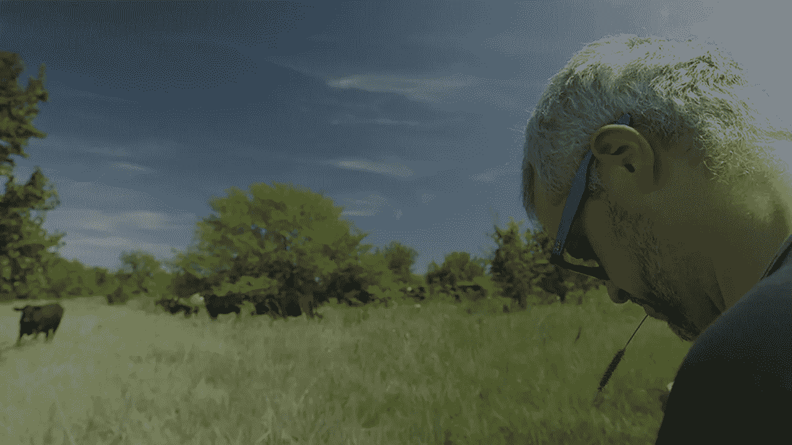

# 拥有一个产品的不同之处在于:建造屠夫之箱最让我惊讶的是什么

> 原文：<https://medium.com/hackernoon/the-difference-having-a-product-makes-what-has-surprised-me-most-about-building-butcherbox-100f252f0b95>

迈克·萨尔盖罗

虽然这是我第二次领导早期阶段的企业——第一次是在 custom made——但我对建立和发展 ButcherBox 的一些不同之处感到惊讶。

最令人兴奋的是意识到我真的真的很喜欢销售产品。

从我们创办公司开始，CustomMade 就是一个市场，让有才华的制造商、商人和创意人员与客户联系，寻找独特的产品。虽然网站上出售各种商品，但我们只是一个中介。(后来情况发生了变化，目前仍由我的联合创始人塞思经营的[定制](https://www.custommade.com/)，现在只专注于珠宝。)

使用 ButcherBox 销售实际产品的体验是如此不同，它能够将高质量的肉类直接送到我们客户的门口。你对顾客收到的东西有很大的控制权——包括价格和质量。不仅如此，看到一个伟大的团队在开发一个产品时对企业的影响是令人震惊的。

这真是太棒了。

例如，能够调整我们一个月内发送多少鸡肉，或者以不同的方式切牛肉，这是一种授权。拥有这种控制比依赖他人来取悦和满足顾客的需求要好得多。

此外，当你达到一定的销售额时，有趣的是弄清楚流程改进如何影响底线。只要看看那些顾客没有得到任何价值，但你却付出了很多的地方，就可以节省很多钱。有了产品，你可以瞄准这些领域，并试图找出如何改善它们。

举个例子，我们改进了一个过程，我们最初认为这是我们获得肉类的唯一途径。

在我们令人惊叹的肉类专家迈克尔·比林斯(Michael Billings)来到 ButcherBox 之前，我们会从美国的一个地方购买肉类，然后运到另一个地方切割，成本为 57 美分，之后我们会运到其他地方，这又多花了我们 35 美分。因此，这一过程会使每块肉每磅增加 92 美分的成本。

所以我们找到了改进这个系统的方法，改变了我们购买肉类的方式，现在我们在切割的同一个城市购买。现在，一个曾经花费近一美元的过程只需要我们 6 美分的运费。

客户没有从我们以前的运营方式中获得任何好处。这只是浪费。没有人得到任何好处，除了公司得到报酬把肉从这个国家的一端运到另一端。我们决定把重点放在客户没有获得价值的领域，但我们付出了很多，并一个一个地改变它们。在这个过程中，我们正在打造更好的客户体验，同时专注于为客户创造最大价值。

现在我们可以把省下来的钱放回盒子里；我们可以给客户更好的价值，给他们更多的产品。我们可以通过提高产品相关运营的效率来做到这一点。

更重要的是，有了一个可以使用的产品，我们团队的创造力和卓越的运营能力得以充分发挥。

这家公司的酷之处在于，我们这里有两种类型的人。我们的营销团队就像这个真正的“蓝天”剧组。例如，最近有一天，有人在会议中插话说，“让我们过一个‘培根日’。每个人都立刻说，“好啊，让我们过‘培根日’吧。”"

然后，我们的操作团队如果在产品上省下一分钱，就会非常兴奋。一分钱！

但事实上，这有很大的不同。在一拖车的肉上每件产品节省一便士，最终我们可以省下 400 美元。假设我们每周做两部预告片，省下的钱最终是每周 800 美元，或者说我们每年节省 40，000 美元；这是一份为团队增添优秀人才的薪水。

我喜欢用一个特定的产品让我们在一些事情上变得“蓝天”,团队有“让我们做这个吧，这会很有趣”的心态。但我也喜欢运营部门，他们很兴奋地发现我们如何能每磅节省 15 美分。太神奇了。

我在 ButcherBox 上发现的是，当你从事产品业务，当你销售实际产品，并且销量增加时，你可以做一些在市场或应用程序上做不到的事情。

最令人兴奋的是，最终，通过这些过程，我们能够让客户更加满意。

***迈克·萨尔盖罗(Mike Salguero)是 ButcherBox 的创始人兼 CEO。***

[**这篇文章最初出现在 ButcherBox 博客 Roam 上。**](https://www.butcherbox.com/roam) **如果你想订阅 ButcherBox，点击上面的横幅。**

**下面请分享给我们一些** 🖤 **。**