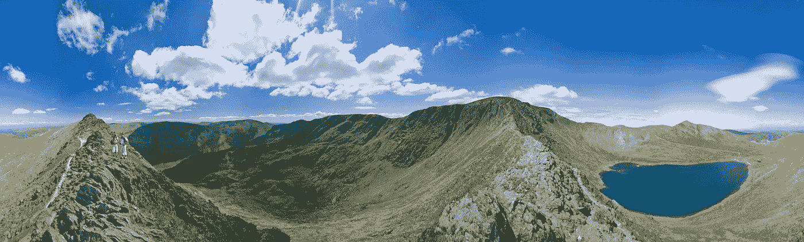
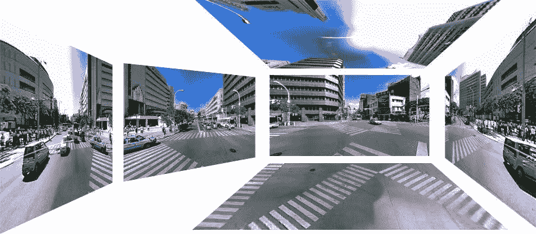

# 未来的数字内容:如何创建和发布 360 度视频

> 原文：<https://medium.com/hackernoon/the-digital-content-of-tomorrow-how-to-create-and-publish-a-360-degree-video-bbd0849b558e>

自从 **YouTube** 和**脸书**开始推出 **360 度视频**以来，这一趋势已经在互联网上引起了无处不在的炒作，甚至在它们发布之前。不管这项创新技术的早期阶段如何，我们在过去几个月中看到的成功已经为赢得“年度内容风格”奖杯奠定了坚实的基础。

但实际上，什么是 360 度视频呢？我们如何创建一个，在哪里发布？

## 360 度视频，在线内容的未来

Image source: [www.computerlegacy.com](http://www.computerlegacy.com)

YouTube(与谷歌合作)在 2015 年 3 月推出了 360 度视频，随后脸书(与 Oculus Rift 合作)在 9 月推出了 360 度视频，为应用开发者创造了沉浸式视频应用的空间，从而改变了移动行业的进程。

也被称为**沉浸式视频**，这种类型的视频记录通过使用特殊的摄像机或视频软件同时记录各个方向的视图来显示**真实世界的场景**。360 度视频中的视图看起来就像观众真的在那里，能够看到周围的所有方面，就像他在现实生活中看到的一样。

360 度内容提供了一种发布您的个人或商业故事的先进方式，将观众带入您的故事中，使他们能够体验内容，而不仅仅是看它。用户可以使用光标在网络上导航视频，对于移动导航，移动智能手机设备作为一种在所需方向上导航的方式。所有这些都是通过这个更丰富、更个人化的故事简单而有趣的浏览。

## 如何创作一个 360 度的视频？

为了制作一个身临其境的视频，你需要一个用于 360 度录像的特殊相机，老实说，这还不是很贵。然而，随着新产品的推出，我们都希望看到价格最终能够平衡，并且对个人用户来说更加经济实惠。这是市场上最著名的四款 360 度摄像机:

谷歌 JUMP ODYSSEY

与 [GoPro](https://gopro.com/) 合作，名为 Odyssey 的 Jump camera rig 包括 16 个相机模块，将视频的 16 个部分创建成一个单独的 VR 视频。

FACEBOOK 环绕 360

17 台摄像机创造了这种新的脸书之美，额外的鱼眼摄像机用于捕捉贝娄和以上的足迹。

三星 GEAR360

这款相机可以同时拍摄两个宽视频或图像，并通过使用一个创建 360 度内容的应用程序将它们合并在一起。

球形 2

这款相机比其他相机更贵，它提供 4K 记录，分辨率为 4096×2048，10 位彩色，每秒 60 帧。它很小，很容易拿在手中。

## 上传 360 度视频到脸书

一旦你成功地使用了一台 360 度摄像机，并制作了一个令人惊叹的视频，是时候把它上传到脸书了。要将你的 [360 度视频上传到脸书](https://www.facebook.com/facebookmedia/get-started/360)，你需要考虑这些规格:

*   支持的文件大小高达 **1.75GB** (视频必须少于 **30 分钟)。**
*   **文件类型** : MP4 容器
*   **视频编解码器** : H.264 视频
*   **分辨率**:最大 4K 输入(4096×2048)
*   **尺寸** : 2:1 显示纵横比
*   **帧率**:最高 60 FPS
*   **像素格式** : yuv420p
*   **深度**:单视场
*   **投影格式**:等矩形
*   **音频** : MP3 或 AAC 音频，最多 4 个声道

上传 360-video 不需要任何新技能，和我们现在做的完全一样。

## 上传一张 360 度的图片到脸书

为了在脸书获得更好的个人或商业体验，你现在还可以选择发布 360 度的图片，并向你的粉丝和朋友展示你的图片背后的场景。事实上，给你的粉丝和朋友成为活动中心的机会，将永远改变我们分享视觉内容的方式。

那么，如何打造自己的 360 度形象呢？有几种方法:

新的 iOS 智能手机为您提供了**全景功能**，因此您可以通过简单地创建全景来拍摄 360 度照片。另一种方法是使用其中一个已知的 app，比如[谷歌相机](https://support.google.com/googlecamera/?hl=en#6164997)或者[街景](https://itunes.apple.com/en/app/google-street-view/id904418768?mt=8)，或者干脆使用上面提到的 **360 度相机**中的一个来拍摄自己的 360 度照片。

## 上传 360 度视频到 YouTube

要在 YouTube 上上传并播放 360 度视频，你需要使用 Chrome、Firefox、Internet Explorer 或 Opera。

要为 YT 制作 360 度视频，有三款 360 度摄像机与 YouTube 兼容:

[理光 Theta](https://theta360.com/en/)

[柯达 SP360](http://kodakpixpro.com/Americas/cameras/activeCam/sp360.php)

[IC Real Tech Allie](http://icrealtech.com/)

然而，你也可以通过使用其他相机装备和软件来创建 360 度的内容，例如[卡拿](http://www.kolor.com/video)。了解更多关于如何利用 YouTube 的高级规范获取最佳结果的信息。

要在 YT 上上传 360 度视频，你需要下载适用于 [Mac](https://github.com/google/spatial-media/releases/download/v2.0/360.Video.Metadata.Tool.mac.zip) 或 [Windows](https://github.com/google/spatial-media/releases/download/v2.0/360.Video.Metadata.Tool.win.zip) 的 360 度视频元数据应用。上传完成后，可能需要一个小时来处理 360 度效果。

## 全新 360 度平台

仅在两个月前，多传感器广告技术提供商 Adtile 已经推出了一个 360 度环境中的广告、互动和控制平台。该公司的技术与几乎所有智能设备兼容，它允许创作者开发 360 度视频，可以跟踪移动并根据设备的握持方式调整视角。我得说，非常有趣而且非常有用。

## 顶级 360 度视频

今年 5 月，脸书发布了根据观看次数排名的 10 大 360 度视频。迄今为止，2016 年最受欢迎的 360 度视频似乎是来自美国广播公司新闻[的视频，该视频显示了纽约时代广场的暴风雪。](https://www.facebook.com/abcnews/videos/10154068281383812/)

另一个顶级 360 度视频似乎是巴萨向[约翰·克鲁伊夫](https://en.wikipedia.org/wiki/Johan_Cruyff)致敬，获得**500 万次观看**。

同样，720 万人观看了 NatGeo 的 360 度直升机飞行，到达世界上最高的活火山之一 Klyuchevskoy。相当可观的数字，你不同意吗？你知道吗，前 24 小时内观看次数最多的 360 度视频，一天内有 530 万次观看，是[权力的游戏](https://www.facebook.com/GameOfThrones/videos/10153647535247734/)的片头字幕？

## 360 度内容的潜力

我最喜欢的 360 度视频之一，绝对是最近发现的[拯救濒危物种的战斗](https://www.youtube.com/watch?v=T-aOVE22lEw)。鲸鲨、犀牛、大象、蝠鲼和狮子等令人惊叹的动物都面临灭绝的威胁，Discovery 在 YouTube 上发布了这段 360 度视频，吸引观众近距离、个性化地观察这些正在消失的生物，重点关注它们的自然环境和实时外观。

脸书最感人的 360 度视频之一是一个慈善组织的故事，讲述了一个住在埃塞俄比亚偏远村庄的 13 岁女孩为家人收集污水的故事，这是她在家乡附近唯一的水源。

有了这样的内容，再加上创新技术的发展，营销人员将这种选择作为其品牌在线活动的最终切实解决方案只是时间问题。它将成为出版商分享故事的终极方式之一，也是展示世界上最大问题的最有力方式之一，以便参与和提供帮助。360 度内容的潜力在于亲自体验一个产品，真实地看到它，并以一种附加价值分享它。无论你的最终目标是销售你的产品，打动观众，还是引发情感反应，360 度内容的真正潜力即使在这个早期阶段也是非常明显和重要的——这是不应该被忽视的。

360 度内容即将改变数字营销，现在是时候激情思考一下了。

## WordPress 和 360 度内容

说到 WordPress，你在 YouTube**上发布的任何 360 度视频都很容易**嵌入到你的 WordPress 网页**中，这是增加你在线形象的一个好方法。在我的下一篇博客中，我会写更多关于 360 度内容的插件和主题。在那之前，尽情享受创建你的第一个 360 度内容吧！**

*本文原载于* [*阿瓦隆博客*](http://www.avalon.host/blog/how-to-create-and-publish-a-360-degree-video/) *。*

> [黑客中午](http://bit.ly/Hackernoon)是黑客如何开始他们的下午。我们是 [@AMI](http://bit.ly/atAMIatAMI) 家庭的一员。我们现在[接受投稿](http://bit.ly/hackernoonsubmission)并乐意[讨论广告&赞助](mailto:partners@amipublications.com)机会。
> 
> 如果你喜欢这个故事，我们推荐你阅读我们的[最新科技故事](http://bit.ly/hackernoonlatestt)和[趋势科技故事](https://hackernoon.com/trending)。直到下一次，不要把世界的现实想当然！

