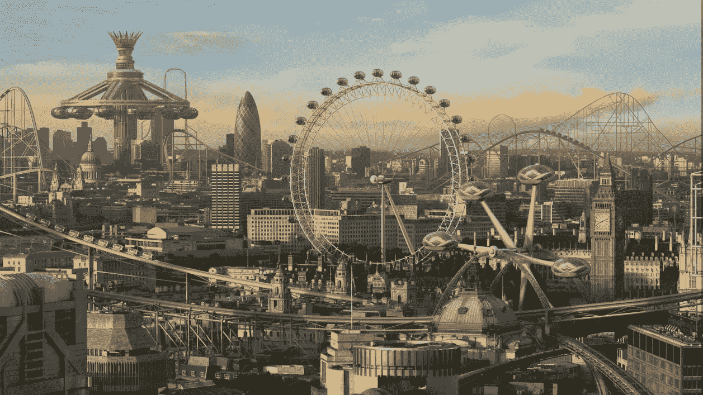
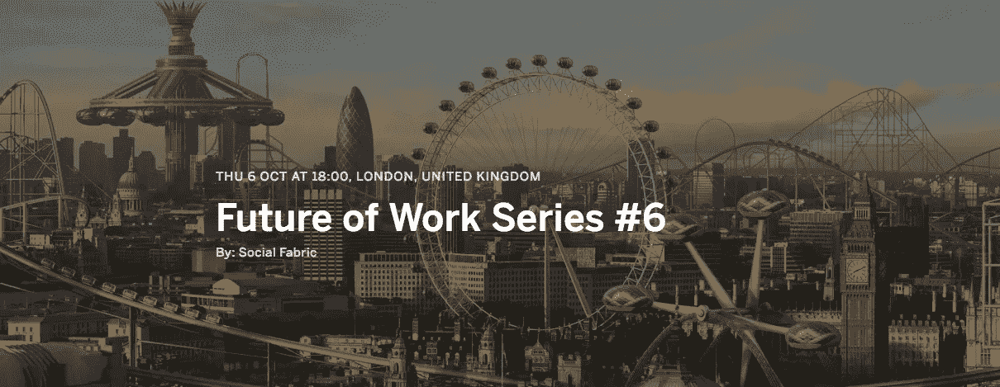

# 医生说张开嘴

> 原文：<https://medium.com/hackernoon/the-doc-says-open-wide-6090a03f28dd>

Image from [LondonTopia](http://londontopia.net/site-news/featured/gallery-insane-visions-of-a-london-of-the-future-future-london-images/)

我刚刚为一本关于未来工作的书采访了一个人。我冷静沉着的回答说，展望未来，确实只有两个截然不同的方向:

1.  工作 ***开辟*** 。组织挖掘他们最大的资产——人的创造性资本(在他们的墙内和墙外)。这也意味着，在后资本主义世界里，将会有一种新的组织自己创造价值的方式——一种新的*主义*即将诞生。
2.  工作 ***关机*** 。是的，我们今天就到此为止。我们注定要走向一个反乌托邦，自动化将会胜出，中产阶级将会消失，清洁工和超级经理之间的鸿沟将无法弥补。

我越来越多地思考后一个版本，它非常可怕。在我的扭曲版本中，也许你在家里玩你的 Vive——只是*闲逛*。你什么都做(和你有一份真正的工作时没什么不同)，但现在是在你的虚拟隔间里。接下来你知道你挥舞着一把半自动手枪。

这个未来的办公室是一个绝对恐怖的地方:

Just another day at the office from magic leap

谢天谢地，这不是为我们准备的。

> 我会把赌注压在一个工作更加开放的版本上——商业透明度、基本收入、创造性智力和新价值网络帮助我们实现这一目标。这是一个工作，工作的版本。

我承认我正试图挑起这场辩论。所以，如果 2016 年 10 月 6 日晚上你在伦敦，那就来吧，加入我们。

本书在此[和**加入对话**和](https://www.eventbrite.co.uk/e/future-of-work-series-6-tickets-26438227450)

详情如下..

**有创意的独立企业数量稳步增长，而采用陈旧的后工业组织模式的企业数量却在下降**

领先的组织已经接受了一种新的运营模式，这种模式奖励生产力而不是存在。

技术和创新继续颠覆着每一个行业。

这是《工作的未来》的第六版，也是迄今为止最大最精彩的一版。你将会和那些设计未来的人们接触，在那里他们每天醒来都在做他们最好的工作。夜晚的指挥包括:

# **吉莉安·戴维斯** /人物&文化@ USTWO

作为领先的公司文化专家，Gillian 知道如何让团队工作。她在那些实质性的组织发展和转型挑战中茁壮成长。作为 leading innovation studio*us two*的人力和文化主管，Gillian 致力于通过引领员工体验设计来确保强大而健康的文化。她是《首次领导》一书的作者，该书提供框架和工具来帮助领导和他们的团队更快地交付更好的结果。她带来了关于组织如何演变、人力资本如何得到最佳利用以及工作的未来可能会是什么样子的丰富知识。

# **维多利亚·斯托扬诺娃** /社区建筑师

维多利亚在工业、思想和人的交汇处工作。她的专长是创业公司和大公司文化的交汇点，因为她帮助顶级机构建立了强大的社区，包括 BBC、微软风险投资、EY、Hyper Island 和 V&A。之前她在 Techstars 担任社区开发人员，在此之前在 Adland 为 Buzzman(巴黎)、Your Maurice(纽约)和 Mother(伦敦)等公司工作。维多利亚主持着 CreativeMornings 的伦敦分会，并在空中有一个固定的靠窗座位——她周游世界，为企业提供社区和增长方面的建议。

# **Julian Wilson** /巴克莱银行移动创新主管

Julian 是一名技术老手，拥有三十多年的经验，曾与一些最聪明的人一起将想法转化为服务和业务。无论是在苹果公司、美国电话电报公司、英国政府，还是作为几家软件公司的联合创始人，Julian 在预测和设计网络如何影响我们的生活方面都有着良好的记录。在巴克莱，Julian 负责移动创新，这实际上是业务中的业务——领导流动团队讲述故事和发明未来。尽管很少见，但朱利安站在有利的位置上，回顾了技术革命的早期——并恰当地对我们下一步的走向提出了一些强烈的观点。

继续吧，在这里发表你的观点

****

****那里见。****

***更多关于工作的未来..***

** [## 我不需要权限，我已经有了。

### 你可能会认为，在举办了 5 场以未来工作为主题的活动后，这将变得有点重复。也许很无聊…

hackernoon.com](https://hackernoon.com/i-dont-need-access-i-already-have-it-6be925042c46)  [## 这是我们的工作方式

### 我们为什么以这种方式工作？我们未来的工作将更多地是一个地方还是一种实践？一天的工作是什么样的…

hackernoon.com](https://hackernoon.com/its-how-we-work-b38d90255e2c)  [## 工作会议的未来

### 协作与创新

hackernoon.com](https://hackernoon.com/the-future-of-work-sessions-c1d26536bb60)  [## 工作的未来——自由职业者的国度

### 外部力量在这个时刻达到了顶点，导致了工作领域的一个彻底的范式转变，而且…

medium.com](/business-fusion/future-of-work-freelance-nation-a2663631f313) 

> [黑客中午](http://bit.ly/Hackernoon)是黑客如何开始他们的下午。我们是 [@AMI](http://bit.ly/atAMIatAMI) 家庭的一员。我们现在[接受投稿](http://bit.ly/hackernoonsubmission)，并乐意[讨论广告&赞助](mailto:partners@amipublications.com)机会。
> 
> 如果你喜欢这个故事，我们推荐你阅读我们的[最新科技故事](http://bit.ly/hackernoonlatestt)和[趋势科技故事](https://hackernoon.com/trending)。直到下一次，不要把世界的现实想当然！

**