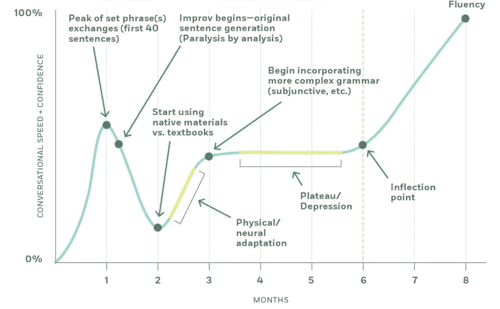

# 医生和手术刀🔊

> 原文：<https://medium.com/hackernoon/the-doctor-and-the-scalpel-78656f508c9a>

## 是时候开始了解基本面了

A picture showing a nurse handing a scalpel to the doctor from the point of view of the patient lying on the operating table. Both are looking at the scalpel. Worried.

Listen to the audio version!

这个行业存在严重的问题。

当我们试图做一些新的事情时，挣扎是可以的，即使是在我们熟悉的行业。

这是意料之中的。

每一项新的复杂能力都会有一个上升期。无论是技术还是新概念。

然而，我们没有拥抱新概念和编程语言，而是倾向于责怪工具或语法。可能是语言或框架造成了混乱的代码，也可能是一个不起作用的概念没有达到预期。

> 当遇到困难时，我们倾向于责怪工具或语法。

抱歉。问题不在于工具。

大多数情况下，语言并没有改变，开发人员是进化的一方，或者概念应用不正确，未能在实践中展示其优势。

让我们想象一个医生做了一个心脏手术，结果出了问题。医生不能抱怨因为医用手术刀的问题而出错。即使手术刀出了问题，病人因此而死，人类也是有责任的，因为他们有责任选择使用什么，而不是工具。为什么编程应该不同？

下图摘自《四小时厨师[》一书:](http://amzn.to/2lH3Vlw)

The bipolar learning graph for a language learning process from the book [The 4-hour Chef](http://amzn.to/2lH3Vlw) by Timothy Ferriss. Here the author creates a graph with lines comparing the level of "confidence in conversational speed" (up) with the time in months a person might take to achieve that (right). The line starts going up immediately on the first month, representing the first 40 sentences where there’s a high level of confidence. The second point from 1 to 2 months shows a huge decline in confidence which is when the improvement begins. At the bottom, the person starts using native materials versus textbooks, it’s the lowest level of confidence. Between the month 2 and 3, there’s an increase in confidence but that still doesn't reach the initial bump, it's when the person starts incorporating more complex grammar. From the month 3 to 6 there's a plateau where nothing changes, and after that, it starts to go up consistently and fast on what the author calls the "Inflection point". When the month 8 comes, the level of confidence is higher than the initial bump of the first month and the person reaches what the author calls the "Fluency".

两极学习曲线是一个观察结果，在原著中，作者使用了几个月的时间跨度。但是该曲线也可以应用于不同的尺度。

作为一名开发人员，学习的旅程可能因人而异。鉴于存在大量变量，很难根据经验测试它是如何工作的。就我而言，我开始编程时没有任何背景，这是一个很好的经验。

让我们假设一个没有任何背景的开发人员出于好奇心开始编程。速度可以根据开发者居住的地方和他们个人生活的其他方面而变化。但是为了这篇文章的目的，让我们使用年的时间尺度，并将它们中的每一个称为“里程碑”。

在**第一年**，一切都是新的。开发人员不明白事情为什么会这样，他们也不在乎。他们只知道，如果他们遵循一步一步的教程，他们可以得到一些工作。这个想法是谷歌一切，并试图“适应”现有项目的代码。

第一年的里程碑严重依赖于[复制/粘贴](https://medium.freecodecamp.com/the-benefits-of-typing-instead-of-copying-54ed734ad849)和[货物邪教编程](https://en.wikipedia.org/wiki/Cargo_cult_programming)。bug 的发生率高；代码很快变得不可维护，性能下降，因为对于最终出现的自定义边缘情况，没有在线方法可循。

> 在第一年，开发人员复制/粘贴代码，并不真正关心他们在做什么。他们只是想做点什么。

在第二年**的**中，开发人员理解了语法以及大部分复制/粘贴代码的功能。仍然有一些神奇的事情发生，还有一些货物崇拜，尽管与第一年的水平有很大的不同。

bug 的发生率仍然很高；开发人员从一年前开始发现糟糕的代码，只是意识到他或她是编写它的人(这是一个积极的信号——这意味着他们学到了一些东西)；随着复杂性的不断增加，性能仍然会下降，尽管速度比以前慢了。

> 在第二年，开发人员理解了大部分语法，并开始关心可维护性

从第 3 年到第 5 年(T10)，开发人员理解了底层原始数据结构的要点。例如，如果他们使用 Java，他们会开始理解`Collection`、`List`和`Array`的用途，但是会开始在任何事情上使用这些结构。当他们学习一个新的概念或技术时，他们也试图在任何地方应用它。

这是“当你有一把锤子时，一切看起来都像钉子”的阶段。

现在已经没有太多的复制/粘贴代码了，但是当应用一个概念(比如干净的代码或者[坚固的](https://en.wikipedia.org/wiki/SOLID_(object-oriented_design)))时，仍然会发生货物崇拜。大多数时候这个概念被错误地应用，比如应用[测试优先而不是 TDD](http://www.stefanhendriks.com/2012/03/31/the-difference-between-tdd-and-test-first-development/) 。

他们可能理解测试代码的需要，但是不一定应用它或者理解“为什么”。他们试图这样做，但发现效果非常差。他们最终决定进行覆盖应用程序一小部分的小测试，因为如果他们试图覆盖更多，他们会发现自己被困在一堆不可维护的测试代码中，这些代码会包含许多误报、漏报和副作用。

> 从第 3 年到第 5 年，开发人员开始测试代码，他们了解到一些概念允许复杂性被部分驯服

从第 5 年**到第 7 年**，开发人员开始更好地理解基本原理。他们也开始正确地应用一些概念，比如 TDD 而不是测试优先。语法不再是一个问题，他们在他们最喜欢的语言中已经达到足够的流利程度，并且可以很快学会一门新的语言。货物崇拜和复制/粘贴很少发生。

他们可以创建大型的测试套件而不会变得太复杂，尽管他们可能仍然很难使其可扩展和易于更改。Mocks 和 Stubs 仍然在错误的场景中被过度使用。覆盖率不是 100%。

> 从第 5 年到第 7 年，开发人员开始用一些判断来应用东西，语法不再是一个问题，他们可以构建测试覆盖，而不用陷入兔子洞

从**第 7 年开始**，开发者开始更好地理解语言无关概念的基础。在我的案例中，以及从我所知道的其他开发者那里，都是事件源和事件驱动设计、领域驱动设计、CQRS 和(罗伊·菲尔丁的)REST 的架构思想。随着时间的推移，他们可能会自己发现或学习敏捷原则，并开始学习其他领域，如数学、物理、哲学和心理学，以便在[软件开发](https://hackernoon.com/tagged/software-development)之上进行创新。

他们还开始学习其他编程范例，并衡量每种技术或概念对于手头任务的权衡。没有什么是银弹了，他们明白讨论是必要的，以达到正确的答案。

> “第 7 年及以后”里程碑包含了大多数大公司在有经验的软件开发人员身上寻找的方面

旅程听起来真的很慢。而且应该！

仍然有许多人相信任何新兵训练营或在线课程都能给他们带来即时的编程技能。但是编程生涯并不是这样的。

就千禧一代而言，西蒙·西内克指出，他们习惯于拥有**即时满足**的思维模式，因为我们在数字时代拥有的东西:不需要等待电视节目，只需要下载就可以了；不用等着买东西，只要上亚马逊，第二天就到了；而不是学习如何去约会，[向右滑动](https://www.gotinder.com/)，就是这样！

这可能会鼓励一切都很容易的心态，一旦人们发现现实并非如此，就会增加抑郁的比率。

A video of Simon Sinek, talking about millennials in the workplace. The video is linked in the part that he talks about the instant gratification provided by technology. I recommend watching the whole video, though, it’s very enlightening.

现在你可能认为 7-10 年的“真正的”经验足以达到最后的状态。国家要求在大多数大型科技公司工作。

可惜，“多年经验”不重要。这不是一个有效的可衡量的技能单位，我在这里只是作为一个抽象的衡量标准。

如果我们观察上面描述的两极学习曲线，有人完全有可能长时间停留在第一个里程碑上，自信很高，能力很低。只是每天做同样的事情，从不进化或学习新的东西(如果我有信心我能做到，我为什么要改变？).

> 同一年有 20 年的经验是没有价值的！

许多跨过第一个里程碑的人会发现，他们的信心会像建立起来一样迅速下降。有些人会患上冒名顶替综合症，有些人会放弃。

我相信这也是为什么我们可以看到一些大学的退学率如此之高。与来自数字时代的即时满足感相比，进步太慢了，这就造成了编程高不可攀的错觉。

有人可能会说，当今行业中的大多数开发人员都有不到 6 年的经验(T2)，或者还没有达到相当于“第 7 年及以后”的里程碑。这意味着有数以百万计的开发人员仍然不理解软件工程的基本原理，而这些原理是创建健壮、稳定和可维护的应用程序所必需的。

> 业内大多数开发人员还没有达到“7 年经验”里程碑的同等水平

他们是为你的汽车编写固件的开发者；你乘坐的飞机的导航系统；您用来访问您的帐户的银行；给你做手术的机器人的软件，以及你的公司用来管理客户的系统。

我们不应该鼓励更多的开发者加入这个行业，而是应该开始教育现有的开发者，让他们知道编写高质量软件的重要性，这样他们就可以成为有用的导师。

作为一个社区，我们可以做 5 件事:

1.  语言、框架和库来来去去。学习一种工具将会使个人一事无成。所以**停止基于工具**创建聚会，转而创建基于基本面的聚会。如果必须的话，用语言/框架作为借口来展示这些基础知识。有很多聚会已经在做了。
2.  如果你有一个博客，写教程是很容易的，有助于作者有效地学习。然而，不要再只写关于语言的语法如何工作、T2 如何工作、框架的 API 如何工作或者 T4 如何使用库的教程了。**开始写“为什么”**。*为什么*一个框架的 API 是这样构建的或者*为什么*一个给定的库存在，它解决了哪个问题，尽可能参考基础知识。这对作者也是有利的，见帖子[“如何”比“为什么”老得快](https://hackernoon.com/how-ages-faster-than-why-712e25c9eb3b)。
3.  **不说工具，开始说概念**。当然，在谈论命名的概念时，你总有可能被误解。但是要尽可能多的解释或者对语法进行类比。如果当你退休的时候你的基础知识会消失，那学习有用的东西还有什么意义呢？
4.  如果你是一家公司或招聘机构，不要再为一个角色写一份工具清单了。首先，询问潜在候选人是否了解软件工程的一些基础知识。我不是在谈论“大 O”或大多数项目中很少使用的算法，我是在谈论在构建或改进系统时如何处理复杂性和编写可维护代码的现实需求。如果他们知道这一点，他们可以很快学会任何编程语言，并开始编写高质量的软件。
5.  如果你是一家大公司，**停止做白板代码面试**。白板代码访谈不是测试驱动友好的，并且给开发人员带来了不必要的挑战，即在没有首先运行它来检查其正确性的情况下，尽早找到解决方案。在真实的开发环境中，没有白板，代码必须运行。需要创建测试来支持这一点。信不信由你，最好的开发人员*可以用 100%的测试覆盖率解决大多数用例的问题*，但是白板面试和边缘用例测试并不能提供一个安全的环境来做这件事。

基础知识是不要重新发明一切(比如喜欢只用纯 JavaScript 而不用 Angular)。基础知识是理解**为什么**语言具有它所具有的特性，**为什么**框架存在，以及**为什么**使用它们中的任何一个都是更好/不好的做法！

这是必要的技能，如果你必须自己实现它们的话。

Greg Young 在他题为“8 行代码”的演讲中告诉我们简单的真正含义。他用 8 行代码总结道“如果你想用一个工具或者框架来解决一个问题，也许你需要的是改变这个问题”。学习基础知识可以让我们不依赖“魔法”,而是用一种基本的方式来思考问题，而不是外包。

> 基础知识不是重新发明，而是更好地理解现有的东西，以避免谈论它是如何工作的

我试图做些事情来改变它，[试图尽可能多地写基本面](/@fagnerbrack/this-is-why-i-try-to-write-only-about-fundamentals-not-about-the-syntax-of-tools-that-are-going-to-5b53c9fbe9e)，**免费**。这是我开始写博客的原因之一，而不是因为这个行业的现状而让自己成为一个愤怒的程序员。

我希望这个行业开始做同样的事情，建立在对专业人士有价值的东西之上，而不是在不到一年的时间里让你过时的东西。

这样我们就能在社会中建立信任，被视为医生。

**一个专业的**能够对自己的决定负责并受到尊重，而不是被迫杀死病人并责怪手术刀的人。

别怪手术刀。

感谢阅读。如果您有任何反馈，请通过 [Twitter](https://twitter.com/FagnerBrack) 、[脸书](https://www.facebook.com/fagner.brack)或 [Github](http://github.com/FagnerMartinsBrack) 联系我。