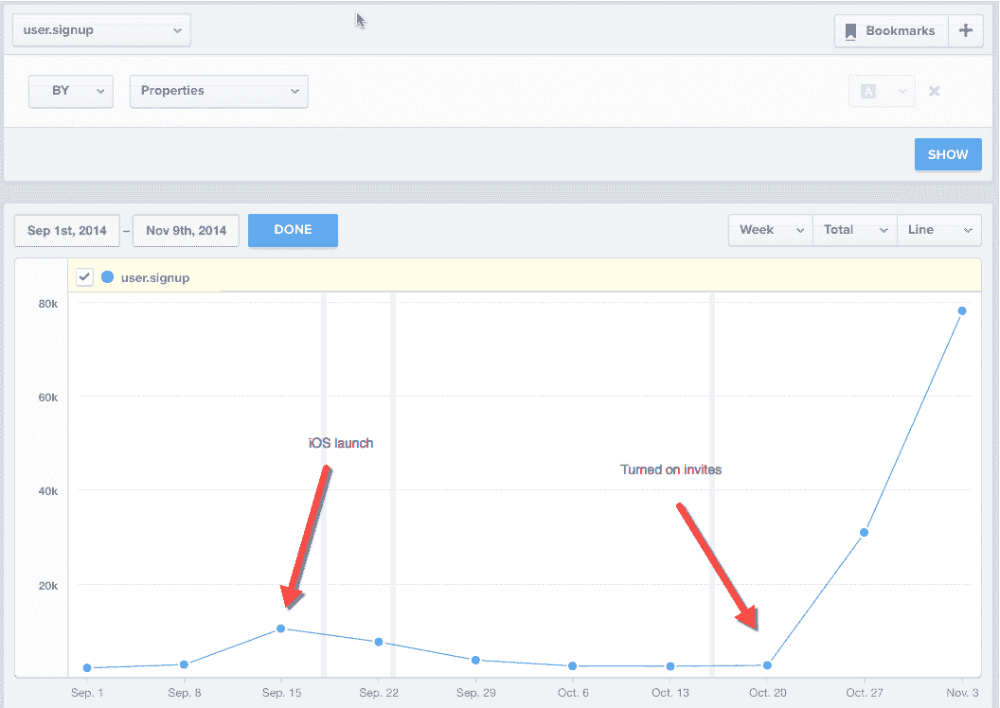

# 双重网络效应:加密如何促进你的推荐增长

> 原文：<https://medium.com/hackernoon/the-double-network-effect-how-crypto-can-transform-referral-programs-e9ccfd5e7467>

我一直在思考[分布式应用将如何发展](/@nicksoman/how-will-dapps-grow-f8cd290ddcf)。这篇文章将涵盖为什么推荐是强大的，如何获得更多的推荐，以及加密令牌如何创建一个双重网络效应，可以增压推荐结果。

## 为什么推荐是强大的

作为 Reveal Chat (B2C，通过推荐发展到数百万用户，被 Napster 收购)和 Gusto (B2B，发展迅速，有望变得巨大)的创始人，我在推荐方面做了大量工作。

像任何成长策略一样，推荐并不是万灵药，过早或过于激进地优先考虑它们可能很有诱惑力——我两者都做过。制造人们想要的东西。不要把水倒进漏桶里。从不发垃圾邮件。都是真的。但是，当一个执行良好的推荐项目发挥作用时，它可能会带来变革和振奋。像这样:

撇开曲棍球棒不谈，我喜欢推荐有几个原因。

*   **推荐增长是产品质量的代表。**并非所有情况都是如此。一些被高度提及的产品只是优化的垃圾邮件大炮，一些在新用户加入时对每个人都变得更好(网络效应！)，有的则没有。但是用户有多喜欢你的产品和他们有多愿意分享它是有关联的。Waze 首席执行官诺姆·巴丁说，成长团队的工作是“加速有机趋势”。而口碑是历史上最好的有机增长渠道。
*   **推荐用户是最好的。**他们更有可能注册、享受你的产品、付费、逗留并推荐他人——这是一个良性循环。由于付费获取通常是有效的，这是一种很好的方式来说明你需要大量的预算来推动大规模增长，推荐可以削减你的客户获取成本(CAC)。如果你没有为用户提供推荐的直接激励(脸书)，或者如果你提供的东西花费很少(Dropbox 的存储空间)或者需要购买才能赎回(Airbnb 的折扣)，这一点尤其正确。
*   推荐是一件有趣的事情。我一直[考](https://www.arealme.com/left-right-brain/en/) 50/50 右脑-左脑。推荐增长是一个数学问题——你可以用创造力来解决！多酷啊。让我告诉你我的意思。

**如何获得更多推荐**

我做了一个叫做 PICs 的简单框架来帮助我把推荐看作一个数学问题——因为没有什么比 PICs 传播得更快。

**P** 邀请或分享的用户百分比*
**I** 每个邀请者邀请或分享的用户百分比*
**C** 邀请或分享的转化率
=病毒系数(viral coefficient)亦称 K 因子(K factor)，亦称任何单个用户引用的额外用户数。

含义:

*   如果你能在一段时间内保持 1 以上的病毒系数，你将呈指数级增长，并可能以那些疯狂的故事结束，你从 SFO 乘飞机起飞，降落在 JFK，有 500 多倍的用户，希望没有崩溃的服务器。这就是大多数人所说的“病毒式传播”
*   你的病毒系数是 **P** 、 **I** 和 **C** 的乘积，所以这些数字中的任何一个增加 20%，你的病毒系数就会增加 20%。所以你可能会问“这些数字中，哪一个我们可以用最少的工作增加 20%？”顺便说一下，在 **P** 和 **C** 上有自然天花板。除非需要分享才能使用你的产品(例如 Snap ),否则通常很难吸引超过 10%的用户邀请或分享。通常很难让超过 25%收到私人邀请的人成为用户，或者从你的平均公共分享中获得超过 0.25 个用户。 **I** 是最“不封顶”的数字——通常比其他两个数字更容易增加每位邀请者的平均邀请数或份额。这就是为什么脸书和 LinkedIn 优先考虑地址簿导入和“邀请所有人”功能，以推动历史上最积极的推荐增长流。好久没注册新账户了？这些流程仍然是这两个应用程序的核心。
*   邀请或分享的一个渠道可能比其他渠道更适合你——可能好得多。你希望你的用户做什么？通过邮件/短信私下邀请朋友？通过脸书/推特公开分享？发布到在线论坛？你可以也应该进行小规模的测试来找出是什么改变了信仰。

这就是数学。B2C 和 B2B 中的数字以及每个领域中跨产品的数字非常不同，但 PICS 框架仍然适用。这就是数学的伟大之处——它在任何地方都一样。

创造性在于找出如何在不损害用户体验的情况下提高 P、I 和 C。那就是了解你的产品和你的用户。这里有一些问题要问你自己，或者更好的是，与你的用户和团队讨论。

为什么用户希望他们的朋友加入你的应用？更像是派对还是五金店？如果你的应用让朋友看起来很酷或很聪明，或者如果每个人都能从一起享受它中受益，比如聚会，人们更有可能推荐他们。如果用户的朋友加入后，你的应用没有变得更好，那么它就更像一个五金店——如果他们喜欢它，一些人可能会告诉朋友，但增加这样做的百分比将是很困难的，你可能需要考虑有形的激励——比如当他们推荐的人购买时，可以支付现金。

**I:** 你希望你的用户推荐谁？你怎么能让它变得简单呢？相关性很重要:我认识的可能对新社交网络感兴趣的人比我认识的可能需要薪资解决方案的人多。在 Gusto，我们从我们的用户那里了解到，他们中的许多人希望推荐更多的朋友，但他们不确定他们认识的人中哪些人会成为 Gusto 的伟大客户。因此，我们要求他们联系他们的联系人，并分析电子邮件域，以推荐最佳人选供他们参考。

**C** :推荐文案是否清楚地解释了你的价值主张？(提示:了解用户是如何当面告诉朋友你的产品的)。你是否让被推荐人尽可能容易地注册并开始获得价值？许多移动应用程序通过短信增长，短信的打开率和点击率很高，但转换率相对较低，因为点击和应用程序安装之间存在摩擦。Web 应用程序通常享有较低的注册摩擦，因此拥有较高的 c。

**加密令牌如何创造双重网络效应，从而增强推荐结果**

好了，有趣的部分来了。想想你最喜欢的具有传统网络效应的应用程序:当更多的人使用它时，你的体验会变得更好。我们以中号为例。当新用户注册并开始发帖、鼓掌和评论时，这个网络对你个人来说会变得更好——尤其是如果他们是你的朋友。这可能会让你想告诉你认识的作家加入 Medium。工作中的网络效应#1。

如果 Medium 开始给你限量发行的“MediumCoin ”,仅仅因为你是一个很棒的用户，会怎么样？如果你可以立即用现金购买或出售 MediumCoin，或者在 Medium 上花费它以获得特殊功能，或者满怀信心地持有它，认为如果网络继续增长，它的价值会增加，那会怎么样？如果你和你的朋友可以免费获得 MediumCoin，如果你推荐他们并且他们注册了，会怎么样？随着你的个人和经济动机的一致，现在你可能真的想告诉你的朋友加入 Medium。当你谈到这件事时，你甚至可能开始听起来有点疯狂。这就是网络效应之二。

人们已经在测试投币推荐的潜力。ICO 营销人员向完成简单营销任务的用户提供象征性奖励(例如，在脸书上发布链接，在 Twitter 上关注个人资料，在 Bitcointalk 上出借你的头像或签名行。)这些是原型推荐或联盟营销计划，可以使用 PICs 之类的框架进行评估和改进。他们可能只是触及了这种方法的皮毛。

在 21 世纪初，PayPal 通过推荐实现了 7%到 10%的日增长率，当一个新的推荐用户注册时，它会给两个人 20 美元。但 PayPal 模式的一个关键限制是，每个人都知道 20 美元对他们来说值多少钱。有些人愿意花几分钟注册来获得它，其他人则不愿意。

当代币可以立即兑换成现金时，代币的当前现金价值可以说代表了它的底价。它也可以在应用程序中使用，或为潜在的未来价值而持有，从而产生错过的恐惧，这可能会使注册变得更加诱人。毕竟，2009 年价值 20 美元的比特币如今价值超过 2500 万美元。

我将很快在新的加密项目中测试推荐概念，我正在寻找思想伙伴来帮助我变得更聪明。如果你有兴趣或者想帮忙，请私信或者在评论中联系[。我很乐意收到你的来信。](https://www.linkedin.com/in/nicksoman/)