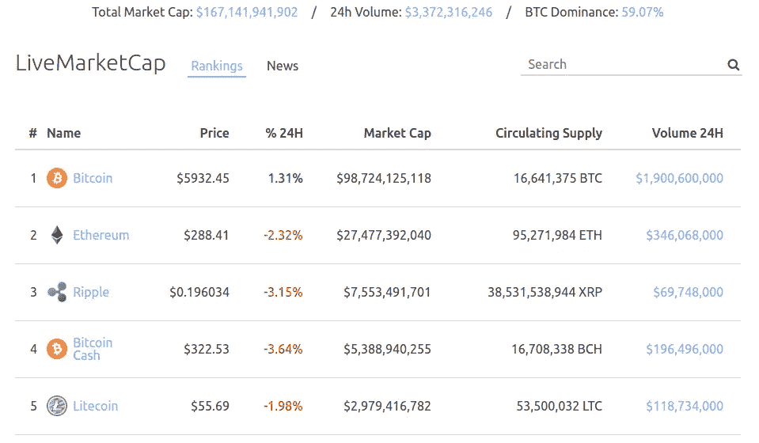
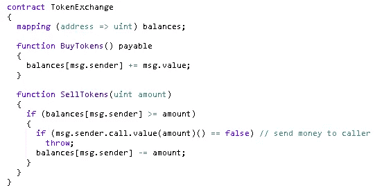
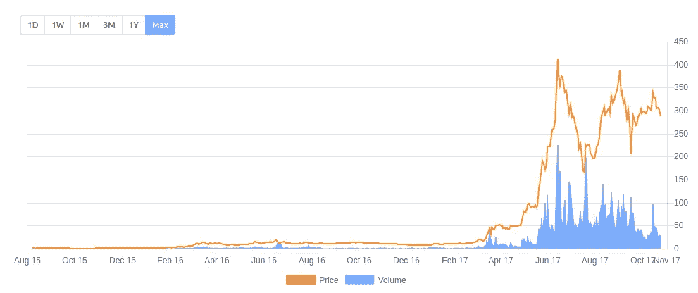

# 理解以太坊的最简单方法(5 岁儿童)

> 原文：<https://medium.com/hackernoon/the-easiest-way-to-understand-ethereum-for-5-years-olds-d8c537a7c7b8>

许多人听说过比特币，这并不奇怪——它是第一种加密货币，直到现在它仍然是最受欢迎和最大的。比特币的成功激励了许多人，这也是为什么在过去几年里，超过 1000 个替代币被创造出来。

毫无疑问，比特币是当今的老大。但是你知道第二种加密货币是什么吗？以太坊。当我们谈到 cryprocurrency 排名时，我们指的是它的市值，换句话说，所有硬币的总价格(例如以美元为单位)。

TOP-5 Cryptocurrencies Market Capitalization and Prices. Source: [https://livemarketcap.com](https://livemarketcap.com)

正如你所看到的，以太坊以巨大的优势领先于其他替代币，并在 2017 年 6 月几乎落后于比特币。在这篇文章中，我将解释以太坊如此受欢迎的原因以及大多数 ICO 使用它的原因。

作为本文的数据源，我决定使用 LiveMarketCap.com 的数据。它提供了所有活跃加密货币的实时排名。你可以在我的[上一篇文章](/@cryptodan/useful-services-for-all-cryptocurrency-enthusiasts-ad1f741a3a3)中阅读更多关于这个平台的信息，并发现其他伟大的加密货币服务。

# 以太坊背后的理念

以太坊于 2015 年 7 月 30 日推出。它的创造者之一是维塔利克·布特林。他出生在俄罗斯，但在 6 岁时移居加拿大。当他提议将以太坊背后的想法公之于众时，他才 19 岁。

从一个普通用户的角度来看，比特币非常简单易懂。有钱包，任何人都可以从一个钱包向另一个或者同时向许多人寄钱。网络相当复杂，它允许避免任何中央服务器，但它解决了经典的问题。只是一个典型的支付系统:人、钱、钱包、交易等等。

那很清楚。那么以太坊的想法是什么？

现在我们可以再做一步，创建一个新的支付系统，允许任何人创建钱包算法。这些算法可以收钱，决定多少钱和给谁寄钱等等。有一个重要的条件:算法是透明的，可预测的，没有人能改变它。

所以，以太坊的开发者增加了创造这种算法的可能性。以太坊里的所有钱包分为两种:由人操作的和由算法操作的。

以太坊中的算法——它们被称为智能合约——存储在区块链中。它们永远在那里注册，网络的任何参与者都有自己的副本，因为每个人都有自己的区块链副本。因此，智能合同的执行结果对每个人都是一样的。

正如你所看到的，这个发明扩展了密码的标准应用。

# 智能合同示例

我们可以写哪种算法？比如金融金字塔。为此，我们可以使用以下规则创建智能合同:

1.如果我们从钱包 A 收到金额 X，将该值保存在债务表中。

2.如果之后我们收到的金额 Y > 2*X，发送 2*X 到钱包 A，为钱包 b 保存这个债务。

3.等等。

4.一种选择是:将每笔交易的 5%发送给智能合约的作者。

再举个例子？好，让我们创建一个拍卖:

1.如果拍卖没有结束，保存参与者的钱包地址出价金额

2.拍卖结束后，选择最高出价，并发回所有其他出价。

还有许多其他的应用:有多个主人的钱包、金融工具、赌注、池、彩票、游戏、赌博等等。

记住优势:这是一个区块链——这意味着每个人都确信没有作弊，每个人都可以访问算法代码，并确保它像预期的那样工作。智能合同不是人:如果没有错误，它不能带走所有的钱，不能破产等等。

A simple Smart Contract. There is a bug allowing to steal all the money. Can you find it?

# 智能合同限制

有了这些优势，还有什么限制吗？

事实上，是的，这里有一些例子:

1.在智能合约中，很难获得随机值和其他不确定的行为。在一些彩票中，最高级的参与者可以“猜测”头奖。

2.如何“隐藏”一些信息并不明显。例如，拍卖过程中的参与者和出价列表。

3.如果智能合同需要区块链中缺失的一些信息(例如，一种货币的最新汇率)，一些可信的来源必须提供这些信息。

4.要使用智能合约，每个参与者都必须拥有以太——一种虚拟的内部货币。这意味着你不能对没有以太币钱包的参与者进行民意调查。

5.智能合约相对较慢。在整个系统中，每秒只能执行 3-5 个事务。

6.通常智能合约执行非常有限的一组简单动作，因为网络中的每个矿工都必须重复这些动作并验证结果。

7.如果一个智能合约有 bug，那就是永久的。只有一种方法可以解决这个问题:迁移到另一个智能合同。但只有在当前的智能合同中有可能提取所有的钱并发送到一个新的钱时，这才是可能的。大多数初学者不会考虑这种可能性。

换句话说，就像在任何其他领域一样，一切都取决于一个聪明的合同作者的职业素养。

# 智能合同的主要用途

最近以太坊找到了一个新的利基:ICO——初始硬币发行。2017 年 1 月 1 日，1 以太的价格约为 8 美元，其峰值出现在 2017 年 7 月:每 1 枚硬币 400 美元。原因是大量的新 ico。在一个项目上投资的意愿刺激了需求，从而提高了价格。

Ethereum Price Chart. Source: [https://livemarketcap.com](https://livemarketcap.com)

以下是加密启动的典型步骤:

1.你有主意了。通常与加密货币和/或区块链有关。

2.你需要钱来开发和推出它。

3.你宣布你接受以太并使用智能合约给予代币。

4.你推广你的项目，筹集你需要的资金。

一个典型的 ICO 能筹到多少钱？

平均金额约为 1000-2000 万美元，通常在几天甚至几分钟内就能完成。通常情况下，ICO 受时间或总量的限制，它会引起人们的兴趣。

有时情况变得很滑稽。在一次 ICO 中，24 秒内就筹集了 3500 万美元。在另一个实验中，参与者准备为每笔交易支付数千美元的巨额交易费，以便在队列中排名靠前。巨大的需求和低渠道容量促使人们增加交易费用以参与 ICO。

到 2017 年 9 月至 10 月，不同的 ICO 筹集了约 18 亿美元。

还感兴趣吗？大概我最近的文章解释了一些主要的规则和陷阱对初学者会有帮助。请记住，ICO 是一项风险极高的投资。投资前请三思。

> 感谢阅读！如果你喜欢，请鼓掌支持👏👏👏还有分享帖子。欢迎在下面留下你的评论💭。

> ***丹·波多兰*** *是区块链* ***开发商*******投资方*** *。**
> 
> **他就是【LiveMarketCap.com】**的 CEO。它提供所有活跃加密货币的实时排名，包括最新的加密货币新闻、市场价格、图表和分析。****
> 
> **有反馈吗？关注 LiveMarketCap 上的* [*推特*](https://twitter.com/livemarketcap) *！👋**