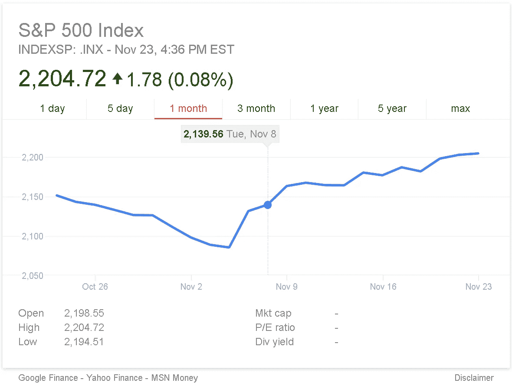

# 特朗普总统任期内的硅谷经济

> 原文：<https://medium.com/hackernoon/the-economics-of-silicon-valley-under-trumps-presidency-dd6459a8d231>

众所周知，唐纳德·特朗普(Donald Trump)在 2016 年大选中获胜，从多个方面打击了硅谷的风气。现在在山谷的中间，我暴露在许多厄运和黑暗的场景中，正如我们所知，这应该是历史的终结。从社会角度来看，也许这是真的:没有什么会是一样的——至少，不会是我们彼此谈论问题的方式。然而，如果我们冷静、冷静地看待经济数据和市场趋势，我们或许能够更加确定地看待未来。

快速浏览一下 S&P 指数就会发现，随着选举日的临近，该指数有所下跌，但总体而言，市场似乎对选举周发生的事情漠不关心。(其实是稍微往上爬。)科技行业现在可能感觉非常悲观，但[市场作为一个整体似乎相当乐观。为什么会存在这种差距？](http://www.theatlantic.com/liveblogs/2016/11/markets-trump-election/507089/)

鉴于特朗普个性和主张的反复无常，无法保证他的所有或任何经济政策会真正变成可行或真实的东西。但他的政策议程似乎有足够的一致性，这让华尔街多少有些放心，尽管他每次都在侮辱他们。

让我们暂时忘掉假货争议、媒体闹剧、愤怒的咆哮、种族主义和即将到来的世界末日的说法。(今天是感恩节，所以不管怎样，暂时远离那些东西可能会有好处。)让我们简单地看看市场对特朗普当选总统后对其经济发展相关政策的反应。他的政策是:

**亲商:**降低公司税，包括小企业。

反监管:全面的监管，包括环境方面的，很可能会放松。

**移民:**加大对非法移民的处罚力度，维护现有合法移民政策。

**基础设施:**增加联邦和州项目的基础设施支出。(尽管几乎每个人都承诺过这一点，但从未真正做到过。)

**对外贸易:保护美国的工作和利益，这可能会导致关税增加。**

除了一些疯狂的提议(比如让墨西哥为此买单)，如果你看够了特朗普的政策提议，它们开始看起来像是来自普通共和党候选人的提议。除了一个例外:特朗普支持美国工人的经济保护主义，同时对北美自由贸易协定和跨太平洋伙伴关系等全球贸易政策进行重大修改。这是他与民主党当权派以及现有的共和党当权派最大的分歧。(在这方面，伯尼·桑德斯相当于特朗普的左派，这也解释了桑德斯在初选期间受到的敌意。)

从纯粹的经济角度来看，最后一点是硅谷最害怕的，因为不管是好是坏，它一直是全球化力量的主要资助者和获利者。从制造、劳动力、招聘、客户获取、投资、社会关系、离岸实践，一直到他们所说的“改变世界”。他们的理想范围将不得不向内而不是向外转移的想法，构成了一个非常现实的经济和生存威胁。

但现在，对科技公司来说，为未来几年的下一个重大转折做准备比以往任何时候都更重要。不管川普会呆 4 年、8 年，甚至不到 1 年，公众的情绪已经发生了不可逆转的变化，人们将会寻找与以前相比与[技术](https://hackernoon.com/tagged/technology)非常不同的东西。如果我们要在即将到来的选举中，在即将到来的世界中保持相关性，我们将需要适应生存。幸运的是，硅谷的文化已经为这种变化做好了准备——或者至少他们应该准备好，如果他们真的相信创造性破坏的过程。

> [黑客中午](http://bit.ly/Hackernoon)是黑客如何开始他们的下午。我们是 [@AMI](http://bit.ly/atAMIatAMI) 家庭的一员。我们现在[接受投稿](http://bit.ly/hackernoonsubmission)并乐意[讨论广告&赞助](mailto:partners@amipublications.com)机会。
> 
> 如果你喜欢这个故事，我们推荐你阅读我们的[最新科技故事](http://bit.ly/hackernoonlatestt)和[趋势科技故事](https://hackernoon.com/trending)。直到下一次，不要把世界的现实想当然！

