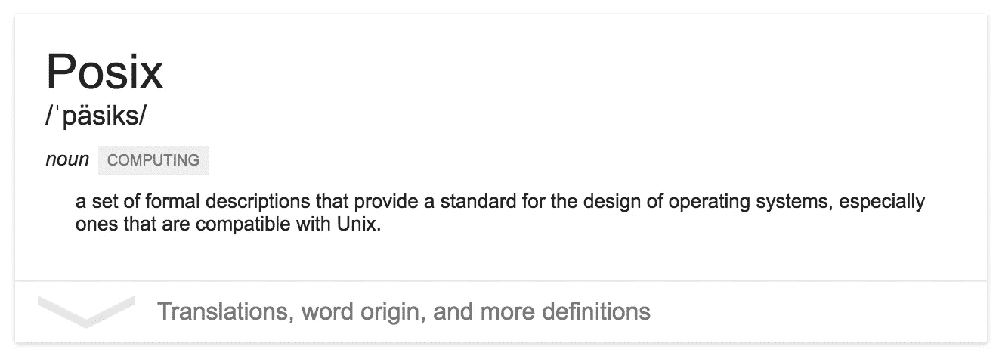

# 分布式 POSIX 的出现

> 原文：<https://medium.com/hackernoon/the-emergence-of-distributed-posix-7226f0fdf3a1>

在过去的几个月里，我注意到人们在暗示或建议一些事情，由于缺乏更好的术语，我将称之为*分布式 POSIX* 或简称 d POSIX。

我这么说是什么意思？好吧，不管我们为 dPOSIX 提出什么(除此之外，希望有一个更好的名字)，它大概都有以下特征:

*   *作为一等公民的容器*:无论调度的单位是什么(Kubernetes 从一开始就有 pods，DC 操作系统在 1.9 中引入了它，Docker 可能会在某个时候跟进？)，dPOSIX 将把[集装箱](https://articles.microservices.com/containers-are-a-lie-2521afda1f81)视为一等实体。例如，我们可以预期 dPOSIX APIs 将理解如何使用不同的容器运行时来运行不同类型的分布式流程——如长时间运行的流程或批处理作业——从目前占主导地位的 [Docker](https://hackernoon.com/tagged/docker) 到 AppC 和 OCI。
*   *分布式运行时环境* : dPOSIX 将假定一组节点(也称为集群或单元或数据中心)作为运行时环境；无论您谈论的是 10 个(我们中的大多数)还是 100，000 个(一些较大的)节点。一些暗示是:1 .[软件](https://hackernoon.com/tagged/software)定义联网是前端和中心，2。牛(大部分)和一些宠物(作为‘遗留应用’的安全毯)，以及 3。所有级别的不可变基础设施(从节点到服务/功能)。剩下的唯一两个问题是:你会推迟多长时间投入公共云(更多信息见下文)，以及如何尽可能减少云提供商锁定(提示:容器编排系统允许你不知道它)。
*   *DevOps 是默认的* : dPOSIX 要求重新思考我们如何构建和运营服务和应用的角色和职责。越来越多的云原生部署至少模糊了开发人员和运营人员之间的界限，在极端情况下([无服务器](http://www.oreilly.com/webops-perf/free/serverless-ops.csp)，erm，功能即服务)要求编写一些代码的人也负责在产品中操作它。

迈克尔。！你之前提到的指标在哪里？

很高兴你问了:

*   我尊敬的同事 Karl Isenberg 在最近的奥赖利[软件架构](http://conferences.oreilly.com/software-architecture/engineering-business-ca)会议上做了一个关于数据中心 POSIX 的演讲。
*   了不起的凯尔西·海托华在 KubeCon 做了一个[主题演讲](https://www.youtube.com/watch?v=8SvQqZNP6uo)，其潜在主题是使用机器集群中单个机器的熟悉概念。
*   同样在上述 KubeCon 大会上，张哈利提供了一个容器编排和管理系统(在概念和 API 层面)的[对比，结果是三个主要参与者——DC/OS、Kubernetes 和 Docker(swarm kit)——越来越多地使用一组重叠的原语，如*服务、部署*等。](https://www.youtube.com/watch?v=_vd0xMjWOD8)
*   Subbu Allamaraju 是我在餐馆打工时认识的，作为一名分布式系统从业者，他非常重视自己的价值。本周早些时候，他发表了一篇关于[不要构建私有云](https://m.subbu.org/dont-build-private-clouds-9a54b3d30c8b)的发人深省的文章，认为你应该像运营自己的核电站一样构建私有云。

关于该主题的一些背景信息和进一步阅读材料:

*   如果你不太熟悉 POSIX，看看一些实用的定义。
*   关于实际构建符合 dPOSIX 的系统的项目清单，请查看 Joe Beda 的帖子[剖析现代生产堆栈](https://www.eightypercent.net/post/layers-in-the-stack.html) (09/2015)
*   在[文件系统领域](https://www.quora.com/What-does-POSIX-conformance-compliance-mean-in-the-distributed-systems-world)，分布式 POSIX 方面已经存在很长时间了。
*   C 编程语言对 POSIX 起到了至关重要的作用，虽然我不认为一种语言会定义或主宰 dPOSIX，但许多(潜在的)兼容 dPOSIX 的系统都是用 [Go](https://golang.org/) 编写的。

> [黑客中午](http://bit.ly/Hackernoon)是黑客如何开始他们的下午。我们是 [@AMI](http://bit.ly/atAMIatAMI) 家庭的一员。我们现在[接受投稿](http://bit.ly/hackernoonsubmission)，并乐意[讨论广告&赞助](mailto:partners@amipublications.com)机会。
> 
> 如果你喜欢这个故事，我们推荐你阅读我们的[最新科技故事](http://bit.ly/hackernoonlatestt)和[趋势科技故事](https://hackernoon.com/trending)。直到下一次，不要把世界的现实想当然！

