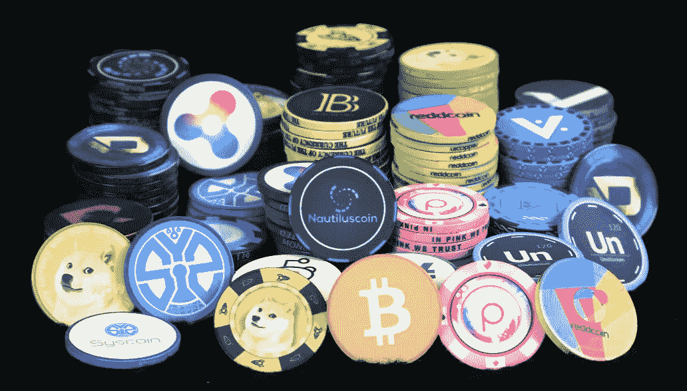
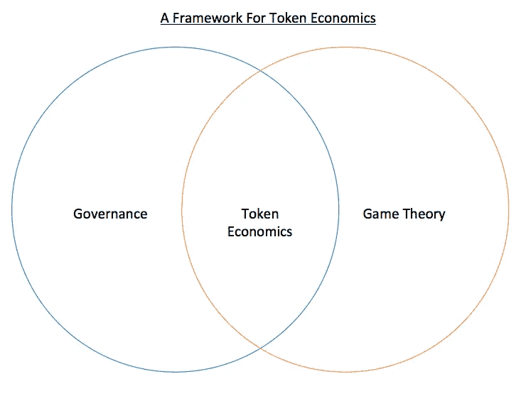

# 新兴的代币经济学——美国东部时间 11 月 6 日下午 2 点到 3 点的电话会议

> 原文：<https://medium.com/hackernoon/the-emerging-science-of-token-economics-conference-call-on-nov-6-2pm-3pm-est-c9ab3946ed6b>

## 可以在介质上找到该呼叫的回复

我们正在秘密进行一场[寒武纪大爆发](https://goo.gl/iP1ryZ)。就像寒武纪时期创造了大量新的生命形式一样，T4 区块链 T5 加密货币和去中心化的出现打开了大量以前无法进入的市场，以及与根深蒂固的现有企业竞争的新方式。当然，今天出现的许多新的加密实体将会消亡，但许多幸存下来的将会是史诗般的。

我认为，将决定这些实体成败的最不被重视的因素之一是象征经济学。根据 [William Mougayar](https://medium.com/u/f826ec76344e?source=post_page-----c9ab3946ed6b--------------------------------) 的定义，令牌是:

> 组织创建的价值单位，用于自我管理其业务模型，并使其用户能够与其产品进行交互，同时促进所有利益相关者的奖励和利益的分配和共享。

如果这听起来很复杂，那是因为它很复杂。William 在 token economics 上写了一篇很棒的文章，是这次电话会议的极好的入门材料。在这篇文章中，他提出了每个基于 ICO 的组织都应该问自己的 20 个问题，包括:

1.  令牌是否与产品用途相关联，例如，它是否给予用户对它的独占访问权限，或者提供对产品的交互权限？
2.  令牌是否授予治理操作，比如对与共识相关的因素或其他决策因素进行投票？
3.  令牌是否使用户能够为正在构建的网络或市场的增值活动做出贡献？
4.  令牌是否基于共享或公开用户的某些数据(被动工作)而授予用户价值？
5.  运行智能合约或为 oracle 融资是否需要令牌？(oracle 是其他智能合同可以使用的信息源)

代币经济是密集的。代币经济学还处于起步阶段。目前，我思考代币经济学的一种方式是:

An Actual Original Thought of Mine

我相信，在不久的将来，世界上一些最聪明的大学生将从主要大学毕业，获得象征性经济学学位。这是一件事。所以我们正在主持一个关于这个话题的电话会议。

在这次通话中，我们邀请三位领先的代币经济学专家分享他们关于如何设计最佳代币经济的知识。需要考虑哪些因素？你必须做出什么样的权衡？只有一个令牌好，还是有多个令牌好？治理如何与代币经济学共存？什么博弈论是相关的？

无论你是一个加密投资者，你对做 ICO 的想法，或者你只是想在加密生态系统中变得更聪明，我认为这个电话会议上讨论的很多内容都会让你大吃一惊(至少这是我的希望)。

我们很高兴有四位专家从不同的角度研究代币经济学。每个人都将带来他们的真实世界经验，以及一些关于如何设计最佳代币经济的理论。在三位专家完成他们的正式评论后，我们将有足够的时间留给观众提问。

*点击* [*此处*](https://goo.gl/k5r6g6) *在 GoToWebinar* 登记呼叫

我们尊敬的四位演讲者是:

[**Tom BOL lich**](https://medium.com/u/67eb8a8fe3f8?source=post_page-----c9ab3946ed6b--------------------------------)**—**[**MAD Network**](https://goo.gl/AYkyWH)**，**一个去中心化的广告技术生态系统去中介程序化广告。汤姆之前是 Zynga 的创始团队成员，在他开始为财富 500 强公司提供“游戏化”建议之前，他帮助创建了像黑手党战争这样的游戏的代币经济。

**Mark Smargon——联合创始人&**[**Colu**](https://goo.gl/6yTzkd)**，**区块链副总裁，该公司利用区块链技术创造当地货币，推动更多人在当地购物、在当地吃饭、购买当地商品，加强当地经济，并将货币控制权掌握在每个人手中。Colu 目前正在伦敦、特拉维夫、利物浦和海法拓展本地货币业务。马克之前是以色列比特币支付提供商 Bitgo 的联合创始人。

[杰克·布鲁克曼](https://medium.com/u/2584d192c956?source=post_page-----c9ab3946ed6b--------------------------------)**——**[**coin fund**](https://goo.gl/k9Dqds)**，**区块链技术研究公司、顾问团队和专有加密资产投资工具的联合创始人和管理合伙人。CoinFund 帮助区块链领域的公司优化如何将区块链经济学应用于各行各业。在加入 CoinFund 之前，Jake 曾在 Triton Research 和 Amazon 工作(担任技术产品主管)。

[Ben Perper](https://medium.com/u/93cc50b2a7d7?source=post_page-----c9ab3946ed6b--------------------------------)—**YouNow/PROPS 的产品总监，**一家去中心化的多对多视频提供商**。Ben 之前是 Zynga 的高级产品经理，负责推出新游戏，运营拥有数亿用户的游戏。在 Zynga 时，Ben 磨练了他在分析用户行为、优化虚拟经济和优先考虑产品路线图方面的技能，以达到积极的 KPI。**

*点击* [*此处*](https://goo.gl/k5r6g6) *在 GoToWebinar* 登记呼叫

*如果你从这篇帖子中获得了至少* 0.00000001 比特币*的价值，或者欣赏了该视频，那么* ***请点击*** *下方的“拍手”。*