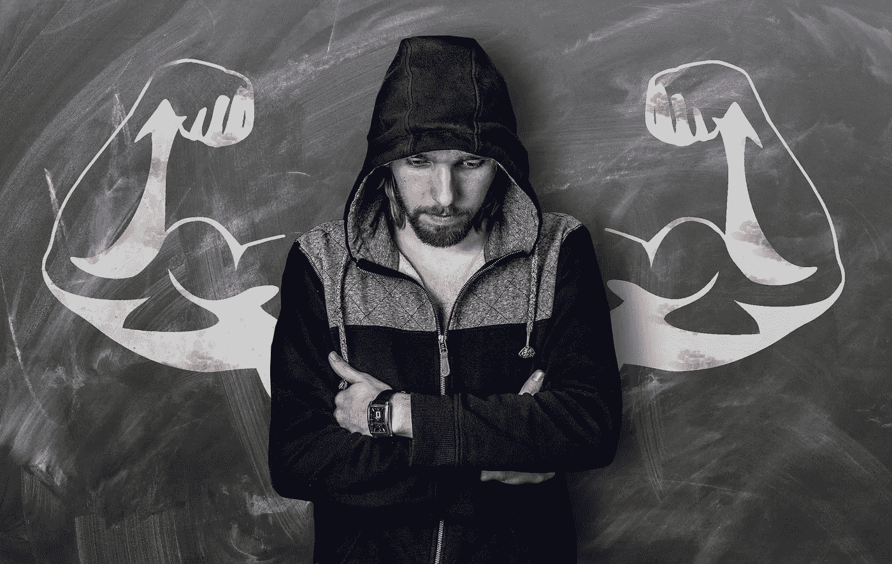

# 情绪适应创始人，第一部分:什么是情绪适应？

> 原文：<https://medium.com/hackernoon/the-emotionally-fit-founder-part-one-what-is-emotional-fitness-628fceaac145>

最成功的创始人和首席执行官不一定是认知最稳定的人。创办一家公司的任务需要某种类型的执念，以及推进一个想法的能力，即使所有证据都指向失败。

创始人的生活是不可预测的，涉及的不仅仅是大量的拒绝和挫折，因此可能最适合那些已经建立了庞大防御体系的人。尽管如此，创始人为整个公司设定了基调和精神气质，因此，他们必须在情感上保持一致。

最近，人们开始了解作为创始人的黑暗真相，以及他们经常面临的强烈抑郁、焦虑和自我怀疑。由 [Freeman 等人](http://www.michaelafreemanmd.com/Research_files/Are%20Entrepreneurs%20Touched%20with%20Fire%20(pre-pub%20n)%204-17-15.pdf)所做的一项研究表明，多达 72%的企业家有心理健康问题，但是正如 Y Combinator 的 Sam Altman [所写的](http://blog.samaltman.com/founder-depression)，“作为一个创始人，永远不要示弱，在所有内部和外部情况下都要成为啦啦队长，这是一种巨大的压力。”

为了消除这种耻辱感，杰出且受人尊敬的创始人和首席执行官们开始大声说出他们自己的奋斗历程，并帮助[在](http://www.inc.com/magazine/201307/brad-feld/many-entrepreneurs-deal-with-depression.html)[初创企业](https://hackernoon.com/tagged/startup)社区中消除精神健康支持需求的耻辱感，使之正常化。这是至关重要的，早就应该进行对话了。

也就是说，我们需要小心不要造成两极分化，在一端，我们有一个在极度焦虑和抑郁下勉强度日的创始人，而在另一端，我们有一个据称“健康”的创始人，他不需要任何情感支持。是时候开始一场关于现实的对话了，在完全的幸福和令人衰弱的精神疾病之间存在着我们大部分的情感生活。

除了帮助创始人获得他们需要的精神健康护理，我们还应该鼓励致力于培养他们的沟通能力，培养同理心，并拥有富有成效和健康的关系。我们需要开始谈论的不仅仅是心理健康。

**什么是情绪健身？**

虽然情绪健康不能与身体健康 1 比 1 比较，但这样想是有帮助的:每个人都有身体，所以每个人都有身体健康。有些人患有慢性疾病，如糖尿病或高血压，但每个人都有感冒的时候，每个人都可以更好地照顾自己的身体，每个人都有独特的身体优势和局限性。

许多人认为，如果他们没有生病，那么他们就没有必要关注自己的身体健康。但是身体健康的人(即锻炼、吃好、睡足)要知道——仅仅因为你没有生病，并不意味着你很健康。

情绪健康也差不多。保持“情绪健康”需要时间、耐心和坚持。情绪[健康](https://hackernoon.com/tagged/fitness)并不是以没有重大心理障碍为特征，事实上，一个人可以应对焦虑、抑郁、躁郁症、多动症等。同时保持情绪健康。

**情绪健康是一种持续的向内看的承诺，处理困难的情绪，努力实现自我意识和自我完善。**

像任何健身养生法一样，它需要保持，并会防止更严重的问题。变得情绪健康并不总是很快或很容易，但那些愿意投资自己的人将会看到巨大的回报。

继续阅读本系列的[第二部分，了解情感契合型领导者的 7 个特质。](https://hackernoon.com/the-emotionally-fit-founder-part-two-7-traits-of-emotionally-fit-leaders-10c8908efb24#.s6sfa4ymz)

*在这里* *保持最新的博客文章* [*。前往*](http://eepurl.com/cHnq3L)[*dremilyanhalt.com*](http://dremilyanhalt.com)*了解更多。*

> 黑客中午是黑客如何开始他们的下午。我们是这个家庭的一员。我们现在[接受投稿](http://bit.ly/hackernoonsubmission)并乐意[讨论广告&赞助](mailto:partners@amipublications.com)机会。
> 
> 如果你喜欢这个故事，我们推荐你阅读我们的[最新科技故事](http://bit.ly/hackernoonlatestt)和[趋势科技故事](https://hackernoon.com/trending)。直到下一次，不要把世界的现实想当然！

