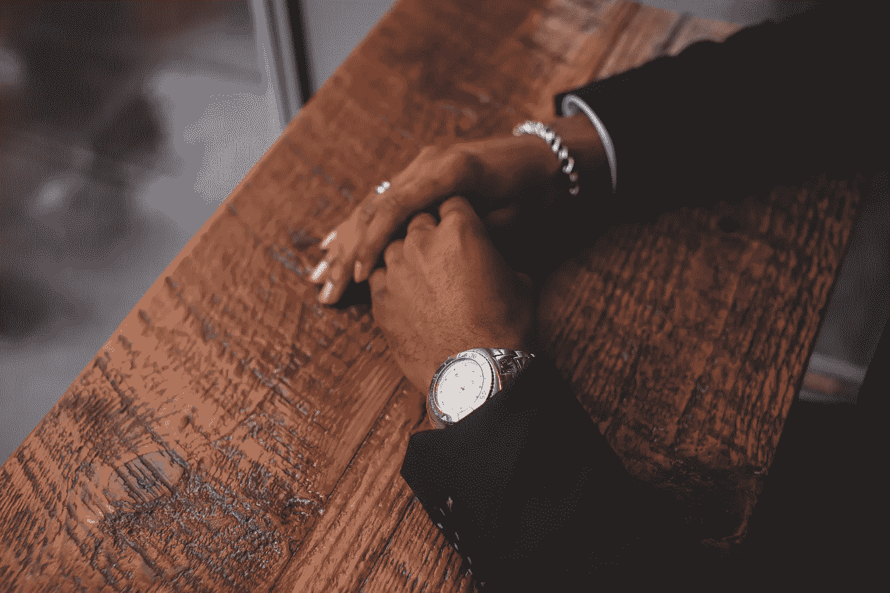

# 情绪适合的创始人，第三部分:为什么情绪适合是必要的？

> 原文：<https://medium.com/hackernoon/the-emotionally-fit-founder-part-three-why-is-emotional-fitness-imperative-be2d3d6b3847>

在本系列的第一部分中，我介绍了情绪健康的概念，在第二部分的[中，我们探讨了情绪健康的领导者的七个特质。但为什么情绪健康对创始人和高管如此重要？](https://hackernoon.com/the-emotionally-fit-founder-part-two-7-traits-of-emotionally-fit-leaders-10c8908efb24)

创始人持续承受的压力对其心理和精神都是极其沉重的负担。除了在精神上处于健康状态，拥有良好的应对机制来处理焦虑、抑郁和自我怀疑，创始人还必须擅长形成和维持良好的关系。他们必须能够与共同创始人、投资者和员工进行有效沟通，并灌输一种信任感，即他们在为公司的最大利益着想。

如果商业只是一系列的关系，那么创始人与他们自己的关系将会减轻他们所做的一切。我和第一页 Sage 的首席执行官 Evan Bailyn 有过一次对话，他是这样说的:

> “实际上，没有什么比我自己的个人治疗更能帮助我的事业取得成功。意识到我如何应对挑战、损失和失望，对我管理公司的方式产生了巨大的影响。这让我更好地了解了别人对我的看法，提高了我有效沟通的能力，也让我对与我一起工作和服务的人有了更多的同情心。”

在很多方面，[科技](https://hackernoon.com/tagged/tech)的创始人就像父母，而公司就像一个家庭。能够坐下来表达困难感受的父母为孩子的情绪和挣扎创造了一个安全的环境。试图压抑自己的脆弱和对支持的需求的父母经常鼓励他们的孩子也这样做，通常没有意识到这一点。

类似地，一个没有对自己做必要的(通常是困难的)工作来理解他们的触发因素、偏见和斗争领域的创始人会将这些问题转移到他们的公司和员工身上。

keen.io 的联合创始人兼首席执行官凯尔·怀尔德(Kyle Wild)已将情绪健康纳入其公司的优先事项。他这样向我解释他的观点:

> “一次又一次，我发现了解自己的弱点让我成为一个更有能力、更有效的领导者。我们的组织和文化对戏剧性的变化有着惊人的适应力，我相信这是因为我们是一个投资于信任和自我探究的部落。对我来说，甚至有人认为情绪健康是公司文化的重要组成部分，这简直是疯了。”

在硅谷，如此多的文化和社区植根于技术领域，拥有情绪健康的创始人将对社会产生非常重要的连锁反应。

从事科技行业的年轻人正在以现任 CEO 和创始人为榜样，学习如何合作和领导。如果他们在一个教会他们如何沟通、透明和感同身受的环境中工作，当他们成为下一代创始人时，他们会带着这些经验教训。这种更替发生得很快，这意味着我们有一个真正的机会来改变公司的运营方式。

不可避免地会有许多人从一开始就看不到投资情感健康的价值。在[初创企业](https://hackernoon.com/tagged/startup)的世界里，设计也出现了类似的情况:

10 年前，许多创始人直到创业过程的后期才优先考虑设计思维。随着时间的推移，[设计在科技产品的成功中扮演着巨大的角色](https://www.forbes.com/sites/lorikozlowski/2013/08/07/why-great-design-is-crucial-for-startups/#12873b411116)，这一点变得越来越明显，需要从一开始就成为等式的一部分。现在，从一开始就看到设计联合创始人和 CDO 的例子并不罕见。我相信情感健康也是如此。

继续这个系列的最后一部分[，在这里，我为创业者们提供了 7 种方法，让他们为了自己和公司的利益而努力实现情绪健康。](http://bit.ly/2nVW0QY)

*头以上*[*dremilyanhalt.com*](http://dremilyanhalt.com)*为多。*

> [黑客中午](http://bit.ly/Hackernoon)是黑客如何开始他们的下午。我们是阿妹家庭的一员。我们现在[接受投稿](http://bit.ly/hackernoonsubmission)并乐意[讨论广告&赞助](mailto:partners@amipublications.com)的机会。
> 
> 如果你喜欢这个故事，我们推荐你阅读我们的[最新科技故事](http://bit.ly/hackernoonlatestt)和[趋势科技故事](https://hackernoon.com/trending)。直到下一次，不要把世界的现实想当然！

