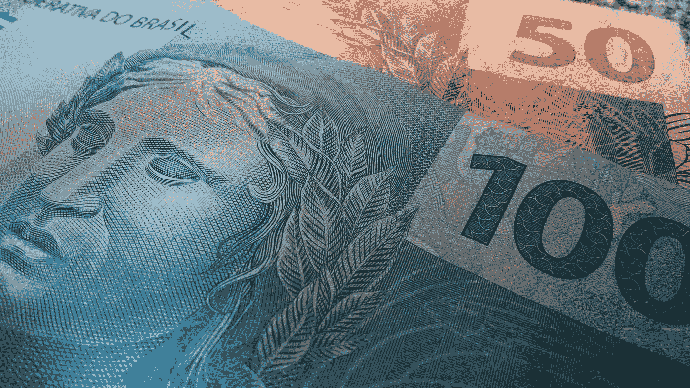
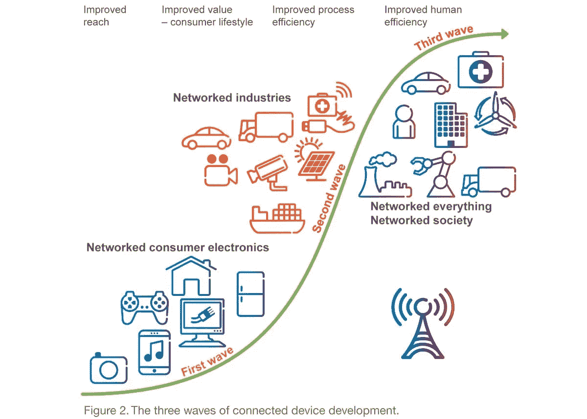
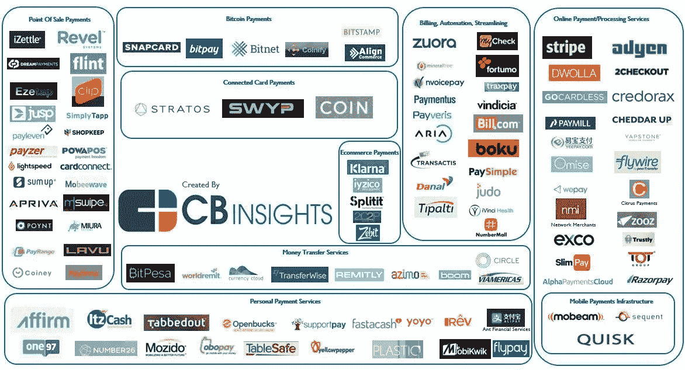

# 皇帝的新衣

> 原文：<https://medium.com/hackernoon/the-emperors-new-clothes-f15ef317cd6d>

## 无形经济的崛起

> 你为什么要生活在一个感觉不到它的重量的世界里？—卡尔·奥维·克瑙斯高

这篇文章向读者介绍了两种相关技术的融合，正如我们所知，这两种技术将改变生活和商业。物联网(IoT)的崛起&价值互联网(IoV)将创造一个无形的经济(很像皇帝的新衣)，只不过你需要在引擎盖下偷看一下才能知道发生了什么。

# **基本术语**

“物联网”这个术语是由宝洁公司(后来的麻省理工学院自动识别中心)的凯文·阿什顿(T4)于 1999 年创造的。今天，它包括任何东西(设备:手机、电脑、电视、车钥匙、恒温器、灯；生物:动物、带有芯片(例如起搏器)的人，该芯片连接到互联网，可以通过网络发送/接收数据，并具有唯一的标识符。

Wordpress

术语“价值互联网”可以简单地理解为可以通过网络传输的以计算机代码(例如加密货币)表示的货币/资产。Ripple Labs 的目标是创建一个“**价值互联网**”——一个以当今信息流动速度进行货币交易的世界。当然，真正的 IoV 延伸到任何有价值的东西，包括法定货币、商品和其他资产。

想象中的价值互联网(全球结算网络)今天不存在，但明天可能会存在。

# 闪回:在去肯尼亚的路上

那是 2001 年，我刚从印度孟买的大学毕业。我登上了一架飞往东非肯尼亚内罗毕的飞机。我的表妹坐在邻座。她从一个公共中转机场加入我们。她从美国旅行到肯尼亚，而我从印度旅行到肯尼亚。顺便提一下，肯尼亚通过其 M-pesa 平台成为移动商务的先驱。

像今天一样，美国和印度之间有许多不同之处，但我们的谈话转向了在各自国家使用信用卡的问题。众所周知，印度是一个以现金为基础的社会([只有 2%的交易是无现金的](http://www.businesstoday.in/current/economy-politics/here-are-the-top-cashless-countries-in-the-world/story/241430.html))，此外，德国(33%的无现金交易)和美国(45%的无现金交易)等许多国家都以使用个人债务为购物融资以及信用卡在债务融资中发挥越来越大的作用而闻名。对于我所有好奇的读者来说，新加坡以 61%的比例领先于无现金交易排行榜，荷兰(60%)、法国(59%)和瑞典(59%)紧随其后。同样，这些百分比是方向性的。它们确实表明，世界上很大一部分交易仍然是无现金的。

社会可以通过一系列的激励措施实现无现金化，从降低银行自动取款机和硬通货的成本(典型的例子——瑞典)到大众金融包容性(典型的例子——印度)。

回到我的旅行——我姐姐解释说，她带着信用卡是为了方便，但她不愿使用信用卡，因为她发现很难记录费用，除非她使用现金或借记卡。对她来说，仅仅是放弃现金或一张直接将借方记入其银行账户的卡的行为，就能偶尔提醒她正在超支。

对我来说，这听起来像是刷卡的便利引入了一种不透明的元素，即你必须等待你的信用卡账单来扫描你逐项购买的商品(当时应用程序还没有那么流行。记得第一代 iPhone 是 2007 年推出的，我说的是 2001 年)

作为一个菜鸟程序员，我觉得这种体验非常类似于封闭的操作系统/软件。使用像 Linux 这样的开源软件，很容易看到代码，但是这种能力只有在你是程序员的情况下才有用。

然而，在 MS Windows 上，你有一个很棒的图形用户界面，但是你不知道其中的代码。我看到了与即将到来的无形经济非常相似的趋势，那就是:

> 伴随便利而来的是不透明，除非你想花时间去了解引擎盖下的东西。对于物联网和物联网来说尤其如此

当时，我所有的交易都是用现金或借记卡进行的，因为我没有信用卡。我习惯了“不用找了”这句话，而我姐姐习惯了直接刷卡。

就像上面 knaus grd 的话一样，我习惯了在递出去之前，先感受一下手中一枚硬币或者一张纸币的重量。现在，没那么多了。

# 快进到今天

现在是 2017 年，我在美国工作。我已经一年没去银行分行了。我 2%的时间都带着现金。我的钱包里装满了信用卡。我用 Venmo 支付给我的朋友，并且非常喜欢它附带的表情符号。我必须说的一件事是，我明智地使用信贷，提前还清债务。现在，你也可以使用 MacBook Pro 上的 Apple pay 图标进行支付。

## 全球支付趋势

根据[艾登](https://www.adyen.com/blog/top-5-payments-trends-for-2017):

1.  全球支付的移动份额(目前为 37%)将继续不可阻挡地增长，在英国和澳大利亚等市场将超过 50%。这主要是由移动钱包的增长推动的。Apple Pay 以其早期采用者和强大的品牌引领潮流(过去一年增长了 400%)，而智能手机市场份额更大的 Android 可能会打开闸门。
2.  根据 Worldpay，替代支付(数字钱包、货币等。)占结算活动的比例可能会从 2012 年的 43%上升到 2017 年的 59%。
3.  在美国，有一个银行财团引进了与 Venmo 竞争的 [Zellepay](https://www.zellepay.com/) 。瑞典支付应用 Klarna 已经变成了一家银行。印度的 PayTM 从软银获得了 14 亿美元的注资。WePay 和支付宝已经在全球扩张。这是风景的快照:

4.科技巨头亚马逊、脸书和谷歌已经在寻求进入。凭借其巨大的影响力，他们的客户几乎是整个世界。

5.根据 [CB Insights](https://medium.com/u/914088e570e?source=post_page-----f15ef317cd6d--------------------------------) 的数据，2016 年上半年，美国市场是支付初创公司交易最多的市场。英国排名第二，是资金雄厚的初创公司的家园，如 [Transferwise](http://www.cbinsights.com/company/transferwise) 和 [Azimo](http://www.cbinsights.com/company/azimo) 等。并列第三的是德国(Number26 和 [Payleven](http://www.cbinsights.com/company/payleven) 的故乡)和印度(MobiKwik 和 [Juspay](http://www.cbinsights.com/company/juspay) 的故乡)，接下来是加拿大、新加坡和丹麦。

简而言之，支付和结算将继续成为风险投资和金融科技领域的焦点。什么会改变游戏？请继续阅读。

# 未来:万物互联

如今有许多支付协议，如美国的 ACH、许多其他国家的 SWIFT 和欧洲的 SEPA。那么，如何跨境转移价值呢？进入区块链。

诚然，围绕区块链及其应用于跨境支付以消除中间商、交易费用和交易时间，存在大量毫无根据的兴奋。

一个众所周知的美国孙子将能够在几分钟内使用手机上的数字钱包/加密钱包向他在印度一个小村庄的祖母发送数字货币/加密货币(可选择兑换为法定货币)，交易成本仅为当前交易成本的一小部分或零交易成本。

> 简而言之，这确实有经济意义。世界是否准备好了，这完全是另一回事。

区块链需要巨大计算能力。为了不可变的记录和安全性，牺牲了效率。

考虑一下比特币社区最近在处理区块大小的隔离见证(SegWit)方法上的问题。比特币区块链每秒只能处理几笔交易，而 Visa 的网络每秒可以处理大约 2000 笔交易。

幸运的是，SegWit 事件没有导致比特币区块链的硬分叉。简而言之，区块链在成为全球可扩展企业之前还有很长的路要走。

Ripple Labs 认为物联网和物联网是一回事，最终将会有一个全球网络。

> 如今被称为“万物互联”的互联网将促进价值的跨境转移，也将允许无生命的物体参与其中。

然而，在此之前，必须有一个价值登记册，即所有类型的资产(包括商品等实物资产)都需要登记，以便能够通过万物互联进行交易。

本田和 Visa 已经宣布了一种联网汽车的概念验证，这种汽车可以无缝支付汽油费用:

智能合同(计算机代码——如果 x 发生了，那么用 Y 语句粗略地说)将促进在线合同。未来，自动驾驶汽车可以使用加密货币和嵌入式智能合同支付自己的汽油费用。事实上，物的交易可能会超过人的交易。

挑战比比皆是，需要克服——监管机构的作用、保护公民权利的政府、防止使用物联网侵犯隐私和制作脱离我们生活的真人秀的在线安全、数字身份的创建等。

> 金融普惠是一项非常艰巨的任务。现金还是王道。

**就像皇帝在《皇帝的新装》里说的**:我不想弄瞎他们，我只想让他们眨一点眼。

> 最终，在万物互联的互联网上做生意只需要一眨眼的时间，然而却很难看到交易发生。这几乎就像魔术一样。

## 感谢您的阅读。如果你认为这篇文章有教育意义，请与你在脸书、推特、LinkedIn 或其他社交媒体上的关注者分享。可以在推特上关注我:@akothari_mba

## 如果你喜欢这篇文章，请点击下面的心形推荐它。

