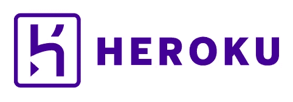
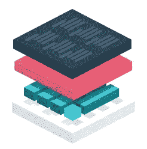

# 赫罗库的末日？

> 原文：<https://medium.com/hackernoon/the-end-of-heroku-cda380b3087f>

不可否认的是，Heroku 改变了我们所知的虚拟主机的面貌。在它们出现之前，我们大部分时间都是从零开始构建和配置服务器，处理共享托管的陷阱，和/或不得不考虑云部署策略的复杂性。Heroku 推出了一个系统，可以轻松设计应用程序，将它们部署到灵活的云基础设施，并根据需要扩展它们——这些创新迅速巩固了它们作为*平台即服务(PaaS)的地位，并使它们在今天的大多数网络[开发](https://hackernoon.com/tagged/development)圈子里家喻户晓。*

Heroku 是一家很棒的公司，这些年来，无论是作为一个用户还是作为一个收购要约的接受者，我都和它打过交道。他们为商业上可行的 PaaS 开辟了道路，我在这个行业呆了七年，并且证明了 PaaS 能够(并且确实)满足真正的业务需求。我不想从他们所做的事情中吸取任何东西，但我最近注意到一种趋势。我看到越来越多的开发者在寻找 Heroku 的替代品。

# 为什么人们把目光投向别处？

在我所见所闻的对话中，有三种常见的抱怨:

## Heroku 很快就变贵了

毫无疑问，开发者对 Heroku 最大的抱怨是价格。Heroku 一开始相当便宜，但是一旦你需要扩展，它很快就会变得昂贵。应用程序按“dyno”定价，dyno 是一个轻量级的 Linux 容器，运行一个用户指定的命令。随着您纵向扩展 dynos，成本会上升(添加更多 RAM、CPU 等。)而这些成本会随着你的横向扩展而成倍增加(添加更多的 dynos)。由于大多数网络应用无法在一个 dyno 上运行，价格的快速上涨是几乎所有 Heroku 用户都必须面对的问题。

坏消息是 Heroku 可能不会很快变得更便宜。所有部署到 Heroku 的应用都部署在 Heroku 的 AWS 基础设施上。由于 AWS 的存在，他们只能将自己的价格定得如此之低，但仍能保持利润率。除非他们能与亚马逊达成某种疯狂的交易，基本上获得近乎免费的服务器，否则价格不会降得太多。

## 睡眠应用很烦人

Heroku 确实提供了一个免费层，许多修补者和爱好者已经开始依赖它，但这仍然是有代价的——你的应用程序在不活动一段时间后会“进入睡眠”。Heroku 本质上是关闭应用程序的容器来释放全局系统资源。一旦应用程序收到网络请求，它就会被唤醒，但最初的响应可能需要 10-20 秒。对一些人来说，这只是小小的代价。其他人只是通过调度每小时点击应用程序的“curl”请求来欺骗系统…

***快速切线****——那些游戏免费层的人只是加剧了 Heroku 的定价问题。尽管这款应用可能对你来说是免费的，但 Heroku 仍然需要为运行你的应用所需的系统资源付费。反过来，他们不得不提高付费用户的价格，以弥补额外的开销。*

…但对许多人来说，这是一种烦恼，迫使他们进入价格快速上涨的付费阶层。

## 不拥有服务器

就此而言，大多数开发人员和公司都有对其业务的关键组件进行控制和拥有的内在需求。说到虚拟主机，没有什么比你的基础设施更重要了。直截了当地说，当你在 Heroku 上部署一个应用程序时，你**不**拥有基础设施，Heroku 拥有，你只被给予他们给你的访问权。

不管你喜不喜欢，Heroku 的小型 dynos 部署在多租户共享服务器上。出于安全考虑，Heroku ***有*** 来限制你对服务器的访问。对许多人来说，这是一个交易破坏者。

另一个相关的抱怨是，您无法选择服务器部署的位置。AWS 就是它。

# 纳米盒

*所以我知道这将被视为一种营销手段，但我真的不想这样。这只是我分享我的想法。*

完全披露——我为 [Nanobox](https://nanobox.io) 工作，过去 7 年一直在 PaaS 行业工作，与 [Pagoda Box](https://pagodabox.io) *(关于两者的区别，请访问* [*这里*](https://content.nanobox.io/nanobox-vs-pagoda-box/) *)* 。所以我知道和 Heroku 竞争是什么感觉…这是一场艰苦的战斗。

Nanobox 是从 PaaS 行业多年的经验以及大型、可扩展的客户端实现工作中获得的经验教训的结晶。我们在 2017 年 2 月初走出了 *beta* ，所以我们仍然是一家年轻的初创公司，但在周一，我们发布了一种新的定价模式，这种模式已经吸引了许多持观望态度的 Heroku 用户的注意，被证明是 Heroku 的一种可行的[替代方案。](https://content.nanobox.io/heroku-alternatives-flexible-affordable/)

## 统一定价

吸引注意力的主要原因只是成本。要用 Nanobox 部署无限数量的应用程序，每月需要 10 美元。如果你想/需要与他人合作，你可以以固定的价格**$ 15/用户/月**创建团队。有一些特定于应用的升级为应用提供了额外的功能和可扩展性，但你可以在 [Nanobox 定价页面](https://nanobox.io/pricing)上查看这些升级。哦，应用程序永远不会休眠。

***注意:*** *付费 Nanobox 账号只需要部署 app。* [*使用 Nanobox 进行本地开发*](https://nanobox.io/for-developers/) *是免费的。*

我们能够保持低价的部分原因是因为我们不托管你的应用。我们将您的应用部署到您的云提供商。我们只需要为我们自己的 API、仪表板和支持服务维护服务器，所以我们的开销很低。

简而言之，在价格方面，Heroku 无法与 Nanobox 竞争，除非他们改变其服务的核心架构。

## 使用你想要的云，它就是你的

如上所述，Nanobox 不会将你局限于 AWS 或任何其他云提供商。您可以部署到任何您想部署的地方。我们目前已经正式整合了 AWS、Digital Ocean 和 Linode，其他的正在整合中。使用我们的[开放 API 规范](https://docs.nanobox.io/providers/create/)，您可以创建与任何提供商的集成。一些用户甚至创建了与他们自己的内部(实际上是在他们的房子里)服务器的集成。

更重要的是，你拥有基础设施。它是你的了。您将 Nanobox 连接到您的云提供商帐户，我们将提供基础架构，并为您提供一个仪表板来监控/管理您的应用，并自动执行与开发、部署和管理应用相关的复杂任务。

# 这是 Heroku 的末日吗？

哈哈，不。如果我声称我正在做的一个项目的推出标志着 Heroku，一个数百万美元的公司的结束，这将是非常冒昧的。但是我只能说这么多——我们已经看到了很多不满意的 Heroku 用户的兴趣。我们用 Heroku 直接解决他们面临的最常见的痛点，那些寻找替代品的人正在 [Nanobox](https://nanobox.io) 中找到它。

> [黑客中午](http://bit.ly/Hackernoon)是黑客如何开始他们的下午。我们是 [@AMI](http://bit.ly/atAMIatAMI) 家庭的一员。我们现在[接受投稿](http://bit.ly/hackernoonsubmission)，并乐意[讨论广告&赞助](mailto:partners@amipublications.com)机会。
> 
> 如果你喜欢这个故事，我们推荐你阅读我们的[最新科技故事](http://bit.ly/hackernoonlatestt)和[趋势科技故事](https://hackernoon.com/trending)。直到下一次，不要把世界的现实想当然！

