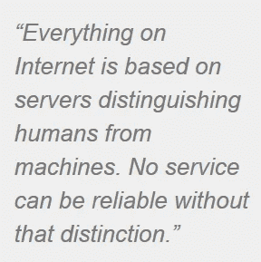

# [互联网]的末日即将来临

> 原文：<https://medium.com/hackernoon/the-end-of-internet-is-near-5603fdafa1e6>

## 机器的崛起

未来要么是需要个人身份证的互联网，要么不是。不会吧。互联网上的一切都是基于服务器来区分人类和机器。没有这种区分，任何服务都不可靠。如果大多数意见是由机器人写的，你就不能有一个提供意见的服务。如果你的竞争对手在用机器人填表格，让你的服务器饱和，你不可能通过提供免费服务为你的[初创公司](https://hackernoon.com/tagged/startup)获得新用户。

如果大部分信息都是垃圾信息，你就不可能有公告板服务。如果没有互联网，你可以向他人发送信息，公开表达意见，或者在没有过多风险的情况下从零开始建立一家公司，我们的世界会变成什么样？

我们会回到十九世纪。当前经济的大部分是基于这种丰富的互动:在线广告，电子商务。我们现在花在这些互动服务上的时间比我们生活中几乎任何其他活动都多。现在想象这一天会停止。

想象一下，在未来，所有东西区分人类和机器人的准确度都比垃圾邮件检测器实际拥有的准确度高。社交网络上的大多数消息都是来自伪装成人类的机器人的消息，以说服你为他们工作的公司提供线索。你不能相信任何意见，因为你没有办法区分真实的意见和机器的意见。这就是我们面临的未来，人工智能的新发展将使机器人能够模仿几乎任何人类能力。

## 隐私与可操作性

如果每个人都有一个个人 ID，并在每项服务中使用它来识别自己，所有这些问题都会消失。通过这种方式，服务提供商可以区分人类和机器人，并适当地过滤数据。这是一个显而易见的解决方案。如此显而易见，以至于人们不禁要问，为什么自互联网诞生以来，它没有被实现。答案是隐私。互联网的创始人不得不在隐私和可操作性之间做出选择。没有已知的方法在算法上同时保证这两者。你必须选择其中一个，修补另一个。如果你提供完全隐私(这意味着匿名)，你必须修补系统，防止滥用匿名；另一方面，如果你保证可操作性(禁止匿名操作)，你必须以某种方式在隐私上妥协。在那个时代，修补可操作性的成本很低，修补隐私的成本令人难以承受:如果你提供完全匿名，你通常可以使用验证码区分人类和机器人。这可以解决匿名的大部分操作问题。相反，如果你禁止匿名，没有任何架构可以提供隐私，这不会涉及独立受托人以昂贵、低效和不安全的方式验证它。现在，我们每天都能在我们的电子邮件收件箱里看到他们最终妥协的后果，那就是大量不受欢迎的电子邮件。

## 互联网投票是一个典型的例子

这些困难的一个典型例子是互联网投票。如果你能开发出不依赖于任何监管隐私的受托人的互联网投票技术，你可以期待找到类似的解决方案来解决互联网上所有需要在隐私和可操作性之间折衷的服务。如果你不熟悉网上投票技术，可能你会奇怪为什么网上投票没有很久以前就被应用到各种选举中。这将带来效率和节约成本的明显好处，一些研究表明，这将使年轻人更多地参与政治选举。但是，如你所知，互联网投票并没有在世界上任何一个国家使用。许多安全专家认为这是不可能的——正是因为你不能同时提供隐私和可操作性。如果你选择匿名，你就不能区分投票和真正的人类，如果你需要一个 ID，你就不能在不依赖可信管理员的情况下提供投票的隐私。因此，这是一个典型的例子，说明在互联网环境中，看似琐碎的任务无法同时满足这两个要求。

如果我们想将文明从一种通常不被考虑(但非常真实)的崩溃可能性中拯救出来(是的，这听起来有些夸张，但这正是现实情况)，我们需要现在就开始思考这个问题，在线投票可以成为我们迫切需要的新技术发展的先锋。

我很自豪能够通过[iglooovote](http://www.igloovote.com)项目开创这一领域的工作，能够开发出一种技术，以完全自动化的方式同时提供隐私和可操作性，不需要任何可信的部分。惊人的时代即将到来！

> [黑客中午](http://bit.ly/Hackernoon)是黑客如何开始他们的下午。我们是 [@AMI](http://bit.ly/atAMIatAMI) 家庭的一员。我们现在[接受投稿](http://bit.ly/hackernoonsubmission)并乐意[讨论广告&赞助](mailto:partners@amipublications.com)机会。
> 
> 如果你喜欢这个故事，我们推荐你阅读我们的[最新科技故事](http://bit.ly/hackernoonlatestt)和[趋势科技故事](https://hackernoon.com/trending)。直到下一次，不要把世界的现实想当然！

