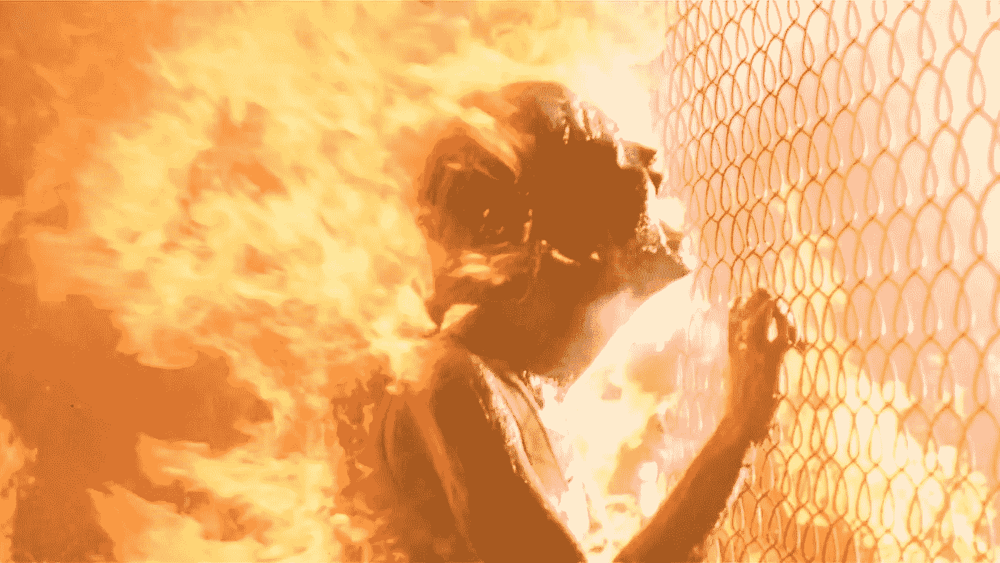
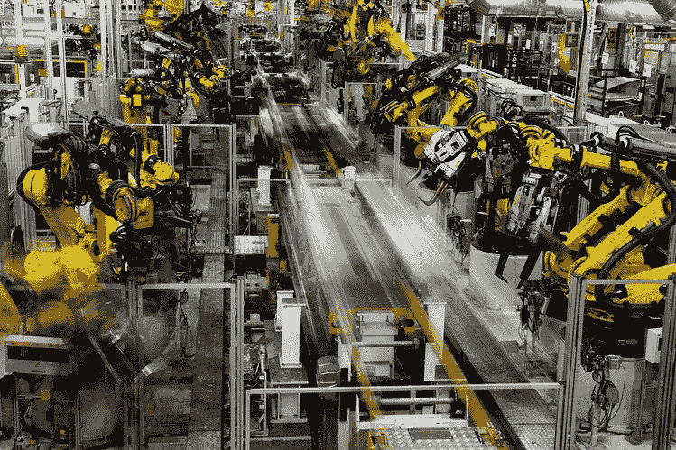

# 世界末日即将来临，它将以人工智能和数字货币的形式出现

> 原文：<https://medium.com/hackernoon/the-end-of-the-world-is-near-and-comes-in-the-form-of-artificial-intelligence-and-digital-money-8a8aec77b9e6>

嗯，也许标题有点夸张，但也有道理。如果我们稍微思考一下，研究一下，我们就能看到一个前所未有的变化即将到来。

作为一个生活在充满不确定性的环境中的发展中国家的公民，我看到各国政府带着陈旧的政策来来去去，然而技术继续以如此巨大和迅速的步伐前进，以至于人们很难及时适应。

## 但是人工智能和数字货币与这一切有什么关系呢？

[人工智能](https://hackernoon.com/tagged/artificial-intelligence)变得越来越复杂，能够非常快速和精确地执行任务，这不是一个拥有杀手机器的好莱坞式场景，而是最大的风险在于劳动力领域，例如，运输行业的工人如何与一辆虽然不完美但在大多数方面比任何人类操作员都好的自动驾驶汽车竞争？

[自动化](https://hackernoon.com/tagged/automation)是新的革命。

从中期来看，我们将看到政府对企业中的自动化职位空缺进行监管，当然也应该有一个人类雇员的最低配额。

这些技术的影响现在和将来都是巨大的，似乎没有一个劳动领域可以幸免，我们将会看到从医疗机器人到机器人艺术家，几乎在你专攻的任何领域都会有一种类型的机器人能比你做得更好。不，这不好笑。

正如我在开始时所说，我生活在一个发展中国家，准确地说是墨西哥，最大的问题是不安全和社会不平等，这些问题是由缺乏就业和数以千计的低薪工作造成的，数百万人生活在食物贫困中，每天生活费不到两美元。

我必须说，我是比特币或以太坊等数字货币和区块链技术的爱好者，我还为我的初创公司 [Kchin](https://k-chin.mx) 开发了一个区块链，我坚信它们将是经济事务的一大进步，有助于结束腐败和大银行对世界经济的控制等许多问题。然而，我也意识到大部分人口面临的风险。

现金最终会消失，在墨西哥，由于毒品战争的结果，政府采取了许多措施来控制现金流动，今天(对普通人来说)用现金买房买车已经不那么容易了，包括用现金在银行存大笔钱也很复杂。

因此，不难想象现金成为历史的场景。

但是，那些生活在食物贫困中的数百万人会怎么样呢？

被排斥在城市之外的土著人将会怎样？

我们的政府，像世界上许多其他政府一样，很少成功地处理这种转变，墨西哥政府庆祝的一个伟大的步骤是禁止动物用于马戏团，但立法从未考虑给那些退休到马戏团的动物提供庇护，所以许多动物只能死在那里或被遗弃。

所以这个问题仍然悬而未决。我们真的准备好应对这些革命性技术的影响了吗？

作为公民，我们准备好面对这一切了吗？

无论答案是什么，技术的进步并没有停止，我们是世界上数以百万计的开发者，他们正在努力研究这些新技术。

变化是不可阻挡的，无论我们喜欢与否，我们都必须做好准备。