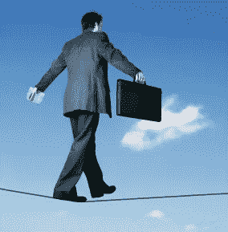
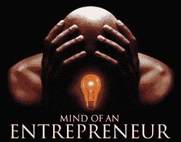

# 企业家的困境

> 原文：<https://medium.com/hackernoon/the-entrepreneur-s-dilemma-c7c48a118661>

在电路中，电流会流过电阻最小的导体。“人”就像电流，我们通常想通过容易的路线，直而明显的路径；安全的道路。但不是企业家。企业家不是“人”。

企业家想要留下遗产，他/她想要到达那个不寻常的目的地。风险铭刻在企业家的 DNA 中。

THE ENTREPRENEUR’S PATH

安全的道路永远不会通向非凡的目的地，企业家知道这一点。

不同的企业家有不同的动机；它们可能是个人的，也可能是非个人的，或者两者兼而有之。但是有一些东西驱使每个企业家想要做得更多，取得更大的成就。一些让他们无法安静或满足的事情。

在追求卓越的过程中，企业家可能会忽略那些在别人看来显而易见的机会。由于注意力分散，企业家可能会拒绝高薪工作，或者看到自己在学校的成绩下滑。

这里就存在着一个困境——我们的家人、朋友和整个社会都是“人”。

他们可能希望企业家得到最好的，并对什么是“最好”有明确的认识。对他们来说，最好的通常是好成绩、学位和高薪工作。这是一条久经考验的道路。它已经奏效，正在奏效，并将继续奏效。成绩，学位，好工作。

他们永远不会理解为什么企业家不从他们的角度思考和看待问题。企业家永远也不会理解为什么他们不从他的角度思考和看待问题。

企业家会说“一个普通员工每月赚 1000 美元，我可以在一分钟内赚到”。或者——“一个员工对人们的生活影响不大，我可以雇佣并负责几千人”。

无论他如何努力，他都无法说服“人”。所以他试图妥协。他不想伤害他的家人和朋友。所以他在图书馆呆了几个小时以取得好成绩。或者他编造了一份简历，并发誓他永远不会这么做；只是因为他父亲想让他有一个。

他妥协了，但还没到变成“人”的地步。他知道自己想要什么。他每天都在思考、进食、做梦和想象它，直到他看到显化。然后他思考、进食并想象另一个更大的梦想，直到这个梦想也成为现实。这个过程还在继续。企业家总是满足，但从不满足。

第六天，上帝创造了“人”和企业家。

我叫 Aganbi Oghenegare，我是一名企业家。

> [黑客中午](http://bit.ly/Hackernoon)是黑客如何开始他们的下午。我们是 [@AMI](http://bit.ly/atAMIatAMI) 家庭的一员。我们现在[接受投稿](http://bit.ly/hackernoonsubmission)，并乐意[讨论广告&赞助](mailto:partners@amipublications.com)机会。
> 
> 如果你喜欢这个故事，我们推荐你阅读我们的[最新科技故事](http://bit.ly/hackernoonlatestt)和[趋势科技故事](https://hackernoon.com/trending)。直到下一次，不要把世界的现实想当然！

