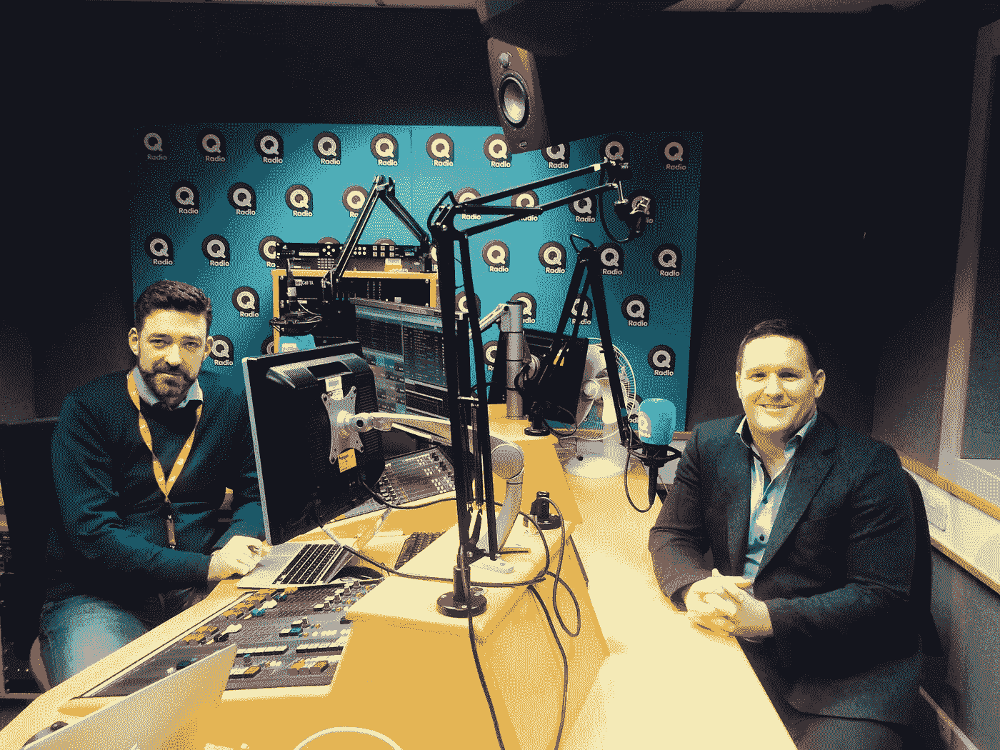
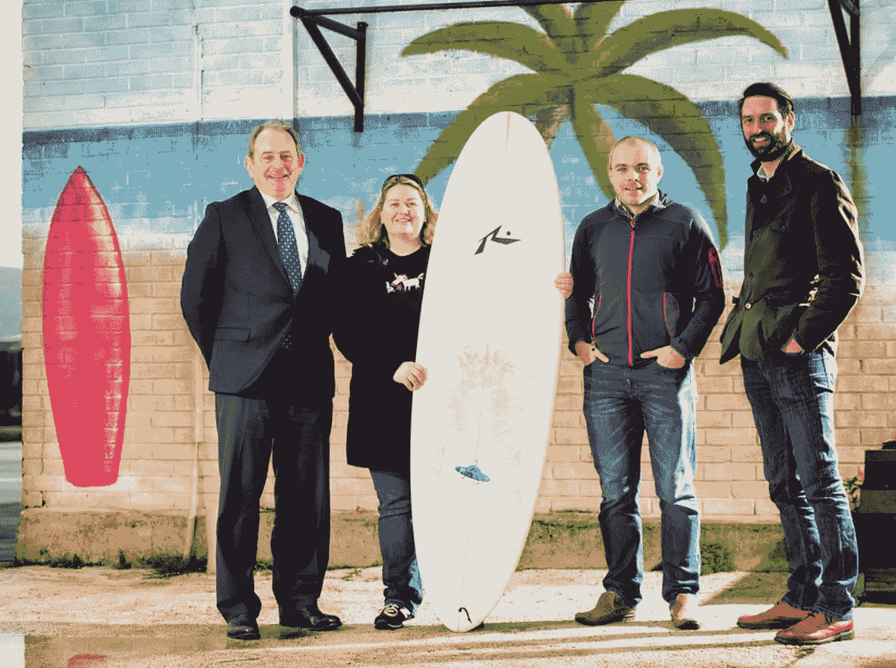

# 企业家的生命周期

> 原文：<https://medium.com/hackernoon/the-entrepreneurial-life-cycle-e645cfde3b81>

# “所有的商业都像人一样有生命周期；创业，高成长，衰落，死亡。”

创业专家兼作家拉里·法雷尔如是说。25 年来，法雷尔先生一直在教授如何让一家企业运转起来。“一家公司的创业生命周期通常在 30 岁时遭遇重大考验。对于一家已有 30 年历史的老牌企业来说，这是一个关键时刻。当创业的企业家退休时，公司通常会做什么？最大的错误是他们雇佣了一名职业经理人。”

法雷尔先生建议，一个企业家总是需要掌舵任何企业。“我们对企业家进行了广泛的回顾和研究。我们认为企业家有 4 个关键的基本原则。这不是你从父母那里继承的天生能力。如果你把它应用到业务中，你就可以延长公司的自然生命周期，尤其是在有合适的人推动它前进的情况下。”

**1。企业内部必须有使命感:**你必须对自己正在做的事情感兴趣。你必须非常专注于它。如果你喜欢它，最终它会给你带来竞争优势。

**2。客户和产品愿景**。顾客和产品是任何生意中最重要的两个词。如果你没有这两样东西，你就没有生意。企业家生活在顾客和产品空间中。

**3。高速创新**:创新不一定要有狭窄的焦点。当然，你需要创新来创造新产品，但这也适用于在你的工资和人事部门建立新的系统。

**4 自我激励的行为**。这又回到了使命感。企业家喜欢他们所做的事情，所以他们受到工作的激励。不仅如此，短期后果对企业家来说是非常真实的。对企业家来说，每天、每周、每月都是至关重要的。如果你在一家大公司工作，而你没有表演，可能暂时没人会注意到。

你可以在我们的播客上听拉里的采访。

拉里还让我们想到了北爱尔兰的一项业务，这项业务已经走过了关键的 30 年，并且正在不断壮大。M 承包商的 Gareth Loye 上前一步。Loye 先生从他父亲那里接管了公司，在过去的几年里，公司发展迅速。

M&M 建设和维护公用事业网络。该公司预计，明年员工人数将增至 150 人，营业额将从 1200 万英镑增至 1600 万至 1700 万英镑。该公司成功赢得了大型全球运营商的合同，这些运营商通常只与营业额超过 1 亿英镑的公司合作。怎么会？他们的记录，还有老式的个人风格。

老板 Gareth Loye 解释说“我只需一个电话。这是整个公司提供的，但如果我们的客户需要什么，我个人仍然会去现场。了解我们的客户今天、明天或明年的需求是关键目标。我们与客户建立关系，并使用视频证明。视频证明将一个装满纸张的杠杆拱文件变成了现实。”

Gareth 还专注于推动业务发展，“当你的业务增长时，你的结构会发生变化；它涉及引入新流程、跟踪工作、跟踪成本，你需要每一个结构都发挥作用，以实现绩效最大化。”

你可以从加雷思和[那里听到更多他的商业计划。](http://www.theprofitmargin.co.uk/2016/01/the-entrepreneurial-life-cycle/)

我们还在播客中谈论了[NI Tech Mission to the USA](http://nitechmission.com/)，其中包括一家公司，该公司正在开发一款应用程序，通过使用儿童的心率和呼吸来帮助他们平静下来。

This photo was actually taken in Belfast!

TakeTen 已经在 100 多所学校开展业务。该公司还与临床医生合作，帮助儿童及其家人应对癌症诊断，并了解可用的治疗方法。

此外，我们本周的启动项目是来自 i3Digital 的 Pocket Buddy。这是一种接触旅游应用的新方式。我们将让他们在他们的推销中解释这个秘密。(我们应该指出，i3Digital 是爱尔兰岛上下载量最大的一些应用程序的幕后推手。)

你也可以在推特@利润空间和脸书@利润空间加入我们。

如果有你想谈的话题，请告诉我们。或者，如果您的企业正在开展有趣的工作，并且您想与我们交流，请联系我们。你可以发邮件到 Jim@theprofitmargin.co.uk或 Naomi@theprofitmargin.co.uk或联系我们。

《利润率》由第一信托银行支持，与阿尔斯特商学院联合制作。

> [黑客中午](http://bit.ly/Hackernoon)是黑客如何开始他们的下午。我们是 [@AMI](http://bit.ly/atAMIatAMI) 家庭的一员。我们现在[接受投稿](http://bit.ly/hackernoonsubmission)，并乐意[讨论广告&赞助](mailto:partners@amipublications.com)机会。
> 
> 如果你喜欢这个故事，我们推荐你阅读我们的[最新科技故事](http://bit.ly/hackernoonlatestt)和[趋势科技故事](https://hackernoon.com/trending)。直到下一次，不要把世界的现实想当然！

