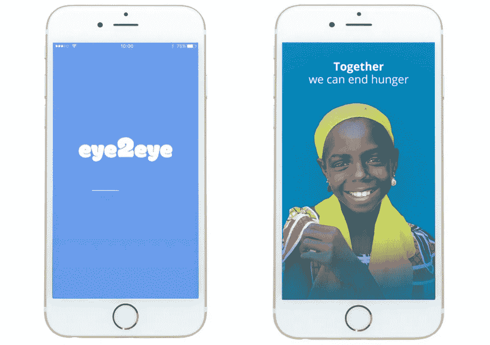
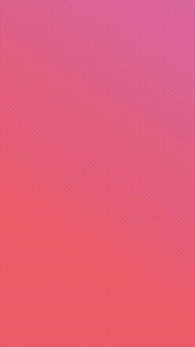
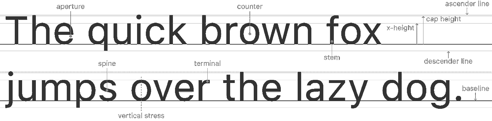
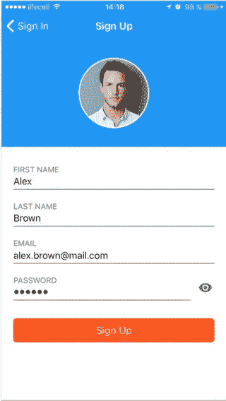
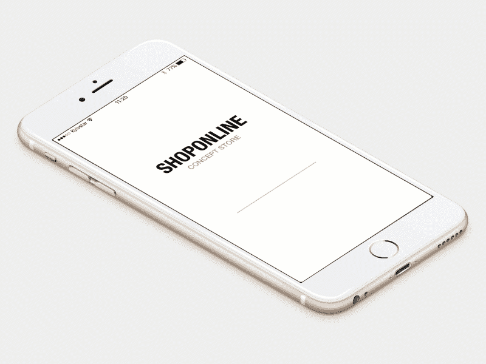
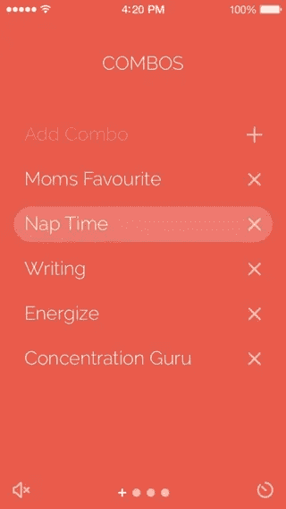
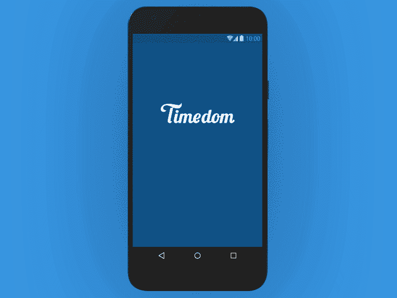
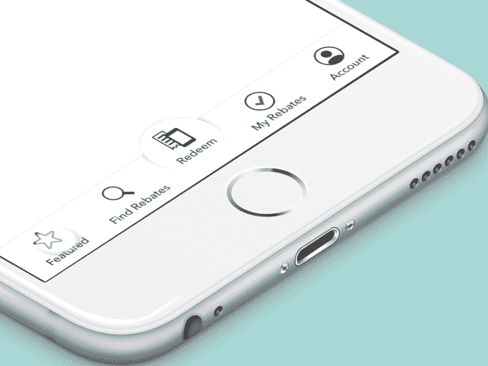
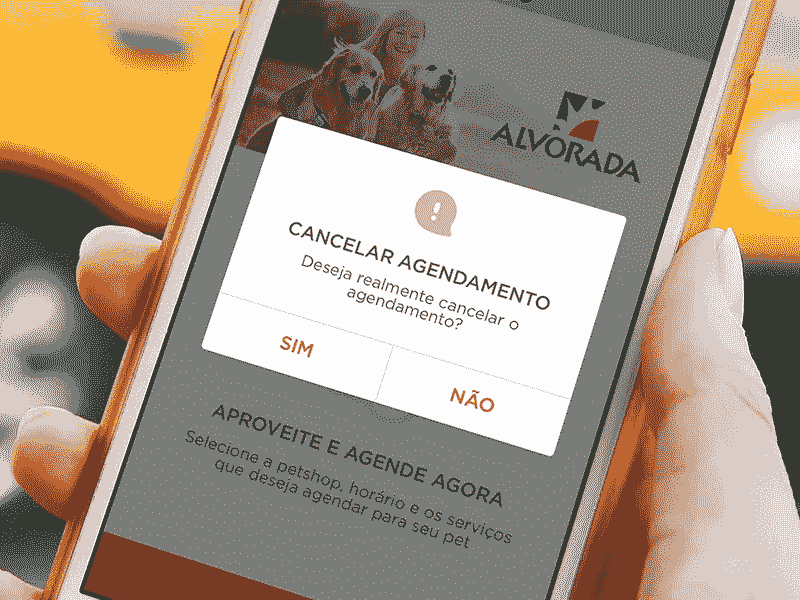
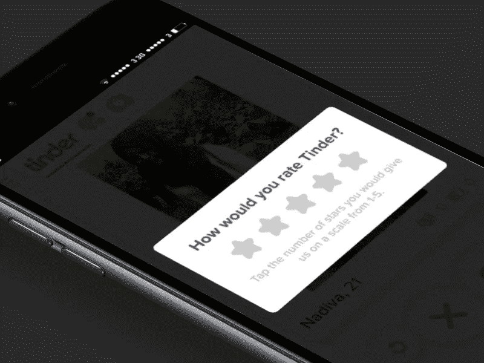

# 基本移动 UX 设计清单

> 原文：<https://medium.com/hackernoon/the-essential-mobile-ux-design-checklist-46169dc24c82>

## 要记住的 13 件事

本文旨在:

*   人，寻找一些移动 UXD 信息，提示和答案。
*   对于那些愿意避免常见可用性陷阱的人来说。
*   为顾客提供一份清单，帮助他们更好地描述他们的需求，让他们更好地理解设计师团队的工作。

# 1.应用程序图标

不要羞于为你的应用图标创造一个定制的设计。使其在相关应用商店和用户移动设备上的其他应用中易于识别。一定要保持简单，只有一个焦点，避免透明。不要忘记测试你的图标与不同的壁纸。不管你的最终用户会选择什么样的背景图片，它都应该看起来很棒。

> [继续在 Django Stars 博客上阅读这篇关于 UX 设计清单的文章。](https://djangostars.com/blog/mobile-ux-design-checklist/?utm_source=medium&utm_medium=hackernoon.com&utm_campaign=ux%20design%20checklist&utm_content=continue%20reading%20on%20ds%20blog)

# 2.闪屏

**Eye2eye** chat by Django Stars — [Google Play](https://play.google.com/store/apps/details?id=com.eye2eyeapp) / [App Store](https://itunes.apple.com/ua/app/eye2eye/id1178023474?mt=8) | **ShareTheMeal —** [App Store](https://itunes.apple.com/us/app/sharethemeal/id977130010?mt=8)

这里的第一个决定是是否确实需要闪屏。想想你的应用程序的实际使用案例。你的应用程序是为快速访问某些数据而设计的吗？是为了推动用户做出一些动作吗？不要使用只会浪费用户时间的闪屏。使用它来显示应用程序的加载进度，或者作为对用户的感觉和情绪的一种呼吁，让他们为通过你的应用程序的旅程做好准备，就像[分享食物](https://play.google.com/store/apps/details?id=org.sharethemeal.app&hl=en)应用程序所做的那样。

# 3.简洁的界面

Dating app by Django Stars — on [Dribbble](https://dribbble.com/shots/3205639-Deasy-Landing-Page)

“简单是最复杂的”——威廉·加迪斯说。让事情变得清晰，易于互动。每一个额外的按钮、表单、图像或界面的任何其他部分都会使屏幕看起来更大，增加用户注意力的压力，应该适当地引导用户注意力。把所有最重要的东西放在主屏幕上，尽量隐藏所有次要的东西。

[*【简约是极致的世故】*](https://twitter.com/intent/tweet?text=%22Simplicity+is+the+ultimate+sophistication.%22+http%3A%2F%2Fdjangostars.com%2Fblog%2Fmobile-ux-design-checklist%2F+via+%40djangostars)

# 4.内容清晰可辨

文本应该清晰易读，用户无需缩放即可阅读。推荐的字体大小和提示在下面[苹果](https://developer.apple.com/ios/human-interface-guidelines/visual-design/typography/)和[谷歌](https://developers.google.com/speed/docs/insights/UseLegibleFontSizes)的官方推荐中有详细描述。

# 5.形式

表单应该尽可能容易使用。应该相应地选择输入字段的高度和宽度。苹果和 T2【谷歌再次为你提供了很好的推荐。形态应该让你明白你现在在哪里，以及下一步会是什么。自动完成是节省用户时间的好选择，而包括自动更正将成为最终用户的额外痛苦。用户将在某些特定字段中输入的数据类型很重要。有“@”和“，”显然很好。com”按钮，填写电子邮件表格，输入电话号码。最后，尽可能避免手动输入数据(例如通过 GPS 定位地址)。

## **你可能也喜欢:**

 [## Django Stars 的 UI 开发流程及其特点

### 这篇文章献给我们的客户。它描述了 Django Stars 中的用户界面(UI)开发流程…

djangostars.com](https://djangostars.com/blog/ui-development-flow/?utm_source=medium&utm_medium=hackernoon.com&utm_campaign=ux%20design%20checklist&utm_content=youmayalsolike1)  [## UI/UX 词汇表:每个设计师都应该知道的东西

### 这篇文章献给设计师和那些必须与他们交流的人。当然，如果你进入任何…

djangostars.com](https://djangostars.com/blog/ui-ux-terms-everyone-should-know/?utm_source=medium&utm_medium=hackernoon.com&utm_campaign=ux%20design%20checklist&utm_content=youmayalsolike2) 

# 6.形象

App concept by Django Stars — on [Dribbble](https://dribbble.com/shots/3122150-Concept-e-commerce-app)

万一我们说的是网店、送餐等“卖货”app。—图像应该是尽可能高的分辨率，以提供您实际试图销售的内容的最详细视图。放大照片是一个好主意，可以让你的用户更好地看产品。选择一个全尺寸的默认图片，显示可点击的缩略图，产生放大的图片。这里要考虑的是你的主要用户群的地理位置。在一些国家，互联网连接速度不足以快速加载高细节图像。

# 7.不要忘记留白

[**空白区域**](https://www.jackrabbitmobile.com/design/the-power-of-white-space-in-mobile-web-design/) 是一个没有内容的区域，它执行一个重要的功能——增加设计的整洁性，并有助于在视觉上设置优先级(它创建了一个清晰的层次结构，首先查看哪里，然后查看哪里)，同时也防止用户随机误点击。

# 8.空状态

这些不仅使屏幕看起来更美观，而且为用户提供重要的信息和指南。确保用户在与你的应用程序交互的每一步都知道发生了什么或者缺少了什么。

# 9.良好的色彩对比

Timedom booking app by Django Stars — on [Dribbble](https://dribbble.com/shots/3206735-Timedom-App)

确保字体和背景色之间保持鲜明的对比。这将使你的文本更容易理解。W3C 建议正文文本和图像文本采用以下对比度:

*   小型文本与其背景的对比度至少应为 4.5:1。
*   大字体文本(14 磅粗体/18 磅常规字体及以上)与其背景的对比度至少应为 3:1。

# 10.航行

通过应用程序的导航应该是自然的，并代表与所选操作系统交互的常见方式。不要将导航控件移动到意想不到的地方，那只会让用户迷失方向。在计划放置导航元素的方式时，你也应该考虑手的位置。它在手机和平板电脑上会有所不同，在纵向和横向布局中也是如此。

# 11.纵向/横向布局

决定你是否真的需要两种类型的布局。我们建议您在具有复杂 UX 架构的应用程序中拒绝布局更改选项，这种应用程序具有许多导航元素(例如 facebook，它甚至将其 Messenger 作为一个独立的应用程序，以使初始应用程序的界面不那么杂乱)，因为这将导致我们大幅损失内容空间。在 Youtube 这样的多媒体应用中，用户大部分时间都在浏览内容，而不是浏览大量的选项——情况正好相反，需要进行调整。此外，不要忘记，横向布局迫使你使用双手进行操作，这将影响控件的定位。

# 12.删除操作的确认

即使你的点击目标足够大，并且它们之间的距离是固定的，也总有可能出现“用户错误”。对破坏性动作实施确认步骤(这也可能包括撤销选项)是必不可少的。

# 13.不要太快或太频繁地要求给你的应用评分

给用户一些时间来形成自己对 app 的印象。避免频繁的，烦人的，反复的 CTA 过程。

> 文章由[Dmytro Puchkov](https://medium.com/u/1a5c7fa0fcec?source=post_page-----46169dc24c82--------------------------------)([**Dmytro Puchkov**](https://djangostars.com/blog/author/dmytro-puchkov/)**)**—UI/UX 设计负责人在 [Django Stars](https://djangostars.com) 。这篇关于 [**ux 设计清单**](https://djangostars.com/blog/mobile-ux-design-checklist/?utm_source=medium&utm_medium=hackernoon.com&utm_campaign=ux%20design%20checklist&utm_content=ux%20design%20checklist) 的文章最初发布在 Django Stars 博客上。
> 
> 特别分享给 [Hackernoon](https://medium.com/u/4a8a924edf41?source=post_page-----46169dc24c82--------------------------------) 社区。

> [黑客中午](http://bit.ly/Hackernoon)是黑客如何开始他们的下午。我们是 AMI 家庭的一员。我们现在[接受投稿](http://bit.ly/hackernoonsubmission)并乐意[讨论广告&赞助](mailto:partners@amipublications.com)机会。
> 
> 如果你喜欢这个故事，我们推荐你阅读我们的[最新科技故事](http://bit.ly/hackernoonlatestt)和[趋势科技故事](https://hackernoon.com/trending)。直到下一次，不要把世界的现实想当然！

