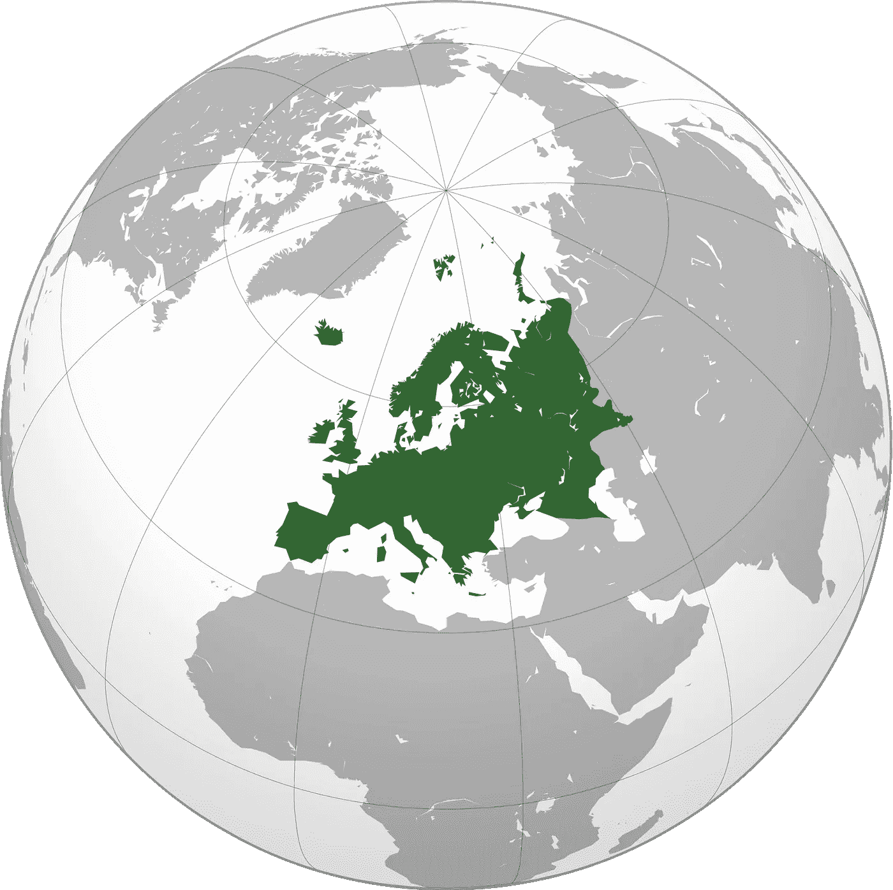

# 欧洲的创业场景仍然破碎

> 原文：<https://medium.com/hackernoon/the-european-startup-scene-is-still-broken-f56be481993d>

欧洲是一些世界上最大的公司的故乡，最近是许多独角兽的故乡。TechCrunch 本周在 [Willy BRAUN](https://medium.com/u/d025ec9befe3?source=post_page-----f56be481993d--------------------------------) [的“欧洲独角兽的拼图”](http://techcrunch.com/2015/11/02/identikits-of-the-european-unicorns/)中讨论了它们，人们似乎已经对它们大肆宣传了。

这篇文章强调了来自欧洲的 42 只独角兽和这项研究的一部分。但是它缺乏解决这些和在山谷中的那些之间的差异。他们是什么时候成立的？它们长这么大花了多长时间？他们能筹集到多少资金？

随着[创业](https://hackernoon.com/tagged/startup)世界变得越来越快，越来越全球化，占据全球市场主导地位的时间变得至关重要。例如，在脸书之前，许多欧洲国家都有自己的社交网络。这些网络没有足够快地扩展到国外，被美国竞争对手的优势资源超越。

> 事实是，在欧洲创业、融资，更重要的是扩大公司规模，仍然比在美国更难。

我的信念是，更多的资源应该集中在学习和理解欧洲初创公司的具体挑战上，以恢复竞争力，甚至是相对于我们的美国兄弟的优势。

因此，我试图提到欧洲初创企业面临的第一个问题，或许还有一些优势，并开始讨论如何克服这些问题，并将它们重新配置为优势。

## **欧洲创业公司的独特困难**

主要的困难源于语言障碍和市场分割。这里是在欧洲发展公司的三大困难(互联网上的每个人似乎都喜欢这些):

**分散社区的人才获取**

人才仍然是本地化的。欧洲的流动性仍然很低，就业法对非欧盟公民仍然很严格。这导致了人才的本土市场偏好，如果国家足够大，这没什么问题，但这会让小国处于不利地位。当人才库很小的时候，招聘策略也需要“国际化”，这带来了很多挑战。

**资本限制**

欧洲的资金缺口仍比美国大。在欧洲，筹集大笔资金仍是一项挑战，对于愿意冒险的人来说，这是一片沃土。像火箭互联网这样的公司创造的价值令人印象深刻。这也证明，如果再加上耐心的投资者和快速扩张的心态，美国模式在支离破碎的欧洲格局中运行良好。但是这种情况很少见。欧洲仍然需要更多的可用资本、更少的风险厌恶和更大的雄心。

**市场细分**

到目前为止，最强的一点是，市场分割意味着公司在扩展阶段要承担一些不必要的扩展成本。为了解决这个问题，许多公司和投资者将美国视为第二市场。这在一系列案例中运作良好，比如荷兰支付公司 Adyen。但它也带来了自身的一系列挑战。

欧美客户通常互不了解，难以打造跨海网络效应和品牌。他们可能认识邻国的某个人，但他们很少说同一种语言。

因此，国际化是一件很难完成的事情。理想的情况是，一旦国内市场被征服或至少被锁定，就应该开始。这为拥有巨大国内市场的国家创造了优势。

国内市场较小的公司应该从一开始就将国际化融入其中。这个经常被遗忘的方面是欧洲比例缩放特有的一个大的区别点。

大多数困难都在朝着正确的方向发展。英语渗透、工作流动性、更大的投资和更少的分散化正朝着正确的方向发展。此外，分散的市场本身也有一些优势:

## **欧洲创业公司的独特优势**

iCub: complete and sized humanoid robot engineered and created in Italy

**小型家用市场**

是的，我知道，我只是把它列为缺点之一，但是请原谅我。一个小的国内市场意味着一个公司更接近客户，可以更便宜、更快、更容易地获得口碑和市场支配地位。这使得公司可以享受职位租金，并可能更快地将市场货币化。

更快的货币化意味着更多的资源向其他国家扩张。通过从一开始就优化国际化，该公司可能在扩张方面处于有利地位。

扩张问题依然存在。外国客户可能没有相同的需求，或者可能不会被相同的信息所触发。接下来的选择是扩大国内市场，在国内进一步发展，或者选择不同的扩张目标。

这一选择已经证明了在一系列类别中，独角兽的数量较少，但国家领导者的数量较多。

**降低开发成本**

与硅谷相比，这经常被认为是主要的优势之一。互联网公司在欧洲的运营成本普遍较低。这主要是因为拥有网络开发技能的员工工资较低。这是否过度补偿了资金的困难？不确定，但这仍然是一个净优势。

## **需要进一步调查**

总之，在欧洲扩大公司规模带来了自身的一系列挑战，使用美国的策略无法克服这些挑战。有必要分别应对这些挑战。写下并讨论它们是理解如何解决它们的第一步，也许有一天会把它们变成优势。

> 我想就这些话题展开讨论。所以，如果你相信相反的观点，如果你有更多的资源或有见地的建议，请在下面分享。让我们集体增加我们的竞争力！

> [黑客中午](http://bit.ly/Hackernoon)是黑客如何开始他们的下午。我们是 [@AMI](http://bit.ly/atAMIatAMI) 家庭的一员。我们现在[接受投稿](http://bit.ly/hackernoonsubmission)并乐意[讨论广告&赞助](mailto:partners@amipublications.com)机会。
> 
> 如果你喜欢这个故事，我们推荐你阅读我们的[最新科技故事](http://bit.ly/hackernoonlatestt)和[趋势科技故事](https://hackernoon.com/trending)。直到下一次，不要把世界的现实想当然！

