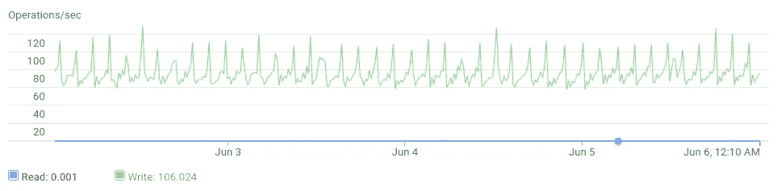

# 从 DigitalOcean 到 Linode 再到 Google 云平台:healthchecks.io 托管设置的演变

> 原文：<https://medium.com/hackernoon/the-evolution-of-healthchecks-io-hosting-setup-4fa0d249a35a>

在这篇文章中，我将关注当前的 healthchecks.io 的托管设置，它在过去两年中是如何发展的，以及我在运行这个小而活跃的服务时所面临的挑战。

## 数字海洋

两年前，当我第一次将这项服务公之于众时，它是靠一滴 5 美元/月的数字海洋水滴运行的。它有一个 CPU 内核和 512 兆内存。droplet 同时运行 Django web 应用程序和 Postgres 数据库。最初，这项服务几乎没有流量，所以一切都很好。几个月后，我换成了 20 美元/月的 droplet(两个内核，2GB 内存)。我用一个 Fabric 脚本部署代码，并让[考虑避免代码部署期间的停机时间](/@healthchecks/deploying-a-django-app-with-no-downtime-f4e02738ab06)。

快进到 2016 年 6 月。基于特性的 healthchecks.io 已经很有用了，但是它的容错性很差。它托管在一台服务器上，每晚都有数据库备份。作为第一步，我决定拆分组件(数据库、healthchecks.io 服务器、hchk.io 服务器、后台任务),并在单独的虚拟机上运行它们。这有助于一些故障场景。例如，如果主网站宕机或流量过大，hchk.io 仍会接受 pings，通知仍会发出。然而，数据库服务器宕机仍然是灾难性的。

## compose.io

数据库成为单点故障让我很不舒服，我一直在探索 HA Postgres 设置的选项。看起来好像管理容错数据库集群本身就是一项全职的系统管理工作。我查看了“付钱给别人做”选项。他们受到我预算紧张的限制。举例来说，我负担不起[与 HA 的 Heroku Postgres](https://www.heroku.com/postgres) ，因为它的起价是 200 美元/月。经过深思熟虑，我决定选择 [compose.io](https://www.compose.com/) 。理论上，他们的规格和价格看起来不错，我用生产数据快照测试了他们的服务(但不是生产级别的流量！)我甚至亲眼目睹了他们的故障转移过程。在故障转移期间，数据库有几分钟不可用，但它确实恢复了，并且在没有我干预的情况下继续工作。

向 compose.io 的迁移并不顺利。在我将生产流量指向新数据库之后，我很快就开始看到各种关于数据库连接问题的哨兵报告。compose.io 支持人员告诉我，我的数据库内存不足，并建议扩展它的 RAM 分配。使用他们方便的缩放滑块，我将 RAM 分配*和*增加了一个数量级。这样做之后，我发现数据库连接减少了，但是仍然相当正常。此时我在想:

*   收到用户的投诉
*   晚上每隔 3 个小时左右醒来检查一下服务
*   支付比原计划多得多的费用
*   没有从 compose.io 支持部门获得关于如何解决我的连接问题的可行建议

## 利诺德

如果有足够的时间使用 tcpdump 和 WireShark，我可能已经解决了掉线问题。但我需要尽快解决问题。我放弃了 HA 需求，将数据库移回普通 VPS。这次我和 Linode 一起去有两个原因:

*   它的定价比 DigitalOcean 稍好。
*   我打算使用 TLS 终端负载平衡器。数字海洋*刚刚*推出他们的。Linode 的节点平衡器已经存在了一段时间，似乎是一个更安全的选择。而且，他们支持 IPv6，不支持。

我更新了我的部署脚本，制定了一个迁移计划，做了一些测试，睡了一觉，然后迁移到 Linode。错误报告停止了，我每月的账单又有了着落。但是数据库又一次成为单点故障。好的一面是，我现在正在对传入的 HTTP 请求进行负载平衡，我的服务可以容忍 web 服务器节点的丢失。

hchk.io 收到的流量是突发的。平均来说，它每秒接收大约 30 个请求，但是每五分钟有一个短暂的流量峰值(一次数百个请求)，每一个小时有一个更大的峰值，并且在每个午夜(UTC)有一段时间请求率升高。



Traffic spikes, as seen from Postgres

hchk.io 流量也不同寻常，因为每个请求都是“一次性的”,需要进行全新的 TLS 握手。我了解到单个节点平衡器每秒只能进行大约 200 次 TLS 握手。在流量高峰期间，负载均衡器成为瓶颈。请求有时需要 3 秒以上才能完成。使用积极超时设置的客户端会将它们视为失败的请求。权宜之计是添加第二个负载平衡器，并使用循环 DNS 在两者之间分配流量。

我还了解到 DigitalOcean 的负载平衡器与 Linode 的 TLS 握手性能相似，所以它们也不好。进一步观察，我发现谷歌的[云负载平衡器](https://cloud.google.com/load-balancing/)可以处理我能扔给它的尽可能多的握手。而且它支持 IPv6，尽管还处于 alpha 预览状态！所以我开始策划向谷歌云平台转移。

## 谷歌云平台

我再次经历了迁移过程，从 2017 年 5 月 4 日开始，healthchecks.io 一直在谷歌云平台上运行。当前设置是:

*   托管云 SQL 数据库。云 SQL 上的 Postgres 目前处于测试阶段，他们还没有高可用性选项，但希望未来会有
*   三台应用服务器，由我的普通结构脚本提供
*   谷歌的云负载平衡器在三个应用服务器之间分配流量

我用谷歌的托管版 Kubernetes——GKE 进行了试验，但最终选择保持简单明了:简单的虚拟机和简单的 Fabric 命令来完成各种管理任务。

当我开始探索谷歌云平台的日志工具时，我遇到了关于来自负载均衡器的“502 坏网关”日志消息。它们很少出现，所以需要很长时间来排除故障(进行配置更改—监控日志几天，看看错误是否消失—重复)，但我谨慎乐观地认为这些问题现在已经永久解决了。简而言之，我必须调整许多 sysctl 参数和 nginx 选项，这样我的应用服务器才能正确处理新连接的突发。以下资源很有帮助:

*   [计算引擎:提示，故障排除&已知问题](https://cloud.google.com/compute/docs/troubleshooting#communicatewithinternet)
*   [调优 Google 云平台 HTTP(S)负载均衡器背后的 NGINX】](https://blog.percy.io/tuning-nginx-behind-google-cloud-platform-http-s-load-balancer-305982ddb340)
*   [优化服务器——调优 GNU/Linux 内核](https://tweaked.io/guide/kernel/)
*   [针对性能调整 NGINX】](https://www.nginx.com/blog/tuning-nginx/)

为了更新应用服务器上的代码，我使用了“滚动更新”模式:将一个应用服务器从负载均衡器循环中取出，更新它，将其放回循环中，然后移动到下一个应用服务器。以下是单台服务器的流程概述:

```
def update():
 # Going down...
 maintenance_on()
 stop_sendalerts()
 stop_sendreports()
 print("sleeping for 120s")
 # Wait for load balancer to fail us
 time.sleep(120) # Actual update
 www()
 hchk()
 nginx() # Coming up...
 print("sleeping for 30s")
 time.sleep(30)
 maintenance_off()
 start_sendalerts()
 start_sendreports()
 print("sleeping for 120s")
 # Wait for load balancer to declare us healthy
 time.sleep(120)
```

maintenance_on()将服务器置于“维护模式”。在维护模式下，服务器仍然可以处理传入的请求，但它开始向负载平衡器报告自己不正常，负载平衡器逐渐将流量从它那里转移出去。负载平衡器需要一段时间来更新，因此脚本在继续更新和重新启动之前会等待 120 秒。完整的更新需要一些时间，但是对最终用户来说是完全透明的…只要我没有部署向后不兼容的数据库模式更改！

这就是 healthchecks.io 现在所在的位置。页面加载时间很短。负载平衡器日志中没有 5xx 错误(交叉手指！).该数据库目前*不具备*容错能力，但希望将来会有所改变。谷歌每月的账单在 150-200 美元之间。

## 经验教训

在评估产品或服务时，必须用生产级别的工作负载对其进行测试。我从 compose.io 的惨败中学到了这一点，当我达到 NodeBalancer 的容量极限时也是如此。

我经常能自己解决的简单问题。当我需要帮助解决更困难的问题，并尝试联系支持时，可以说，我得到了我所支付的:

*   来自 compose.io 支持的回复和 [Richmond 关于闪光灯的评论](https://www.youtube.com/watch?v=NbESKH0t0zs&feature=youtu.be&t=15)一样有用。
*   谷歌单独收取支持费用。白银计划的起价为 150 美元/月。
*   关于节点平衡器的局限性，Linode 给了我一个直截了当的回答，对此我表示感谢。

最后，当我在寻找解决方案时，我探索了许多工具和技术，但最终都没有使用。它们都进入了“锦囊妙计”，在未来的项目中可能会有用。


Meet the healthchecks.io Ops Team!

就这样，感谢阅读！而且，如果您还没有监视您的 cron 作业和后台任务的静默故障，我欢迎您查看 [healthchecks.io](https://healthchecks.io/) ！

—p teris Caune，健康检查. io

[](http://bit.ly/HackernoonFB)[](https://goo.gl/k7XYbx)[](https://goo.gl/4ofytp)

> [黑客中午](http://bit.ly/Hackernoon)是黑客如何开始他们的下午。我们是 [@AMI](http://bit.ly/atAMIatAMI) 家庭的一员。我们现在[接受投稿](http://bit.ly/hackernoonsubmission)并乐意[讨论广告&赞助](mailto:partners@amipublications.com)机会。
> 
> 如果你喜欢这个故事，我们推荐你阅读我们的[最新科技故事](http://bit.ly/hackernoonlatestt)和[趋势科技故事](https://hackernoon.com/trending)。直到下一次，不要把世界的现实想当然！

