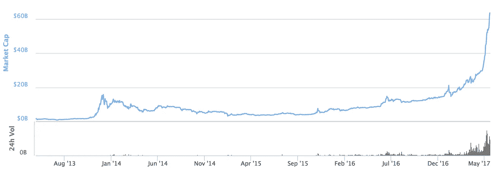

# ICO 经济的指数繁荣、萧条和再生，即资金更少的互联网泡沫

> 原文：<https://medium.com/hackernoon/the-exponential-boom-bust-and-rebirth-of-the-ico-economy-ie-dotcom-bubble-with-dumber-money-d545c02589a9>

区块链的崛起令人毛骨悚然地想起了互联网时代——缺乏经验、只有一个想法的创始人筹集大量资金来制造产品并推向市场。

Source: WriteOpinions.com

我们都记得结果如何。涨了，炸了，后来又涨了。这一次也不例外。

除了它是…

如今，ico 正以不可维持的速度加速发展，由拥有数十亿 T2 比特币 T3 的隐鲸提供资金，却无处投资。随着赌注越来越大，步伐也在加快。

Source: CoinDesk.com

[迄今为止最大的 ICO te zos](https://medium.com/u/948dd45fd3d0?source=post_page-----d545c02589a9--------------------------------)也有不少问题。事实是，非营利组织并不是为了做生意而设计的，大部分的 ICO 市场都在掠夺愚蠢的钱。

这并不是说所有创建 ico 的创始人都只想要免费的午餐，但这基本上可以归结为一点。

区块链是一种根本性的颠覆性技术，但并不是所有的业务和用例都有意义进行令牌化。几乎没有价值的想法，只不过是一份白皮书和一个“深思熟虑”的计划，却能筹集到数千万甚至上亿美元的资金。这很危险。

当投资者意识到这些代币几乎没有价值时会发生什么？你不可能在如此短的时间内创建数百个类别的“有价值”资产，而不具有一些内在价值并且不会出现问题。

我和创始人的对话几乎都是“我们的公司如何做 ICO？”而不是“我们的公司有内在的、可标记的价值吗？”

因为在另行通知之前，加密货币在法律上不能成为股票/证券。尽管它们应该是过时股票的可能演变，但今天的情况并非如此。

那么，当你将大量资金、过于雄心勃勃的想法、仓促的商业计划、普遍薄弱的创始团队、容易上当受骗的投资者以及自由市场交易的理念结合在一起时，会发生什么呢

事实是，ico 是当今最热门的技术领域。不可避免的是，市场将会调整，投资者将开始抛售，代币和代币背后的公司将会崩溃。数十亿美元的价值将被摧毁，感情将受到伤害，证券委员会将介入，投资者可能会起诉创始人。

但这些都不重要。重要的是接下来会发生什么。

这是一个终极问题。这就是我们的辛迪加不关注 ico 的原因。这些是淘金者，这些是为了赚快钱而死去的男人和女人。但如果历史告诉我们什么的话，颠覆性技术最终会获胜并复苏，那些出售镐和铲的人会获得巨大利润(因此我投资了[马特·加利根](https://medium.com/u/9e1633b0e7ad?source=post_page-----d545c02589a9--------------------------------)的公司 [The Picks &铲子公司](https://angel.co/picks-and-shovels)，这是一家开发工具和软件来帮助投资者管理加密资产的初创公司)。

【喜欢这篇文章到目前为止？然后你会很想在这里 注册我的简讯[**——并获得一些免费的奖金！]**](https://thesyndicate.vc/subscribe/)

这就把我们带到了文章的结尾，以及这个问题。

在狂野的西部，谁赢了？你如何定位你的创业公司或你的投资组合，以度过 ICO 经济的繁荣和不可避免的萧条？

一些创业公司从互联网时代毕业，拥有了互联网。谁是明天的巨人，计划如何让他们占据主导地位？

混乱创造机会，随着这个游戏的结束和成熟，我们将开始看到一些真正的价值。

想法？

**加入加密货币的未来&区块链圆桌**与 Gil Penchina、Andy Brom Berg(coin list 首席执行官)、Joey Krug 和 Lou Kerner 于 11/28 @ 11am PST—**[**RSVP on Typeform now。**](http://thesyndicate.vc/cryptomedium)**

****奖励:**就此话题采访了几位密码专家。以下是他们的想法:**

*   **[乔伊·克鲁格](https://medium.com/u/29c759230b77?source=post_page-----d545c02589a9--------------------------------)[预言](https://medium.com/u/f4d568271227?source=post_page-----d545c02589a9--------------------------------)和[潘迪拉资本](https://medium.com/u/d25fb22875fb?source=post_page-----d545c02589a9--------------------------------)关于[ICOs 和公开市场](https://thesyndicate.vc/ts-cryptocurrencies-icos-and-the-future-of-public-markets/)的未来**
*   **[Lou Kerner](https://medium.com/u/b01056393401?source=post_page-----d545c02589a9--------------------------------)[黑客报](https://medium.com/u/4a8a924edf41?source=post_page-----d545c02589a9--------------------------------)关于[加密货币和垄断的未来](https://thesyndicate.vc/ts-offered-14-of-facebook-for-5m-lou-kerner-of-flight-vc-on-israel-social-media-cryptocurrencies-and-future-of-monopolies/https://thesyndicate.vc/ts-offered-14-of-facebook-for-5m-lou-kerner-of-flight-vc-on-israel-social-media-cryptocurrencies-and-future-of-monopolies/)**

# **在你走之前…**

***如果你从这篇文章中得到了可操作的或有价值的东西，* ***点击👏下面的按钮*** *和* ***在脸书和推特*** *上分享文章，这样你的朋友也能从中受益。***

**[*原贴于 mattward.io*](https://mattward.io/the-exponential-boom-bust-and-rebirth-of-the-ico-economy-ie-dotcom-bubble-with-dumber-money/)**

**[**订阅获取我的 15 页《获得客户的成长秘诀指南》**](https://mattward.io/subscribe)和我的《VC 不能忽视的完美推介指南》 [**。**](https://mattward.io/elevator)**