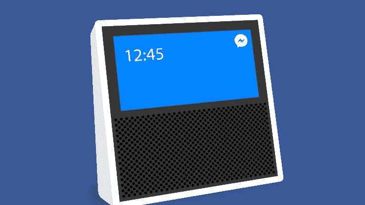

# 脸书智能音箱——通信全循环

> 原文：<https://medium.com/hackernoon/the-facebook-smart-speaker-communications-full-circle-fb5f4437dcab>

(source [TechCrunch](https://techcrunch.com/2017/07/25/facebook-speaker/?ncid=rss&utm_source=tctwreshare&utm_medium=feed&utm_campaign=Feed%3A+Techcrunch+%28TechCrunch%29&sr_share=twitter))

围绕智能音箱/智能助理领域的[产品发布会，新的传言浮出水面，这次来自脸书。](https://techcrunch.com/2017/07/25/facebook-speaker/?ncid=rss&utm_source=tctwreshare&utm_medium=feed&utm_campaign=Feed%3A+Techcrunch+%28TechCrunch%29&sr_share=twitter)目前还没有关于该产品的真实信息，只是很多猜测，但是在阅读[TechCrunch 关于该产品的文章](https://techcrunch.com/2017/07/25/facebook-speaker/?ncid=rss&utm_source=tctwreshare&utm_medium=feed&utm_campaign=Feed%3A+Techcrunch+%28TechCrunch%29&sr_share=twitter)时，我不禁听到了许多我最近一直在报道的话题的回音(双关语):

*   [亚马逊 Echo 的通信服务](https://chatbotslife.com/what-was-missing-from-amazon-echo-9f39778fc910)
*   [苹果的 HomePod iMessage 支持](/@jorge.serna/wwdc-2017-social-comms-5-homepod-and-social-communications-475839fdf457)
*   [关于“Amazon Anytime”](https://hackernoon.com/amazon-anytime-can-that-work-1-why-2c8a77a8387a)，*亚马逊的另一项*通信服务([或者也许不是？](https://hackernoon.com/amazon-anytime-can-that-work-3-what-else-to-do-16cd11cdc2a0))

让我们来看看 TechCrunch 文章中我看到的与这些相关的方面。

# 新设备中的通信

> “对脸书来说，允许演讲者通过语音文本信息、VoIP 音频通话或视频通话来传递信息也是明智的。”

这基本上就是亚马逊通过 Alexa 通话和信息提供的功能。但是脸书没有创造新的服务，而是利用自己在社交传播方面的优势。这种将以移动为中心的通信服务扩展到新设备的概念是我所谓的“智能手机的解体”的一部分。我认为这一趋势主要是由行业驱动的，因为消费电子和电信提供商希望创造一个新的需求周期。我们还没有看到消费者的大量采用——特别是与智能手机的增长模式相比——这就是为什么玩家们试图将这些新设备与他们现有的生态系统结合起来。

*   对于亚马逊 Echo 来说，生态系统就是亚马逊的购物体验和其他类似亚马逊音乐的服务。但是这使得通信成为一个薄弱环节。
*   苹果最初专注于他们的苹果音乐体验，[，但他们也有 iMessage 可以利用。我相信另一个可以使用的生态系统是 iOS](/@jorge.serna/wwdc-2017-social-comms-5-homepod-and-social-communications-475839fdf457) [开发](https://hackernoon.com/tagged/development)社区，但我稍后会回到这个话题。
*   [谷歌正在使用他们的谷歌助手来实现](https://www.forbes.com/sites/quora/2017/05/18/with-the-expansion-of-google-assistant-google-home-is-about-to-get-a-lot-more-powerful/#18d9180f46d3)，这反过来又受益于他们从谷歌服务和安卓设备获得的用户知识。
*   **脸书的社交通讯市场领先地位是其生态系统的优势。**

# WhatsApp 呢？

> “截至 2 月，Facebook Messenger 的 12 亿用户中，每月有 4 亿人通过脸书音频和视频通话进行交流。”

Facebook Messenger 作为交流工具的优势显而易见。但是 WhatsApp 呢？以美国为中心的媒体往往会忽略 WhatsApp，因为它在美国市场没有那么重要，但 [WhatsApp 也拥有超过 12 亿的月用户](https://techcrunch.com/2017/06/27/facebook-2-billion-users/)，并在欧洲和拉丁美洲的许多重要市场占据领先地位。这里的问题是，当前的 [WhatsApp 解决方案不支持几种设备](https://hackernoon.com/i-s-multidevice-the-achilles-heel-for-whatsapp-1ac91c3edf07)，特别是语音和视频通信。

拥有 WhatsApp 的脸书推动多设备通信可以为 WhatsApp 进入多设备领域提供额外的“激励”。

# 社交网络是关键

> “亚马逊已经在试图通过其新的亚马逊 Echo Show 版本的智能扬声器打入家庭通信市场，这种智能扬声器可以让人们通过屏幕进行视频通话。谷歌有自己的谷歌家庭扬声器，苹果正准备推出 HomePod。但它们都不像脸书那样拥有无处不在的跨设备即时通讯平台和全面的社交图谱。”

这一点是正确的。智能扬声器领域的所有参与者都在关注他们设备上的通信，但就此而言，关键要素是:

*   社交图谱。与从头开始创建相比，现有的社交图具有巨大的优势。[这是我在亚马逊周围的传言中看到的主要问题](https://hackernoon.com/amazon-anytime-can-that-work-2-the-good-the-bad-and-the-ugly-bbd4ac2b512f)。
*   跨设备支持。Facebook Messenger 支持哪个，[但 WhatsApp 不支持](https://hackernoon.com/i-s-multidevice-the-achilles-heel-for-whatsapp-1ac91c3edf07)。

**所以脸书是这里最好的位置。**

这并不意味着他们会赢。

# 但是，通讯是杀手级应用吗？

这里的问题是，通信服务是否是智能音箱等新设备的中心。

正如我在谈论亚马逊 Echo 时所讨论的，[通信是该设备所需要的东西](https://chatbotslife.com/what-was-missing-from-amazon-echo-9f39778fc910)，但 Echo 在拥有它之前就已经存在，并且有许多用途:购物、智能家居、信息、娱乐…

在这一领域，脸书能提供什么？

这还有待观察，但虽然脸书可以利用他们在通信领域的地位，但我对一款只能(或主要)做到这一点的新设备持怀疑态度。他们也可以提供一些信息/娱乐元素，正如[苹果正在围绕音乐](https://www.apple.com/homepod/)定位他们自己的设备，但是脸书内容的[问题也要在这里考虑。](https://www.theguardian.com/technology/2017/may/16/facebook-fake-news-tools-not-working)

# 不，平台是杀手级应用

最后，我相信智能音箱领域的成功将取决于开发者的支持。他们将为这些设备创造新的用途，使它们像在智能手机市场一样更加相关。这就要求亚马逊、谷歌、苹果以及现在的脸书开放他们的平台，并为开发者提供激励，作为一个关键的战略点。

最初，这会造成操作系统的碎片化，这对开发者来说是个压力。例如，过去 WhatsApp 不得不为诺基亚、黑莓或 Windows Phone 设备开发应用程序版本。由于开发者没有资源或合适的投资回报率来瞄准所有四个(或更多)平台，他们将不得不在一些平台上下注，最终将围绕这些平台中的一两个(新的“iOS”和/或“Android”)进行整合。

但也许这对脸书来说不成问题。他们已经在苹果和谷歌平台(iOS 和 Android 的脸书、WhatsApp 和 Instagram 应用)的基础上取得了成功，因此他们可能会在智能扬声器市场上取得同样的成功。即使他们最终没有成为这些设备的硬件和操作系统部分的相关参与者，他们仍然可能是用户参与斗争的赢家。

这可能是这位脸书演讲者背后的主要原因:我们的目标不是在市场上推出一款成功的设备——脸书在这方面没有经验——而是一款工具，迫使其他参与者开放他们的平台，然后成为那里的主要开发者，就像他们在智能手机市场上所做的那样。