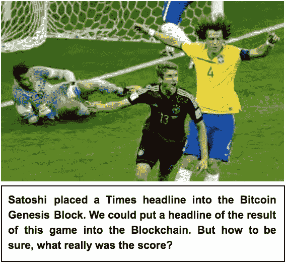
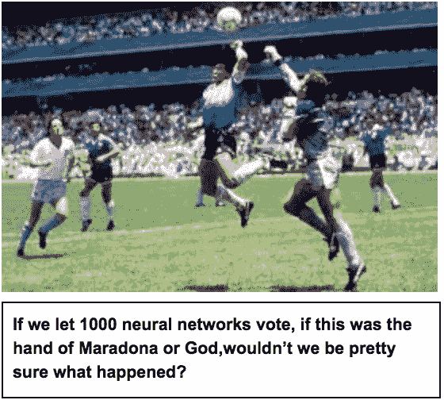

# 事实机器 I:用股份投票记录事实

> 原文：<https://medium.com/hackernoon/the-fact-machine-i-voting-with-stake-documents-facts-e99230e6482>

比特币最酷的把戏是它的投票机制，它鼓励人们按照规则玩游戏，并创造信任。我们应该重新发明智能机器学习算法的原理。这将允许我们将真实世界的“事实”引入我们的系统

如果你在一个行业中有两个主要的流行词，比如区块链和人工智能，你可以肯定，有人会试图将它们混合起来——营销声音太好了。但是为什么呢？我的回答是:这一切都与“事实”有关:将区块链与智能机器学习算法结合起来是一个伟大的想法，因为智能算法可以让区块链“信任引擎”进入现实世界，以建立事实:神经网络可以检测汽车，许多神经网络在正确的激励下将建立真的有汽车的事实。然后，我们将事实记录到区块链中，我们的智能合同会奖励一张虚假的停车罚单。这是我的想法，我会解释。

如果你知道什么是去中心化甲骨文，你会发现这里有一个建议来解决甲骨文提出的问题[以太坊](https://www.ethereum.org/):如何将数据和事实纳入智能合同。如果没有事实，大多数智能合约以及提供智能合约的平台都是无用的。

不要期待设计或代码或原型，这只是一本小册子，它说:比特币的“真正交易”是向真理靠拢的投票机制，因为我们相应地激励网络。我们最好有第三，第四和第 n 次看 Satoshis 的把戏。

# 那么，比特币的“真”是什么呢？

看看这里的，如果你不熟悉比特币的工作原理，这是主要思路。这并不是说区块链不重要，图灵完整性对一些用例有帮助，但如果你只是用另一种共识机制取代那个机制，你需要小心这对系统有什么影响。共识机制不能独立存在，也不是比特币的唯一发明，但没有它和它的激励机制，一切都不会起作用。

简而言之，它是这样做的:矿工采集指纹，这是一组比特币交易的散列。结果必须满足某些条件(低于难度目标，根据数字前面的 0 的数量进行调整)，您添加一个随机数，一个随机数到您收集的交易集，生成哈希，您可能无法满足难度目标。你选择一个不同的随机数，取散列，检查——直到你成功。这是非常困难的(蛮力，一次又一次地尝试)，但很容易证明你有正确的随机数添加到块达到难度目标。你赢了，呸。有点拗口，希望我没弄错。如果你听起来不像英语，你最好看看那个视频，读一点关于散列函数的知识。

如果你没有赢，你就失去了你的电费，因为运行这些芯片来制造哈希，对我来说你需要电力。如果你不按规则玩，你尝试双重消费或者你在如何生成你的块上马虎，你肯定会失去你的钱。其他节点会拒绝你的块。所以，你参加了一场比赛，如果你表现好，你将有统计上可定义的机会获胜，如果你赢了，你将创建一个比特币，并将其发送到你自己的地址。

看待工作证明机制的一种方式是将其视为一种[预测市场](https://en.wikipedia.org/wiki/Prediction_market)。在预测市场中，你赌的是未来事件。既然你把钱放在桌子上，你就要小心你的预测。事实证明，这些市场往往能提供相当准确的预测。比特币网络提供了一个专门的预测市场:最长的链条会是什么？如果你是一名矿工，只有在最长的链条上操作，你才有机会赢得奖励。与预测市场相反，在预测市场中，你是被动的，可以真的只是打赌，作为一名比特币矿工，你可以影响最长的链条会是什么。如果你赢了比赛，你的街区将领先，你可以奖励自己一些比特币。

所以这不是关于'*区块链是比特币发明(银行)'*，*，【图灵全集】区块链是比特币精神继承人(以太坊)'*或者'*你可以选择任何你喜欢的共识机制(*[*hyperledger*](https://hyperledger.org)*)*)。这些策略都有其优点，但我在这里重点关注的是大众投票机制，在这种机制下，选民可以赢也可以输，并会跟随大众，因为只有这样他们才能赢。与大众在一起的最佳策略是遵守规则。

# 事实的区块链和神经网络

现在，对于区块链和机器学习的结合。

比特币区块链毫无疑问地告诉我们，如果交易 A 发生在交易 B 之前或之后，交易在哪些地址之间发生，以及“发送”了哪些金额。它们实际上并不是真的被‘发送’，而只是被写入公共区块链。在比特币区块链中，这个时间有序向量对于避免“双重支出”问题是必要的，这简单地意味着你只能花一次每一个比特币，就像我们只能花一次现金一样。

公开发布和分发数据集是达到目的的一种手段。如果有另一种避免双重支出的设计，不使用中央结算所，那可能(纯粹是猜测！)嗯一直是聪的选择。

但是你实际上可以把任何东西写入区块链，不一定是关于比特币的交易。他/她自己写了一个标题

> 《泰晤士报》03/1/2009 财政大臣濒临第二次银行救助

进入[创世纪区块](https://en.bitcoin.it/wiki/Genesis_block)。

比如你可以放入区块链‘2014 年世界杯巴西 7:1 战胜德国’。区块链只是将此记录到区块链中，这当然是不正确的。区块链对世界一无所知，它是盲目的。它接受你放进去的任何东西，即使它是错的。这很巧妙:它可能是假的，但如果它被写入比特币区块链，你就无法倒回。不理想，要么倒带，要么确保你得到的事实是正确的，因为你永远保留它们。

机器学习，特别是神经网络和深度学习的一个用例是模拟人类的感官和技能。机器学习“阅读”，也就是能够总结文本或理解作者的情感。

机器还学会对图片或电影中的对象进行分类。给一个神经网络一张猫的图片，它会告诉你这是一只猫，太壮观了。在行驶的汽车上安装一个摄像头，神经网络将检测到树木和人等物体，并做出相应的反应，这太神奇了。

通过一些训练和一点幻想，让我们假设你可以用一整场足球比赛来训练一个神经网络。当一名球员扑倒另一名球员时，它会进行检测，并理解和计算常规进球。给它一个摄像头和训练，神经网络就会和你“交谈”游戏。它不能检测球员，确定是否有进球或犯规。

如果神经网络检测到犯规或进球，它只是将其放入区块链。

> 梅西犯规 21.23 分钟，运球约 5 马德里。巴萨球迷疯狂地要求点球。

因此，有一个真正有能力的带摄像头的神经网络，它给我们这个事实，我们把它放入区块链，一个事实。

但是，我们怎么知道这是真的呢？因为我们像信任裁判一样信任神经网络，也许有一个著名的组织可以保证神经网络的有效性？我们又来了，一个银行——一个事实银行，但它是同样丑陋的老中间人问题，我们不想要它。如果我们相信一个神经网络，一个裁判，我们就处于和比特币一样的境地，因为 Satoshi 把那个标题放到了 Genesis 块中。但是，如果我们有同样的问题要解决，我们为什么不跟随 Satoshis 的脚步呢？

# 游戏中皮肤的大众投票记录了事实

想象一下，你在一个体育场里，有成千上万的人在看足球比赛。在休息时间，发言人宣布一个发送短信的电话号码，你应该发送一个“是”或“否”:在禁区内的铲球是犯规吗，所以要处罚？游戏的规则是:如果你像大多数人一样投票，你将参加一次抽奖，获得下一场比赛的免费门票。

你可以考虑不同的策略。如果你和当地人在一个小体育场里，你可能最好去看看观众同情哪支球队，因为不管实际发生了什么，他们都会投票支持他们。也许观众的视线可能是一个因素，你知道 80%的观众从很高的地方看到场地，他们不会看到你站在围栏后面的边线旁边看到的那一点点推动。

但是观众越多，在绝大多数情况下，你最好还是根据事实投票。这一幕在视频屏幕上重复出现，每个人都可以看到这是一次犯规，所以你投票决定犯规和点球，将有机会获胜。

这种情况可以用众所周知的[博弈论](https://www.investopedia.com/terms/n/nash-equilibrium.asp)概念来分析。每个参与者都选择对自己最有利的策略，即使参与者没有明确协调。如果他们已经透露了他们的策略，他们会坚持这个策略。我们的观众的策略是用他们最好的判断来描述事实。

现在让我们的小例子达到一个更抽象的层次:我们的观众实际上是一些带摄像头的神经网络。他们遍布体育场，有人让他们摆脱了皮带。我们的问题是:这是犯规，是还是不是？所以，我们不要问比特币工作证明的问题:给我低于当前难度目标的 nonce，你就有权写入新的比特币并获得奖励。我们用摄像机告诉神经网络:如果这是犯规，给我你的答案。如果你像你的大多数神经网络同伴一样投票，我们将授予你参加抽奖的权利。奖励必须足够高，统计分布足够有利，让你'做工作'，也就是说，处理图片，告诉我这是否是犯规。对于所有参与的电视网来说，他们的最佳策略是跟随真相，因为这是你可以期待多数人投票的地方。

重要提示:重复使用比特币的投票机制，创建一个预测市场参与者可以通过你想看到的行为积极影响他们的利益:说实话。

我所说的“真理”并不是指相对论或类似“什么是公正的经济体系”这样的问题。我说的是简单的事实，我们已经或者有望很快用人工智能自动处理这些事实。

敬请关注[第二部分](/@benedikt.herudek/the-fact-machine-ii-machine-learning-isnt-cryptography-56fe30d3998d)，在那里我会说为什么我认为这是可行的，即使密码学和机器学习真的没有任何关系。