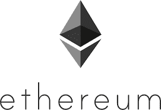
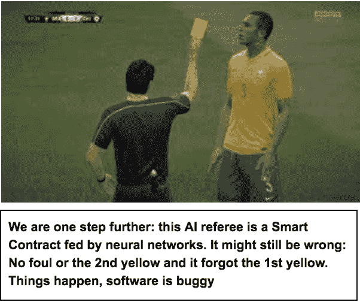

# 事实机器三:区块链&智能合约没那么重要

> 原文：<https://medium.com/hackernoon/the-fact-machine-iii-blockchains-smart-contracts-dont-matter-that-much-fb5c7ac5ede5>

比特币最酷的把戏是它的投票机制，它鼓励人们按照规则玩游戏，并创造信任。我们应该重新发明智能机器学习算法的原理。这将允许我们将真实世界的“事实”引入我们的系统

在[第一期](/@benedikt.herudek/the-fact-machine-i-voting-with-stake-documents-facts-e99230e6482)和[第二期](/@benedikt.herudek/the-fact-machine-ii-machine-learning-isnt-cryptography-56fe30d3998d)部分，我描述了比特币如何组织矿工，让他们遵守规则，以及如何将该原则重新用于机器学习算法，以创建一个与事实相融合的网络。

一个神经网络可以检测到一辆汽车，许多神经网络在正确的激励下将确定确实有一辆汽车。然后，我们将事实记录到区块链中，我们的智能合同会奖励一张虚假的停车罚单。

那么，区块链、智能合约和所有这些共识机制呢？你是说这都是胡说八道，所有那些聪明的家伙都完全忽略了它——你甚至没有读过，更不用说理解所有那些东西了，你这个傲慢的 p@&k？！?'

# 区块链正是我们想要的样子

区块链给整个行业起了个名字，我也用这个词。而实际上…它们只是存储数据的另一种方式。以一个普通的 IT 项目为例，你会用你建立的数据库表来命名它吗？我从来没有看到过这一点，只要你不把手段(你的数据模型)误认为你的项目交付的价值，你就可以做到。

比特币区块链是避免重复花费你的硬币的手段之一，它与工作证明、Merkle 树、哈希指纹链以及其他我甚至没有注意到的东西一起做到了这一点。

如果您正在寻找除安全性和不变性之外的其他附加值，那么您有一个不同的数据模型。当然啦！没什么大不了的，如果你对智能机器感兴趣，你最好给它们一个从过去的错误和成功中学习的机会。

如果你在你的网络中定期举行比赛，如果一名球员犯规，你最好存储参与者给出的答案。因此，你创建了一个标签数据集:这一幕实际上是一次犯规，这不是友好的神经网络“xyz”所认为的。为了启动这个系统，你需要一些人类裁判来对犯规进行分类。但是过一会儿你的神经网络会学习。

你想知道，某些国家、年龄组或身高的球员运球是否更好？确保你从某个地方收集了这些数据，确保网络可以从之前被归类为“冷静运球”的数据中学习。无论你问网络什么问题，你都要确保你的数据集支持这个学习曲线。

对于谁能在竞争中竞争，分布式系统是相当无情的。如果你发送的方块不是根据比特币网络的规则生成的，你就没有机会获胜。如果你希望你的网络中有一个不同的数据结构来支持解决你感兴趣的问题，你可以强制参与者提供你想要的数据，否则他们很容易就会被排除在竞争之外。只要你相应地激励他们(这实际上提出了许多没有考虑到的问题，即如果你想引入一种加密货币“事实硬币”来激励神经网络)，他们就会遵守你的规则。

这里没有限制，您可以根据自己的喜好定义数据集，并支持您的用例。称之为智能区块链或智能链，忘记区块链或只是使用这个词，并注意数据结构是我们最少的问题，因为我们只是制造我们需要的东西。

# 忘记区块链，图灵完整性和集中共识

让我们痛击一些聪遗产猎人！当然，这完全被夸大了，因为这些平台有有效的用例，并能提供巨大的成就。但抨击总是有趣的，夸大其词有助于说明问题。如果那些家伙读了这本书，这些小小的侮辱会像水一样从鸭子的背上滴下来。

对于习惯于传统数据库的人来说，用散列指纹来保护许多事务，甚至在以前的事务集的指纹上运行散列，这是一个很好的技巧，可以确保没有人干预您的数据。不完全是新的，数据集是“铁一般坚硬”的，你真的不能篡改它的原因是大型网络中使用的工作机制的证明。关于区块链或分布式分类账，没有什么比任何数据模型更令人兴奋的了。如果有人给你太多的营销信息，你会尽可能快的跑或者尽情的笑。有比我更聪明的人在区块链问题上开玩笑，他们实际上只是分布式数据库。

聪明的合同，以太坊:如果你是决定判罚的裁判，你首先要问是否有犯规。如果出现犯规，那么“惩罚”行为——智能合同的作用——是相当明显的。当然，裁判可能是一个傻瓜，被贿赂或胁迫。但是，在 100%确定的事实“犯规”的情况下，“聪明合同”不会留下太多回旋的余地。在更复杂的法律环境中，智能合同可能会发挥重要作用。但是，如果我们没有提供正确的事实，任何聪明的契约都会误入歧途。根本问题是事实。如果您有安全的事实，那么在特定的上下文中，您会希望在像以太坊这样的智能合约平台上执行不可变的可验证代码。但是实际上有这么多吗？

对于许多应用程序来说，数据是基础。代码中的算法和规则通常是商品，受制于法律监管和市场力量，而且通常运行良好。举个例子，有人建立了一个应用程序，运行所有世界杯比赛的统计数据。它将重复使用神经网络建立的事实，并在区块链中记录和公开提供。球员、球迷、记者和教练只需支付少量费用就可以获得一个账户。用你喜欢的任何技术，你就能卖出去。这是关于正确的数据和用户体验，笨蛋！其余的都是商品，不需要神奇的规则和聪明的契约。如果你曲解了数据或者你的用户体验不好，你的竞争对手就会接管这个客户端。不需要世界计算机，这听起来很可怕。坦率地说，在我成为信徒之前，我需要看到一些令人信服的智能合同用例。

“技术共识”我称之为共识机制，它满足了某些技术需求，但抛弃了比特币消灭中间人的野心。

共识机制的一些典型技术标准是一致性(所有节点产生相同的有效输出)、活性(所有参与节点最终产生结果)和容错性(从一个节点的故障中恢复)。这是一个标准列表，类似于你要求数据库是[酸](https://en.wikipedia.org/wiki/ACID)(原子的、一致的、隔离的、持久的)。

这是“公正”的技术！去中心化在哪里，我们消灭的邪恶中间人在哪里？我想念这里的戏剧，这太无聊了！例如，Hyperledger Intel 的 [Poet](https://sawtooth.hyperledger.org/docs/core/releases/latest/architecture/poet.html) 是一种共识机制，建议由 Intel 硬件执行抽奖。他们刚才是这么说的吗？所以我们摆脱银行，让英特尔来做中间人？IBM 表示，共识对于他们的超级账本结构来说是如此短暂，以至于他们认为共识是可以互换的。

与我所说的正好相反:共识机制是整个故事的要点，没有它，比特币将完全不同。毫无疑问，这些都是聪明的工程师，他们做这些事有很好的理由。但是，尽管这种共识机制将支持它们被设计用于的用例，但我确实要说，它们没有像比特币的工作证明这样的机制所具有的任何颠覆性的去中心化权力。

就像任何杰作一样(比特币是一件艺术品！)，每个人都有自己的解释，这只能证明这一点，这项发明是多么惊人。

# 我刚才说什么了？

是为真相投票，婊子！对我来说，比特币之所以有趣，主要是因为它在分布式系统中创造了信任的概念，而无需求助于银行这样的中间人。它通过它的共识机制做到这一点，所以该机制很重要，而区块链并不比任何其他数据结构更重要。智能合约只有在你提供事实的情况下才会有用。

比特币交易实际上覆盖了一个非常狭窄的领域:他们只是说这一交易发生在那两个公钥之间的交易之前和之后。这些交易事实并不能很好地说明现实世界。然而，机器学习可以模拟人类如何对世界进行分类。想象一下你可以把这些结合起来！

我的建议是像 Satoshi 一样去做:这是关于许多在游戏中有皮肤的参与者的投票。因为站在多数人一边的最佳策略是诚实地列出事实。在正确的激励下，我们可以利用这一点，就像比特币已经做到的那样，并将一些现实世界的事实纳入我们的系统。

如果你在研究学习系统来列举事实，你不应该趟浑水，说什么“代码就是法律”。如果我这辈子写的代码是法律，那就彻底乱了。代码有问题，学习算法学习。在一天结束的时候，我们需要相信自己，希望我们能找到这些聪明的裁判，聪明的，不受影响的。他们确实存在。

但是，将他们做的一些事情自动化并没有什么坏处，如果我们能够做到这一点，将会有一些非常令人兴奋的用例出现。我要说的是:将人工智能算法与分布式系统的共识算法相结合，并将其与一些博弈论相结合，这是一个很好的研究领域。