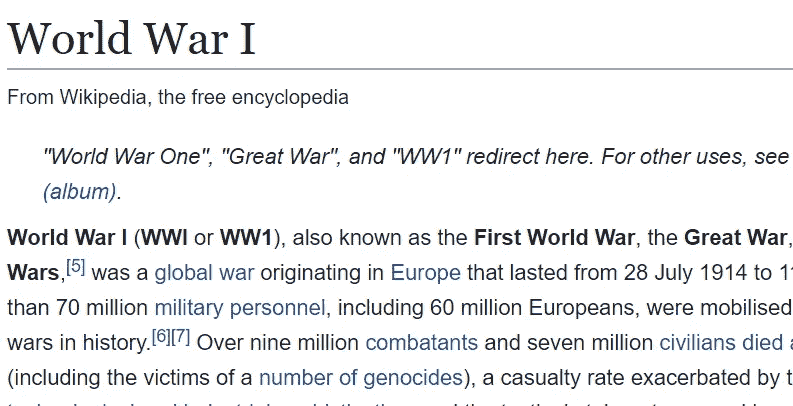
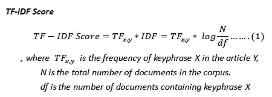

# 识别新闻文章中关键词的最快方法——tfi df with Wikipedia(Python 版本)

> 原文：<https://medium.com/hackernoon/the-fastest-way-to-identify-keywords-in-news-articles-tfidf-with-wikipedia-python-version-baf874d7eb16>


Github 项目链接:[点击这里](https://github.com/adamchinkc/tfidf_wiki)

当我们略读或浏览一篇[文章](https://hackernoon.com/tagged/article)、[、**关键词**、](https://hackernoon.com/tagged/keyword)、**、**是我们对文章相关主题有一个基本了解的最重要指标。当我们想让我们的计算机做和我们一样的任务时， ***我们必须教它们如何从文章中获取关键词，并决定哪些关键词比其他关键词更重要*** *。*

最简单的方法是从预定义的列表中找到“关键词”。而且，这个列表可以从最大的免费在线百科全书——维基百科中提取。

# 维基百科(一个基于 wiki 技术的多语言的百科全书协作计划ˌ也是一部用不同语言写成的网络百科全书ˌ 其目标及宗旨是为全人类提供自由的百科全书)ˌ开放性的百科全书

我试着从[这里](https://dumps.wikimedia.org/)下载维基百科的垃圾，并创建一个维基百科的本地数据库。你可以参考罗伯特的指示将整个维基百科导入你的本地数据库。

下一步是根据每篇维基百科文章的标题创建一个关键词列表，因为维基百科似乎解释了其百科全书中的每一个术语。维基百科中也捕捉到了不同的表述方式，如“一战”、“WW1”或“一战”。



现在，我们有了关键词列表[这里](https://github.com/adamchinkc/tfidf_wiki/blob/master/keywords.txt)(中文版)，我们可以使用简单的脚本从一篇文章中提取关键词。

```
keyword_article = []
for k in keywords:
 k = re.sub(“\r\n”,””,k)
 if k in articlekeyword_article.append(k)
```

然而，这并不是该步骤的结束，因为提取的关键字列表可能会有一些重叠的关键字，如在获取关键字“一战”时的“世界”、“战争”、“世界大战”。这些重叠的关键字会被过滤掉。

```
keyword_overlap = []
for g in keyword_article:
 for h in keyword_article:
  if g != h:
   if h in g:
    keyword_overlap.append(h)wiki_terms = list(set(keyword_article)-set(keyword_overlap))
```

下一步是识别程序从文章中提取的关键词的重要性。

# TF-IDF 得分



**TF-IDF(词频-逆文档频率)**是一种计分方法，考虑到特定术语在其他文章中的**稀缺性，计算特定术语**在目标文章中的**频率。**

TF-IDF 的含义可以简单说明如下:

> TF:术语越频繁，分数越高
> 
> IDF:术语越常见，得分越低

我们来举个例子。我们在纽约时间 2016 年评选出 2016 年最受欢迎的故事——“[W*hy 你会嫁错人*](https://www.nytimes.com/2016/05/29/opinion/sunday/why-you-will-marry-the-wrong-person.html) *”。我在文章中有大约 96 个“the ”,而“marriage”只有 15 个。因为“the”在每篇文章中都很常见，所以与“marriage”相比，IDF 的得分很低。在这个例子中，TD-IDF score 完成了识别重要关键词的工作。*

# 从文章中计算 TF

```
term_no = []
term_sum = 0
wordcount = {}
tfidf = {} for i in xrange(len(wiki_terms)):  
 term = articles.count(wiki_terms[i])  
 term_no.append(term)for i in term_no:  
 term_sum = term_sum + ifor i in xrange(len(wiki_terms)): 
 tf = Decimal(term_no[i])/Decimal(term_sum)
 wordcount[wiki_terms[i]]=tf
```

# 在您当地的维基百科数据库中计算 IDF

```
for k in wiki_terms:
 x2.execute(“select key_idf from key_cn where key_term = %s”,(k))
 idf = x2.fetchone()
 if idf:
  tfidf_value = float(wordcount[k])* idf[0]
 if tfidf_value > 0.1:
  tfidf[k] = tfidf_value
 #if the keywords appear in header, it is important. 
 if k in articles_header:
  tfidf[k] = 1
```

这不是故事的结尾。当我们想把故事链接在一起的时候，tf-idf 本身并不会计算每篇文章的相似度。在下一节中，我们将探索如何将相关文章与抽象的关键词链接起来。

如有任何意见，请随时留在这里或给我发电子邮件至[adam.kc.chin@gmail.com](mailto:adam.kc.chin@gmail.com)。