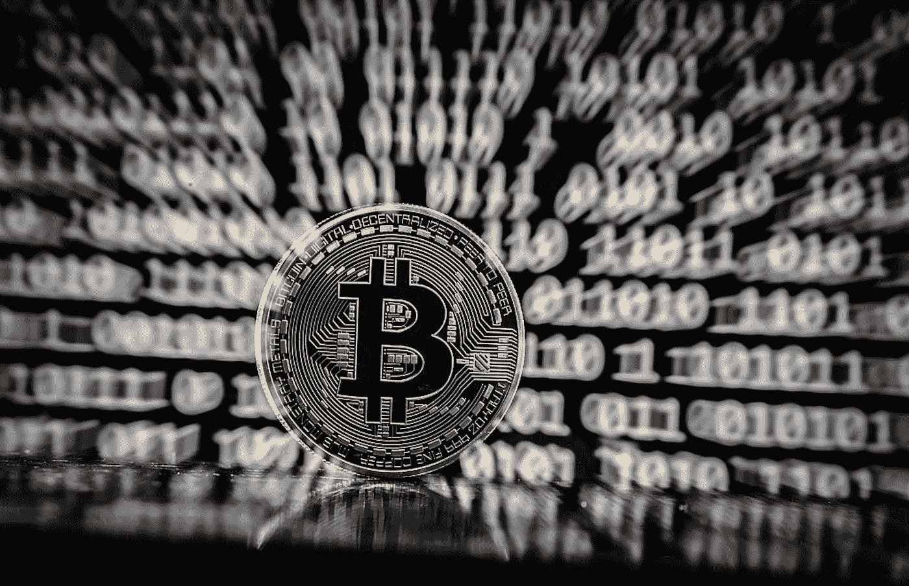
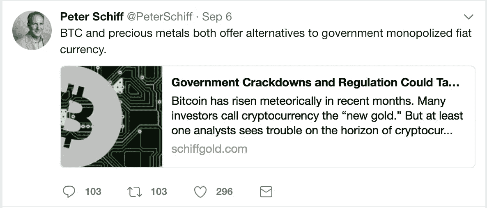

# 比特币的恐惧

> 原文：<https://medium.com/hackernoon/the-fear-of-bitcoin-9090ab5b4cbd>

多年来，专家们一直呼吁比特币的消亡。许多人称之为泡沫、时尚，只不过是“数字海市蜃楼”。为什么比特币和加密货币会煽动如此多的恐惧？

Fear The Bitcoin, Fear The Future

要回答这个问题，我们首先需要看看那些高调的学者，他们是谁，他们说过什么——甚至他们现在在说什么。我个人最喜欢的是彼得·希夫。引用他最近的一次狂言——呃，我指的是采访，引用彼得的话说:

> “比特币是唯一一个除了投机之外还被用于其他用途的社会领域，它的主要好处是打击犯罪，”

如果这种说法不是为了制造恐惧(并且充满无知)，我真不知道什么才是。彼得还提出了许多其他荒谬的说法，包括他在接受马克斯·凯泽采访时所说的“没有商家用比特币为他们的产品定价”。难道他从来没有听说过 www.bitpremier.com 吗？介意解释一下迪拜和以比特币价格出售的新公寓吗？在我看来这些都是用比特币定价的。但是见鬼，我知道什么。我生活在泡沫中，对吗？

那么，为什么一个聪明的商人会做出如此错误的声明呢？一个原因可能是担心比特币将取代黄金成为新时代的价值储存手段——随着彼得成为希夫黄金公司(以及一个总金先令)的董事长，这条线是如何连接起来的就非常清楚了。所以，他的观点可以这样解释，我们在 cryptoland 已经接受了这一点。除了一件事。阅读彼得在 9 月 6 日发的这条推文。

这是我的新问题(也是我曾经问过自己的一个问题)…彼得可能是一个隐藏的比特币持有者吗？当你停下来的时候，这是一场有趣的辩论。这是一个聪明人，做出看似片面的反对比特币的断言，然后发推文吹捧 BTC 和黄金都比法币好？我可能错得离谱，但看起来彼得自己有一套私人钥匙。以下是这篇文章的精彩摘录，可以在 schiffgold.com 上找到:

> 这是否意味着你应该完全避免比特币和其他加密货币？
> 
> 不一定。
> 
> 比特币有很大的上升空间。BTC 和贵金属都为政府垄断的法定货币提供了替代品。它们扮演着与自由市场、健全货币类似的角色。但与任何金融工具一样，也有潜在的陷阱。用贵金属分散您的加密货币投资组合可以帮助减轻一些潜在的负面影响，并使您的财务状况总体上更强。

所以，我想我们已经解释了为什么恐惧会从彼得嘴里喷出来。我们将其总结为要么是对比特币的简单无知，要么是对黄金和他的企业的强烈热情；或者只是一先令黄金，同时让那些研究比特币的人忽略他的话。

每个投资者和商人都必须(也需要)尊重沃伦巴菲特的成就。几十年来，沃伦做出了极其聪明和精心计算的举措和决定。然而，这是我最不同意他的一点。沃伦没有抓住重点。他把比特币比作所有东西的支票或汇票。只有一个转移资金的方法。不用说，技术是他没有掌握的东西。尽管沃伦很聪明，但他没有在比特币、区块链或加密货币方面做过功课，也没有看到更大的图景。我们的世界正在向全数字世界转变。当前形式的菲亚特将会消亡。如果它想生存下去，事实是——菲亚特需要密码多于密码需要菲亚特。老实说，在世纪之交的这一天，没有一个人会像*那样对携带黄金或白银感兴趣。技术会赢。*

> *[**沃伦·巴菲特——他所说的关于比特币的一切**](https://youtu.be/vCmGsYa0P6k)*

*现在，让我们谈谈我不断收到的数百篇呼吁“禁止”或“终结”比特币的帖子和观点。绝大多数的文章和观点都挂在希夫和巴菲特这样的人口中。他们缺乏对加密货币进行智能反驳和辩护所需的研究和知识。所有人都试图证明或假设，政府能够以某种方式关闭一个由许多人而不是一个人同时运行的分散网络。当然，祝你好运。对于那些阅读我的博客文章 [***的人来说，加密和区块链是一个泡沫——但不是专家们认为的***](https://decentralize.today/crypto-and-blockchain-is-a-bubble-but-not-the-bubble-experts-think-be6258e444d3) 的泡沫，我做出了一些强有力的声明。其中之一是:*

> ****“不能控制的，没有人能控制。”****

*我最喜欢的观点之一是指出有多少国家“禁止”密码。名单是:玻利维亚、厄瓜多尔、孟加拉国和吉尔吉斯斯坦。世界上所有的经济强国，对吗？好吧，我会向我们所有人说明这一点。期待任何和所有第三世界(或接近第三世界)国家和独裁者领导的国家禁止密码货币。期待所有以压迫人民而闻名的国家也这样做——或者至少尝试对密码货币进行难以置信的控制。但不要把它们作为现代化和自由的第一世界国家未来做出银行和金融决策的榜样。这是常识。相反，让我们看看金融界的 meccas。日本现在接受密码货币作为一种合法的支付形式(在银行和零售商的巨大压力下，这种情况最近有所逆转)。如前所述，迪拜现在正在以比特币合法出售公寓，加拿大最近宣布了首个经法律批准和监管的 ICO。在美国，现在有一项法案越来越受欢迎，该法案旨在消除 600 美元以下比特币交易的所有税收负担——各国政府似乎正在尝试与密码货币整合。不是禁止它。*

*最后，诺贝尔经济学奖获得者罗伯特·席勒将比特币和密码货币比作泡沫。公平地说，在他的一次采访中，他确实试图淡化他的观点。罗伯特也表达了对区块链科技的敬意(虽然我不清楚他是否知道区块链这个词)，但是我仍然坚信他没有记住这个事实。让我向你指出他对 [**石英**](https://qz.com/1067557/robert-shiller-wrote-the-book-on-bubbles-he-says-the-best-example-right-now-is-bitcoin/) 的采访。以下是供您阅读的摘录，并就受人尊敬的(非常聪明的)罗伯特·席勒在研究和理解我们心爱的密码方面所投入的深度做出您自己的结论。*

> ***石英:你有没有看过最初的硬币发行？***
> 
> *席勒:不，什么是首次硬币发行？*
> 
> ***Quartz:这就像使用加密令牌，而不是比特币本身，而是区块链架构，并发行这些虚拟加密令牌，就像发行股票一样，尽管他们说它们不是股票。***
> 
> *席勒:它和比特币有什么不同？*
> 
> ***石英:有点像众筹。假设您已经开了一家酒吧，您想通过发行这些代币为其提供资金。一个令牌相当于一瓶啤酒，但是您的酒吧只会提供固定数量的啤酒。如果人们认为这将是一个真正的热门酒吧，代币的价值高达 100 美元或 200 美元。人们通过这种方式筹集了数亿美元，他们的商业计划相当单薄。***
> 
> *希勒:是的，这是一个典型的泡沫。我将不得不阅读那件事。有很多加密货币，但它们没有比特币那么好的故事。也许有新的说法。也许这是一个更流行的故事。你让我想写点关于这个的东西。你让我开始思考。*

*最后，对比特币的恐惧可以总结为:无知和散播恐惧。我指出的所有这些受人尊敬的人显然都没有做足功课。Schiff making 声称，你***‘不能用比特币购买任何东西’***，而它的***‘只能用在投机之外就是犯罪’***。巴菲特称比特币为“支票”或“汇票”，最后是席勒，他甚至不知道 ICO 是什么(似乎试图通过成为比特币的对手来利用比特币)——请尽快寻找他关于 ICO 泡沫的书。*

*我给你们所有人的信息是，教育你们自己。不要只看像我这样的博客作者和金融专家关于比特币和密码的叙述。深入了解为我们展示的潜在信息和暗示。菲亚特在苦苦挣扎，有人可能会说是垂死挣扎。如果这种情况真的发生了，我们真的会抛弃数字世界的信念，带着金银去杂货店吗？我认为不是。*

*加密的未来隐藏在 FUD 和我和其他人写的兴奋之间。*

*要明智，但不要害怕。*

***~CryptoJayson~***

***在 twitter @crypto_jayson 上关注我***

***捐款地址:***

***NEO:axz 5 aichxeeefg 5 zo 45 waev 2 qhdrqa 93 QC***

***ETH:0x 84 f 95 a 68 Fe 5 ff 16 bb 7 e 047 c 1484 F4 CD 07 FD 1c 0a***

***BTC:19 uue 9k 4 ybs 6 zmmxcjzdx 9 cz 6 caz H2 ztx***