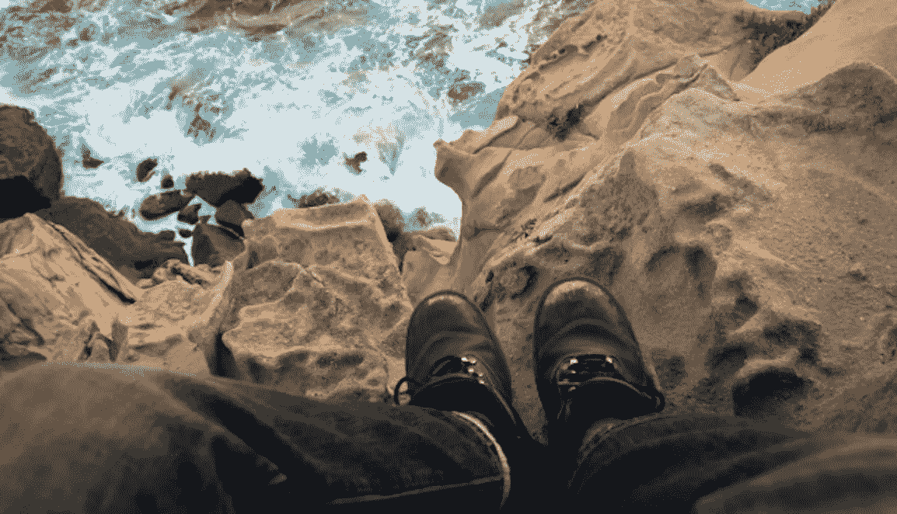
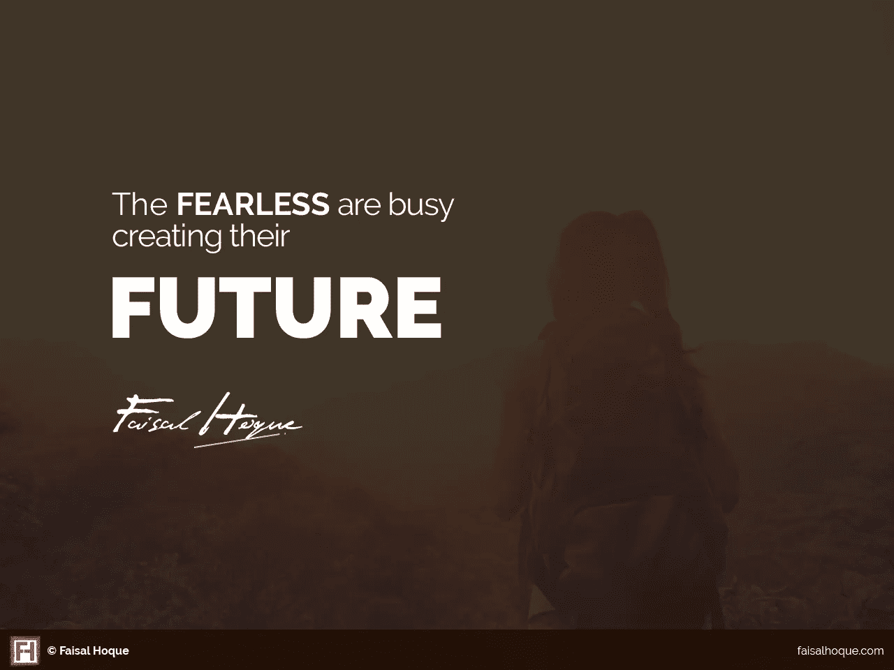
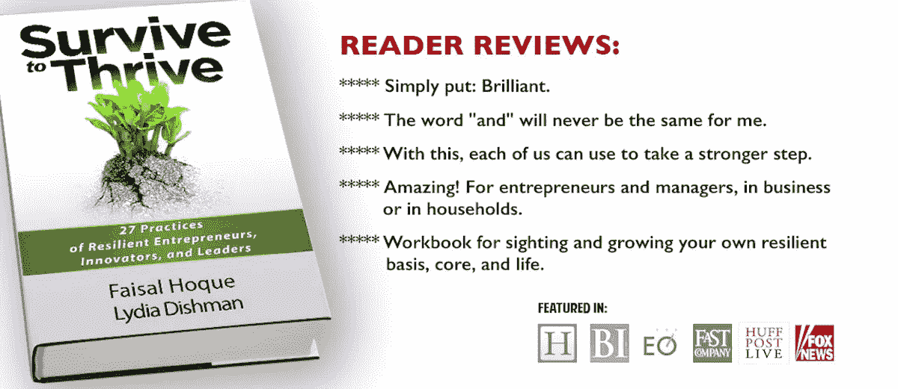

# 无畏者正忙于创造他们的未来

> 原文：<https://medium.com/hackernoon/the-fearless-are-busy-creating-their-future-9d34981f9d87>

[Image: Flickr user [Orin Zebest](https://www.flickr.com/photos/orinrobertjohn/6173500807)]

战胜恐惧是关于自我意识、智慧和了解自己的优势——通常是在面对逆境时。幸运的是，这些是你可以练习的性格特征。

恐惧在我们的情感生活中占有一席之地，它每天都会出现。一切都会导致它:找新工作、处理财务不确定性、创造新事物、考虑失败。出于需要，我们的大脑被设计成让恐惧进入——没有恐惧，我们永远无法生存。

但是你如何避免恐惧阻碍你发挥潜力的能力呢？

战胜恐惧是关于自我意识、智慧和了解自己的优势——通常是在面对逆境的时候。你可以练习和培养这些性格特征，谢天谢地，随着时间的推移，这甚至会变得更容易。

这七条原则帮助我培养了勇气:

## 追随你真正的目标

无畏地行动通常意味着进入未知的领域，挑战传统的道路，或者抛开对安全和舒适的需求。你哪来的精力这么做？通常来自[你真实的目的](http://www.fastcompany.com/3004785/self-improvement-strategies-becoming-more-authentic-leader)——你人生中的个人召唤。印度哲学家帕坦伽利说:

> “当你受到某种伟大目标的激励时，你所有的想法都会打破束缚:你的思维超越了局限，你的意识向四面八方扩展，你会发现自己置身于一个新的、伟大的、美妙的世界。潜伏的力量、能力和才能变得活跃起来，你会发现自己成为了一个比你梦想的还要伟大的人。”

## 通过创造来预测你的未来

无畏者正忙于创造他们的未来。他们[想象他们的未来](http://www.fastcompany.com/3009902/creative-conversations/how-da-vinci-like-thinking-helps-you-imagine-future-success)并发明他们的方式。诺贝尔奖获得者丹尼斯·加博尔在他的书*发明未来*中写道:

> “未来无法预测，但未来可以被发明。正是人类的发明能力造就了今天的人类社会。发明的心理过程仍然是神秘的。它们是理性的但不是逻辑的，也就是说，不是演绎的。”

准确理解我们想要什么是我们成功的基础。但是实现成功需要每天迈出下一步，不管有多困难。这意味着你不能坐以待毙，坐等成功。

## 做别人不做的事情

走非常规道路需要为更大的回报(金钱或其他)而冒险。与众不同需要勇气。无畏的人往往不会纠结于事情，而是果断——未知不应该让你麻痹。

## 弯曲，但不要折断

无所畏惧意味着你必须有弹性。因为如果你是，你将发展一种心智能力，当事情不顺心时，它能让你轻松适应。像竹子一样，有弹性的竹子会弯曲，但很少断裂。

你也要放手。这种放手的能力推动了一个持续不断的变化过程——这让人们变得灵活和适应性强。

## 把每一个障碍都变成资产

纳尔逊·曼德拉十几岁时，听到一位部落长老说，“这些是我们的年轻人。他们是我们的未来。但事实是他们是二等公民……他们永远是男孩。”曼德拉听后决定改变南非。他的决定改变了世界。

无畏的人用他们所拥有的去工作，把障碍变成机会。他们从容应对挑战、失望和拒绝。他们试图将这些事件视为礼物，并找到利用它们前进的方法，而不是挫折。

## 拥抱失败

加州大学戴维斯分校教授[院长基思·西蒙顿](http://psychology.ucdavis.edu/faculty_sites/simonton/)解释说，从莫扎特到达尔文，有创造力的天才在失败面前多产——他们只是不让恐惧阻止他们。失败是这些类型的过程的一部分。有创造力的人只是做更多的实验，所以他们有更多的机会成功。

## 说不——做出艰难的决定

说不比说是需要更多的勇气。但是如果你这么做了，你会保护自己不做出错误的决定。这个策略可以帮助你保持专注，防止不必要的复杂和错误的转弯。也可以让你不要和错误的人扯上关系。

朱迪思·希尔斯博士在《今日心理学》*中写道:*

> *“对于“是”的力量，人们有很多谈论，也有很多话要说。“是”支持冒险、勇气和对生活敞开心扉的态度，这种态度的优雅是不可低估的。但是没有——一个金属栅栏关上了自己和他人影响之间的窗户——很少被庆祝。这是一种隐藏的力量，因为它既容易被误解，也很难参与进来。”*

***阅读原文**[***@ fast company***](http://www.fastcompany.com/3029063/7-ways-build-your-courage-against-impossible-odds)**或**[***@ LinkedIn***](https://www.linkedin.com/pulse/fearless-busy-creating-future-faisal-hoque-1?trk=prof-post)**。***

*版权所有(c) 2016，作者 Faisal Hoque。保留所有权利。*

*我是一名企业家和作家。 [SHADOKA](http://shadoka.com/) 等公司创始人。Shadoka 促进企业家精神、增长和社会影响。《万物互联——如何在创意、创新和可持续发展的时代进行变革和领导》(麦格劳·希尔，2014 年)和《生存与发展:富有弹性的企业家、创新者和领导者的 27 种实践》(励志出版社，2015 年)。在推特上关注我 [@faisal_hoque](https://twitter.com/faisal_hoque) 。*

********

> *[黑客中午](http://bit.ly/Hackernoon)是黑客如何开始他们的下午。我们是阿妹家庭的一员。我们现在[接受投稿](http://bit.ly/hackernoonsubmission)并乐意[讨论广告&赞助](mailto:partners@amipublications.com)的机会。*
> 
> *如果你喜欢这个故事，我们推荐你阅读我们的[最新科技故事](http://bit.ly/hackernoonlatestt)和[趋势科技故事](https://hackernoon.com/trending)。直到下一次，不要把世界的现实想当然！*

**