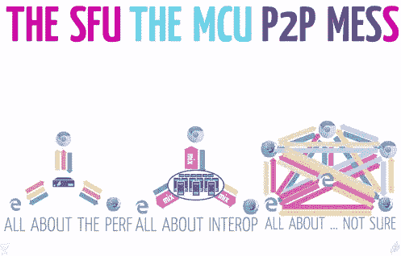

# 十五分钟的 WebRTC 演示

> 原文：<https://medium.com/hackernoon/the-fifteen-minute-webrtc-demo-3f5cf3a71fc4>

教程中总有一些类似“看看你能在 15 分钟内做些什么！”这是对 WebRTC 的[设计](https://hackernoon.com/tagged/design)的证明，这甚至是可能的:15 分钟获得一个工作的对等演示是相当令人震惊的。总的来说，这些教程是合法的:你可以在不到一个小时的时间里得到一些非常棒的东西。

也就是说，工作演示和准备生产的东西之间的差别是很大的。举个例子，

*   你打算支持什么浏览器？
*   它会部署在公司网络上吗？该解决方案必须处理代理和防火墙吗？
*   是 1-1 聊天，还是多方会议？
*   您将如何帮助用户配置他们的麦克风、扬声器和摄像头？
*   你会支持 iOS 和 Android 客户端吗，可能通过一个原生应用？

…这些是…不是简单的问题。在最普通的情况下，每个人都在使用 Chrome，这都是一对一的聊天，通常相当容易。但现实是，你可能会有一个末日产品经理(PMoD)坚持让你支持 IE11、Safari、一堆手机，以及一个有 2 到 10 个同时聚会的房间。这就是事情变得…困难的地方。

先说浏览器。也许你很幸运，你的 PMoD 只想要 Chrome。耶！跳到下一节。

或者不是。他们想要 IE11 和 Safari。这意味着:一个插件。你的选择是一些 [github 项目，它们使用相当旧版本的 WebRTC](https://github.com/sarandogou/webrtc-everywhere) 、 [pay Temasys](https://skylink.io/plugin/) ，或者推出你自己的邪恶开源软件联盟，比如 [Firebreath](https://github.com/firebreath/FireBreath) 加 [OpenWebRTC](https://www.openwebrtc.org/) 或 [Chrome 的 WebRTC 实现](https://webrtc.org/native-code/)。

这也可能意味着支持安装程序(可能同时支持 Windows 和 OSX)，如果你包括 H.264 支持和双倍/四倍的 QA 工作，潜在的 MPEG-LA 许可问题，因为插件经常在一些相当关键的方面与本机实现不同。如果您选择自行开发的解决方案，您可能还会遇到其他有趣的事情，比如跨平台绘图模型。

最后，即使有安装程序，在某些公司内部，用户甚至会被阻止安装。因此，您需要一种在这些公司内部部署和处理更新的方法。

假设您的 PMoD 主要想与财富 500 强公司一起使用您的产品。现在你的问题是:这些公司中的每一个都将有一些可怕的代理/防火墙基础设施，结合健康剂量的随机反病毒软件在本地运行，这将阻碍无缝部署你的产品的一切努力。

你绝对需要一个 TURN 服务器，比如 [coturn](https://github.com/coturn/coturn) ，你绝对需要同时支持 HTTP CONNECT 和 TCP 443，因为某些网络安全类型似乎不理解 A)在 HTTPS 之外还有一个广阔的网络世界，B) UDP 不是一种时尚。

即使有了 TURN 服务器和 443 访问，还是会有网络不合作。为此，你必须在这个庞大的公司里找到一些人，并说服他们允许你进入。美好时光。

最后，你必须将这些服务器分散在世界各地，因为你的用户遍布全球。

你开始在 AWS 中建立一个小型的服务器大军。

您的 PMoD 还没有完成。现在，他们希望在同一个会议中有两个以上的人。问题是:当你将人加入会议时，你会遇到[握手问题](http://mathworld.wolfram.com/HandshakeProblem.html)。基本上，当您添加更多的人时，连接的数量将取决于:

所以如果你有四个人，那就是 4(4–1)/2，或者六个连接。去八突然意味着你有 8(8–1)/2，或*二十八* 人脉。你的 PMoD 觉得十听起来不错；这使你处于 *45 个要建立的连接，最坏的情况*。

遗憾的是，这无法扩展。在十个人的情况下，房间里的每个人都必须将数据推送给其他九个参与者。大多数人缺乏上行带宽来做到这一点。你遇到了真正的问题。

那么我们如何解决这个问题呢？我们使用选择性转发单元(SFU)，多点控制单元(MCU)，或者你告诉你的 PMoD 他们在吸毒，你可以支持四个(也许五个？？)人们在一个 P2P 满网的厄运中:

当然，你突然需要基础设施——大量的基础设施，而且在某些服务器死亡的情况下可能是多余的。该服务器需要坚如磐石，因为它是会议的单点故障。您可能需要在世界各地部署它，因为澳大利亚的用户试图连接到您在美国东部的媒体服务器时会有严重的延迟。这个基础设施必须与你的 TURN 服务器协同工作。你需要决定是选择 SFU 还是 MCU，两者都有明显的权衡。

你的 PMoD 给你发了一封疯狂的邮件；首席执行官试用了该产品，她的摄像头工作不正常，她听不到其他人的声音。原来是扬声器被关掉了，摄像头在用 Skype。这也证明了这是你的问题。

你需要为人们提供枚举、配置和测试他们的硬件的方法。这很糟糕，原因有很多:

*   Windows 在应用程序之间的共享方面有点糟糕。例如:摄像机归 Skype 所有。Chrome 未能获得摄像头。
*   Windows 真的不擅长管理音频设备。你有默认的麦克风，但你也有默认的通信设备，似乎没有人能很好地理解这一点，因为在某些基本层面上这是不可理解的。
*   高级用户总是想要配置他们的扬声器输出。他们希望通过他们的耳机，而不是通过他们的电脑扬声器(咄)，所以必须能够配置。
*   但是 Firefox 不允许这样做。没有适合您的扬声器配置。
*   而火狐的 getUserMedia 实现简直是疯了。每次你请求访问麦克风和摄像头时，它都会弹出一个权限提示。多谢了，火狐。
*   这提醒了我:上帝禁止在 Chrome 或 Firefox 中意外拒绝权限提示的用户。那是支持电话。克拉普。
*   哦，还有，你的财富 500 强客户一直在安装 Chrome/Firefox，而摄像头和麦克风被管理员禁用了。非常感谢各位。谢谢你所做的一切。

…您还需要一些方法来测量麦克风强度，确定视频流是合法的，并允许用户正确配置他们的扬声器。对于一个严肃的项目来说，这些都不是细节；它们对现实世界中的实际成功至关重要。

然后是各种各样的垃圾:静音音频/视频，允许人们在会议中交换硬件，为人们提供调试设备的工具，等等。

PMoD 不理解他们为什么不能用 iOS。没问题，你说。我只需将一些 WebRTC 库移植到移动设备上，创建一个本机应用程序，实现我们最终选择的 SFU/MCU 解决方案所需的所有信号，瞧，完成了。小菜一碟！

哦，然后我会从头再做一遍，但对于 Android。

这需要对 SDP 提供/回答交换、涓流冰、DTLS 协商、本地代码等方面有深入的了解。你的项目持续了三个月。它还将您与您选择的一些 SFU/MCU 紧密耦合，因为信令不是 WebRTC 标准的一部分。

…那该死的 15 分钟演示。看看它给你带来了什么。

我不应该抱怨。我真的没有抱怨。过去，这需要一个相当大的团队(团队？？)的工程师来推出这样的解决方案。现在，有了 WebRTC，让一个小团队管理一个公司的所有基础设施是完全可能的。

它不适合胆小的人——你需要一些媒体和网络专家，一些有 SIP/SDP 经验的人可以拯救你，一些面对一些不虔诚的本机代码无所畏惧的人。但这是合理的。

小心 15 分钟的演示。