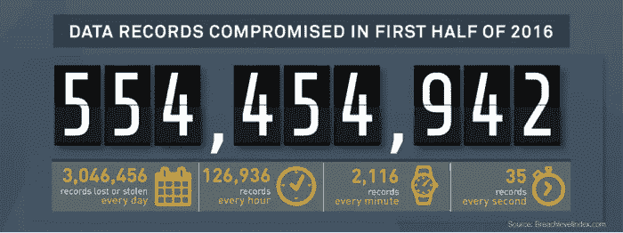
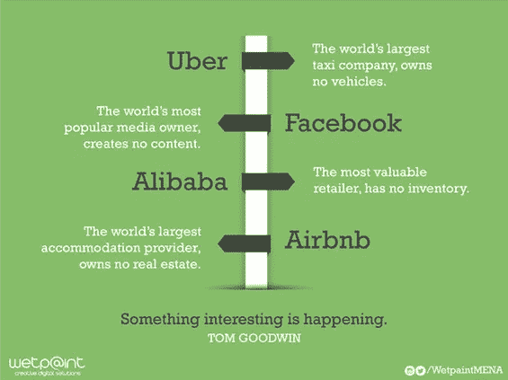

# 为身份而战-解决人类问题。信任。

> 原文：<https://medium.com/hackernoon/the-fight-for-identity-solving-the-human-problem-trust-ce19bdb28ce7>

> 如果你总是处于真实身份的压力之下，我认为这是一种负担。马克·扎克伯格/脸书

线上和线下的界限正在消失。我们与他人(社交网络)联系，并在相互之间以及与企业互动时使用多种设备和渠道。一切可以联系的，都会。机会是巨大的，但以目前事实上的方式这样做是有风险的。普通用户每个电子邮件账户至少有 90 个在线账户，每个企业都希望 T2 用户注册账户。当不好的事情发生时，而不是如果发生时，数量是巨大的。我们都读过像 [Equifax](https://www.vox.com/policy-and-politics/2017/9/13/16292014/equifax-credit-breach-hack-report-security) 或 [Yahoo](https://www.engadget.com/2016/12/14/yahoo-confirms-a-new-security-breach-affecting-1-billion-account/) 这样的大公司，但是那些拥有数万或数十万用户的小公司呢？那些我们甚至不知道的已经暴露了…

[https://blog.gemalto.com/security/2016/09/20/data-breach-statistics-2016-first-half-results/](https://blog.gemalto.com/security/2016/09/20/data-breach-statistics-2016-first-half-results/)

[未来十年在线信任的命运](http://www.pewinternet.org/2017/08/10/the-fate-of-online-trust-in-the-next-decade/)是皮尤的一个伟大系列，它揭示了信任的许多方面，以及我们如何在日常数字生活中获得或失去信任。信任的概念将更多地成为一个关系问题，而不是一个技术问题——一个人的问题。数字世界的问题是，我们人类一直是用户。这不是我们的领域，所以我们以主体的身份进入——规则是不同的。有人在那里控制着我们的关系。

你同意这些条款和条件吗？

电脑在解决电脑问题方面很棒。以区块链为首的基于不信任设计的新技术可能会成为解决信任问题的关键因素。但是技术本身就足够了吗，或者我们还需要其他的东西吗？

**我们解决的是正确的问题吗？**

在本系列的前几部分中，我介绍了关于身份的 [CRM](/@Jemiweb/the-fight-for-identity-part-1-5f3150b8f13d) 和 [VRM](/@Jemiweb/the-fight-for-identity-part-2-c70cfd57502e) 模型。Glome 是这些模型之间的桥梁，其核心理念是:

> 个性化不需要身份，只需要我的背景。

我的背景是一个非常人性化的东西。我们必须专注于赢得他们的信任，而不是努力让人们被认出来。为了把 Glome 放在一个盒子里(或其他业务所在的细分市场)，我们把自己描述为一个匿名的 CIAM(客户身份和账户管理)平台。让我们再来看看数字颠覆的图像:

> Glome 将成为世界上最大的账户提供商，不拥有任何用户。

让它深入人心。它确实改变了一些事情，但同时:
-它对用户没有任何要求(没有摩擦，没有应用，没有注册)
-它完全兼容 CRM
-它完全兼容 VRM
-它完全兼容 GDPR

在线身份是必须具备的，但只能在正确的地方——你信任的地方。荣耀不能拥有它，因此我们不能作恶。我们为客户创造用户，企业使用 Glome。由于我们不知道最终用户的身份，我们不能窃取或出售给任何人。谷歌、脸书、银行、运营商——没有一家能做我们做的事情，因为身份是你要么有，要么没有的东西。没有灰色地带。

我们的目标不是让网络匿名。我们的目标是让网络真正以人为本，帮助公司赢得用户的信任！

> Glome 帮助企业赢得信任，并通过多种设备为他们的客户和客户的朋友提供服务，而无需强迫任何人注册或安装应用程序。

包括商业，但由人类负责。