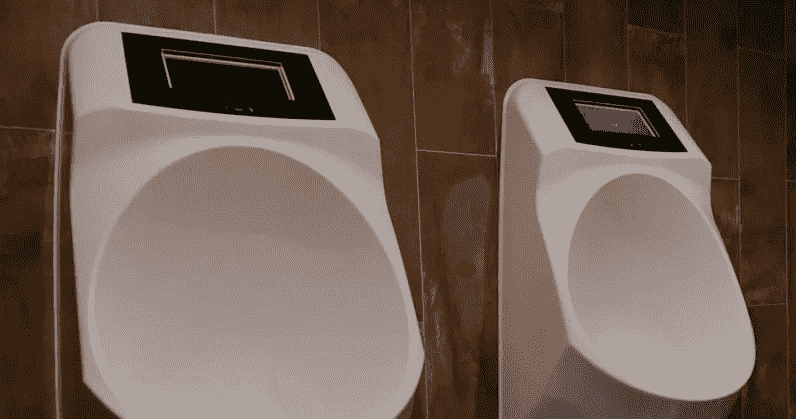
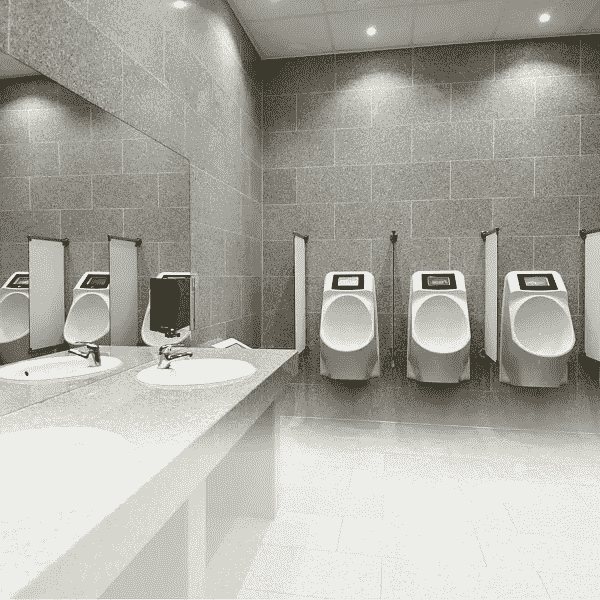
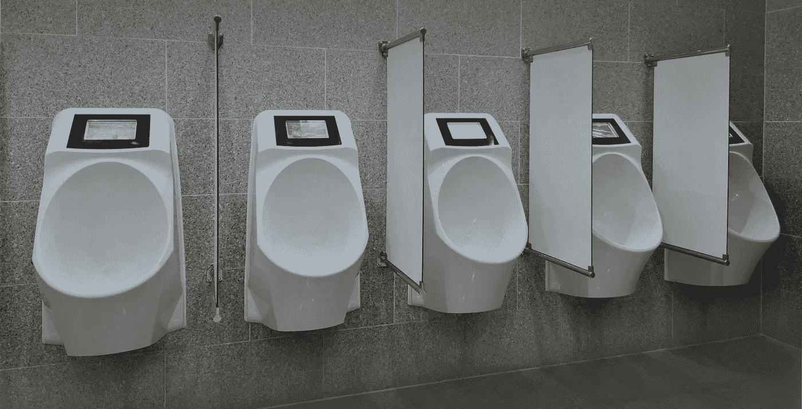

# 科技中更好的东西:男人在公共场合撒尿时的智能广告

> 原文：<https://medium.com/hackernoon/the-finer-things-in-tech-smart-ads-while-men-pee-in-public-50d93183e894>

我们不会在这件事上撒尿。具有前瞻性思维的荷兰厕所初创公司 [Mr.Friendly](http://mrfriendly.nl/en/) 找到了一种方法，即使在你撒尿的时候，也可以用侵扰性广告来纠缠你。

这家古怪的公司设计了一种智能便池，当你清空水箱时，它会让你的视线充满垃圾广告。事实上，这里的重点是“当”的部分。这项不寻常的发明配备了内置传感器，只有当它们检测到有人将画布涂成黄色时，才会滚动广告。

广告随后会显示在便池的内置显示屏上。正如你可能猜到的，Friendly 先生还建立了一个“云控制中心”，让你远程管理广告，包括广告何时出现。

你可能会想，这是个好主意吗？

据 Friendly 先生说，小便池上的广告“保证能吸引男士 40 秒的注意力”。

网站上写道:“当一个人最乐于接受信息时，Friendly 先生明白找到沟通方式的重要性。”“做到这一点的最佳时刻是当一个人无法逃避去做别的事情，而只能专注于你的信息的时候。这种情况很少发生，尤其是在我们忙碌的现代世界。”

除了它提供的极好的广告机会外，Friendly 先生声称这种小便器是“无水的，性价比高”它也完全无味。不幸的是，这个便池的价格没有列在网站上。

有趣的是，我从一个同事那里听说了友好先生和它的尖端发明，他在野外发现了其中的一个。在标志性的物联网时尚中，广告部分——这是 Friendly 先生的独特卖点——不起作用。

平心而论，厕所技术是一个合法的行业，没什么可大惊小怪的。你可能听说过日本的[高级厕所](https://en.wikipedia.org/wiki/Toilets_in_Japan)——或者可能见过[这种不用手就能清洁主教的高科技便池](https://en.wikipedia.org/wiki/Toilets_in_Japan)。

然而，与 Friendly 先生的小便池不同，这些小便池的设计考虑的是功能性，而不是广告。

因此，除非友好型便池先生能够用美妙的小便体验来平衡在如此不寻常的场合投放广告的愤怒，否则我们还不如把这个概念冲进马桶。

*本故事由* [*Mix*](https://thenextweb.com/author/dimitarmihov/) *撰写，原载于* [*下期网络。*](https://thenextweb.com/shareables/2017/12/07/smart-urinal-ads-toilet/)

*要阅读黑客正午的每周趋势 TNW 故事，请访问*[*【Hackernoon.com/tnw】*](http://hackernoon.com/tnw)*。*