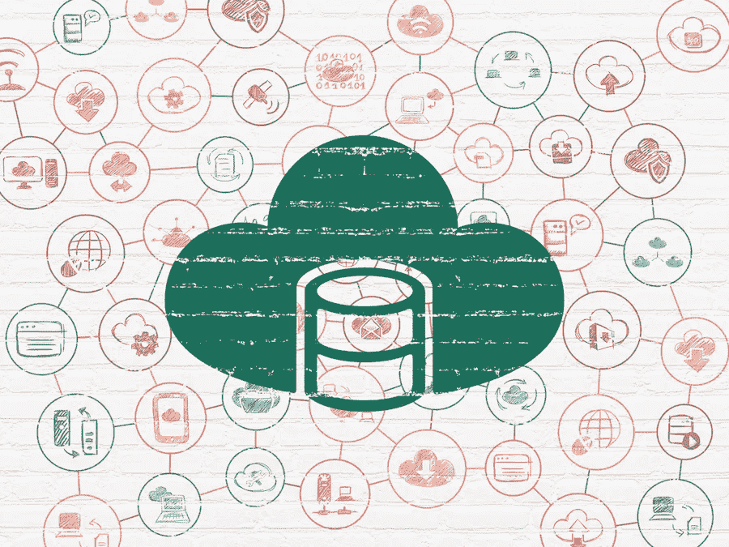
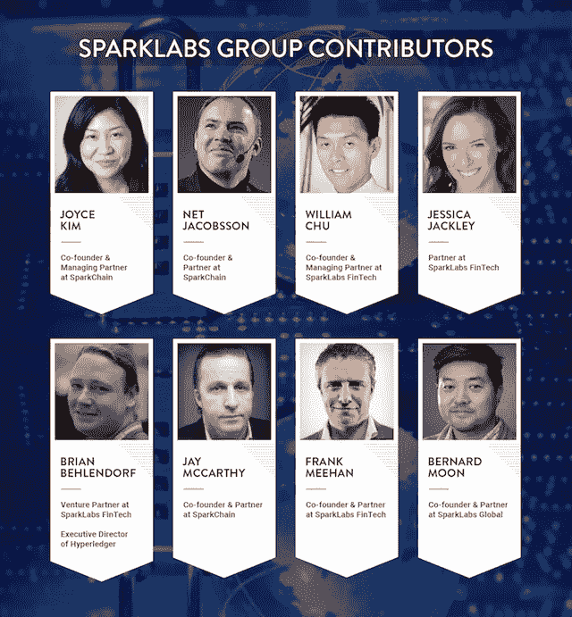

# 第一家 1000 亿美元的区块链公司可能是下一个 SAP

> 原文：<https://medium.com/hackernoon/the-first-100-billion-dollar-blockchain-company-could-be-the-next-sap-c8b49bfe6e32>

Image Credit: BigStockPhoto

> 最初发表在我们的[福布斯博客上，“关于加密货币、区块链和货币的未来”](https://www.forbes.com/sites/sparklabs/2017/12/15/the-first-100-billion-dollar-blockchain-company-could-be-the-next-sap/#1b1cae7a1948)

T 关于区块链技术将会如何颠覆性，可能会有很多炒作，有些人吹嘘它将如何改变当今世界的一切，每个行业都为颠覆做好了准备。虽然我对区块链技术感到兴奋，但我不认为它是包治百病的技术。

区块链提到的最常见的行业是银行和金融、医疗保健、网络安全，以及任何缺乏透明度或缺乏跟踪和效率低下的领域，如创意作品和供应链管理。

区块链在消费者和企业市场上的潜在颠覆性，看起来就像是一名船长在雾夜航行在大洋中央。你知道你在看广阔而遥远的水域，但能见度有限，未来不确定。

**企业是关键**

当我想到区块链在面向消费者的产品上的潜在应用，以及由此诞生的新公司时，我兴奋不已。当我想到企业方面时，我有点昏昏欲睡。从本质上来说，区块链技术相当无聊。作为一种新的解决方案或中间件产品，它使后端流程更加高效、安全或透明。遗留系统的中间件？将大型企业从 IT 石器时代带向去中心化、分布式系统的未来？请在我腿上插一把叉子，在我喉咙里灌一加仑红牛。

I need Bishop’s knife trick on me to keep me awake for enterprise startups. “Aliens” (1986)

但无聊是好事，凸显了区块链企业公司的巨大潜力。这些新兴的区块链企业初创公司的一个很好的行业基准是 SAP 和 Oracle 这样的公司，它们是传统的企业数据库公司。我认为今天的企业区块链初创公司和未来几年的公司是下一代企业数据库公司。 **SAP 市值超过 1350 亿美元，去年收入超过 230 亿美元，Oracle 市值超过 2090 亿美元，收入超过 370 亿美元。**甲骨文将自己定位为世界第一的企业数据库公司，拥有从中间件解决方案到服务器再到数据库的数十种核心产品。

**关注亚洲**

一个鲜为人知的事实是，SAP 的旗舰产品 HANA database 背后的核心技术来自他们在 2005 年收购的一家名为 Transact In Memory 的韩国公司。Transact In Memory 是由首尔国立大学电子和计算机工程教授[桑查](http://kdb.snu.ac.kr/chask/)博士创立的。

下一代全球企业数据库公司可能不仅仅基于从该地区获得的技术，而是完全源自亚洲。比如 Blocko，2015 年通过[我们在首尔](http://www.sparklabs.co.kr/)的加速器，已经成为韩国领先企业区块链公司，市场份额超过 90%。他们的区块链即服务平台 Coinstack 已经在三星、LG CNS、现代和许多其他价值数十亿美元的公司中实施。对于韩国交易所，他们创建了一个总部位于区块链的场外交易市场，将交易时间从 2–3 天减少到 1 天。**这导致去年节省了 7300 万美元的成本**。

Enterprise IT is the new black… er, green. (image credit: BigStock)

Blocko 为韩国最大的信用卡公司 Lotte Card 建立了一个基于区块链的生物识别登录和支付授权系统，将身份验证时间从 7–10 分钟减少到 2–3 分钟。这一简单的解决方案将 Lotte Card 的年度安全解决方案支出降低到其原始运营成本的 10%,同时大幅提高了其安全级别。

中国的另一家公司 SunlightDB(今年 SparkLabs Beijing 首届班的成员)正试图基于区块链技术创建一个全新的数据库。他们正在建立一个高度安全的数据库，其中的信息不能被篡改，但也完全开放。与区块链技术公司的一些误解相反，他们的数据库查询至少比传统数据库快 10 倍。

**加盟区块链**

除了亚洲和创业世界，区块链的实施正在全球范围内进行。在迪拜，全球最大的航空服务提供商之一 DNATA(迪拜国家航空运输协会)正与 IBM 合作，通过区块链技术改善货物交付流程。潜在的成本节约将达到数亿美元。

许多美国公司正在试行区块链解决方案，但我相信，在未来的一年里，将会有一个转变，从美国公司涉足水，到更多的美国公司跳入区块链技术的分散水域。2018 年将是企业初创公司和大公司(如 IBM、埃森哲、美国银行)在这一领域的突破之年，这一领域的美国公司可能会迅速赶上亚洲的创新。

亚洲初创公司的弱点是无法成为全球性公司，也无法在本地区以外产生重大影响。你只需看看腾讯、阿里巴巴、Kakao 或乐天的发展，就能质疑来自亚洲的真正全球企业的生存能力，但也许亚洲新一代企业家将证明我们错了。无论是来自亚洲、欧洲还是美国，未来的一年都可能为世界上第一家市值 1，000 亿美元的区块链公司的诞生铺平道路。

伯纳德·穆恩是由加速器和风险投资基金组成的网络公司[*spark labs Group*](http://www.sparklabsgroup.com/)*的联合创始人和合伙人。*

Our team of contributors for the Forbes Blog