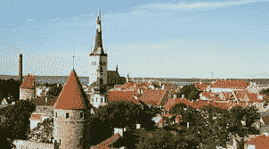

# 爱沙尼亚的第一场网络战争:十年后我写的反思

> 原文：<https://medium.com/hackernoon/the-first-internet-war-in-estonia-the-postmortem-i-wrote-10-years-later-72040f53620e>

Image source: [http://www.bbc.com/news/world-europe-17220810](http://www.bbc.com/news/world-europe-17220810).

很难说是否有“第一次互联网战争”，如果有，也不可能说它何时发生，但历史上有一个事件称得上是“第一次互联网战争”，而我就在那里。

[前几天我写了一篇文章](https://securityledger.com/2017/04/estonia-10-years-later-lessons-learned-from-the-worlds-first-internet-war/) [研究](https://hackernoon.com/tagged/examining)从技术上讲，这可能是 [DDoS](https://hackernoon.com/tagged/ddos) 攻击，但我们从爱沙尼亚真正学到的是，信息操作、操纵和假新闻是一种政策驱动模式，我们可以追溯到爱沙尼亚作为第一个“测试案例”。

在这篇短文中，我想回顾一下我为爱沙尼亚 CERT 写的事后分析，看看自那以后发生了什么。

十年前，爱沙尼亚发生了 DDoS 攻击。苏联解体后，爱沙尼亚从零开始建设其整个基础设施，因此，在互联网上这样做。

想象一下 DDoS 攻击对一个“居住”在互联网上的国家意味着什么。基本服务可能会停止。

当我第一次遇到这个消息时，我不屑一顾。“又一个 DDoS，”我说。然后第二周过去了。然后第三个开始了。作为组织全球事件响应和保护互联网基础设施在线任务组的成员之一，我认识一个人，他就是希拉。

希拉·阿勒莱德是爱沙尼亚应急小组的负责人，这是一个位于塔林的两人小组，负责协调和应对安全事件。我给他发了一张纸条，说:“你们需要帮助吗？”

他马上回答:“我什么时候去机场接你？”

我是在长达一个月的攻击后的第三周进去的。我的角色相对较小。我在力所能及的地方提供帮助，并撰写了对袭击的事后分析和教训。然而，爱沙尼亚人给我们上了重新定义信息安全的一课，也就是后来众所周知的网络安全。

## 第一课

> 衡量你的标准不是防止攻击，而是你如何应对攻击。

攻击会发生。攻击者将会成功。您在发现攻击、调查攻击和缓解攻击方面做得有多好？

## 第二课

> 是人的问题，不是电脑的问题。

计算机攻击不是关于比特和字节。这只是必要的补偿。没有它，它们不会发生。电脑攻击是针对人的。如果人们认为攻击是成功的，那么它就是成功的，不管有没有实际的损害。

## 第三课

> 任何人都可以影响世界政治

游戏不限于国家。一个在世界另一端的孩子可能会潜在地影响世界政治和基于计算机攻击的决策。他们很容易做到，我们容易受到他们的伤害，归因是困难的，我们有自己的直接嫌疑人，我们想归因于无论如何。

## 第四课

> 我们不再怀疑——这是战略含义。

我们总是大声疾呼信息和网络安全是战略性的。但是我们真正知道什么呢？我们可以根据三个类别进行有根据的猜测:

一个是基于我们从其他战争领域学到的理论。我们可以试着考虑它们在网络战的情况下会受到怎样的影响或实施。

**两个**是基于采取较小规模的计算机攻击，如网络犯罪，并考虑当一个民族国家使用它们时他们可能会看起来。

**三个**是基于可能发生的事情。我们知道各种攻击类型以及黑客可能会做什么。意思是，思考这些如何潜在地服务于一个民族国家。

理解网络安全具有战略意义，这也是我们应对挑战的方式，这也是我最终创办网络欺骗初创公司 Cymmetria 的原因。

## 第五课

> 我们必须依靠别人来保护自己

虽然信息共享和协作已经成为一种时尚，我们可以通过谁在这方面说得更多来判断谁是我们领域的新手，但我们不能没有它，这一点也变得比以往任何时候都更清楚。

在互联网上生存是关于你认识谁，谁能帮助你。你不能控制这个世界——你几乎不能控制你自己的网络。这是关于确保自助，或者我喜欢夸张地称之为:相互确保生存。

## 过去十年

在过去的十年里，所有这些教训都被证明是正确的。

网络安全已经表明，它是关于计算机攻击，但基于政策目标。它还向我们表明，它通常是一种媒介，信息可以通过它传递，而不仅仅是被中断。通过其他方式延续政策，正如我在另一篇文章中所写的那样。

我们还了解到，这些规则适用于间谍世界和世界政治。无论是在先进的民族国家 APT 攻击中，归因一直是主流媒体和政策制定者最近的主要关注点，还是在网络安全第一原则中，我们现在假设妥协，并尝试尽快检测攻击者的存在，而不是依赖预防。

我们注意到像“匿名者”这样松散的黑客组织和维基解密这样的组织登上了世界舞台，影响了世界政治。不需要太多。

最后，这不仅仅是关于我们和我们所控制的东西。这是关于我们知道谁可以帮助我们保护自己，以及我们如何负责任地回报和帮助他们。

爱沙尼亚是我们拥有的第一个真正的公共使用案例，它在今天和当时一样重要。十年后，我很高兴回顾和探索这些经验教训。我们可能已经经历了 DDoS 攻击、间谍网，周围都经历了地狱。但到目前为止，爱沙尼亚仍然是网络战事实上的榜样。

加迪·埃夫隆。
(推特: [@gadievron](https://twitter.com/gadievron) )

# cyber # cyber war # estion ia # first principles # lessons learned # DDoS #宣传#信息运营

> [黑客中午](http://bit.ly/Hackernoon)是黑客如何开始他们的下午。我们是 [@AMI](http://bit.ly/atAMIatAMI) 家庭的一员。我们现在[接受投稿](http://bit.ly/hackernoonsubmission)并乐意[讨论广告&赞助](mailto:partners@amipublications.com)机会。
> 
> 要了解更多信息，请[阅读我们的“关于”页面](https://goo.gl/4ofytp)、[在脸书上点赞/给我们发消息](http://bit.ly/HackernoonFB)，或者简单地说， [tweet/DM @HackerNoon。](https://goo.gl/k7XYbx)
> 
> 如果你喜欢这个故事，我们推荐你阅读我们的[最新科技故事](http://bit.ly/hackernoonlatestt)和[趋势科技故事](https://hackernoon.com/trending)。直到下一次，不要把世界的现实想当然！