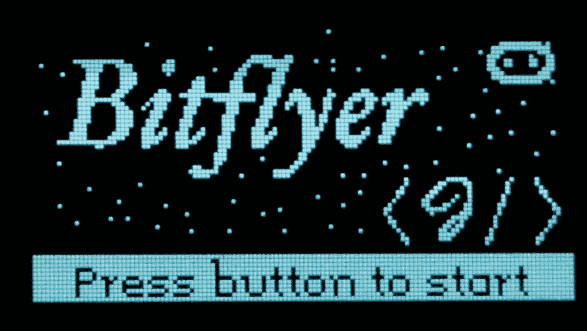
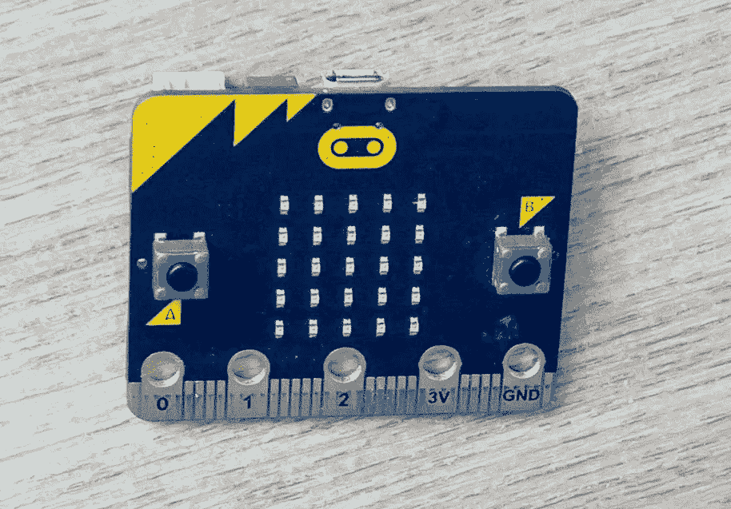
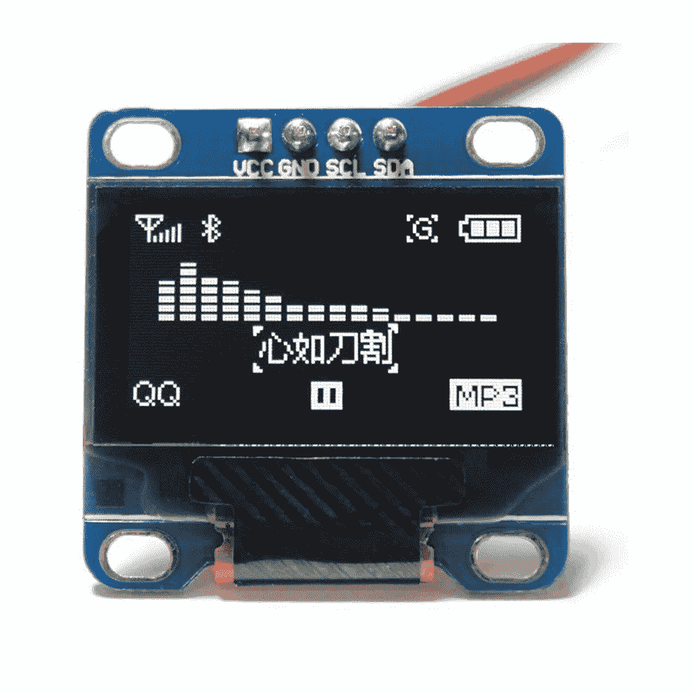
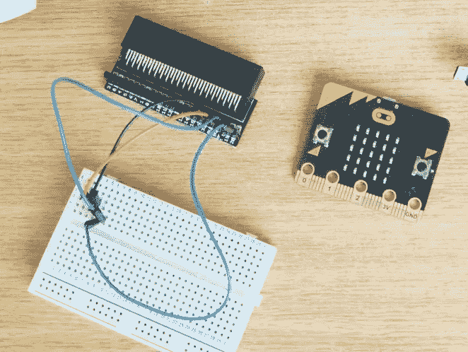
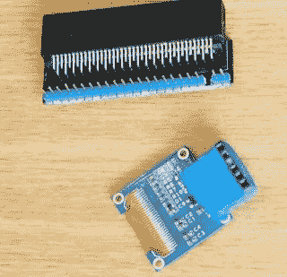
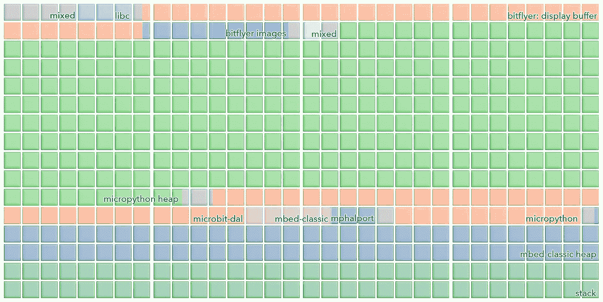
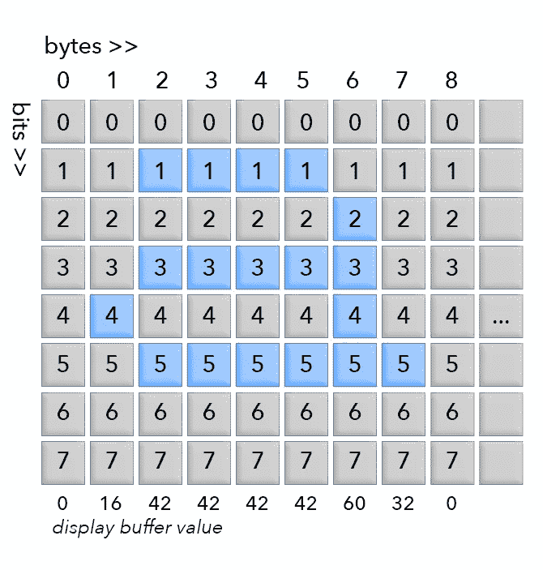
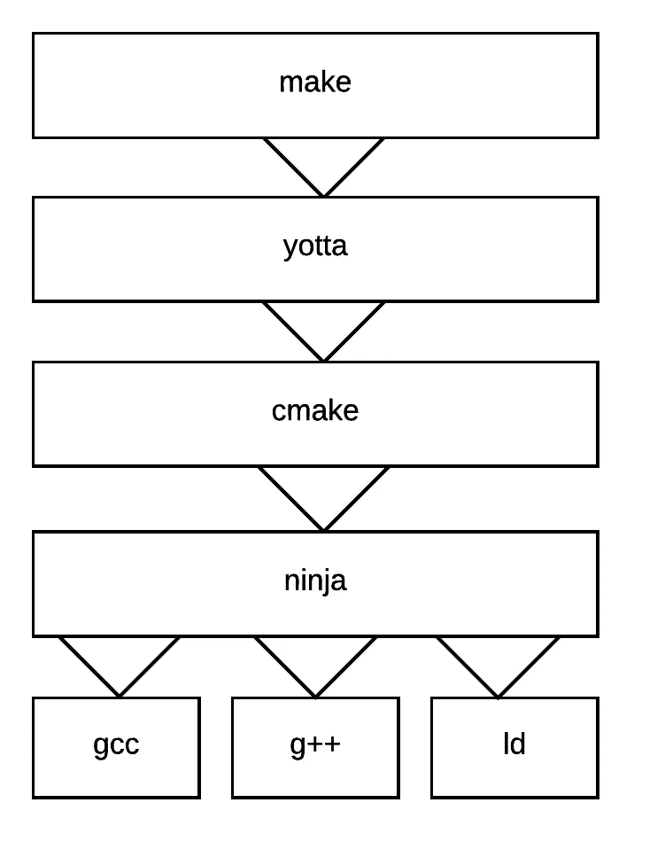

# BBC 微上第一个视频游戏:bit[大概]

> 原文：<https://medium.com/hackernoon/the-first-video-game-on-the-bbc-micro-bit-probably-4175fab44da8>

The title screen

不久前，我很幸运地得到了一个 BBC micro:bit，这是 Nicholas Tollervey 提供的，我想看看我能把 python 推向什么程度(我去年 5 月开始写这篇文章！).这是我用 2 美元的外部显示器在 micro:bit 上构建游戏的故事。

# 硬件

[bbc micro:bit](https://www.microbit.co.uk/) 是一台微型电脑，[其中](http://www.bbc.co.uk/mediacentre/latestnews/2016/bbc-micro-bit-schools-launch)有一百万台被英国人(和威尔士人！)学童和学校。它有灯，按钮，USB，蓝牙，运行 Python！

硬件相当有限。它围绕 nRF51822 芯片构建，时钟频率为 16 MHz，内存为 16 KB。闪存空间稍微大一些，有 256 KB 的可用空间。这使得做更复杂的事情相当有挑战性和乐趣。

该板有两个按钮，和一个由 25 个发光二极管组成的迷你屏幕，这对人们开始使用非常好，但在绘制小行星和宇宙飞船时非常有限！为了让事情更令人兴奋，我添加了这个小显示屏:

你可以在网上花 2 美元买到。在之前我已经讲过[这个显示器了。](/@stestagg/playing-star-wars-on-the-esp8266-with-micropython-5f175fe7b755)

为了连接两者，我从 K [itronik](https://www.kitronik.co.uk/) 买了一个 edge 连接器，它可以将 micro:bit 上的智能 edge 连接器变成电子原型的普通引脚。

考虑到这一点，以及来自 micro:bit site 的[引脚，它显示了 I C 引脚(显示器使用的有线协议)，以及哪些引脚可用于为显示器供电，我可以将它们连接起来。不幸的是，micro:bit 和显示器的引脚并不完全匹配，我不得不将一个跨越两条电线的适配器拼凑在一起，以允许显示器直接插入分线板。然后，我用](https://www.microbit.co.uk/device/pins) [sugru](https://sugru.com/) 包裹连接器，让它看起来更漂亮:

# 软件

Micropython 有点令人敬畏。Python3 语言的一个独立实现，由 Damien George 开发，运行在低功耗/内存芯片上，为嵌入式应用而设计。

最终，它仍然是 Python，尽管它有很多好处，但它并没有被设计成超快或内存高效，而这两者在传统上对游戏来说是至关重要的。这使得一些事情变得相当棘手，我将在下面探讨它们。

# Bitflyer

这是一个游戏的视频:

我的想法是在小行星和太空入侵者之间创建一个更简单的交叉，巨石从屏幕顶部落下，玩家必须驾驶飞船来躲避它们。

源代码在 github 上:[https://github.com/stestagg/bitflyer](https://github.com/stestagg/bitflyer)

在制作过程中，我遇到了该平台的一些限制，我将在下面讨论这些限制:

## 速度

速度实际上并不是一个大问题。该芯片的时钟频率为 16 Mhz，micropython 很好地利用了这些周期。

在某些情况下，我将一些代码转移到 C 模块中(见下文),这有助于解决一些瓶颈问题。

主要的速度问题是更新显示。I C 并不是为超高速通信而设计的。nRF51822/ssd1306 可以以 1 Mhz 的时钟速度进行通信，但对于 I C 线和握手协议，这实际上相当于 25–40 KBps(字节)。

更新整个显示需要 1 KB 的数据，因此每秒多次这样做(cpu 在通信发生的整个时间都很忙)不会给做其他事情留下太多空间。

## 记忆

记忆是个大问题。micro:bit 有 16 KB ram，这并不多，尤其是在使用严重依赖动态分配的 python 时。

下图显示了如何为 micropython 划分内存(禁用了许多较大的内置模块):

Map of the RAM usage of the bitflyer code. Labels indicate which system uses that section of memory. Each square represents 32 bytes of RAM

重要的部分是“micropython 堆”部分。所有普通的 python 对象都在这个范围内，

所有普通的 python 对象都存在于上图中绿色的“micropython 堆”中，这个堆只能使用大约一半的 ram。

传统上，对于嵌入式系统，所有代码都被编译，并添加到闪存中，在 micro:bit 上是 256 KB(加载空间！).使用 python，虽然源代码可以存在于 flash 中，但 micropython 必须在运行时将它编译成 RAM 中的对象。在这种情况下，添加大量复杂代码来避免内存使用通常不是一种选择，因为复杂代码也会使用与您试图压缩的对象相同的内存池。

我没有深入研究 micropython 解析器/编译器的内部，但是像去掉注释和使用 [pyminifier](https://github.com/liftoff/pyminifier) 这样简单的事情对将代码放入内存有很大的帮助。

最后，为了找到一个可靠运行的模型，进行了大量的试错，改变了使用的变量和顺序。我还必须调整 python 堆和栈的大小(使它们变小)来容纳所有内容。

## 显示缓冲器

我很早就决定使用显示缓冲区。我使用的显示芯片(ssd1306)有一个内部帧缓冲器，但没有简单/明显的方法从中读取当前值，只能更新它们。

我本可以实现一种方法，基于跟踪自上一帧以来移动了什么对象，并计算增量，来清除/ [重画](https://hackernoon.com/tagged/repainting)屏幕的部分，但是这种方法有一些缺点:跟踪每次更改的代码/内存成本相当高，与显示器的通信相当慢，所以许多小的更新命令会引入明显的滞后/延迟。

相反，我决定在内存中保存一个屏幕“视图”，每次都用它来进行有效的更新。这是一个很大的成本，屏幕有 128x64 像素，每个像素要么开要么关，所以屏幕缓冲区是 1 KB，或机器总内存的 1/16。这种方法的优点是更新屏幕要简单得多，因为您只需跟踪屏幕的哪个矩形包含更改，并进行一次数据批量传输来更新显示。

最初，我使用 python 数组来存储屏幕缓冲区，并立即遇到了严重的内存问题。问题原来是分裂。micropython 堆只有 9 KB，在中间某个随机的地方有一大块 1 KB 的不可移动数据，这给试图在它周围放置小对象的分配器造成了很大的压力。

我在有效地将位图数据复制到数组中时也遇到了一些困难，在循环中使用“|”操作符有点慢。

为了解决这两个问题，我给 micropython 添加了一个 c 模块，它提供了一个静态分配的 1 KB 缓冲区的显示缓冲区接口，以及一些用 c 编写的 [blit](https://en.wikipedia.org/wiki/Bit_blit) 函数

## 形象

显示器有一个奇怪的内存布局。垂直方向有 64 个像素，但这些像素被分成 8 个像素的行。每行将 1 个字节中的位映射到垂直像素，如下所示:

The ssd1306 internal memory layout

这种非标准格式意味着我不能真正使用 micropython 内置的图像模块，而是编写一个脚本来将图像转换为以上述格式打包的 c 数组，并将它们作为静态变量包含在内。

## Rant —层

> 抽象/专门化权衡的争论是复杂的，并且会变得激烈。我个人非常反对在任何堆栈中超过 1 或 2 个抽象点，下面的咆哮就是基于这个观点。我对一个可行的实现提出质疑，但没有证明另一种方法更好(或者发送一个拉请求)，所以这真的不公平。然而，我确实认为围绕这个问题进行友好的辩论可能是有益的。请注意，以下观点可能不会得到普遍认同。

Damien 在如此短的时间内将 micropython 移植到 micro:bit 上所取得的成就是惊人的，我不知道确切的时间，但我知道这是一个令人印象深刻的快速转变。

一种方法是利用现有框架来实现这一目标，其中许多框架由 mbed 生态系统推广/管理。使用 [mbed](https://www.mbed.com/en/) 工具的成本是图层，mbed 工具都构建在构建于底层工具之上的工具之上。这些层中有几层增加的价值很小，但都是有成本的。

例如，构建 bitflyer/micropython 二进制文件基本上就是在源代码上调用 gcc arm 交叉编译器，使用预定义的参数，并用 nRF51822 ld 脚本将它链接在一起，以给出正确的内存布局。

mbed 方法是使用一个叫做 [yotta](https://yotta.mbed.com/) 的工具。Yotta 是“IOT”平台的软件包管理器，要使用它，你需要一个 ARM 帐户，并让 ARM 访问你的 github 帐户。(我感觉 ARM 试图在这里建立一个锁定平台)。

Micropython 有一些额外的构建阶段，所以在 yotta 周围有一个 Makefile 包装器，然后调用“yt build”

YT build 最终为项目创建一个 CMake 配置(> 1.7 k 行)，并运行它来生成一个 [ninja](https://ninja-build.org/) 构建配置(> 2.8 k 行)。

Ninja 随后运行，依次为每个文件调用 gcc/g++，然后将它们链接在一起。

如果一切正常，就会产生一个二进制文件。但是，如果你想知道所有 RAM 的去向，你需要查看 *ld* 的输出，为了做到这一点，我必须发现并跟踪堆栈的每一层，以找到相关信息输出的位置。幸运的是，我不需要实际更改 *ld* 命令行参数，因为那样会困难得多。

现在，我知道，ARM 正试图建立一个神奇的平台，容纳 1000 个现成的组件，这些组件可以与许多平台交叉编译，并向所有 IOT 开发人员提供 ARM 交付的一键式价值，但在这种情况下，魔力很快就消失了。

## 哈尔/达尔/平台

这个问题出现的另一个例子是在代码中。Micropython 只是一个执行环境，所以为了和不同的硬件集成，它有一层叫做 mphal (micropython 硬件抽象层)。这将公共模块功能转化为特定于设备的调用。

micropython 的 micro:bit 端口使用了一个名为 [microbit-dal](https://github.com/lancaster-university/microbit-dal) (设备抽象层)的项目，在很长一段时间内，需要兰卡斯特大学的某人亲自批准才能访问代码(自述文件中仍有提及)

microbit-dal 是在 mbed 平台上构建的，因此调用 mbed-classic 代码来完成大部分繁重的工作。

mbed-classic 是一个基于一组 IOT 相关功能的硬件抽象库，最终调用 nrf 的 yotta_target 来满足实际的平台特定需求。

所有这些层的副作用之一可以在上面的内存图中看到。microbit 上有两个独立的堆，micropython 堆和 mbed-classic 堆。对于 16 KB 内存来说，这是一个很大的堆！

这个堆栈中涉及的代码行很快开始增加，并且跟踪所有层中的代码路径很快就过时了:

## 摘要

编写 bitflyer 真的是一个有趣且有益的挑战！

这种体验对于更高年级的/ [技术](https://hackernoon.com/tagged/technical)学生来说并不遥远。如果可以释放更多的内存，并对辅助模块进行一些整理，举行一次学校活动来焊接显示连接器，并编写一个简单的游戏应该是容易做到的。

编写 c 模块等的大部分艰苦工作，通过一些整理应该是可重用的，允许在没有太多技术知识的基础上构建酷的项目。

我对游戏的下一步将是添加声音，使用一个简单的压电扬声器和 micropython 音乐模块。

> [黑客中午](http://bit.ly/Hackernoon)是黑客如何开始他们的下午。我们是 [@AMI](http://bit.ly/atAMIatAMI) 家庭的一员。我们现在[接受投稿](http://bit.ly/hackernoonsubmission)并乐意[讨论广告&赞助](mailto:partners@amipublications.com)机会。
> 
> 如果你喜欢这个故事，我们推荐你阅读我们的[最新科技故事](http://bit.ly/hackernoonlatestt)和[趋势科技故事](https://hackernoon.com/trending)。直到下一次，不要把世界的现实想当然！

