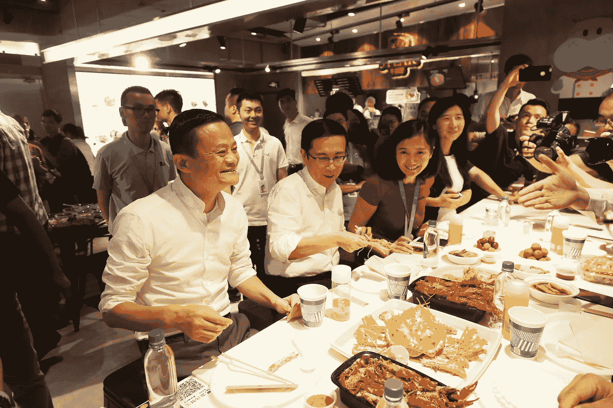

# 关于阿里巴巴季度业绩，你应该知道的 5 件事

> 原文：<https://medium.com/hackernoon/the-five-things-you-should-know-about-alibabas-quarterly-results-eaa650cd75c2>

My quarterly results are bigger than yours Jeff!

# 阿里巴巴昨天公布了季度财务业绩，股价飙升。以下是一些最有趣的数据和故事。

1.  **成长。** [阿里巴巴](https://hackernoon.com/tagged/alibaba)公布收入同比增长 56% (!)，高于预期，顺便说一句，超过亚马逊季度同比增长的两倍。新买家数量的增长和个性化的积极影响被认为是增长的主要驱动力。*(啊！就拿那些说中国经济正在放缓的宏观经济学家来说吧！).*
2.  **阿里巴巴正在推进其“新零售** **战略”**，这呼应了亚马逊的最新举措:2017 年 6 月，阿里巴巴以 16 亿美元完成了对银泰零售的收购。银泰是中国的一家百货商店和购物中心运营商，拥有 49 家百货商店和购物中心。一个更有趣的举动是阿里巴巴对 Hema 商店的孵化:线上&线下新鲜食品商店，人们可以亲自购买新鲜食品，或在网上订购，并在 30 分钟内送到家。这可能是贝佐斯对 Wholefoods 的愿景，但马已经悄悄地建立 Hema 近两年了。(*现在谁在抄袭谁？)*
3.  **Cloud computing** revenue grew 96% year over year. AliCloud crossed the one million paying costumers milestone and improved the segment’s margin — though it isn’t profitable yet.(亞馬遜網絡服務 — that’s AWS in Chinese, per Google Translate).
4.  **现金:**公司在本季度创造了 33 亿美元的自由现金流，现金余额达到 220 亿美元。
5.  **很酷的东西:找回失踪儿童**。帮助寻找中国各地失踪儿童的“团圆”平台于 2017 年 5 月庆祝其成立一周年。Reunion 平台是一个由互联的阿里巴巴和合作伙伴移动应用组成的生态系统，为执法部门提供基础设施，以接收来自公众的众包信息，更有效地搜索失踪儿童。根据阿里巴巴的报告，自 2016 年 5 月成立以来，该平台已成功找到 1274 名失踪儿童，成功率为 97%。 *(多酷啊？？)*

Jack Ma & Daniel Zhang at Hema Supermarket

你可以在这里找到完整的细节:[http://www.alibabagroup.com/en/ir/earnings](http://www.alibabagroup.com/en/ir/earnings)

.:.

请随意评论、提问、分享或鼓掌。