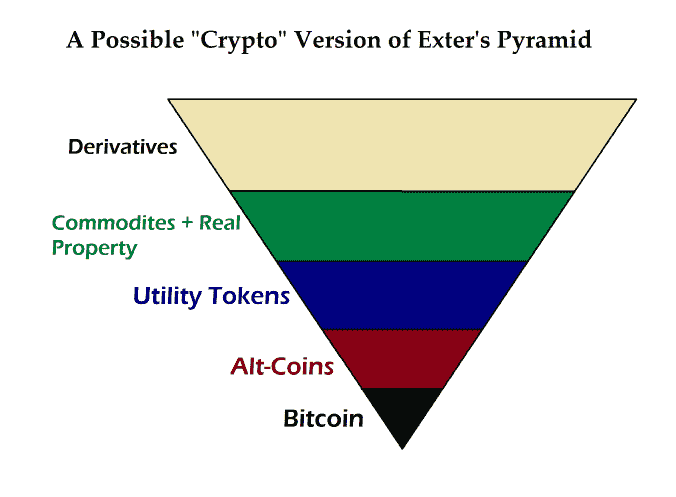
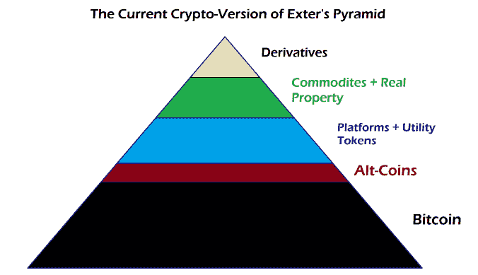

# 下一轮加密货币牛市的基础

> 原文：<https://medium.com/hackernoon/the-foundation-of-the-next-cryptocurrency-bull-market-gold-goats-n-guns-on-wordpress-com-b4a8ab975836>

在我写这篇文章时，比特币回到了 7000 美元以上，此前围绕着未能实现名为“Segwit 2x”的协议升级发生了一轮巨大的波动。Segwit 2x 旨在改善比特币在现实世界应用中的功能。

在接下来的 48 小时里，比特币经历了一次经典的抢购和抛售，价格飙升至近 8000 美元，然后暴跌至 5500 美元。但是，随着事态的发展，我们看到那些预测比特币会因为缺乏“扩展”解决方案而陷入死亡漩涡的人错了。

几周前，在我上一篇关于寻找 Alpha 的文章中，我谈到了比特币最初突破 5000 美元的“单薄”之处。但是，现在不同了。像 Monero {XMR}，DASH 和 Zcash {ZEC}这样的硬币处于或接近历史高点。莱特币已经从接近 50 美元的低点涨到了 63 美元。作为 Segwit 2x 混乱的主要受益者，比特币现金{BCH}翻了两番。

另一方面，*平台资产*一直是个大杂烩。这些是基于智能合约平台发行代币的密码，不一定是开采出来的。

以太坊在 280 美元附近找到了支撑，交易价格在 320 美元左右，仍比历史高点低 20%。然而，EOS 从 0.51 美元附近的底部爆炸，并继续向 2.00 美元反弹。NEO 仍在 25 美元至 30 美元之间建立基础。STEEM 已经跌破 0.90 美元。

# 分割和成熟

这意味着市场正在细分。不再仅仅因为比特币上涨了 10%,资金就无所顾忌地涌向一切。我们开始看到成熟和价格歧视开始进入秘密空间。

在过去的几个月里，这种情况一直在发生，这让一些希望快速致富的人感到震惊。

市场正在寻找界定资金存放的最佳地点。在我看来，首先要确定的是，相对于流通现金，需要将多少资本投入储备资产。

我将这两件事定义为不同的细分市场。

[我在早先的博客](https://tomluongo.me/2017/11/11/with-bitcoins-adolescence-comes-real-competition/)中讨论过这个问题，详细讨论了这个问题，以及为什么推动比特币的交易密度并不那么令人满意。

> 这并不是说我不是 Segwit 的粉丝。我是。但是，我是比特币上的 Segwit 的粉丝吗？我不知道。在加密货币的世界里，我想要一种储备资产，它位于 Exter 的货币金字塔的底部，可以是 1)不腐败的，以及 2)所有其他类似货币的资产，包括像以太坊这样的公用代币，可以用来衡量的标准。

简而言之，我希望看到一种真正的黄金替代品出现。而比特币就有这些特质。与莱特币或比特币现金等竞争对手相比，比特币速度慢、价格高，有时使用起来很烦人。

对于简单地转移资金，至少有六种解决方案比比特币作为交易媒介更好。

就像至少有六种央行发行的货币远比黄金优越一样。

但是，这才是重点。为了让加密空间成熟为一个功能市场，它需要一两种资产成为加密货币系统可以建立的基础资产。

# 金钱的颜色

货币有三个重要的属性。它们是:

1.  交易媒介
2.  记算单位
3.  财富储备

黄金仍然像后两者一样发挥着美妙的功能。你可以用它来比较资产(记账单位)的价值，并把你的账本放在里面。同时，它相对于法定货币保持其价值，给你一个随着时间推移对你的财富(财富储存)的准确评估。

然而，在这个时候进行交易(交换媒介)是一件痛苦的事情。

在使用案例中，比特币正迅速变得像黄金一样。但是，更重要的是，比特币看起来像黄金，因为它有最古老、最安全的区块链做后盾。在这个类比中，比特币的区块链时代类似于有记录的数千年历史，在这段历史中，黄金不仅是财富的储存手段，也是真正的交易媒介。

我在上面链接的文章中发表了这个版本的埃克斯特金字塔。这是讨论这个问题的起点。

Adding Transaction Density to Bitcoin Removes its Uniqueness

要建立一个有效的货币体系，就必须建造一个新版本的约翰埃克斯特金字塔。如果你看看密码空间，这正是正在发生的事情。莱特币最初是为了稍微好一点的比特币而建立的。

但是，它无法竞争。随着比特币屡创新高，莱特币萎靡不振，莱特币的开发者推动通过非链支付层缩短结算时间，在这种情况下，就是闪电网络。现在，莱特币使用起来相对便宜，支付确认也很快。

但它现在也只服务于一个目的，一个交换媒介，因为它确实牺牲了一些东西来获得这种功能。

其他“另类硬币”强调隐私(Monero，Zcash)或整合菲亚特网关等，以增加其独特的销售主张，从而获得市场份额

这就是为什么我说那些推动更高交易密度和更低交易费用的人没有抓住比特币应该是什么的要点。它不需要成为拥有最多用户的最大的加密货币。

它需要成为最好、最安全的区块链，拥有巨大的哈希能力，为其历史最悠久的安全性提供动力。它必须是这样的，这样它才能成为与真实世界的货币(最重要的是，美元或欧元)进行交易的最佳界面。

如果没有这些属性，将会有多少资本从当前政府发行的货币体系的安全性和舒适性中转移出来。

# 失败就是胜利

现在，重新定义比特币未来的努力失败已经尘埃落定，投资者需要注意一些与比特币及其新分裂的市场有关的事情。

首先，从长远来看，比特币占加密资产总市值的比例可能会下降。随着真实世界和加密世界之间建立更多的联系，更多的属性，如交易时间短和费用低，将主导人们的日常行为。

就市值百分比而言，我上面提到的所有“另类硬币”都有光明的未来，而今天它们根本没有增加市场份额。这是好事。这将允许一个更大的密码金字塔。

Despite the Recent Bounce Bitcoin Will Continue To Lose Market Share

其次，随着越来越多的人加入比特币，在分散到各种替代硬币和公用代币之前，货币将通过比特币更自由地流入加密空间。为什么？因为比特币未来的不确定性已经过去。不确定性阻碍投资。

既然比特币已经将自己定义为加密世界的储备资产，资本可以以更加理性的方式进行配置。

第三，由于这些事情，比特币可能会失去市场份额，但会获得市值，因为这种演变将继续吸引资本。随着时间的推移，市场将决定一个真正的自由市场经济体应该持有多少储备，即实际储蓄与风险流动性资本的总和。

我们现在在“现实世界”中没有这种情况，因为我们没有自由的货币市场。央行通过操纵利率(即货币成本)来扭曲风险评估。他们这样做是为了最大限度地减少储蓄，以提高货币流通速度，而不是创造财富。

第四，很多项目会失败。当在这个领域做决定时，使用上面的金字塔来找出你正在看的项目适合的地方。金字塔越高，失败的可能性就越大，因为项目可能与市场的优先级不一致。

What the Crypto-Monetary System Looks Like Today.

所以，最后，我要说的是，现在密码空间是埃克斯特金字塔的对立面。大部分财富储存在储备资产比特币中。即使有，也只有很少一部分被套牢在顶级衍生资产中，如期权、期货等。

今年早些时候，这座金字塔大部分是黑色的。这就是我所说的市场细分和成熟。它刚刚开始看到自己作为一种完全不同类型的货币体系的增长潜力。

我相信这就是比特币核心集团在反对 Segwit 2x 时所反对的。我不知道他们是否从这个角度来看。但是，作为一名奥地利经济学家，我很想观察新经济的数字版本如何在一个环境中演变，在这个环境中，财产权和消费者主权得到维护，而不是成为流动性祭坛上的牺牲品。

比特币未来将实现更大的块大小。但它的速度将比许多人认为的要慢得多。

就目前而言，在我看来，比特币似乎挺过了最初的敌意收购尝试，而意想不到的影响是，它可能已经开启了自己牛市的下一波浪潮。

想了解更多类似的评论、交易想法和投资组合模型 [*请加入我的 Patreon*](https://www.patreon.com/goldgoatsnguns) *在这里你每月只需 12 美元就能得到所有这些。*