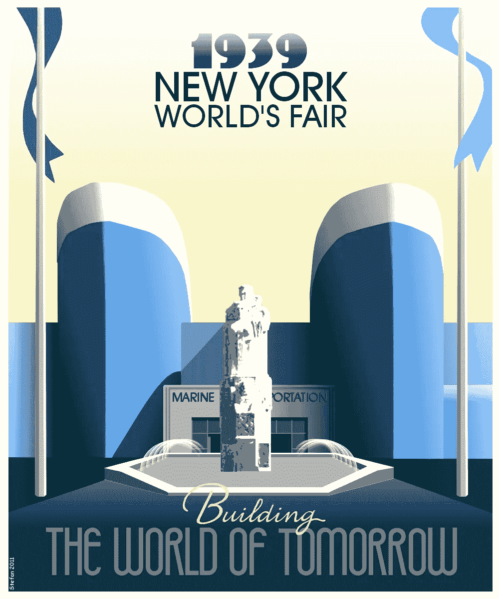
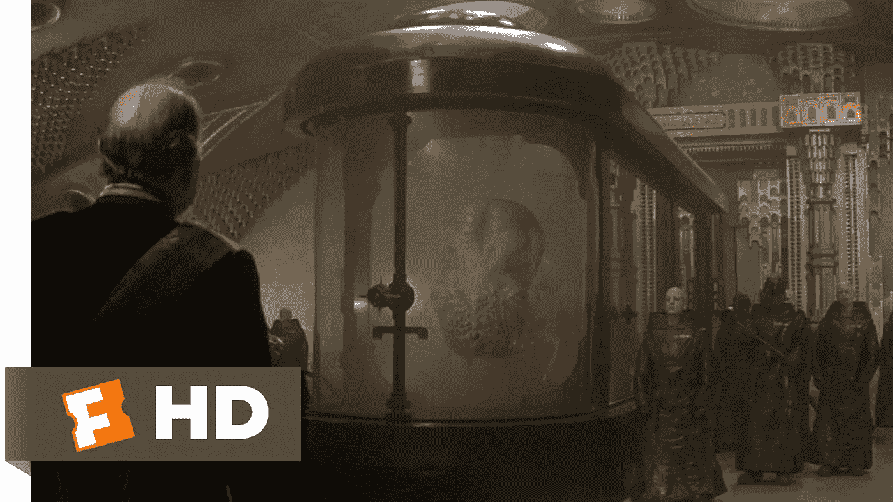
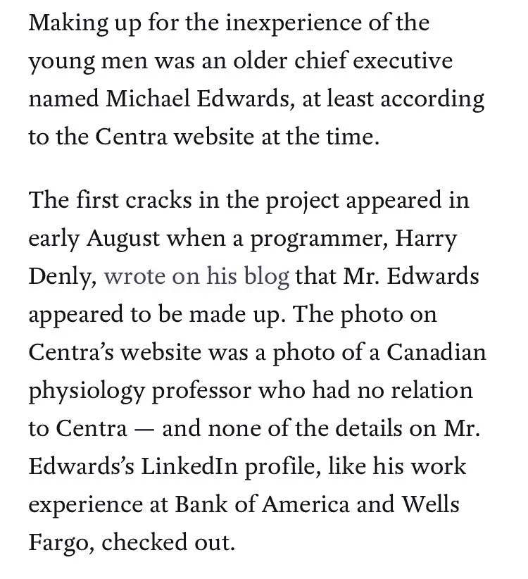
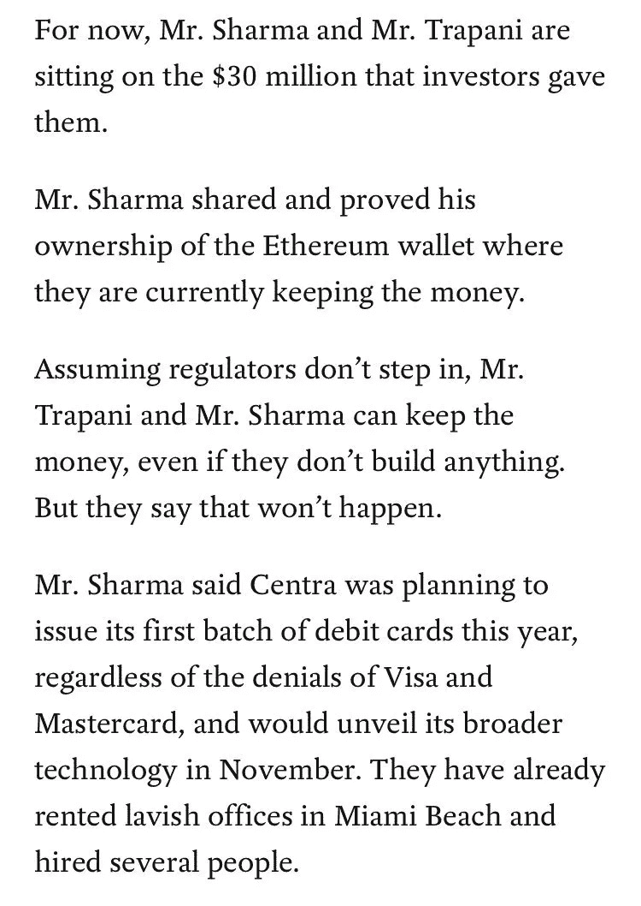

# 科技炒作周期的四个阶段

> 原文：<https://medium.com/hackernoon/the-four-stages-of-the-tech-hype-cycle-a272f37fbfdb>

> 你可以在我们的每周简讯[tokenreporter.co](http://tokenreporter.co)中读到更多类似的内容。

虽然我非常看好代币销售的整体概念，但我们即将看到一次重大调整。简而言之，将会发生的是代币狂热注入主流行业和文化，这种事情在科技领域一再发生，在这种情况下，加密货币也是如此。然而现在，由于更快的采用率，一切都加速到前所未有的程度。

简而言之，抓紧你的座位。我们正在接近 ICO 悬崖，做好准备是值得的。

迄今为止，市场一直存在于一个拥有大量模糊产品的幻想世界。首先，让我们了解所有这些钱从何而来。你所看到的所有这些大规模的象征性加注都是由一小撮隐形鲸 +驱动的[。他们在有前途的位置进进出出，就像沙丘里那些巨大的漂浮的导航器一样。他们是聪明的投资者，拥有大量不可获得的秘密资本，代币销售是他们增加储备的主要方法，期望以更简化的方式取出现金。](https://news.bitcoin.com/the-whos-who-of-the-bitcoinerati-the-new-1/)

一旦我们经历了代币销售的炒作周期，这种“鲸鱼”资本就会变得稀缺。一旦“世界”了解了正在发生的事情，事情将会彻底改变。

所有的科技炒作周期都是一样的。本质上有一个定义它们的四步过程，你可以看到这个过程在几乎每个行业都在重复。Linux。关系数据库。姜戈。Reddit。智能手机革命。这些炒作周期有多个切入点，也有多个赚钱点——只要支持者保持头脑清醒。

1.  **低噪音**——任何科技炒作周期的第一步都是低噪音。这种噪音起初几乎察觉不到——想想你第一次与 Linux 对话，或者当你第一次听说比特币时——只有顽固分子(也是最烦人的)坚持使用这项技术。他们会没完没了地谈论它，而它对外部世界几乎没有影响。我们正处于代币销售炒作周期的这个阶段，但我们正在迅速进入下一个阶段…
2.  **爆炸** —爆炸有好有坏。一些爆炸清除旧的污垢和 FUD，一些爆炸摧毁一个公司。我记得硬件领域的一些例子，包括 Palm Pre 的死亡和 Ink Atom 的概念。没有从爆炸中幸存下来的公司和产品将无法进入下一轮…
3.  在这个阶段，每个人都在开玩笑。人们在出租车上和机场休息室谈论这项技术。你的父母寄来了关于它的新闻剪报。达到这一阶段的技术开始吸收传统、指导方针和为追随者服务的大公司。简而言之，事情即将变得无聊。
4.  **无聊的岁月** —想想 Linux。十年前，Linux 是一个革命性的工具。今天，当你想建立一个网站时，它是你在五分钟内就能完成的东西。这就是代币销售和所有加密技术的发展方向，所有早期的头脑发热者最终都会在银行找到轻松的工作，在那里他们不会造成太大的伤害。事物从那里滑向永恒。

坏消息是。因为代币销售正从第一阶段进入第二阶段，越来越多的审查被放在这个概念上。《泰晤士报》上的这个[故事](https://www.nytimes.com/2017/10/27/technology/how-floyd-mayweather-helped-two-young-guys-from-miami-get-rich.html)就是一个最好的例子。我提供两个摘录来集中你的愤怒:

就像它之前的许多技术一样，事情似乎好得难以置信。由于不尊重“闭上你的嘴，做好工作”这个简单的概念，经营代币销售的人冒着将整个概念付诸东流的风险。

最终，我们处于十字路口。我们知道代币销售将会继续，我们知道有大量的坏种子，我们知道将会有监管。你如何使用这些参数？通过为聪明人制造好的产品，只筹集你需要的，并证明“公用代币”不仅仅是一个谎言。当爆炸来临时，它会消灭那些没有准备的和不道德的。我们的工作是确保它不会抹杀整个代币销售的概念。

— -

> 你可以在我们的每周简讯[tokenreporter.co](http://tokenreporter.co)中读到更多类似的内容。