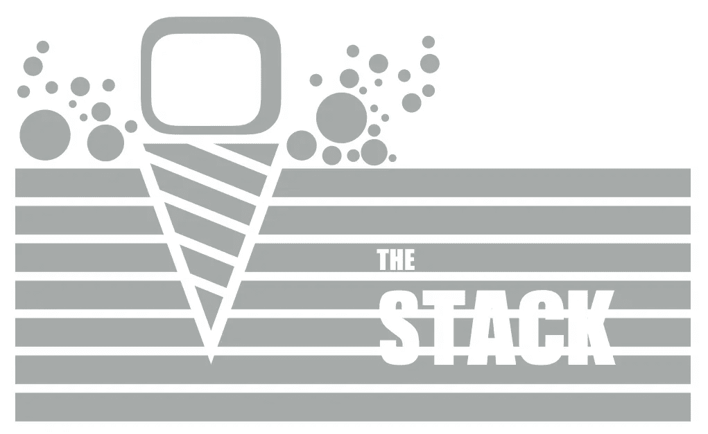
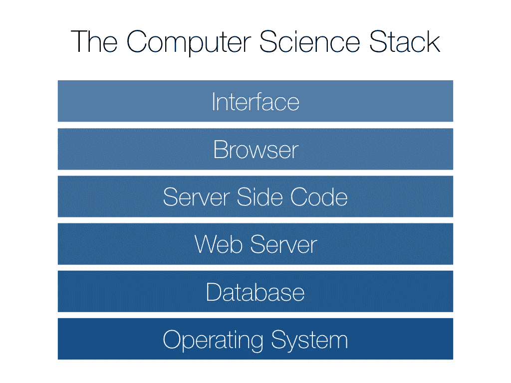
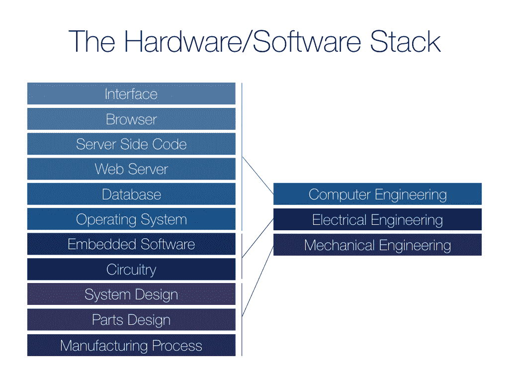
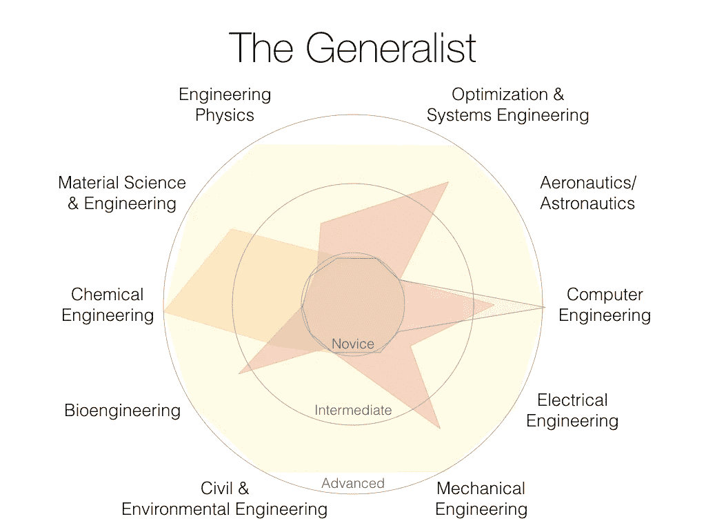

# 全栈谬论:为什么全栈工程师实际上不存在

> 原文：<https://medium.com/hackernoon/the-full-stack-fallacy-why-full-stack-engineers-dont-actually-exist-1b8837383144>

Full stack engineers span from the deep depths of the operating system up to the superficial client-side interface.

科技行业将“全栈工程师”定义为能够编写项目所需的任何类型代码的人。我们称赞这位工程师是半神，因为他们可以同时面对系统编程的[无法无天的僵尸启示录](http://scholar.harvard.edu/files/mickens/files/thenightwatch.pdf)和设计一个完美的用户体验来迷惑大众。全栈程序员的力量在于，对于许多硅谷[初创公司](https://hackernoon.com/tagged/startups)来说，这个人可以跳到任何层次的[技术](https://hackernoon.com/tagged/technology)中，并产生重大影响。也就是说，对于大多数开发应用程序、平台和服务的公司来说，找到一个能够构建公司需要的一切**的人并不困难，因此偏向于这些更灵活的企业。**

> 一旦你向你的技术栈添加任何物理的东西，全栈工程师的概念就开始瓦解。硬件改变游戏。

一旦你的公司处理设备，你就失去了通过软件更新随意改变的能力。从 App Store/Play Store 发布到产品的全面工厂召回。不用说，你需要一些能够处理工业设计、嵌入式软件和制造的工程师。

当然，有些人有能力将一个产品从 [CAD](https://en.wikipedia.org/wiki/Computer-aided_design) 引导到 [UI](https://en.wikipedia.org/wiki/User_interface) 。我们称他们为**机电一体化工程师**，他们是电气、机械和计算机工程交汇处的稀有品种。虽然机电一体化作为一个领域仍然在不断变化，但我们将开始注意到的是，这些跨学科的工程师永远不会成为真正的专家。简单地说，机器人工程师不太可能成为世界上最顶尖的界面专家。

The stack expanded beyond the confines of computer science, representative of a traditional hardware/software company.

当我们进入更多的行业时，我们的堆栈继续增长，成为“全堆栈”的能力变得更加不可行。我们也给这些工程师起了名字，他们中的一些人有能力超越机电一体化大师。在越来越微观的层面上，他们是生物工程师、化学工程师、材料科学家和工程物理学家。在事物的宏观方面，他们是航空航天工程师或系统优化工程师。在这一点上，“全栈”不再意味着专业知识(人体专家不太可能也是行星机构的高手)，而是在需要时随着变化的领域和数量级的舒适性和流动性。

> 真正的全栈工程师是*多面手*，而不是*专家*。

The computer science stack expanded out to include micro and macro sciences. Disclaimer: This diagram may not be an exhaustive list, but attempts to cover many traditional engineering disciplines.

很难找到一个工程师能够投入任何公司的任何项目并开始提供价值，但是毫无疑问，这个人拥有一些关键的品质:

*   **工程思维**——将问题分解成组件并以系统的结构处理它们的能力
*   **跨学科的流利性**——根据需要轻松钻研各种技术领域的能力，通常基于对基础科学(物理、化学、生物等)的深刻理解。)
*   [**成长心态**](https://hbr.org/2016/01/what-having-a-growth-mindset-actually-means)——应对挑战性任务的信心和寻求帮助的谦逊，认识到一切都是改进的机会
*   **强大的人际沟通** —对于一个打算跨多个团队的工程师来说，这是一个经常被忽视的必要条件，允许想法和见解在这些工作组之间流动

也就是说，对于一家拥有跨学科技术的公司来说，完成手头任务的最佳人选是拥有坚实的核心问题解决技能的多面手。这是我们能够真正达到的最接近“全栈”的状态虽然通才工程师很难找到，但好消息是我们可以培训他们。最好的培训形式是灵活的工程课程，为学生提供通过多样化的项目工作进行探索的机会，但即使是那些自己动手修补和实验的坚定的个人也可以成为强大的多面手。

到现在为止，你可能已经考虑到我的整个科学书库的排序可能被取消了。例如，一些化学性质是材料科学的基础，但反过来也是如此。或者你可能已经意识到，没有任何专业，学习工程学是很困难的。当然，对于计算机科学来说，堆栈有更明确的层次。将一个数量级归属于整个场是一种过度概括(化学家可能在上午研究电子轨道，在下午研究海洋化合物浓度)。现实是，科学更像是一张网，而不是一堆，就像这样:

**Interdisciplinary Engineers**. Engineers should map their strengths across interdisciplinary sciences, reflecting their interdependencies. **Yellow**: Ideal (read: impossible) engineering expert in all disciplines. **Orange:** Example of an academic focusing in chemical engineering with applications in material science and, subsequently, in bioengineering. **Red:** My personal interdisciplinary stack mapping, for reference. **Gray:** Traditional understanding of the computer science “full stack” engineer.

虽然其中一些领域已经存在了几千年，但我并不是第一个认识到它们每天都在融合和交织的人。当我们为未来培养工程师时，将越来越有必要向他们介绍可用于解决全球范围内重大跨学科问题的通用原则。我们需要在寻找、雇佣和提升有能力将不同领域联系起来的通才方面投入更多。为了我们所有人的利益，我们不要自欺欺人地认为*他们中的任何一个*是真正的“全栈”

*喜欢这个帖子？推荐分享，让别人也能找到！*

> [黑客中午](http://bit.ly/Hackernoon)是黑客如何开始他们的下午。我们是 [@AMI](http://bit.ly/atAMIatAMI) 家庭的一员。我们现在[接受投稿](http://bit.ly/hackernoonsubmission)并乐意[讨论广告&赞助](mailto:partners@amipublications.com)机会。
> 
> 如果你喜欢这个故事，我们推荐你阅读我们的[最新科技故事](http://bit.ly/hackernoonlatestt)和[趋势科技故事](https://hackernoon.com/trending)。直到下一次，不要把世界的现实想当然！

