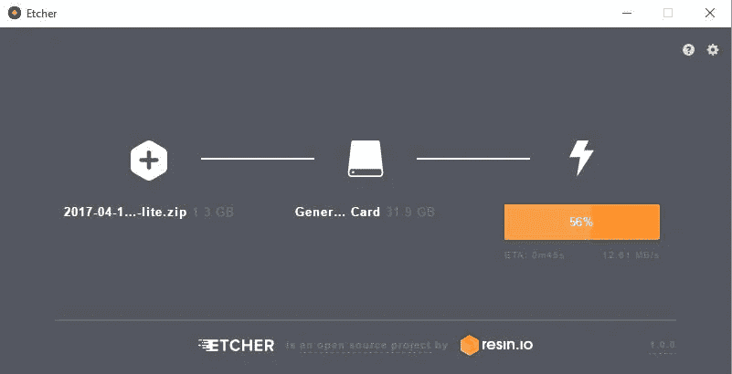
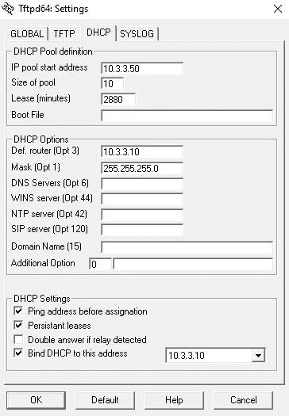
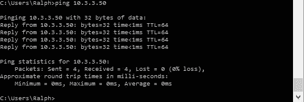
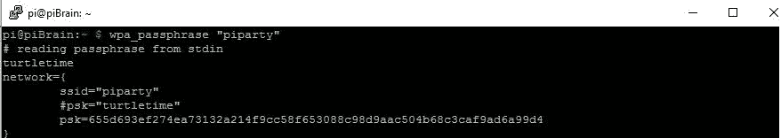
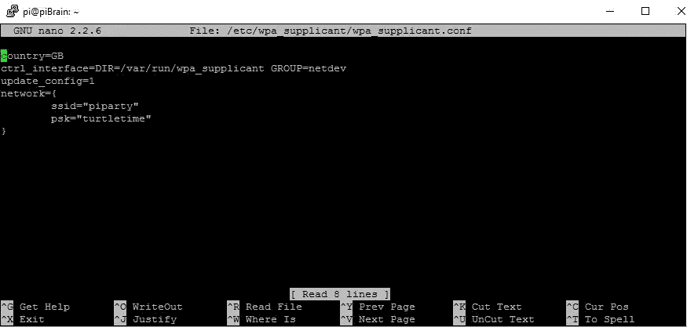

# 最完整的堆叠骑行

> 原文：<https://medium.com/hackernoon/the-fullest-stack-ride-b1e69ca03024>

## 阶段 1 —规划—服务器架构

**如果您错过了我们正在打造的产品的概要介绍，您可以在此处找到*[](/@RalphUtz/we-apologize-for-the-slight-delay-de91c6385d6b)**。**

> *“千里之行，始于足下”——老子*

*我们的第一步是提供计算、存储和网络。我们开始吧。*

***计算—** 我们使用 [Raspberry Pi](https://www.raspberrypi.org/products/) [平台](https://hackernoon.com/tagged/platform)来满足我们的计算需求。我们将运行一个 [Raspberry Pi 3 Model B](https://www.raspberrypi.org/products/raspberry-pi-3-model-b/) 和四个 [Raspberry Pi Zero W](https://www.raspberrypi.org/products/pi-zero-w/) 如果您愿意，可以少用两个任何口味的 Pi，尽管当我们开始集群和负载平衡时，有更多的主机会变得有趣。此外，我使用无线网络，因此如果您有非无线个人信息服务，您需要进行适当的调整。我们将运行 [Raspbian](https://www.raspbian.org/) 作为操作系统，并依靠 Docker Swarm 进行集群。*

**

***存储—** 我准备用[这些](https://www.amazon.com/SanDisk-microSDHC-Standard-Packaging-SDSQUNC-032G-GN6MA/dp/B010Q57T02/ref=pd_bxgy_147_img_3?_encoding=UTF8&pd_rd_i=B010Q57T02&pd_rd_r=RAHPZQ3T51ZQAH1YWZVS&pd_rd_w=KhSPF&pd_rd_wg=zwBs3&psc=1&refRID=RAHPZQ3T51ZQAH1YWZVS)卡进行本地 Pi 存储。只要你用得够快，任何品牌都可以。我们将在我们的无线路由器上挂一个 USB 驱动器，作为穷人的 NAS，这样我们的容器就有了持久的存储空间。*

***网络—** 电线？我们要去的地方，不需要电线。无线的吧，具体是 802.11n。为此我选择了 [Linksys AC1750](https://www.amazon.com/gp/product/B00IJYGIU0/ref=ox_sc_sfl_title_1?ie=UTF8&psc=1&smid=A1M0GZGHL8F7T8) 有两个原因。首先，亚马逊给了他们很高的价格。第二，它支持 [DD-WRT](https://www.dd-wrt.com/site/) ，并有一个 USB(读:NAS)端口。*

## *第 1 阶段——行动——服务器架构*

*先做最重要的事。我们需要支持我们的计算和本地存储。我用的是 Windows 10 笔记本电脑，因为这是我手头的资料，而且我只从 Linux 的角度看过这类教程。*

*你会想要安装[蚀刻机](https://etcher.io/)，然后我们会用它在我们的微型 SD 卡上刷新[拉斯边杰西建兴](https://www.raspberrypi.org/downloads/raspbian/)。整个过程对我来说就是点击，但是如果你遇到问题，在 Pi 网站上有一个[安装指南](https://www.raspberrypi.org/documentation/installation/installing-images/README.md)。*

**

*Etcher 完成后，在 SD 卡的根目录下放置一个没有扩展名的文件“ssh ”,暂时启用 SSH。SSH 在 Raspbian 上是默认禁用的，一旦我们开始安装，我们将希望永久启用 SSH。我们的本地存储现在已经准备好，可以插入到 Pi 中了。*

*现在是计算时间了。拿一根网线，将 Pi 上的以太网端口连接到笔记本电脑上的以太网端口。在启动时，Pi 将寻找 DHCP 服务器的 IP 地址。我使用 Jounin 的 tftpd64 在我的笔记本电脑上运行本地 DHCP 服务器。出于某种原因，chrome 的安全浏览在 tftpd 域上发出了警报。您可以自由地使用任何您想要的方式来为您的 Pi 提供 DHCP。通过指定您希望 DHCP 服务器在哪个网络接口上运行来设置您的 DHCP 服务器，定义您的地址池，并设置您的 DHCP 选项来分发子网掩码和默认路由器。*

**

*My tftpd settings*

*确保您已插入 SD 卡，然后给 Pi 通电，并查看 DHCP 服务器日志。日志将告诉您 Pi 何时提取了一个地址，以及它提取了哪个地址。*

**

*Here we see that the Pi has pulled IP address 10.3.3.50*

*我们需要一个 SSH 客户机来与 Pi 通信。我个人最喜欢的是油灰。拿一份拷贝，放在容易记住的地方。打开命令提示符，从 pinging 开始，以确保我们有良好的通信。*

**

*如果你得到的不是回复，你可以参考[这个](https://technet.microsoft.com/en-us/library/cc940095.aspx)来找出你的错误意味着什么。我首先要检查的几件事是:*

1.  *Pi 有权力吗？*
2.  *以太网电缆是否牢固地插入您的计算机/Pi？*
3.  *Pi 上有链接灯(黄色/绿色)吗？*
4.  *你看到 Pi 从你的 DHCP 服务器获取 IP 地址了吗？*

*根据您使用的笔记本电脑，您可能需要使用以太网[交叉电缆](https://en.wikipedia.org/wiki/Ethernet_crossover_cable)。代替电缆，你可以在你的 Pi 和笔记本电脑之间插入一个便宜的开关。*

*继续前进。 [SSH 到 Pi](https://www.raspberrypi.org/documentation/remote-access/ssh/windows.md) 我们将完成操作系统的设置。*

```
*>c:\putty.exe -ssh pi@10.3.3.50*
```

*我将 putty 可执行文件放在 c 盘的根目录下。Pi 的默认用户名是… `**pi**`。接受安全证书并使用`**raspberry**` 作为密码。你会得到一个友好的贝壳作为奖励。*

```
*pi@raspberrypi:~ $*
```

*使用`[sudo raspi-config](https://www.raspberrypi.org/documentation/configuration/raspi-config.md)` 并执行以下操作:*

*   *进入接口选项-> SSH，永久启用 SSH*
*   *更改用户密码*
*   *更改主机名*
*   *展开现在位于高级选项下的文件系统*

*确保您每个 pi 都有不同的主机名。我在所有的 pi 上都是无头的(没有显示器),所以我也进入高级选项，将内存分配改为 16，因为我没有使用 GPU。计算现已完成。*

*网络是我们基金会三角形的最后一条腿。我们将配置我们的无线网络并摆脱我们的 Cat5e 束缚。*

***旁注*在我负责支持这个庞然大物的任何场景中，我都会使用物理网络。我打算用这个版本无线上网，因为所有的东西都在我的桌子上，我试图把混乱降到最低。**

*我不打算详细说明如何配置所有的无线模型设备，但我只想说，您需要设置一个 SSID，并给它一个至少 8 个字符的密码。我用`WPA2 Personal`是为了安全。我在我的无线路由器上配置了我的 SSID 为`**piparty**` ，密码为`**turtletime**` 。我还将无线路由器用作无线网络的 DHCP 服务器。你也应该这样做。*

*回到 Pi 命令行，我快速扫描以确保我的无线网络一切正常，看到列出的`**piparty**`后，我知道我已经准备好将我的 Pi 配置为客户端。*

****

*我输入`**wpa_passphrase**`命令，给它无线 SSID，然后当它提示我时输入密码。*

**

*我们现在已经生成了 WPA PSK，需要使用 nano 修改位于/etc/WPA _ supplicant/WPA _ supplicant . conf 的配置文件来配置 WPA supplicant 以连接到我们的无线网络。*

*`sudo nano /etc/wpa_supplicant/wpa_supplicant.conf`*

*在文件的底部，您需要添加之前的网络信息。以下是我的一个例子:*

**

*Don’t forget the closing bracket on the network statement!*

*保存文件，按下`**CTRL+X**`，然后按下`**Y**`，然后按下`**Enter**`，退出 nano。用`**sudo wpa_cli reconfigure**`重新加载你的 wpa 恳求者配置。看一下 wlan0 接口，您已经从您的无线路由器获得了一个 IP 地址。*

**

*inet addr:192.168.1.105 = Success*

*从上图中我们可以看到，我的 Pi 从运行在我的无线路由器上的 DHCP 服务器收到了第一个可用的 IP 地址。找到了。如果您不成功，您可以在此找到有关为您配置无线功能的更多详细信息。*

*对集群中的每个 Pi 执行以下步骤。完成后，您应该能够从连接到您的无线网络的任何设备 ping 每个 Pi。*

***以下 Pi 的快捷方式— — — — — — — — —使用以下命令打开工作 Pi 上的* `*wpa_supplicant.conf*` *文件:**

*`sudo nano /etc/wpa_supplicant/wpa_supplicant.conf`*

**复制文件内容，粘贴到笔记本电脑/工作站上的新文件中，命名为* `*wpa_supplicant.conf*` *。在未来的 Pis 上，将新创建的* `*wpa_supplicant.conf*` *的副本放在 SD 卡的根目录下(放在您之前放空的“ssh”文件的相同位置)。在启动时，您的新 Pi 将自动连接到您的无线网络，您可以 SSH 并继续上述过程。这可以省去您将每个 Pi 物理连接到笔记本电脑进行初始无线配置的麻烦。**

*概括一下:*

*   *我们构建了单独的物理服务器*
*   *我们调配了本地存储*
*   *我们将服务器联网，并测试了连接性*

*我们现在有了一个可以发展的基础。在每一期中，我们都会添加新的功能，直到我们为我们的应用程序构建了一个合适的归宿。*

*在我们的下一篇文章中，我们将为我们的应用程序成为云原生应用程序打下基础，这是我们将 Docker 安装并运行的一种奇特方式。*

*请在下面留下建议、评论和问题。*

*[](http://bit.ly/HackernoonFB)**[](https://goo.gl/k7XYbx)**[](https://goo.gl/4ofytp)*

> *[黑客中午](http://bit.ly/Hackernoon)是黑客如何开始他们的下午。我们是 [@AMI](http://bit.ly/atAMIatAMI) 家庭的一员。我们现在[接受投稿](http://bit.ly/hackernoonsubmission)，并乐意[讨论广告&赞助](mailto:partners@amipublications.com)机会。*
> 
> *如果你喜欢这个故事，我们推荐你阅读我们的[最新科技故事](http://bit.ly/hackernoonlatestt)和[趋势科技故事](https://hackernoon.com/trending)。直到下一次，不要把世界的现实想当然！*

**