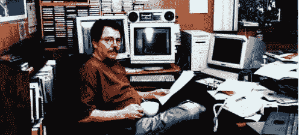

# 1999 年以来的未来

> 原文：<https://medium.com/hackernoon/the-future-in-1999-baf1d1fccb04>

This photo is actually from 1996, but it’ll do. My gear and I still looked like that when [Y2K fears](https://en.wikipedia.org/wiki/Year_2000_problem) pooped what should have been the biggest party in a thousand years.

这是我刚刚发现的一个未发表的作品。它最后一次修改是在 1999 年 9 月 25 日，在克里斯·洛克、大卫·温伯格、里克·莱文和我写完[【The clue train Manifesto](https://www.amazon.com/Cluetrain-Manifesto-End-Business-Usual/dp/0738204315)*(2000 年 1 月出版)之后不到一个月，在@DaveWiner 让我开始写博客之前一个月。我想这是《线索列车》一章的早期草稿，我从来没有抽出时间重新利用过。无论如何，它仍然是我当时对技术的现在和未来的想法的一个很好的时间胶囊，并且在许多(也许是大多数)方面仍然是正确的。*

# 章节

*   [收敛](#convergence)
*   [市场对话](#market)
*   [分工](#dividing)
*   [再见消费者，你好顾客](#goodbye)
*   [资金幻觉](#funding)
*   [营销退货](#marketing)
*   [杀手级服务](#killer)
*   一种选择，而不是上瘾
*   [传记](#biography)
*   [注释](#notes)

# 趋同；聚集

对话和普通讨论的一个关键区别在于，在普通讨论中，人们通常持有相对固定的立场，并在试图说服他人改变时支持自己的观点。充其量，这可能产生协议或妥协，但不会产生任何创造性……这里最重要的是对话精神的存在，简言之，就是暂停持有许多观点的能力，以及对创造共同意义的主要兴趣。”—大卫·博姆&大卫·皮特

电视和网络之间的相似之处只是在屏幕上，但两者的融合是不可避免的。在整个 20 世纪下半叶，电视一直是最普遍、最强大的社会影响力，也是一个巨大的经济影响力:仅在美国，这个产业就价值 450 多亿美元，目的是吸引所有人的注意力。自电话以来，网络是最个性化和最具互动性的媒体，也是第一个能够促进每个供应商和每个客户之间直接商业关系的媒体，再加上从第一来源到最终客户的每个价值链中的每个环节。

这两种技术都有助于预测，所以我们很容易将一种技术的资产预测到另一种技术的负债上。从电视中，我们很容易看到网络上巨大的广告市场，仅仅是从电视的溢出效应。从网络上来看，很容易看到电视频道和节目源作为适合浏览的链接，以及随时可以下载的内容，最好是免费的。

但是固定位置在这里有两个问题。首先，网络正在发展，并且为了更容易的描述，正在改变世界。第二，我们理解熟悉媒体的术语——尤其是电视——限制了我们对网络潜力的理解，尤其是当它与这些媒体融合的时候。

这些问题主张博姆和皮特建议的那种对话:一种开放的观点，寻找一个还不存在的共同意义。

因此，如果你愿意进行真正的对话，这就是你的篇章。你会在这里读到在其他地方找不到的东西，你的观点也会受到挑战。我知道，因为我持有许多——也许是所有——相同的观点。我自己的职业道路从写作到出版到广播到广告到市场营销，一直涉足所有这些职业。

我所寻找和想要分享的，并不是不言自明的真理，而是随着融合的进行将变得显而易见的真理。这一章提出了几个候选人。如果它让我们思考和谈论它们，它就会成功。

# 市场对话

*“交谈是卓越的社交工具。”—奥尔特加 y 加塞特*

商业是社会性的。没有其他人我们做不到。

市场是商业社会。从塔什干的街道到 Amazon.com 的网页，每一个市场都是社会活动的喧嚣。这可能不是现场谈话，但如果市场是活的，人们就在谈话。如果它在增长，人们会说很多。这就是“嗡嗡”的含义。热门市场充满了谈论和商业。现在，Amazon.com 周围的嗡嗡声很大，尽管当他们从公司的网站上购买一本书时，几乎没有人说一句话。嗡嗡声发生在亚马逊内部，也发生在亚马逊彻底改变的图书销售市场内部。亚马逊不仅仅是通过增加一个新的渠道来改变这个市场，而是通过给售书对话增加一个新的有趣的主题——并通过在网络上促进这种对话，这是自电话以来最活跃的对话媒体。今天，亚马逊每年在网上销售价值 4 亿美元的书籍，巴诺书店销售 1 亿美元。这是一项价值 5 亿美元的业务，而四年前它还是一片空白。T4:所有这些都是 1995 年前我们所知的图书销售业务的补充。

因此，售书市场随着售书对话而增长。这一增长是正数，并且与新老销售渠道的增长同步。

几年前，当 Barnes & Noble 推出其超市时，类似的事情也发生在售书对话中。生意几乎在一夜之间彻底改变了。独立书店在某些情况下受到了伤害，但总的来说，市场不仅增长了，而且变得更加活跃和有趣，也不那么墨守成规了。

然而，媒体将图书销售业务视为一个战场。事实就是如此。在 Barnes & Noble、Borders、仓储式商店和无数独立书店之间，竞争非常激烈。脾气爆发成诉讼。现在，代表独立书店的美国书商协会正在起诉巴诺书店涉嫌掠夺性商业行为。这一切都是伟大的复制。

因此，我们这里有两个关于市场的隐喻:1)对话；以及 2)战场。一个是正和，一个是零和。一个是虚拟的，另一个是物理的。一个用 AND 逻辑，一个用 OR 逻辑。网络上哪个更公正？

这不是比赛。对话隐喻描述了一个正新和爆炸的世界。战场隐喻通过否认这些数字侮辱了那个世界。当我们谈论在杂货店争夺货架空间的时候，这个方法很有效；但是当我们谈论网络时，战场隐喻忽略了最重要的发展。

对话隐喻还有另外两个优点。首先，它是一个同义词。用“对话”这个词代替“市场”，这个事实就变得很清楚了。卖书对话和卖书市场是一样的。第二，对话是人类彼此之间最基本的联系。我们可能爱或恨对方，但除非我们在交谈，我们之间不会发生什么。社会是在对话中成长的。这包括我们称之为市场的商业社会。

创立 Farallon Computing(现在的 Netopia)的大脑研究员里斯·琼斯(Reese Jones)说:“交谈是所有社会交往的基础。人们生来就是一对一交谈，而不是多对多。人类的大脑一次只能密切注意只有一个人说的话。即使一个人对一大群人讲话，这种关系也总是一对一的，演讲者对听众。对于说话者和每一个听众来说，这是一次私人谈话的一半。”

这就是琼斯想开发“电话软件”的原因他认为对于我们称之为商业的社交活动来说，电话是一个比电脑好得多的平台。他在 1989 年说了这句话，远远领先于他的时代。因为现在我们有电话软件。这就是所谓的网络。

网络正以爆炸性的速度增长:在短短四年内，国内用户从零增长到五千万。电视花了 13 年才达到同样多的观众。广播花了 40 年才接触到这么多听众。业务增长预测甚至更离谱。美国商务部预计，到 2002 年，互联网上的交易额将从今年的 80 亿美元增长到 3270 亿美元(T2)。1994 年几乎为零。

网络不是一个市场。这是一项新的技术发展，扩大了现有市场的对话，在某些情况下，增加了一个新的销售和分销渠道。所以网络不是一个对话，而是一个邀请*许多*对话的地方，每个对话都有自己的词汇、兴趣、偏见和标准。

让我们看一下标准。在每一个依赖技术的行业中，都有关于标准的无休止的争论。网络也不例外。但是最重要的标准是我们谈论最少的，因为我们甚至不知道它们的存在。网络大师克雷格·伯顿说:“有三种标准:*事实上的*、*法律上的*和*法律上的*。但是第三个是真正重要的，因为它是最难改变的——因此也是最标准的。标准是社会和行业的习惯。它们是如此根深蒂固，以至于几乎没有人能够想象出其他方式。” [5](#5)

使这些标准“如此根深蒂固，以至于我们无法想象其他方式”的原因是它们是这些社会的常识。“常识有一个通常是无意识的概念结构，”乔治·莱考夫说，他是加州大学伯克利分校的语言学和认知科学教授，也是这两个领域的主要思想家。“我们甚至更少意识到思想的组成部分——概念，”他说。我们所有的概念都是隐喻性的。T21:多亏了隐喻，我们可以用别的东西来理解一切。

拿生命来说。我们无时无刻不在谈论生活；但是我们有没有注意到我们是如何谈论它的呢？几乎没有。生活是一个常识问题。然而，我们对生命最常见的概念隐喻是*一段旅程*。这就是为什么我们谈论生活——当然是无意识地——用旅行比喻。出生就是“降临”。死亡就是“出发”。选择是“十字路口”。目的是“目的地”如果我们不“知道我们要去哪里”，我们就会“偏离方向”或“迷失方向”我们的辅导员给我们“指导”我们说“他还有很长的路要走”，或者“她已经走了很长一段路。”我们可以用旅行隐喻的例子填满整本书，仅仅是为了生活这个主题。

因此，生活的标准概念隐喻是一次旅行。想都没想，我们都同意了。

我们并不都同意网络。现在，我们根据至少五种不同的具体隐喻来理解网络。这些都构成了不同的市场对话。让我们来看看每一个对话及其潜在的概念隐喻。没有一个是“常识”，但他们都想成为“常识”。随着融合的进展，将会出现一两种对网络的普通理解(因此也是标准的理解)。它所支持的对话也应该定义和限制在那里出现的市场。

**1)出版对话**

出版是最初的网络隐喻，是创建网络的思想家和开发者使用最多的隐喻。在这里，我们“编写”或“创作”“超文本”“文档”“内容”“页面”和“文件”，供“访问者”进行“浏览”，偶尔还会用“书签”标记位置当然，出版业很快就接受了这个词汇，并在网上广泛发布自己的作品。报纸和杂志全部在网上出版，包括“版面”、“故事”、“特写”、“给编辑的信”等等。在这个对话中还有一个艺术话题。在这里，我们用“图形元素”和“高生产价值”来“创造性地”设计页面尽管如此，我们还是在发布页面。因此，通过这个概念隐喻，*网络是一个出版物*。

**2)房地产对话**。

网络的创造者也大量借用了房地产词汇。因此，网络上的一切都是一个“站点”，一个“家”，或者一个带有“地址”的“位置”，这是我们“建造”的，也许是在“开发者”的帮助下。通过这个概念隐喻，*网络就是房地产(或房地产开发)。*

具有讽刺意味的是，房地产行业在采用网络方面进展缓慢。与出版、零售、广告和娱乐不同，尽管网络采用了房地产隐喻，但它对整个网络对话贡献甚微。

**3)零售对话**。

与房地产不同，许多现有的零售企业已经接受了网络，并为其词汇做出了贡献。例如，Amazon.com 把自己描述成一个“商店”，在这里你可以“浏览”被组织成类似“过道”的“主题”你也可以在“继续结账”之前，在装载你的“购物车”时参观“礼品中心”Onsale 虽然是一个“拍卖超级网站”，但自称是“更聪明的购物方式”，贴出特价商品，并有一个“集市”版块。通过这个概念隐喻，*网络是一个市场*。 [9](#9)

**4)广告对话**

网络是一种有可能接触到数十亿人的通信媒介。这立即引起了广告对话的关注，广告对话很大程度上使用了货运隐喻。我们通过“门户”和“渠道”，或在针对“眼球”的“载体”上，通过“信号”来“发布”、“发送”或“推送”我们“瞄准”的“产品”或“信息”的“库存”我们希望通过“品牌”、“曝光”和其他广告方式来“抓住”一定比例的眼球，几乎所有这些方式都是单向地将商品从广告商转移到消费者手中。根据这个概念隐喻，网络是一种递送服务。 [10](#10)

**5)****娱乐谈话**。

娱乐业对网络感兴趣的原因与它的广播和出版伙伴——广告业——一样:接触和服务数十亿人的前景。但是作为一种娱乐媒体，网络已经成为“一个昂贵而令人烦恼的失败”，华尔街日报说。埃德·贝内特在同一篇文章中说:“把互联网当作一种娱乐媒体是错误的。贝内特曾担任 VH-1 的总裁五年，并于 1995 年受雇于 Prodigy，为该在线服务带来电视知识。失败了。

除了色情作品和多人游戏(它们只是将屏幕后面发生的事情扩展到包括网络上其他地方的玩家和程序)，网络上与娱乐相关的网站是其他媒体的附属品。雅虎娱乐标题下的大部分列表会导致娱乐公司或对娱乐感兴趣的个人的出版或零售对话。甚至电视网络现在也主要使用网络作为发布媒介，在那里他们可以推广他们的节目，或者通过提供例如实时交通和天气预报来增加这些节目的价值。虽然许多广播电台现在都在网上广播，但他们对网络的使用并没有促成新的网络市场对话。只不过是现有电台对话中的另一个话题。因此，我们找不到概念隐喻，如*网络是一个剧院*或*网络是一台电视机*。反正还没有。

到目前为止，唯一能在网络上工作的娱乐对话是关于网站设计的时尚和化妆品方面的。在这里，我们可以看到关于“激动人心”、“酷”、“杀手”、“有吸引力”和“刺激”的设计的讨论，这些设计通过“发展一个故事”、“构建一个故事”或“创造一种感觉”来“提升一个网站的形象”。根据这个概念隐喻，*网络是一种兴奋剂。*

现在让我们看看这些概念隐喻如何映射到网络上，以及网络*如何作为市场*促进这些对话*。*

**出版**比喻很好地描述了网络；但这并不意味着出版是在网上赚钱的好方法。正如约翰·佩里·巴洛所说，“保护身体表达有其方便的力量。尽管有古腾堡的存在，版权还是发挥了很大作用，因为出书很难。因此，虽然纸张上墨水的物理性质使出版变得很难做并且很容易保护，但是网络的虚拟性质使出版变得很容易做并且很难保护。结果是 10 亿份免费出版物，有些带广告，很少(如果有的话)能赚到出版商喜欢看到的那种钱。

然而，出版是网络的原始隐喻，也是我们使用最多的隐喻。所以是有市场的。但这个市场就像电话市场:必要的便利和受欢迎的成本。不是赚钱的方式。

一句话:出版是通过网络赚钱的好方法，而不是通过 it 赚钱。

零售的比喻是另一回事。正如 Amazon.com、CDNow 和许多其他人所证明的，网络是一种有效的新销售渠道，而且是双向的，允许供应商和客户进行各种新的(而且比过去更直接的)对话。“电子商务已经非常庞大，在未来几年内肯定会在所有商务中占很大比例。

**房地产**的比喻非常流行，同样具有误导性。这是因为房地产行业最重要的陈词滥调——“只有三件事重要:位置、位置和位置”——在网络上只有短暂的相关性。短 URL 可能比长 URL 更好，而且”。com”域名可能具有“品牌”品质；但是任何位置都离任何其他位置只有一次点击的距离。总有一天(我们稍后会看到)，我们不再需要搜索引擎来找到我们想要的东西。这将降低雅虎和其他“门户”的品牌价值。你可以把你自己该死的门户放在你的桌面上。

**广告**的比喻很管用，但仅限于广告在网络环境中仍可接受的程度。就像房地产的比喻一样，广告将被削弱——在这种情况下，被网络提供的供应商和客户、生产者和消费者之间直接对话的机会所削弱。我们将在下一节对此进行更深入的探讨。

娱乐的比喻是最弱的。大多数娱乐对话都是关于两件事:

1.  网站设计，这只是美化和室内装饰的房地产隐喻
2.  当互联网的容量增长到可以容纳整个娱乐行业，包括电视和广播、电影和录音的一切时，会发生什么(这不会很快发生，因为这些行业不会允许这种情况发生)。

因此，尽管网络是娱乐公司扩大现有市场对话的一个很好的方式，但娱乐似乎并不是一个在网络上赚钱的好方法。

所以在这个早期阶段，有几件事是清楚的:

1.  出版、零售和房地产被证明是支持工作市场对话的概念隐喻
2.  广告在某种程度上是成功的，因为它在网络上就像在其他媒体上一样有效。
3.  娱乐等待着证据，直到带宽在这里才会到来。

因此，当我们接近网络和电视的融合时，让我们从迄今为止的网络历史中寻找可以学习的方法。

出版是第一位的。发展超文本理论的思想家和发明家，包括万纳尔·布什、泰德·尼尔森、马歇尔·麦克卢汉、道格·恩格尔巴特都使用了出版概念和术语。这个比喻后来被将超文本理论付诸实践的人扩大了，包括蒂姆·伯纳斯·李、马克·安德森以及最初的科学家、黑客和学者组成的互联网社区。今天，网络仍然是发布、存档、研究和连接各种信息的非常有用的方式。没有哪种媒体能更好地服务于好奇或创新的头脑。

虽然商业可能不是网络原动力的第一要务，但他们的媒介很快被证明是有史以来最商业化的媒介。它邀请黄页中的每一个企业或者在网上销售，或者通过使用网络发布有用的信息来支持他们现有的业务，并邀请客户和其他相关方进行对话。事实上，通过充当最终的黄页目录和商店和企业不动产的无止境传播，网络展示了出版和零售隐喻之间的极端协同作用，以及它们的基本概念系统。

因此，简单地说，网络有效地服务于两个基本的经济需求:

1.  需要*知道*；和
2.  需要*购买*。

虽然网络也是向眼球传递信息的好方法，但我们应该停下来观察一下，信息市场是一个完全发生在电视运输系统的*供应*方的对话。在广告市场，媒体向做广告的公司出售空间或时间。对消费者来说不是。消费者可以免费获得信息，不管他们是否想要。

当消费者不仅可以向媒体，也可以向为媒体付费的公司顶嘴时，会发生什么？过去我们从来没有面对过这个问题。现在我们知道了。网络将以广告和其他商业之间的新分工来回答这个问题。这种划分将进一步暴露广告和娱乐隐喻的局限性。

# 分工

广告是当你不能去见某人时你做的事情。仅此而已。”—费尔法克斯圆锥

Fairfax“Fax”Cone 创立了世界顶级广告公司之一 Foote，Cone & Belding，并经营了四十年。作为一个来自芝加哥的严肃的人，Cone 确切地知道广告是什么，不是什么。有了这个简单的定义——当你不能去见某人时你做什么——他在广告和销售之间画了一条清晰的线。在他退休 30 年后的今天，我们可以在电视和网络之间划一条相同的线，并据此进行分工。

一方面，我们有电视，有史以来最好的广告媒体。另一方面，我们有网络，有史以来最好的销售媒介。

网络就像电话一样，是比促销更好的销售工具。这就是当你*可以*去见某人时你所做的事情:一种通知客户并让他们通知你的方式。好处的范围是无法估量的。你们可以互相学习，分组讨论，进行可视的电话交谈，或者直接销售，根本不需要销售人员。

换句话说，你可以做生意。各种生意。就像电话一样，很难想象有什么生意是你在网络上做不了或者帮不上忙的。

所以我们有一个选择。看到或被看到:通过网络看到，或在电视上被看到。和人聊*或者和*人聊*。与他们交谈，或给他们发信息。*

一旦我们分工，网络广告将不会比今天的电话广告更有意义。它将同样不受欢迎，同样侵扰，同样粗鲁，同样无用。

网络将从供应商和客户两方面引发一种新的营销方式:寻求扩大我们称之为商业的对话，而不是用潜在客户不想要的信息攻击他们。这将暴露网络广告——以及大多数其他广告——是垃圾广告，并促使服务于供应而不侮辱需求的东西的发展，并建立两者同样需要的市场对话。

这一新的营销对话将拥抱罗布·麦克丹尼尔所说的“神圣的可怕真相”——一个只有否认才能超越其真实性的真相。当这一事实变得清晰时，我们将认识到大多数广告是一种丑陋的艺术形式，只有愚蠢的资金才能证明其合理性，并谴责在缺乏需求的情况下不受欢迎的供应的罪恶。

事实是:没有对信息的需求。从来就没有。 [22](#22)

事实上，大多数广告都有负面需求，尤其是在电视上。它实际上是*减去*的值。为了了解电视广告有多负面，想象一下，如果遥控器上的静音按钮将“我们不想听到”的信息反馈给广告商，会发生什么。当这个反馈最终被接受时，每年 1800 多亿美元的广告市场将会像一个糟糕的蛋奶酥一样倒下。

它会没落是因为网络会带来两个广告前所未见，一直害怕的发展 [23](#23) : 1)直接反馈；以及 2)问责制。这些将揭露另一个神圣的可怕事实:*大多数广告不起作用*。

在缺乏替代方案的情况下，广告人总是承认这一点。商界有句老话是这样说的，“我知道我一半的广告都浪费了。只是不知道是哪一半。”(让我们面对现实吧，“一半”已经非常慷慨了。)

有了网络，你*能*知道。把网络加到电视上，你也可以在电视上测量浪费。

明智地使用网络，你根本不必满足于任何浪费。

# 再见消费者，你好顾客

*“消费是生产的唯一目的和目的；生产者的利益只有在促进消费者的利益所必需的情况下才应该受到注意。”—亚当·斯密*

很容易混淆消费者和顾客，生产者和供应商。亚当·斯密在他写《国富论》的时候并没有做这些区分。在 1776 年没有必要。现在有了。电视娱乐产品的消费者不是它的消费者。其广告产品的顾客也不是。当电视的商业模式应用到网络上时，顾客和消费者之间的这些分歧造成了沟通差距和市场误解，成为代价高昂的错误。

为了搞清楚电视和网络之间的区别，让我们来探讨电视业务和网络中不同市场对话中这五个角色之间的市场关系:

*   生产者
*   顾客
*   供应商
*   客户
*   经销商

电视是两个行业:1)娱乐服务；以及 2)广告递送服务。它们涉及两种非常不同的对话。第一个是巨大的，包括每个人。第二种是狭义的，只包括广告商、广播公司和代理商。

电视的娱乐生产者是节目来源，如制作公司、网络娱乐部门和电视台的节目制作方。这些也是他们制作的程序的供应商。他们的客户和经销商是网络和电视台，他们将产品免费提供给他们的消费者，观众。

在电视广告业务中，广告是由广告商自己制作的，或者是由他们的代理商制作的。但在这种市场对话中，广告商扮演的是顾客的角色。他们从电视网和电视台那里购买时间，这些电视网和电视台既是供应商又是经销商。同样，观众免费消费产品。

在过去，这些对话之间的区别并不重要，因为消费者不是电视的金钱换商品市场对话的一部分。相反，消费者参与了围绕电视赠送的产品:节目的对话。

?

然而，在电视经济中，节目只是诱饵。这当然是非常诱人的诱饵；但它在资产负债表的成本端，而不是收入端。电视 450 多亿美元的收入来自广告，而不是节目。节目来源的大部分收入来自 T2 的顾客:电视网、辛迪加和电视台。不是来自观众。

然而，广播公司习惯于认为他们的观众与他们的业务密切相关，并经常将人口统计数据(如 25-54 岁的男性)称为“市场”。但这里没有市场对话，因为这种关系(尽管如此)仅限于供应方要求的条款，即收视率数据和非个人信息，如人口统计突破和生活方式特征。这可能是有用的信息，但它缺乏以现金形式表达的真实市场需求的真实性。事实上，很少有观众与他们观看的电视台和网络进行对话。这是一个单向的，一对多的分配系统。电视消费者只在总体上重要，而不是作为个体。他们很多，不是一个。正如 Reese Jones 之前告诉我们的，不存在多对一的对话。充其量只有对一个的感知。差别很大。

所以，没有现金的声音，观众只能消费。他们的角色是上钩。当然，如果广告起作用，他们也会上钩。但是广告业务仍然是一个不包括消费者的对话..

所以我们得到了没有需求的供给，这是对广告的一个不错的描述。

现在让我们看看网络。

在这里，顾客和消费者是一样的。他或她可以直接从广告商那里购买广告商的商品，并享受双向一对一的市场对话，而不涉及作为媒体的电视或作为诱饵的单向消息的干预。他或她也可以直接从节目源购买娱乐节目，在这种关系中，娱乐节目既出售又制作。电视台和网络的发行作用是不必要的，或者至少是外围的。换句话说，网络使电视和其他媒体脱媒。

因此，电视面临的真正威胁不仅仅是网络让广告变得可信。而是它让商业更有效率。事实上，网络既是商业媒介，也是商业的必要附件，就像电话一样。没有媒介，因为电话在把卖主和顾客聚集在一起方面做得更好，在培养口碑方面做得更好，甚至广告商也承认这是最好的广告。网络是一个前所未有的线索交换系统。当公司得到足够多的线索，知道他们的广告实际效果有多差时，他们会像一个糟糕的传输一样放弃它，或者改变它，以至于我们不能再把它称为广告。

这将是广告业的大屠杀。取消广告预算很容易。广告不受政府机构的保护，也不受税收优惠的鼓励。这只是一项支出，一个项目，管理费用。你可以打一个电话就浪费掉，除了少数营销传播人员和他们昂贵的广告公司，几乎没有人会被解雇。

其他种类的广告呢？嗯，平面广告是可以容忍的，而且通常是受欢迎的，因为读者对它们有一些选择。他们实际上是在和社论争夺读者的注意力。自己也承认，垃圾邮件 98%是垃圾。网络上的横幅广告也在这个范围内。大多数冲浪者认为它们是低影响的垃圾邮件:很少有用，也不受欢迎。雅虎和其他一些网络服务已经只对点击率收费(这实际上为雅虎适度的盈利做出了贡献)。但是增加一点责任感(点击进入后发生的事情)，广告商可能甚至不会为此付费。

当然，电视节目还是会有需求的。只要期待消费者更多地参与市场对话，换句话说，支付一些费用，成为顾客。

广播公司有大量的节目和电影。顾客可以直接购买，或者根据广告内容的百分比协商降低费用。然而，由于他们可能有跳过广告的能力，不必要的信息不太可能成为交易的一部分。电视(或网络电视)将变成视频商店，就像电脑变成书店一样。任何由磁带、磁盘或胶片提供的东西都将遵循简单的供求法则。

对于传统的电视广告来说，电视直播会更安全一些。实时时间总是稀缺的，电视直播最适合的内容也是如此:新闻、天气和体育。然而，谁将为此付费的问题仍然没有答案，因为今天的广告客户仍然可以找到更有效的方式在以网络为媒介的商业世界中花费他们的营销资金。

# 资助幻想

*“言语是营养。图像是毒品。”—罗布·麦克丹尼尔*

最近，我问一位最受欢迎网站的主管，他的企业是否赚钱了。“不，”他说。“不过没关系。我们刚刚获得了 2700 万美元的最新一轮融资。”

斯图尔特·布兰德说，资金决定形式。今天，这一点在网络上得到了最充分的证明。

娱乐和媒体帝国看待网络的方式就像巴格西·西格尔看待沙漠一样:它是一个建立吸引人的地方，人们会在那里花钱，或者他们的眼球会在那里停留足够长的时间，让广告抓住他们。这就是网络成为虚拟赌城的原因。

一些风险投资家和娱乐产业有着同样的野心，他们会慷慨地资助任何计划在网络上复制电视产品、市场模式或两者的项目——尽管网络作为一流的广告媒介有明显的缺陷..

为什么？他们吸毒了吗？

嗯……是的。我们都是。因为我们所有人都在进行娱乐谈话，电视上有无穷无尽的话题..

我们在奥兹。不是真的也没关系。我们都一起在黄砖路上。嘿，那些砖块是金子。否则为什么风投和娱乐巨头会为他们支付这么多钱？这个奥兹是另一个梦想的领域。他们正在建造它，我们中的大多数人都会跟着来。如果我们不付钱呢？地狱，*他们* *都在。*

娱乐是一种同样追随时尚的形式。今年，最时尚的网站被装扮成“门户”，是一个永不关闭的空间的镀金广告。它们像跳舞的稻草人一样荒谬，又像通往天空的门一样必要。但是，尽管超现实，这个概念还是很畅销。Excite 是一家普通的门户网站公司，1997 年销售额为 5300 万美元，亏损是它的三分之一，如今市值超过 20 亿美元。雅虎，一家销售额相似、资产负债表略有盈余的公司，估值超过 90 亿美元。

对于一个完全的幻觉来说还不错。

去年的奥兹时尚是“推”有一段时间,“推送”如此火爆，以至于计算机行业乌托邦式的时尚月刊《连线》( Wired)宣布浏览的死亡，取而代之的是类似电视的“沉浸式”媒体，它提供“无数的非纸质信息和娱乐项目”在 1997 年 3 月的个人电脑论坛上，我要求与会者——大约 500 名业界人士，包括许多最时尚的推送设计者——如果他们真的想要通过网络向他们推送内容，请举手。没有人知道。许多人笑了。没什么区别。这是一种时尚，所以它顺其自然，就像时尚一样。

为什么这些时尚如此引人注目？因为这次谈话是关于娱乐，而不是真相。

正如霍华德·比厄在电影《电视网》中所说，“电视不是真相。电视是一个该死的游乐园。电视是一个马戏团，一个嘉年华会，一个由杂技演员、说书人、舞蹈家、歌手、杂耍演员、杂耍怪胎、驯狮员和足球运动员组成的巡回剧团。我们从事的是打发无聊的行业。” [28](#28)

也是一个非常成功的例子。考虑一下统计数据: [29](#29)

1.  大多数美国人把他们的时间分成三种活动:工作、睡觉和看电视。普通美国人每天看 4 个多小时的电视。也就是每周 28 小时，每年 2 个月，每条生命 10 年。
2.  1997 年，美国广告商在电视广告上的花费超过 450 亿美元，占所有广告支出的四分之一以上。
3.  一年多来，孩子们花了 1600 个小时看电视。这几乎是他们在学校花费的 900 个小时的两倍。
4.  99%的美国家庭至少有一台电视。平均来说，这些电视一天要开将近 7 个小时。
5.  三分之二的人边吃晚饭边看电视。我们中有四分之一的人也经常在看电视的时候睡着。
6.  孩子们每周花 1680 分钟看电视。他们每周还花 38.5 分钟与家人进行有意义的交谈。这是 436 比 1 的比例。
7.  平均每个孩子每年要看 20，000 个 32 秒的电视广告。到他或她 65 岁时，这个数字将达到 200 万。

很少有人会认为电视是一件好事。对电视的糟糕感到绝望是一个巨大的非商业行为。电视自由美国统计了四千项关于电视对儿童影响的研究。TVFA 还表示，49%的美国人认为他们看太多电视，73%的美国父母认为他们应该限制孩子看电视。

而且，正如烟草业会告诉你的那样，吸烟是一种“成人习俗”和“一个简单的个人选择问题”。

那我们就承认吧:电视是毒品。那么，为什么我们明明知道它对我们的大脑有害，却还要服用呢？

六个原因:1)因为免费；2)因为它无处不在；3)因为它有麻醉性；4)因为我们乐在其中；5)因为这是一件我们都可以谈论而不会涉及太多个人隐私的事情；6)因为它伴随了我们半个世纪。

电视不仅仅是我们文化的一部分；这是我们的文化。正如霍华德·比厄对他的听众所说，“你穿得像地铁，吃得像地铁，抚养孩子也像地铁。”我们也像地铁一样做生意。这是标准的。

霍华德·比厄说得对:电视是一根管子。让我们从*我们*的角度再看一遍。

我们看到的是一个单向的货代系统，从生产商到消费者。网络和电视台通过“频道”在“信号”上“播放”、“发送”和“传递”节目，“观众”的“观众”通过这个“管道”接收或“得到”我们通过“观看”来“消费”这些产品，通常在这个过程中想要“放松”。

注意，这种活动最好是牛的，最坏是植物的，无论如何都是麻醉性的。委婉地说，*在这个隐喻中没有互动*的空间。让我们面对现实吧，当大多数人看电视时，他们唯一想与之互动的是冰箱。[第三十期](#30)

打个比喻来说，电视包含大量吸引人和刺激的内容并不重要，就像生活在许多方面不是一次旅行一样重要。电视是一根管子。它从他们那里传到我们这里。我们只是坐在这里，像鱼缸里的鱼一样，盯着玻璃吃。

当然*我们*不是真的那样。当我们看电视时，我们是有意识的。

嗯，我们当然是。很多人也是。但这不是这个概念的工作方式，也不是这个系统所重视的。电视的传递系统隐喻把观看减少到一种效果——低谷尽头的噪音。他们把编程简化为集装箱货物。例如，“内容”是一个管状名词，直接来自电视对话。什么样的零售商会用这种降低价值的标签贬低他们的商品？梅西百货卖“内容”吗有了电视，标签是准确的。这种产品是没有价值的，因为消费者根本不用为此付钱。 [32](#32)

当然，娱乐话题也有积极的一面。作家、制片人、导演和明星都拿出“表演”来娱乐“观众”这里隐含的隐喻是戏剧。通过这个概念隐喻，*电视是一个舞台*。但这种对话的可协商市场价值完全是由它的客户提供的:电视台和网络。然而，观众不为产品付费。它的顾客把它作为广告诱饵。这隔离了演艺圈的对话及其价值。你可能会说，电视实际上是通过赠送的方式从自己的产品中减去了价值。

当我们看广告信息的概念隐喻时，另一个概念问题出现了。就是这样:*消息就是武器*。广告用语充满了军事隐喻，而且不仅仅是在电视行业。无处不在的广告被“部署”在“飞行”中，这些“飞行”被“定位”或“瞄准”，以对“目标”产生“影响”。厚厚的广告时间表被戏称为“地毯式轰炸”和“路障”。我们会这样谈论*客户*吗？当然不是。顾客参与其中。他们为我们的商品付钱。我们和他们有关系。我们在一起谈话。

从长远来看(可能不会很长)，网络对话将会胜出，原因很简单，它支持和培养直接对话，因此以更快的速度发展业务。它还有概念隐喻，可以更好地支持商业。

毒品有它的用处。但押注于培育的市场比押注于被麻醉的市场要好。

树不会长到天上去。电视 450 亿美元的业务可能是广告森林中最大的红杉，但再过几年，我们就会开始数它的年轮了。“对话开始的地方，宣传就结束了，”雅克·埃吕尔说。 [33](#33)

网络是关于对话的。事实上，它支持娱乐，而且做得很好，但这并不能改变事实。网络第一次给娱乐业(以及每一个行业)带来了前所未有的对话。现在每个人都可以进入娱乐话题。或者包括你能说出的任何其他市场的对话。拥抱这个世界上最安全的赌注。至少可以说，押注于旧的幻觉机器是有风险的，不管它目前可能有多受欢迎。

事实是，我们从未离开过堪萨斯。这并不是一件坏事。因为有了网络，堪萨斯州将会是一个更好的做生意的地方。

# 营销回报

没有一个有效的企业战略不是以市场营销为导向的，最终也不会遵循这条不可动摇的规定:企业的目的是创造并留住客户。要做到这一点，你必须做那些能让人们愿意和你做生意的事情。关于这个问题的所有其他真理仅仅是衍生物。”—西奥多·莱维特

自从西奥多·莱维特赋予“营销”一词以实质意义以来，已经过去了超过 35 年在他 1960 年的宣言《营销短视》中，莱维特将营销的工作定义为“无论如何都要让顾客满意”不幸的是，营销作为一个流行语比作为一门学科更成功；但这让莱维特忙个不停，用思想服务于太多其他人只用语言服务的东西。

在营销模式 [35](#35) 中，莱维特指责公司“其政策完全是为了自己的便利，完全是以消费者为代价”最后，在《T4》中，营销想象力 Levitt 用上面的引文总结了他的想法。 [36](#36)

当这些话发表时，市场营销仍然被理解为我们可以称之为“广播”的术语。即使对于像麦当劳和西尔斯这样与大量顾客面对面的公司来说，营销也是一种自上而下的单向努力，目标是大量的人，他们很少会得到直接的反馈(以现金以外的形式)。或者被通缉。

网络改变了这一切。

网络不像 800 号码、回邮卡或任何其他“直接响应”媒介那样工作。它不能由客户服务或订单执行办公室控制和管理，因为它太开放和太互动了。公司外部的任何人都可以联系公司内部的任何人，他们的电子邮件地址可以被找到。有这么多员工参加新闻组和其他互联网活动，找到并联系这些人并不难。

对于有堡垒心态的公司来说，网络是一个可怕的发展。它让乌合之众进入大门，把他们释放在象牙塔里。事实上，有堡垒意识的公司经常是网络盲，他们几乎看不到确实发生的乌合之众的渗透。这些公司的网站管理员发现自己处于一个有趣的位置，比楼上的人知道更多的事情。

但对于具有前沿思维的公司来说，网络是一个开放的星系，有着《星际迷航》级别的机会(有新的地方可以“大胆地去”探索新的世界和分裂新的无限)。这些公司将网络视为一种丰富的新媒体，通过它，客户和其他所有人都可以参与营销过程。对他们来说，正如莱维特所定义的那样，网络是有史以来为营销开发的最好的媒介:会让人们想和你做生意的东西。

在《关系营销》一书中，里吉斯·麦肯纳坚持认为营销完全是关于关系的:“对话，而不是独白。”但是到了 1984 年，莱维特已经看到了关系在市场营销中日益增长的重要性，并利用关系来区分“旧”和“新”的销售风格。在旧的风格中，“卖方住在离买方有一段距离的地方，与他的销售部门联系，把卖方决定生产的东西卸给买方。”在这种新的风格下，“生活在离买家更近的地方的卖家，深入到买家的领域，了解他的需求、欲望、恐惧等，然后设计并提供各种形式的产品。” [37](#37)

“未来，”莱维特总结道，“将是一种越来越紧密的关系。”网络获取“越来越多”的信息，并将这种倾斜推向天空。它已经威胁到关系的数量和强度，超出了大多数公司的承受能力。就连微软也在试图通过网络和电话来管理无数的客户关系。

这使得关系管理可能是网站管理员面临的最重要的工作。有先见之明的莱维特为我们提供了一些非常有用的建议:

1.  认识到关系是一个公司最宝贵的资产，并投资于它们
2.  培养买方和卖方之间实际的或感觉到的依赖关系
3.  在买家和卖家之间建立直接联系，并利用它们
4.  认识到建立和培养这些关系是销售者的责任
5.  帮助买家了解这些关系的长期成本和收益
6.  更喜欢人性化，而不是制度化的关系
7.  发挥你的想象力，从记下“事物的简单本质”开始——换句话说，不要胡说八道

？网络做了所有这些事情。就好像它是为了满足莱维特的订单而制造的。电视没有做到任何一点。

# 黑仔服务

“我们在获取记录方面的无能很大程度上是由人为的索引系统造成的。”—万纳尔·布什，1945 年。

*“我们仍处于中世纪末期，除非我们解决了目录问题，否则文艺复兴不会到来。没有元目录，我们无法解决这个问题。”——克雷格·伯顿，1998 年*

网络是一个奇妙的东西，但是它是没有组织的。就此而言，电视也不是。更糟糕的是，我们唯一的组织概念是索引或目录(Yahoo！)和搜索引擎(Excite、Infoseek 等)。尽管这些服务受到了华尔街的高度重视，但令人遗憾的是，这些服务远远不够，因为它们无法可靠地解决简单的*寻找*的需求。大多这些服务只*缩小*。很少有顾客去任何目录只是为了缩小选择范围。

在计算机和网络中，组织工作属于这样或那样的*目录*。目录有很多种，每一种都是为了满足操作系统或应用程序的神秘需求而设计的。从目的上来说，这些目录与我们日常生活中习以为常的目录没什么不同，包括地图、频道列表、书籍索引和电梯楼层号。区别在于目录在现实世界中更容易相处。在网络世界里，他们不会。

克雷格·伯顿将目录定义为**一种管理身份、位置和随时间变化的关系的方式*我们可以在日常生活中做到这一点，日历、地址簿和其他充满我们周围社交空间的目录:白页、黄页、地图、餐馆菜单……一个的存在并不排斥另一个。他们相处融洽。*

*计算中的目录混乱会导致精神分裂症和老年痴呆症。看看搜索引擎的结果。一次搜索产生同一文档的不同版本以及指向已移动页面的链接的频率如何？太频繁了。*

*一个真正的目录将包含所有不断变化的网络内容——或者至少是我们想要了解的网络部分。我们不需要仅仅缩小搜索范围的搜索引擎。我们可以直接得到我们想要的。*

*网络有一个最小的目录，叫做域名服务，简称 DNS。但 DNS 只定义了域名级别，或网站的顶级:介于//和第一个/(例如， [www.microsoft.com)之间的内容。](http://www.microsoft.com).)然而，在第一个/的右边，网络全是干草堆。它从未以任何方式组织过，也没有人试图组织过。*

*搜索引擎可能会在大海捞针，或者至少把大海捞针缩小到一个*可能*包含你要找的针的小范围。但是，任何搜索引擎的改进都不会否认网络的大海捞针性质。它是没有组织的。在两个基本的网络服务应用到它之前，它不会被组织。那些服务是目录*和安全*。*

*每一个严肃的私人网络都有这两者。这适用于微软交易所、Lotus Notes、Novell NetWare、IBM SNA 网络等等。但是组织一个网络的每个目录也将其从其他网络中排除，包括来自同一供应商的不同种类的网络。微软、Novell、IBM 这样的大公司都有很多目录，很少有和其他公司处得好的。*

*对于供应商和用户来说，目录之间的差异既是政治上的，也是技术上的。目录往往是排他性的。他们锁定客户，将竞争对手拒之门外。*

*使事情复杂化的是安全问题。我们的安全隐喻倾向于锁和保险库，但事实上安全主要是记录保存的问题(把它想象成一种非常私人的发布形式)。例如，当您授权使用信用卡购物时，您的帐号记录会与一系列已撤销的帐号进行比较。*

*目前，网上的安全并没有远远超出你从自己的信用卡上获得的东西。如果没有一流的安全性，我们还需要很长时间才能看到电子商务的承诺真正实现。*

*最后一个复杂因素是分布式或面向对象计算的问题。每个人都同意，整个计算世界将演变成一个巨大的“对象”集合:数据和代码的构建块，可以根据需要组装成应用程序、文件和其他任何东西。然而，这个世界需要一个完整一致的目录和安全基础设施。但是我们没有，只要这个世界还充斥着专属目录，我们就不会有。*

*这就是为什么当网络被建成一个完全开放的空间时，目录和安全服务被排除在外。这也是进展缓慢的原因。*

*已经采取了积极的步骤。一个是 LDAP(轻量级目录访问协议)，它允许目录交换信息。但是 LDAP 并不组织网络，或者(更适合于网络的设计)允许它组织自己。*

*研究过这个问题的分析师一致认为，从长远来看，唯一能解决这个问题的技术是*元目录*。元目录以一种保持每个目录自治的方式连接多个目录的内容，但允许它们作为一个功能整体一起工作。它还提供了一种政治和技术问题都可以解决的社会空间。*

*可以把元目录看作是现实世界空间的计算等价物，在现实世界中，无数不同的目录共存于你自己的生活中，很少有人意识到其他目录的存在。我们今天在计算中没有这样的东西——甚至在我们自己的电脑上，我们的传真号码列表不知道我们的电子邮件、蜗牛邮件和电话号码列表。像微软的 Outlook Express 这样的产品在包含和扩展这些目录方面做得很好，但通常是以取代客户可能想要保留的其他系统为代价的。多个目录不会消失，因为目录只会激增。例如，Netscape 的新浏览器(4.05)引入了一些功能，要求在一台服务器上有两到三个全新的目录“名称空间”，每一个都可以替代 DNS。真正包含和扩展它们的唯一方法是使用元目录。*

*现在让我们来看看元目录在网络和网络/电视融合中扮演什么角色。*

*现在我们可以*买*比我们*找*容易多了。有了功能目录基础设施，*和*都将变得更加容易和高效。例如，想象一下，如果您不必跟踪不同网站要求的每个用户 ID 和密码，或者如果您可以一次登录多个电子邮件系统，生活将会多么轻松。*那个*就是元目录做的事情。而“单点登录”只是其明显的好处之一。还有很多其他的。*

*电视/网络融合的最大好处是封闭。当元目录出现并提供一致的目录和安全基础设施时，网络和电视之间的区别在很大程度上变成了显示问题。无论您是想研究一篇论文、下载一部电影还是预订一次航班，目录和安全部门都会根据您可用的技术安排您需要的资源。*

*如今只有一家公司提供元目录产品:一家名为 [Zoomit](http://www.zoomit.com) 的加拿大小公司。产品是 VIA。小心点。*有人*会让这件事发生。*

# *一种选择，而不是上瘾*

**电视只是眼睛的口香糖。—弗雷德·艾伦**

*这看起来可能希望渺茫，但我敢打赌，电视的第一个五十年将是唯一的五十年。我们会像现在回顾无线电的黄金时代一样回顾它。是一些公共的和友好的东西让这个家庭走到了一起。这是一种我们可以一起沉默的方式。一些我们都可以谈论的无关紧要的事情。*

*公平地说，电视总是有大量的好东西。但是它也有更多的药物。弗雷德·艾伦称之为“眼睛的口香糖”是出于善意情况更糟。这让我们变得愚蠢。它让我们开始吸食真正的毒品，比如大麻和可卡因。它告诉我们，枪解决问题，暴力是普通的。它把我们从家庭和社区中分离出来，把我们塞进了一个系统，这个系统把我们当作一种被养肥的产品，像牛一样被盲目地牵着走。*

*网络和电视的融合是不可避免的。但它将发生在有意义的隐喻的术语上，如出版和零售。在这些隐喻中有足够的空间来订购和运送娱乐产品，尤其是零售业。网络是实现视频商品直接需求市场的完美方式，而电视行业从未准备好提供这种市场，因为它永远不会接受这个概念。他们做的是吸引广告商眼球的生意。他们的工作是提供娱乐，而不是收费。*

*那么我们会得到什么呢？电脑屏幕上的口香糖，还是电视上的选择？*

*这是毫无争议的，尤其是当表格开始自己筹资的时候。*

**注:我复制粘贴了原 HTML。用@medium 的 CMS，Sections 下的锚链接不起作用；但是作为一个目录列表仍然有效，你可以向下滚动。**

# *笔记*

*1.麦肯-埃里克森。[此处](http://www.mccann.com/res/detail.shtml)。*

*2.参见《图书男爵》，*《商业周刊》*，1998 年 6 月 29 日。*

*3.来源:*时间*，1998 年 7 月 27 日。第 19 页*

*4.资料来源:*新兴数字经济，美国商务部，1998 年。**

**5.Craig Burton 和他的妻子 Judith Clarke Burton 早在 80 年代就改变了 *de rigeur* 网络思维，当时他们开发并实施了 Novell 的战略，将网络业务从硬件转变为软件对话:从有关“管道和协议”的对话转变为有关网络操作系统和与这些操作系统一起工作的软件的对话。离开 Novell 后，他们成立了 Burton Group，这使得业界将网络视为一组服务，而不是一个平台。**

**6.《道德政治:保守派知道自由派不知道的事情》，乔治·莱考夫著，芝加哥大学出版社，1995 年。第 4 页。**

**7.关于这个主题最容易理解的书是乔治·莱考夫和马克·约翰逊的《我们赖以生存的隐喻》。芝加哥大学出版社，1980 年。**

**8.参见大卫·西格尔的*创建黑仔网站:第三代网站设计的艺术*(第二版)，海登图书公司，第 12-15 页。**

**9.我们也可以说网络是一个购物中心或一条主要街道。但是，对一个地方的最初和最完善的理解是，一个地方有许多小贩出售许多东西，这个地方就是一个市场，购物中心和街道就是其中的一种。**

**10.或者我们可以说网络是一种载体。然而,“运输”意味着单一和单向的运动或传导，而“车辆”则不是。**

**11.“不是娱乐让网络发光；这是枯燥的数据——除了性，为消费者提供便利的网站才是最受欢迎的。华尔街日报，1998 年 7 月 20 日。**

**12.[“思想的经济”，](http://www.wired.com/wired/2.03/features/economy.ideas.html)约翰·佩里·巴洛，连线，第 2.03 期。参见[http://www . wired . com/wired/2.03/features/economy . ideas . html](http://www.wired.com/wired/2.03/features/economy.ideas.html.)**

**13.整个网络是一个超文本结构。你可以在每个地址的前面看到它。“http”代表“超文本传输协议”。**

**14.万纳尔·布什在 1945 年发表的划时代文章《正如我们所想》中预见了无数的发展。其中最主要的是技术发展带来的知识爆炸，他预见到计算机处理压缩到廉价和微小的形式，无处不在的通信，以及分享和导航知识爆炸的迫切需要。他关于导航知识的概念是第一个超文本理论。看吧。**

**14.泰德·纳尔逊在 1965 年创造了“超文本”这个术语。虽然他被认为是这个问题上最重要的思想家，但 Nelson 还保持着一个未发布产品的开发时间的世界纪录，这个产品在 Nelson 和其他人几十年的努力下仍在开发中。**

**15.马歇尔·麦克卢汉因其对媒体的激进思考以及一系列其他主题而闻名。他关于个人和社会与媒体的关系的观点仅仅在麦克卢汉活着的时候(他死于 1980 年的最后一天)才被引用；但是随着互联网的到来，这些想法变得越来越密切和有用。查看[多伦多大学麦克卢汉分校网站](http://www.mcluhan.utoronto.ca/mm.html)了解更多信息。**

**16.道格·恩格尔巴特是互联网的爱迪生。Englebart 最著名的发明是鼠标(随之而来的是指向和点击的整个概念)，他还有无数其他的发明，包括几十年前提供超文本电子邮件的“NLS”系统。**

**17.蒂姆·伯纳斯·李创造了网络。他描述那项工作的论文是这里的。**

**18.马克·安德森带领团队在伊利诺伊大学开发了第一款浏览器 Mosaic，然后在网景公司做了同样的工作。**

**19.Rob McDaniel 是一名编剧，目前正在撰写新书《The M！他希望能在今年年底前出版。他是网上 t 恤和其他商品零售商 Technorganic 的合伙人。该网站及其商品都包含麦克丹尼尔的挑衅性和可引用的“恍惚代码”**

**20.“神圣的可怕事实”的概念是麦克丹尼尔的“恍惚代码”之一**

**21.马歇尔·麦克卢汉说，“广告是 20 世纪最伟大的艺术形式。”(《广告时代》，1976 年 9 月 3 日)**

**22.我承认这有点夸张。许多人看超级碗比赛是为了看广告；耐克和其他强大的“品牌”公司发布的信息显然是有需求的。但我坚持认为，在这些情况下，广告就像电视一样发挥着最大的隐喻作用:作为刺激的来源，而不是信息的来源。换句话说，它作为编程是成功的。但是如果你问人们是否需要信息，答案通常是否定的。**

**23.除了有史以来最伟大的广告人大卫·奥格威。奥美不断猛烈抨击不尊重消费者的广告，并孜孜不倦地倡导研究。在这次任务中，奥格威认为自己是沙漠中的一个声音。“大多数人，”他说，“像醉汉使用灯柱一样使用研究:更多的是为了支持而不是启发。”奥格威写了许多书；但最好的是奥美论广告，兰登书屋，1987 年。它对广告的作用就像斯特伦克&怀特的《风格要素》对写作的作用一样。它生动地澄清了一个非常模糊的主题。**

**24.“植入式广告”虽然本质上是促销，但不是一种广告形式。这是电视节目创作者和投放产品的公司之间达成的一种促销或易货安排。**

**25.斯图尔特·布兰德。建筑如何学习。维京图书，1995 年。p？。**

**26.1998 年 7 月 7 日**

**27.凯文·凯利和加里·沃尔夫，[“推！吻别你的浏览器:超越网络的媒体的激进未来。连线杂志，1997 年 3 月第 5.03 期。](http://www.wired.com/wired/5.03/push/%5D.%20Pages%2011%2B)**

**28.http://www.filmsite.org/netw.html**

**29.自由美国电视(TVFA)在[的网站](http://prince.essential.org/tvfa/)上有丰富的统计数据，大部分在它的[统计页面](http://prince.essential.org/tvfa/stats.html)上，其中引用了 A.C. Nielsen Co. (1996)，加上其他来源，在该页面的脚注中注明。**

**30.我想把这归功于某人，因为这是一句伟大的台词。但是我不记得在哪里买的。**

**31.“内容”也来自出版对话，它是意义的同义词。然而，在今天所有的网络对话中——包括出版对话——“内容”是货物的同义词。**

**32.有四种例外:1)非商业电视，客户直接从电视台购买；2)付费电视，包括付费和按次付费频道；3)家庭购物渠道，即零售商和分销商；以及 4)电缆，这是一种无源信号分配系统。**

**33.里吉斯·麦肯纳把这句话归功于马歇尔·麦克卢汉，还有其他一些人，但尼尔森·塔尔，多伦多大学麦克卢汉文化科技项目的档案员，马歇尔·麦克卢汉全球传播中心的前主席，归功于雅克·埃吕尔。**

**34.西奥多·莱维特，“营销近视”，《哈佛商业评论》，1960 年 7 月/8 月。**

**35.莱维特，*营销模式*，1969 年。**

**36.莱维特，*营销想象力*。自由出版社，1984 年。第 19 页**

**37.Regis McKenna，*关系营销:顾客时代的成功策略*。艾迪森·韦斯利，1991 年，第 14、18、119-31 页。**

**32.比尔盖茨，*前路*，pp**