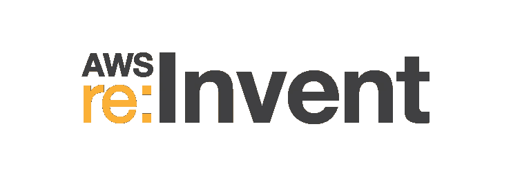

# 云计算的未来:AWS 是 Web 的系统架构，下一步是什么？

> 原文：<https://medium.com/hackernoon/the-future-of-cloud-computing-aws-is-the-system-architecture-of-the-web-whats-next-17aaa6077f47>

又到了一年中的这个时候——AWS 重新发明。数万名开发人员、产品经理、运营工程师、风险资本家和行业专家齐聚拉斯维加斯，讨论云计算巨头亚马逊的未来。

周二上午，我有幸与 Paul Underwood 一起出现在威尼斯人的中心舞台，他是 AWS 解决方案架构师，与年轻的创新型创业公司密切合作。我们分享了无服务器未来的愿景，过渡应该如何发生，以及我们在 Polybit — [stdlib:一个作为服务软件库的功能】](https://stdlib.com/) —如何帮助开发人员和公司在这个新的前沿领域构建、维护、组织、共享和扩展服务。

# AWS:网络的系统架构

同样，JavaScript 开发人员不担心他们编写的函数的内存地址，[未来无服务器世界的云开发人员将永远不必担心他们代码执行的物理位置、地理、虚拟机或容器](/@keithwhor/a-library-of-node-js-microservices-for-everyone-looking-forward-219cfbc2ab0d)。他们将构建能够正常工作的服务*。句号。规模将不再是一个问题。其中一些服务将在一个组织内共享，另一些将与整个世界共享。*

*从某种意义上来说，你可以把 AWS 这样的提供商看作是 web 的系统架构。软件可配置基础设施为我们完成特定任务提供了广泛的选择。这些基础设施产品的广度为固执己见的软件提供了一个巨大的机会来帮助创建一个抽象层，从而大大简化大型软件开发。*

## *与早期系统开发相似*

*从这个角度来看云基础设施，我们可以将 IBM 和微软的发展进行类比，以了解在计算层之上创建抽象层(如操作系统)如何影响行业内的技术进步。我认为云计算的未来是*而不是*植根于提供越来越多的专业化基础设施服务，而不是*以任何你想要的组合来配置基于云的系统。从某种意义上来说，未来是简化的——它让开发人员能够完全忘记底层基础设施的实现细节。没有硬件，没有容器之类的硬件隐喻，只有代码。**

*在未来十年，云计算量(以及 AWS、Azure 和其他参与者之间的竞争)将继续大幅增加，但云服务上的支出将[向价值链的应用层](http://blog.gardeviance.org/2016/11/why-fuss-about-serverless.html)转移，就像我们之前观察到的微软在 IBM 上的方式一样——重点转向用户友好的操作系统，使企业能够更快地发展，而不是计算机层本身。随着计算变得商品化，基础设施即服务的利润率和利润将趋于零，行业支出将奖励专注于实现原始系统配置可用性的参与者。*

## *成熟的云市场*

*过去关注独立系统上的用户体验的转变可以作为一张地图，帮助我们预测云计算市场将如何变化。基础设施提供者根本不具备构建下一层抽象的远见和可操作性。对于更大的参与者来说，独自向价值链上游转移是一项具有挑战性的任务*，因为主导已有公司的“由委员会设计”的口号并不适合培养这些“云操作系统”抽象概念的第一次迭代的增长。**

**随着无服务器领域的成熟，我们将看到由专注于构建简单开发者产品的天才团队驱动的初创公司主导该领域。这一直是、并将继续是新兴技术市场的现状。想想 Dropbox 或 Stripe 的成功，但它们是作为一个整体应用于云计算，而不是某个特定的垂直业务。**

**为这些初创公司的繁荣铺平道路的基础设施提供商最终将为自己在未来的成功奠定基础。那些试图控制*商品*和*可用性*层的供应商将会猛然醒悟——被建在竞争对手之上的一千根针杀死。AWS 虽然比初创公司更有能力，但历史上一直表现出对这一点的认识，并愿意在他们的平台上“合作”并鼓励创新——Heroku 是最大的成功之一。**

# **展望未来**

**像 Firebase 和 Parse 这样的公司充当了云服务领域的先锋，专注于开发者将基础设施作为商品的体验。我相信我们会把它们作为云基础设施市场中以开发人员为中心的易用工具和抽象即将到来的“寒武纪大爆发”的早期指标来回顾。**

**我们的数据无疑表明了这一点。在发布 stdlib 的最新版本[的几周内，我们看到开发人员的采用率(以平台上的计算时间来衡量)飙升。经过几个月的迭代，确定了最好的无服务器工作流，我们的增长图表，根据平台使用情况来衡量，看起来像这样(Y 轴标签模糊)；](https://stdlib.com)**

****

**stdlib Compute — September to December 2016**

**成千上万的开发者已经注册了我们的平台，其中数百人在过去几周内积极地创建服务。这仅仅是开始。无服务器开发工具和框架的使用*今天*只是正在进行的全行业过渡的沧海一粟。**

# **如何帮助构建未来**

**继续向前推进。基础设施管理已经过时了。没有运营管理的特性交付是行业的发展方向。在构建和试验新技术时，保持对开发人员体验的关注。**

**向无服务器架构的转变是我们考虑如何与云交互的更大转变的第一步。我们对未来的愿景相对简单——全球任何开发者都可以无缝地访问我们星球的计算资源，而不需要特定领域的基础设施专业知识。这不仅会对人们如何看待*开发软件*产生根本性的破坏性影响，也会对人们如何看待在新的“API 经济”中形成商业实体产生根本性的影响。**

**在 Polybit，我们正在建设这个未来。我们对接下来会发生什么感到兴奋，你也应该如此。我们感谢我们出色的开发者社区，感谢 AWS 给我们一个分享想法和愿景的舞台，感谢我们受到的欢迎。在云中创建巨大的、全球规模的平台将变得更加容易。**

**Keith Horwood 是 Polybit 的创始人兼首席执行官，他正在创建一个标准的 Web 库。该团队包括来自 AngelPad、YC、谷歌、Heroku 和 AWS 的优秀员工、投资者、顾问和导师。**

***可以* [*在 Twitter 上关注 StdLib，@StdLibHQ*](https://twitter.com/stdlibhq) *，或者* [*直接关注 keithwhor*](https://twitter.com/keithwhor) *。***

************

> **[黑客中午](http://bit.ly/Hackernoon)是黑客如何开始他们的下午。我们是 [@AMI](http://bit.ly/atAMIatAMI) 家庭的一员。我们现在[接受投稿](http://bit.ly/hackernoonsubmission)，并乐意[讨论广告&赞助](mailto:partners@amipublications.com)机会。**
> 
> **如果你喜欢这个故事，我们推荐你阅读我们的[最新科技故事](http://bit.ly/hackernoonlatestt)和[趋势科技故事](https://hackernoon.com/trending)。直到下一次，不要把世界的现实想当然！**

****