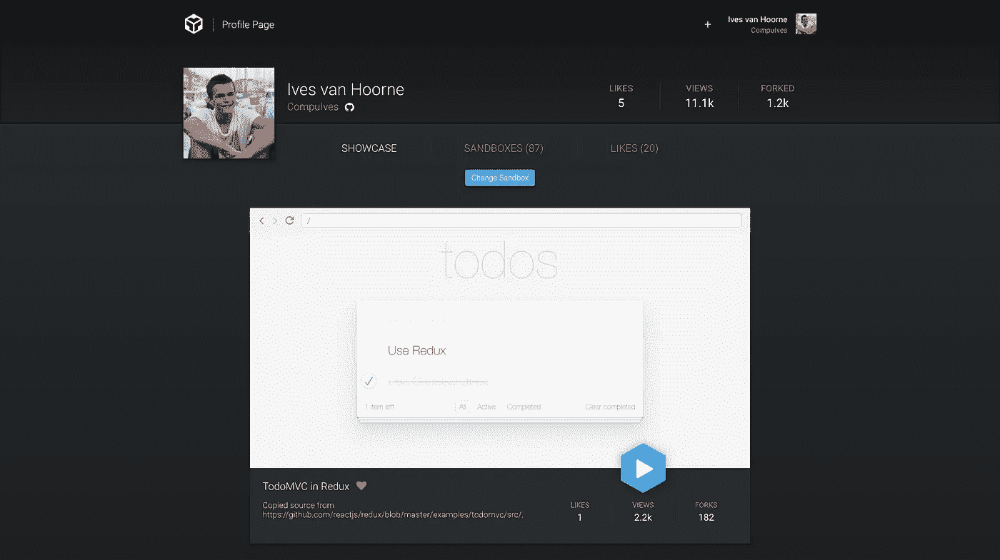
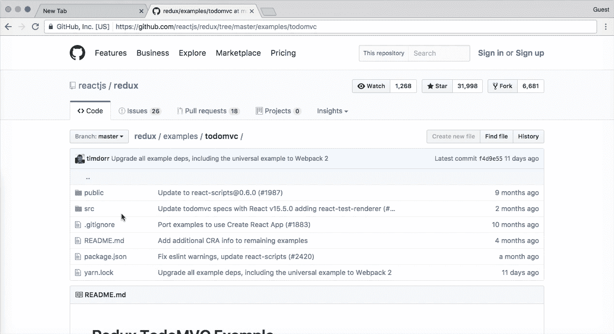
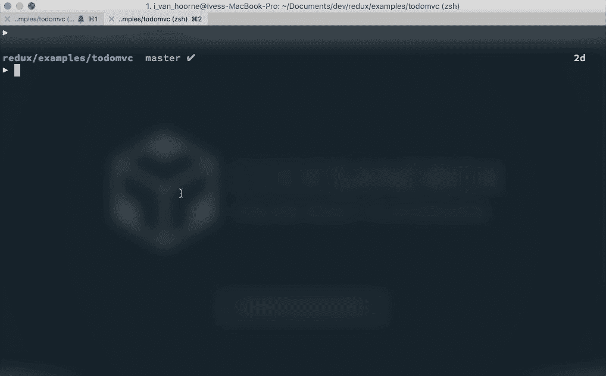

# CodeSandbox 的未来

> 原文：<https://medium.com/hackernoon/the-future-of-codesandbox-d1ccc5aebf59>

自从我们用[这篇](https://hackernoon.com/codesandbox-an-online-react-editor-b8945ce095d2)中型文章‘正式’发布 [CodeSandbox](https://codesandbox.io) 已经过去两个月了。在这篇文章中，我首先分享了一些数据，所以看在过去的份上，让我们再来一次。

在上一篇 Medium 文章之后，CodeSandbox 受到了极大的欢迎。两个月前我们有 1500 个沙盒和 280 个用户，现在我们有 **16000 个**沙盒和 **2300 个**用户！我们每天存储 130 万个新字符的代码。我无法描述这有多不可思议；它已经超出了我的期望。我要感谢所有使用 CodeSandbox 并联系我的人。

# 做了什么

我想先回顾一下我们在过去的 2.5 个月里构建的东西，我们获得了很多反馈，多亏了这些反馈，我才能够构建许多新功能。以下是最大变化的一些亮点:

## 侧视图

你现在可以看到其他人正在 CodeSandbox 上构建什么，每个用户都有一个显示他们所有沙箱的个人资料视图。您还可以“喜欢”其他沙盒，并查看您的沙盒获得了多少浏览量。 [BTMPL 的简介](https://codesandbox.io/u/BTMPL)包含了一些很棒的例子，他所有的沙箱都有很好的标签。

An example profile view

## 嵌入媒体

你可以在支持 [Embed.ly](https://embed.ly) 的平台上共享一个沙盒，比如 Medium。你甚至可以在那里编辑嵌入的沙箱，这意味着你可以做一些非常有创造性的事情，比如在 Medium 上用交互式例子编写组件教程。

The ‘new’ sandbox on Medium, try editing it!

## 改进的 npm 依赖支持

在发布 CodeSandbox 之后，我联系了 [WebpackBin](https://webpackbin.com) 的作者[克里斯蒂安·阿尔佛尼](https://medium.com/u/d4ec01100893?source=post_page-----d1ccc5aebf59--------------------------------)。我们的服务都支持 npm 依赖关系，我们都面临着有效处理这一问题的挑战。我们决定合作，为 WebpackBin 和 CodeSandbox 构建一个[通用的‘打包器’](http://webpack-dll-prod.herokuapp.com)。新的打包程序比以前的版本更智能，现在支持 css 文件和浏览器映射等功能。我们写了一篇关于它的文章，你可以在这里找到。非常感谢 Christian，他在打包程序方面做了大量的工作，与他共事非常愉快。

# 视力

许多人向我们提出了关于 CodeSandbox 的想法。 [Phil Holden](https://medium.com/u/d8efe38e5fc3?source=post_page-----d1ccc5aebf59--------------------------------) 也发布了一篇[非常有趣的文章](https://hackernoon.com/javascript-tightening-the-loop-part-1-9771a0de372a)关于 CodeSandbox 这样的在线编辑器的用例。它启发了我们，我们意识到这个工具有更多的潜力，不仅仅是作为一个分享你的创作的平台。我们为 CodeSandbox 的未来发展设定了两个目标。

## 1.让它变得简单，让孩子也能使用

我已经收到了几十封电子邮件，来自那些正在使用 CodeSandbox 学习 React 的人，这很有意义。有了 CodeSandbox 这样的工具，你不必学习`bash`如何工作，或者`npm`是什么，或者`node`代表什么。你可以打开一个网页，然后开始黑客攻击。

当你刚开始的时候，你想要立即开始有趣的东西，而不是必须先学习所有这些额外的技术。当然，你最终需要学习它们，但是当你只是想开始构建的时候，一开始就有这些障碍是令人沮丧的。

我，我认为我们中的更多人，遭受着知识的诅咒，当我们知道的越多，就越难把自己放在初学者的位置上。像终端和编辑器这样的事情变得微不足道，我们忘记了我们已经为此困惑了几个小时。

正因为如此，我们需要设定一个更加雄心勃勃，但又切实可行的目标:让 web 应用程序的开发变得如此简单，甚至连孩子都可以轻松地开始学习。

A child of 8 played with React using CodeSandbox!

我认为最好的学习方法是不断尝试。如果你亲身经历过错误，你会更好地记住为什么你应该应用一个解决方案。这意味着当用户犯了一个错误时，我们需要显示解决方案的最佳方向。

对于 CodeSandbox，这意味着我们需要专注于创建更友好的错误消息，并在错误发生时尝试提供建议(比如缺少库)。配置应该保持在最低限度，如果我们有配置，我们应该在 GUI 中提供这样的选项。

有很多改进可以使 CodeSandbox 成为一个非常用户友好的编辑器，甚至比其他编辑器更友好，因为我们可以假设用户工作的上下文。让我们利用这一点。

## 2.让它成为一个容易发现的例子的地方

每天大约创建 300 个沙盒。这些沙盒是为无数不同的目的而构建的，但大多数时候是为了与他人共享。没有办法找到构建在 CodeSandbox 上的沙盒，这是一个真正的遗憾，因为我们坐在一座有价值信息的金矿上。

图书馆就是一个很好的例子。已经有一些很棒的库，像 [redux-form](https://github.com/erikras/redux-form) 、[Merrill](https://github.com/paypal/glamorous)、 [mobx](http://mobx.js.org) 、 [apollo-client](https://github.com/apollographql/apollo-client) 、 [css-constructor](https://github.com/siddharthkp/css-constructor) 和 [react-day-picker](http://react-day-picker.js.org) ，它们使用 CodeSandbox 进行错误报告和/或文档记录。这些库的作者写了非常有价值的内容，但是我们缺少一种容易发现这些库和例子的方法。

有许多沙盒也有关于 React 的课程。人们使用沙盒来教授其他人不同的概念，像[一个](https://codesandbox.io/s/Wn3zGj3pn) `[PureComponent](https://codesandbox.io/s/Wn3zGj3pn)` [和](https://codesandbox.io/s/Wn3zGj3pn) `[Component](https://codesandbox.io/s/Wn3zGj3pn)`的区别，或者[如何用](https://codesandbox.io/s/XoBNWnBWv) `[react-router](https://codesandbox.io/s/XoBNWnBWv)`做延迟导航。这些沙盒经常在 Reactiflux 或 Twitter 上共享，但是如果你能通过 CodeSandbox 发现它们，那也是很棒的。

我们应该有一个先进的和高性能的搜索。例如，这样你可以很容易地搜索一个库，并找到所有使用该库的沙箱。

# 新功能

没有新功能的 CodeSandbox 帖子不是 CodeSandbox 帖子！我们将发布两个新功能，让您可以更轻松地将项目放到 CodeSandbox 上。

## 从 GitHub 导入

从 GitHub 导入是一个非常受欢迎的功能，现在它终于出现了！实现相当简单，你可以选择一个 GitHub URL，用“codesandbox.io/s/github”替换“github.com ”,这个路径将指向一个沙箱，它将自动更新 git 存储库。

目前我们只正式支持 CodeSandbox 上的`create-react-app`项目，这意味着它很可能无法与 GitHub 上的其他项目一起工作。

Opening TodoMVC in Redux right from GitHub

## CodeSandbox CLI

您现在还可以使用 CLI 上传您的`create-react-app`项目。想象一下，你的项目遇到了问题，现在你可以轻松地将你的项目上传到 CodeSandbox，并向他人寻求帮助。或者如果您有一个 bug 报告要做，您可以轻松地将一个可重现的案例上传到 CodeSandbox。

Uploading the Redux TodoMVC example right from the CLI

CLI 可以使用 yarn 或 npm 安装:

`npm i -g codesandbox`

要上传您的项目，您可以转到您的项目目录并运行`codesandbox ./`。这将上传当前目录，并给你沙盒的网址。CLI 的源代码可以在这里找到[。](https://github.com/CompuIves/codesandbox-cli)

# 会发生什么

今年夏天的路线图上有很多东西。我想花大量的时间让编辑器更加用户友好。我们还列出了将在未来几个月实施的功能。以下是一些亮点:

## 使用 Algolia 搜索

我对此感到非常兴奋。我们正与 [Algolia](http://algolia.com) 合作添加沙箱搜索。这将有助于增加沙箱的可发现性。一个具体的例子:假设你想知道如何使用`redux-form`。通过新的搜索，您可以使用此库搜索所有沙盒。我们希望将 CodeSandbox 变成一个寻找 React 示例的中心。此功能还允许您标记沙箱。

## 立即部署 ZEIT

我们还与 ZEIT 合作，将[现在](https://zeit.co/now)与沙盒整合。将会有一个“部署到现在”,它将使用现在的魔力部署您的应用程序的生产就绪版本。这真的很酷，因为现在(双关语)，你终于可以从头到尾在 CodeSandbox 上构建应用程序了。之前已经完成了，但是缺少部署步骤。ZEIT 的员工非常乐于助人，很高兴看到我们有着共同的愿景。

## 静态文件支持

使用 CLI 上传时，您还不能使用`public`文件夹，因为我们不支持静态文件。这是非常需要的，并将很快添加，这将使它有可能使用主机图像和其他二进制文件的权利在沙箱中。

## 定价

我们还开发了名为“CodeSandbox Pro”的产品。这是为了获得一些静态文件托管和模板的服务器成本的贡献。我们不想限制整体体验，因此，CodeSandbox Pro 将完全是可选的。有了 CodeSandbox Pro，你可以制作私人沙箱，并为静态文件使用更多的存储空间。这个想法是，你可以每月支付一定的金额(你可以决定)，只要你的贡献超过一定的最低金额，就没问题。我们还没有真正决定最低限额，但我们会确保它是负担得起的。

## 模板

目前，我们只支持遵循`create-react-app`模板的项目。我们希望从`vue-cli`开始，将它扩展到其他模板。你可以指定在创建一个新的沙箱时使用什么样的模板。基于这个模板，编辑器，甚至颜色(蓝色代表`create-react-app`，绿色代表`vue-cli`)都会相应地改变。主要要求仍然是应该有零配置来启动一个项目，这也适用于下载沙盒。

[Sunil Pai](https://medium.com/u/e970465f2c1e?source=post_page-----d1ccc5aebf59--------------------------------) 在 React-Europe 2017 上发表了一篇关于[将运行时逻辑迁移到编译时](https://www.youtube.com/watch?v=yjVhjmM1FPc)的好处的演讲，我真的相信这在未来会发生更多。你已经可以看到一些`css-in-js`图书馆要求巴别塔插件工作。这就是为什么还会有一个`custom`模板，在那里你可以控制编译。可以在那里修改`webpack`配置和`babelrc`。您可以通过弹出现有模板来获得它。所有这些都可以通过简单友好的 GUI 或直接编辑代码来实现。

我对 CodeSandbox 的发展方向感到非常兴奋。我知道我们现在拥有的是一个很好的基础，我们可以在这个基础上改进和扩大。再次，我想感谢早期采用者的使用和他们的反馈，我们也有一个惊喜给你😉。

## 我们是开源的！

我们最近开源了应用程序的不同部分，检查了存储库，并毫不犹豫地打开了问题或 PR！

客户:[https://github.com/CompuIves/codesandbox-client](https://github.com/CompuIves/codesandbox-client)CLI:[https://github.com/CompuIves/codesandbox-cli](https://github.com/CompuIves/codesandbox-cli)Git 提取器:[https://github.com/CompuIves/codesandbox-git-extractor](https://github.com/CompuIves/codesandbox-git-extractor)

关于这一点，请不要犹豫，告诉我们您的想法；在过去的几个月里，他们帮了我们很多。你可以给我发推特或者发短信( [CompuIves](https://twitter.com/CompuIves) )或者发邮件到 hello@codesandbox.io

让 CodeSandbox 成为 web 应用程序开发的有用工具，无论是对初学者还是有经验的开发人员。

我要感谢 Harindu Perera、Sven Mol、Kent C. Dodds、Donavon West、Bartosz Szczeciński、Phil Holden 和 Christian Alfoni 帮助撰写了这篇文章👍。

> [黑客中午](http://bit.ly/Hackernoon)是黑客如何开始他们的下午。我们是 [@AMI](http://bit.ly/atAMIatAMI) 家庭的一员。我们现在[接受投稿](http://bit.ly/hackernoonsubmission)，并乐意[讨论广告&赞助](mailto:partners@amipublications.com)机会。
> 
> 如果你喜欢这个故事，我们推荐你阅读我们的[最新科技故事](http://bit.ly/hackernoonlatestt)和[趋势科技故事](https://hackernoon.com/trending)。直到下一次，不要把世界的现实想当然！

