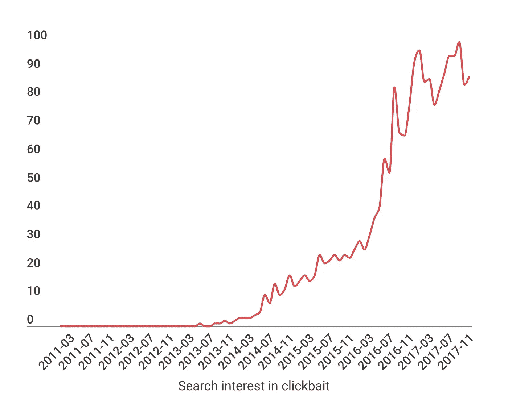
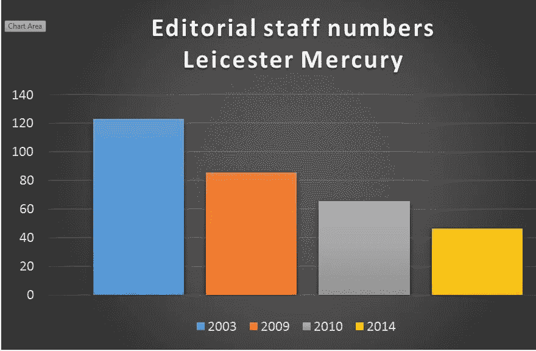
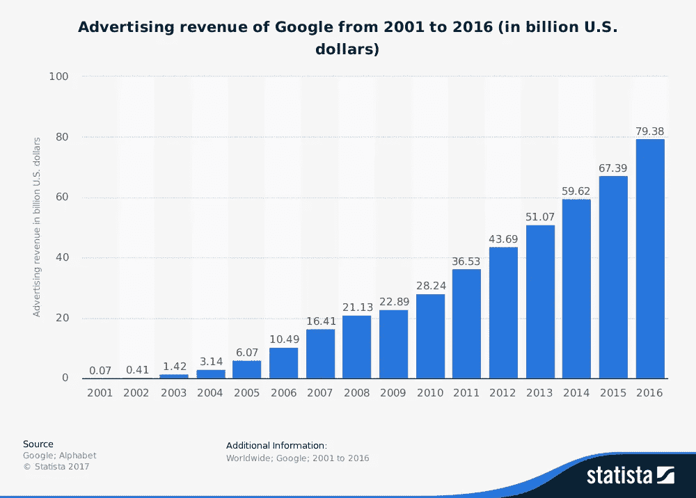

# 新闻业的未来是光明的，而且是有报酬的

> 原文：<https://medium.com/hackernoon/the-future-of-journalism-is-bright-and-paid-bdec2d77f269>

Journalism has been undergoing an existential crisis for some time, and it’s about to rise from the ashes.

如果有一张图表描绘了现代新闻业的衰落，那就是这个:

Courtesy of [Google Trends](https://trends.google.co.uk/trends/explore?date=all&q=clickbait)

曾经有一段时间，新闻是每天吸引绝大多数公众的唯一可行方式。好的新闻会赢得读者，而读者的关注会直接转化为广告收入。

但是随着数字广告和社交媒体的出现，这种联系被打破了。这引发了一场持续了十多年的存在主义危机，随着收入的蒸发，新闻制作者和采集者努力维护他们的新闻理想。

现在，随着对广告依赖的减弱，新闻业即将浴火重生。

**第一个征兆**

在 90 年代初，报纸为覆盖面和效率而竞争，但这是一个平衡的竞技场，质量得到回报。

报纸无与伦比的影响力和尚可接受的目标意味着广告是支持各种新闻的可行选择，从小报到调查。

在 90 年代末和 21 世纪初，这一地位开始慢慢下滑。数字媒体取代了印刷媒体，社交媒体作为广告媒体的地位上升——目标高度集中，受众不断扩大。

印刷收入开始下降，人们认为问题在于媒介——“网络为王”，没人再看报纸了。

于是新闻业适应了:报纸推动“数字化转型”，它们的网络资产繁荣起来，直线下降的广告收入暂时停止，然后[以越来越强的活力重新开始急剧下滑](http://www.pressgazette.co.uk/how-the-rise-of-online-ads-has-prompted-a-70-per-cent-cut-in-journalist-numbers-at-big-uk-regional-dailies/)。

Courtesy of [Press Gazette](http://www.pressgazette.co.uk/how-the-rise-of-online-ads-has-prompted-a-70-per-cent-cut-in-journalist-numbers-at-big-uk-regional-dailies/)

到 2012 年，事情已经明朗了。记者们被大批解雇，留下来的被迫更快、更便宜地生产内容。到 2015 年，曾经受人尊敬的出版物开始大量生产任何能吸引读者的东西。他们开始编写 clickbait。

就像一只螃蟹在锅里被慢慢加热一样，报纸通过更廉价地生产内容来应对收入下降，新闻质量下降，它们存活的时间稍长了一点，但未能解决不可避免的结局。在每一步，他们都抵制搬迁，记者谈论他们面临的财政困难，但他们凑合着，他们继续写作。

但是没有均衡点；这不是全世界的记者们集体勒紧裤腰带就能解决的问题。媒体行业不仅仅由记者经营。

社交媒体沉淀免费内容。没有人能在价格上与免费竞争。新闻业需要停止成为“内容”，而开始成为一种产品。

**新型号**

基于广告的收入模式已经死亡。谷歌和 T2【脸书】已经垄断了这个市场，并且榨取每一分钱。

要进入广告市场，你要么需要有与他们相当的定位，这几乎是不可能的，除非在非常特殊的领域，要么你需要依赖他们的定位，在这一点上你不再有一个有利可图的业务——他们可以从你身上榨取任何他们喜欢的什一税，并且[没有竞争](https://digiday.com/uk/new-eu-data-law-matters-headache-ad-tech/)。

新闻业终于认识到了这一点；它感受到了热量，爬上了边缘，从那里它可以看到新的世界。形势已经发生了变化，需要做出根本性的改变；但他们正在迎接挑战，并发现有一种方法可以让他们生存下来，甚至茁壮成长。老派质量的新闻是有价值的，人们愿意为此付费。

**未来**

与鲍勃·伍德沃德一起推翻尼克松总统的伟人卡尔·伯恩斯坦曾说过，新闻业的真正目的是为公众提供“可获得的最佳版本的真相”。尽管遭到了十年的诋毁，但新闻业的这一核心价值在今天仍然具有相关性，甚至可能比拥有几份报纸就能让你跻身福布斯 15 强的时代更具相关性。

这是新闻业新时代的黎明，可能是一个迎来新黄金时代的机会。全球信任度处于历史最低点——政客被嘲笑，企业被恐惧，保障自由和信仰的民主和资本主义制度受到质疑。人们迫切需要方向，需要有人让当权者负起责任。

这是未来记者的角色——不是整理猫的视频，连珠炮似的报道，或者抓拍无休止的名人游行。公众不再需要报纸上的点击诱饵；社交媒体可以满足这种恶习，他们想要真实的忠实者。

值得注意的是，新闻业的社会价值似乎也可以成为其经济救星。

今年，*卫报*超过 [40 万付费读者](https://www.theguardian.com/gnm-press-office/2017/jul/25/)。数字收入攀升了 15%，来自自愿捐款和订阅的收入在报纸历史上首次超过了广告收入。

与此同时,《金融时报》拥有超过 80 万名付费订阅读者，其中一半以上拥有数字订阅,《纽约时报》的付费用户数量正出现前所未有的增长,《T2 时报》的付费用户数量也出现了前所未有的增长，Trinity Mirror 发布了自己的无广告订阅服务。

信息很简单——人们愿意为高质量的新闻报道付费。我们不能贬低该行业所做的工作，说它的价值一定低于网飞吐出的渣滓。新闻业可以成为民主的基石，是理解世界和绘制世界发展蓝图的重要原料。

如果记者需要赚钱，如果媒体想要生存，它必须开始将广告资金视为商业模式、退路或失败案例的替代方案。

我们需要重新赢得观众的信任。我们需要赢回“关于猫的十件你不知道的事情”已经被有效地磨掉的尊重和欣赏，我们需要为可靠的、可依赖的质量索要报酬。

Clickbait 已经风光不再，贫穷、靠广告资助、索然无味的新闻时代即将结束。明天的新闻业将是高质量的、调查性的、值得信赖的和有偿的。广告模式的失败对于新闻制作者和采集者来说是一场悲剧，但它将被视为因祸得福。

*大记者* [*用 Krzana 找预新闻*](https://krzana.com) *。*