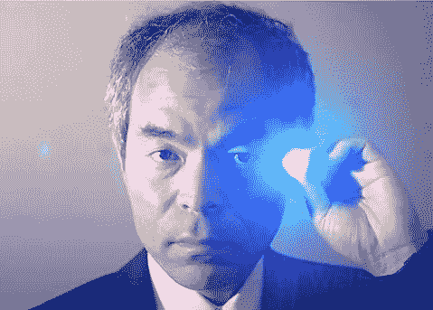
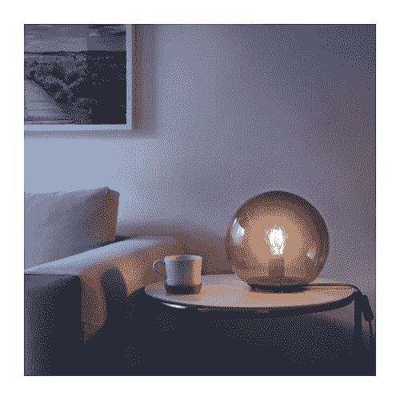
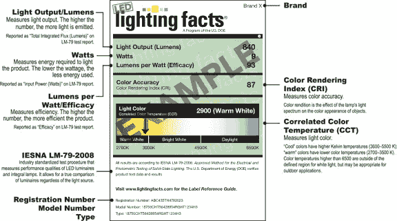
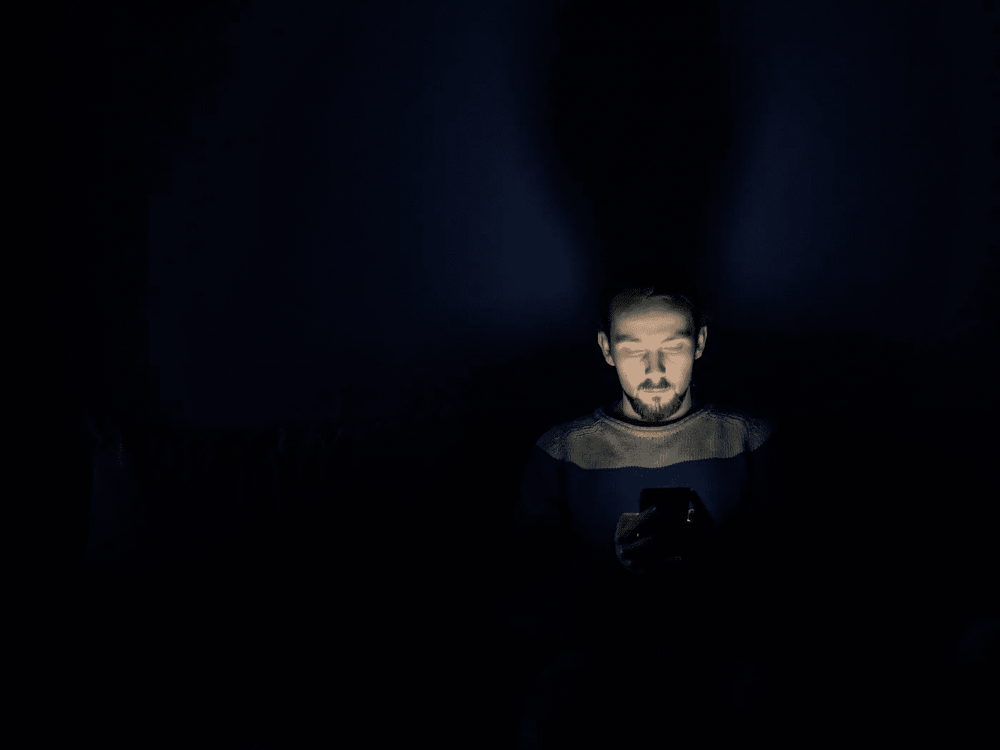
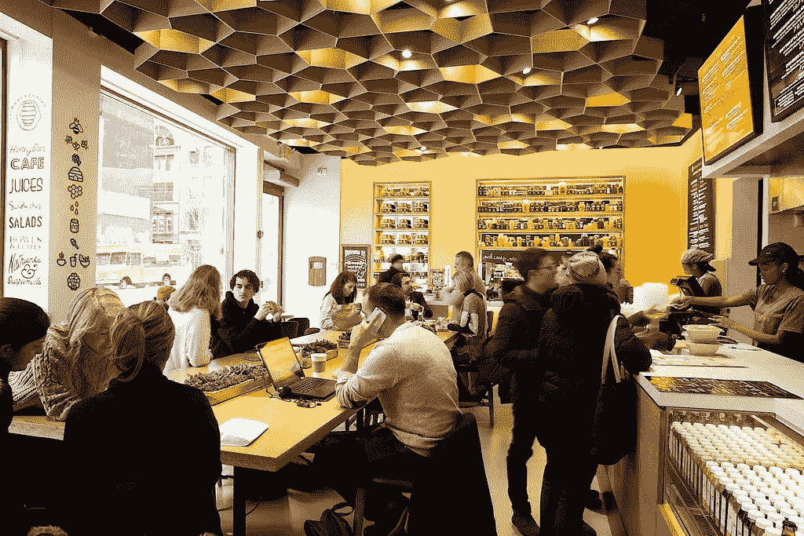

# 光的未来

> 原文：<https://medium.com/hackernoon/the-future-of-light-c8cf75394725>

The body clock is influenced by changes in light throughout the day. Photo by [Den Heslop](https://unsplash.com/photos/6WRAKNsZVOY?utm_source=unsplash&utm_medium=referral&utm_content=creditCopyText).

迪森的电灯泡商业化确实改变了世界。他的技术帮助实现了电网、现代交通，并最终实现了我们今天享受的生活方式。照明在上个世纪逐渐改善，直到最近大规模采用发光二极管。

随着 LED 照明成为主流，我们面临着新的挑战。你再也买不到 60 瓦的灯泡了。相反，你必须深入研究 CCT、CRI、流明和其他术语。人们越来越意识到蓝光的风险，以及对新技术的无端妖魔化。整个照明行业面临停滞。

我们如何摆脱这一困境，我们将何去何从？

# **领导革命**

红色和绿色发光二极管已经存在了大约 50 年，主要局限于在电子产品中用作指示灯。90 年代初，名古屋大学和日亚化学的三名日本研究人员用氮化镓(GaN)制造了第一个蓝色发光二极管(LED)。

One of the blue LED inventors, Shuji Nakamura. Photo by [Ladislav Markuš](https://commons.wikimedia.org/wiki/File:Shiju.jpg).

诺贝尔奖获得者赤崎勇、天野之弥和中村修二的发现意义重大，因为蓝光可以通过磷光材料转化为白光。磷光体材料，例如钇铝石榴石(YAG)，通常是黄色的，并且位于 LED 管芯材料的顶部。

在 2000 年代中期，公司开始将蓝色 led 和磷光体封装到灯泡和其他光源中。这些早期产品价格昂贵(一个灯泡 20-50 美元)，并且在颜色一致性、热量和寿命方面存在很大问题。

> 今天，你可以花大约 1.5 美元买到一个 LED 灯泡。

随着性能的提高，组件的成本降低了。根据[海茨定律](https://en.wikipedia.org/wiki/Haitz%27s_law)，每流明的成本(发光量)每十年下降 10 倍。

今天，你可以花大约 1.5 美元买到一个 LED 灯泡[。这种灯泡的色彩表现比与之相当的螺旋形紧凑型荧光灯更好，可持续使用 10，000-20，000 小时。其他 LED 光源可以持续更长时间(50，000-100，000 小时)。相比之下，白炽灯泡可能持续 1000-2000 小时。](https://www.amazon.com/Philips-Equivalent-White-Dimmable-Medium/dp/B01CAL1EMY/ref=sr_1_3?s=hi&ie=UTF8&qid=1504356243&sr=1-3?tag=gregyeut-20)

在销售点，LED 灯的价格与白炽灯相差不远。但是它们的长寿命和低功耗意味着您可以节省更多。在一个便宜的 LED 灯泡的寿命中，你将支付大约 12 美元，包括购买价格和能源。五个 60 瓦的白炽灯泡在同一时期的价格约为 78 美元。别忘了你要换五次灯泡，而不是只换一次。

You probably wouldn’t know it, but this trendy [Edison-style bulb](http://www.ikea.com/us/en/catalog/products/20376525/) is LED. Photo by [IKEA](http://www.ikea.com/us/en/catalog/products/30356305/).

许多国家已经努力逐步停止销售白炽灯泡。尽管一些地方还没有通过立法，但照明行业已经在很大程度上转向了 LED。2015 年，宜家成为[首家仅销售 LED 照明的大型零售商](http://www.ikea.com/us/en/about_ikea/newsitem/081015_IKEA_100_percent_LED)，其他零售商也在采取类似举措。

这些努力正在奏效。根据美国能源部的数据，2016 年[LED 市场渗透率为 12.6%](https://energy.gov/sites/prod/files/2017/08/f36/led-adoption-report-summary_2017.pdf) 。这一比例高于 2014 年的 3%。

# **大量的选择，大量的困惑**

并非一切都好。LED 曾经有过与众不同的时刻，但现在它在很大程度上是一场价格竞争。1.50 美元的灯泡购买量将是以前的五分之一，打破了旧的商业模式。老的忠实拥护者努力与新的以折扣为导向的品牌竞争。

托马斯·爱迪生创立的通用电气公司[计划出售](https://www.bloomberg.com/news/articles/2017-06-08/ge-plans-to-exit-edison-s-old-business-in-sale-of-lighting-unit)其灯泡业务，因为利润率低。

> 人们只是想要回他们的 60 瓦灯泡，去他妈的节能。

对消费者来说，这甚至都不是什么好事。那个 LED 灯泡很便宜，但是你可能真的不知道你会得到什么。家得宝和其他零售店没有很好地解释色温(CCT)、流明和显色指数(CRI)。制造商用“柔和的白色”和“明亮的白色”等误导性术语来混淆视听。

早期的 LED 产品受到可靠性问题和丑陋颜色的困扰，进一步加剧了这种耻辱。

哦，你想把那个灯泡和你现有的调光器一起用？别提了。

所有这些都导致了大众的不满。而不满意导致退货，这对利润已经很低的消费照明业务没有帮助。人们只是想要回他们的 60 瓦灯泡，去他妈的节能。

商业领域的情况稍好一些。LED 灯具有一百万种形状、尺寸和颜色。能源和维护成本大幅降低，提高了建筑的底线。

大多数商业 LED 灯具没有灯可替换。他们打算持续到下一次装修。除非任何电子故障，发光二极管不会“烧坏”它们只是随着时间变得越来越暗淡。

The Lighting Facts label is now found on most lamps. But it is still not clear enough for the everyday user. Image by [DOE](http://www.lightingfacts.com/Library/Content/Label).

但是 B2B 领域也有它的问题。对照明控制的要求越来越高，在某些情况下，法律甚至要求[。很少有制造商制造照明系统的所有组件，导致不兼容。即使星星排成一行，按计划调试系统也是极其昂贵和耗时的。](http://www.cooperindustries.com/content/dam/public/lighting/resources/library/literature/General/Title-24-Guidelines-for-Controlled-Lighting.pdf)

[DLC 标准](https://www.designlights.org/)过于关注能源效率，最终可能会损害光的质量。加州，历史上能源法规最进步的州，[已经反击](http://www.energy.ca.gov/title24/)，把重点放在色彩表现上，而不是能源。他们说，led 已经足够高效了。但是该州现在正因推翻联邦能源效率法规而受到审查。

# **蓝色蓝调**

同时，我们已经意识到光对人类昼夜节律的影响。人们对其中的细微差别存在争议，但总的来说，当白天有大量蓝光而晚上很少蓝光时，你可以睡得更好，表现更好。

除了视杆细胞和视锥细胞，我们眼中还有一种[第三类](https://en.wikipedia.org/wiki/Intrinsically_photosensitive_retinal_ganglion_cells)感光细胞，只对蓝光敏感。这些细胞不是对视力有贡献，而是告诉生物钟什么时候是白天，什么时候不是。

这种机制一直运作良好，直到大约 150 年前，电灯才变得无处不在。在我们家里和电子设备中发现的同样的照明可以欺骗生物钟，让它以为现在是白天，而实际上不是。

> 这个问题并不仅限于学术界。人们意识到蓝光的影响，并希望找到解决方案。

昼夜节律紊乱似乎是第一世界的问题，不如与营养不良和贫困相关的公共卫生问题重要。但是它与乳腺癌、老年痴呆症和其他疾病有关联。此外，轮班工作和频繁的时区转换会导致工作内外的事故，以及女性月经周期的不一致。

苹果是唯一一个在这个问题上采取重要立场的家喻户晓的名字，2016 年初在 iOS 上推出了[夜班](https://support.apple.com/en-us/HT207570)，2017 年在 MacOS 上推出。夜班将手机和电脑屏幕在晚上换成橙色，减少了蓝光的含量。即便如此，该功能在默认情况下也不会启用，也不会被公司广泛宣传。

说来有趣，我最近在一家苹果商店。一位身材矮小的老太太走到一名员工面前，问如何让她手机上的橙色灯恢复正常。这个问题并不仅限于学术界。人们意识到蓝光的影响，并希望找到解决方案。

Usage of blue-light emitting displays at night can disturb the body clock. Photo by [KristopherK](https://pixabay.com/en/male-night-the-darkness-light-2013929/).

总体而言，照明行业在提供解决昼夜节律紊乱的简单产品方面进展甚微。包括照明设计师和建筑师在内的规范社区正在寻求支持他们最新的以人为中心的设计的系统。但他们的请求大多被置若罔闻。

业界反对以人为中心的照明的观点围绕着以下几个方面:没有足够的研究，对光谱的分歧，以及集成系统的复杂性。在我看来，这些都是逃避在未经验证的市场中开拓的借口。

照明巨头对以人为中心的照明区分其业务的潜力视而不见。有空间让人进来大出风头。

# **昼夜照明**

一些新贵创造了一个类别，我称之为昼夜节律照明。概括地说，昼夜节律照明在一天中会自动改变颜色和亮度。早晨以温暖昏暗的光线开始，让位于工作时间凉爽明亮的光线。到了晚上，灯光又变回温暖的光芒。这很像 [f.lux](https://justgetflux.com/) 和夜班，但是针对你的环境。

这一类别中最著名的初创公司之一是 Ketra，它制造了一种可以安装在家庭和商业环境中的昼夜节律照明系统。它不是特别实惠，但 Ketra 系统是目前最完整和现成的昼夜节律照明解决方案。

昼夜节律照明不仅符合科学，而且感觉也很好。白天凉爽、相对明亮的照明使室内环境看起来更像室外。晚上，较暗、较暖的光线有助于放松。半夜醒来，只需要很昏暗的灯光引路。否则，光会打草惊蛇。

[Honeybrains](http://honeybrains.com/), a health-focused fast casual restaurant in New York City, featuring circadian lighting by [Ketra](https://ketra.com/projects/honeybrains).

到目前为止，Ketra 的产品是最令人印象深刻的，但也有其他制造商的迹象。飞利浦提供了一种 LED 灯泡[,价格约为 6 美元](https://www.amazon.com/Philips-SceneSwitch-Equivalent-Switchable-Brightness/dp/B01MG5UQU7/?tag=gregyeut-20),只需轻轻一按开关，它就可以在三种颜色设置之间切换(夜晚昏暗温暖，正常明亮的白炽灯，白天凉爽明亮的白色)。宜家有类似的东西，但带有无线遥控和调光功能[，售价 27 美元](http://www.ikea.com/us/en/catalog/products/70353343/)。

这些产品只能手动控制，因此不是真正的昼夜节律照明。但是它们是你今天可以花不多的钱买到的东西，可以让你一窥未来。

# 为你调谐的光

昼夜节律照明听起来很棒，但是其他能影响昼夜节律的因素呢？食物、社交活动、咖啡因、酒精、压力和旅行呢？

照明系统不太可能完全抵消昼夜节律的中断。然而，如果它知道你的昼夜节律状态，照明可以帮助正常化身体的睡眠和觉醒周期。

> 你周围的照明永远是最适合你的。

假设你一周后要去东京旅行。你的目的地比东部夏令时早 13 个小时。昼夜节律照明可以帮助你在接下来的日子里转移到新的时区，而不是在到达时将你的昼夜节律完全改变。

或者你是夜班工人。但是你也有和家人一起计划的周末活动，大部分在白天进行。昼夜节律照明可以帮助减少与快速变化的睡眠模式相关的昏昏沉沉。

Circadian lighting could reduce the symptoms of jet lag. Photo by [Jon Tyson](https://unsplash.com/photos/MtOVM_rKgag?utm_source=unsplash&utm_medium=referral&utm_content=creditCopyText).

如果你家里、车里、办公室和健身房的照明都按照你的生理节奏调节，会怎么样？如果你桌子上的灯和你邻居桌子上的灯不一样会怎么样？你的飞机座位和千里之外的酒店房间或者 Airbnb 的灯光呢？

如果照明系统不仅知道*有人*在房间里，而且知道*碰巧是谁*会怎么样？你周围的照明永远是最适合你的。除了调暗灯光之外，你永远也不需要做更多的事情，甚至连这都不需要做。

# 构建黑仔应用程序

LED 照明很快从早期使用者的昂贵玩具变成了廉价商品。现在有了一个杀手级应用的空间，我相信先进的、互联的昼夜节律照明是答案。

> 一个伟大的产品是简单的，可以理解的，和负担得起的。

拼图的碎片已经存在，使所有这一切发生。全球定位系统和室内定位系统的结合可以精确定位你在世界任何地方的位置。关于你的[睡眠卫生](https://www.fitbit.com/sleep-better)的信息可能来自 Fitbit 或智能手表。一条[相位反应曲线](https://www.circadiansleepdisorders.org/info/PRC.php)将被用来在任何给定的时间适当地改变你的生理节奏。

Estimote sells an indoor positioning system solution that could be integrated with lighting.

无论是谁建立一个昼夜节律照明解决方案，都会认识到这不是一件容易的事。这需要理解一个伟大的产品是简单的，可理解的，可负担的。它需要合适的人朝着统一的、固执己见的愿景努力。

我们已经看到了昼夜节律照明对人们生活产生积极影响的潜力。这种意识已经存在，并将继续增长。

现在我们只是在等待正确的解决方案。

感谢阅读。如果你觉得这篇文章有趣，请点击上面的拍手按钮，并与你的朋友分享。我也鼓励你留下评论或直接联系我。