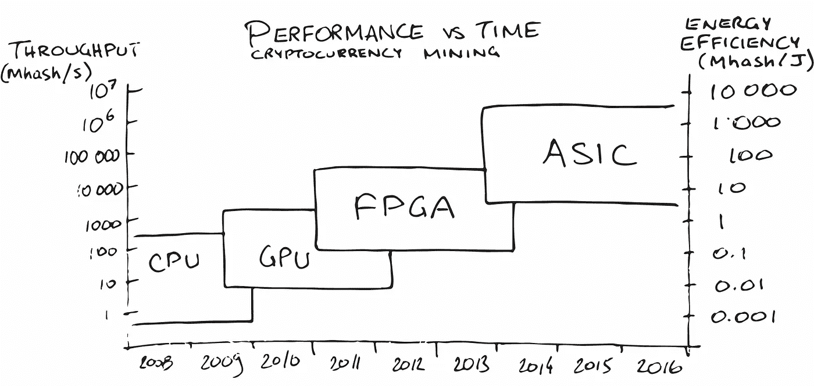
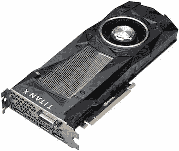
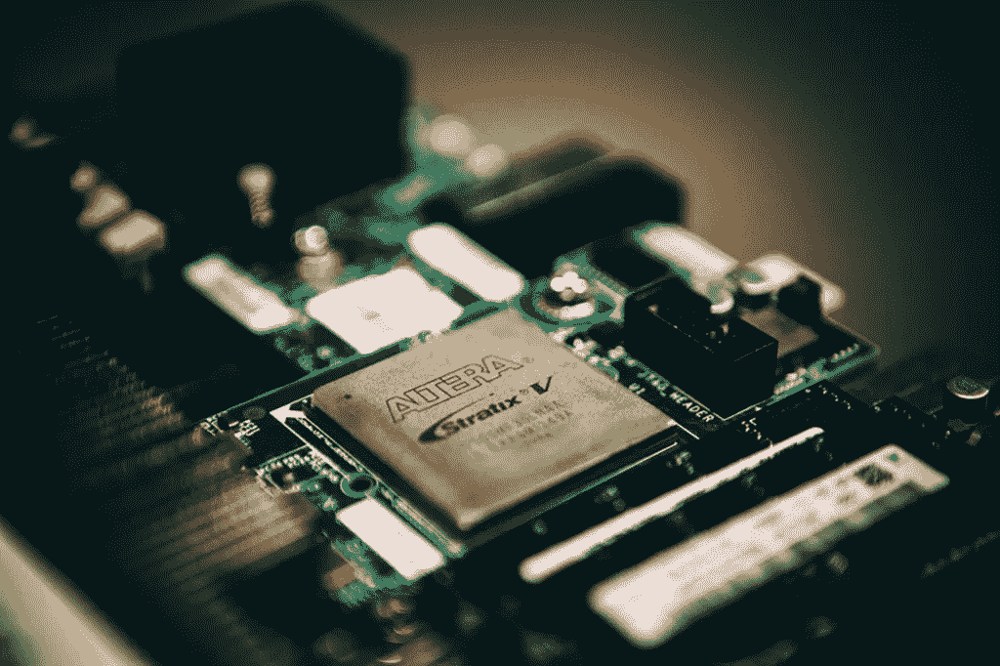
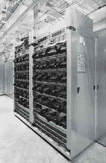

# 机器学习硬件的未来

> 原文：<https://medium.com/hackernoon/the-future-of-machine-learning-hardware-c872a0448be8>

让我们对计算硬件技术的发展进行一次高层次的探索，重点放在对机器[学习](https://hackernoon.com/tagged/learning) (ML)的应用上，并使用加密货币挖掘作为类比。

我认为机器学习行业正在经历与多年前加密货币一样的硬件发展。

机器学习算法通常由矩阵(和[张量](/@philjama/how-tensors-advance-human-technology-3831bff0906))运算组成。这些计算极大地受益于并行计算，这导致了在图形卡上执行的模型训练(而不仅仅是在 CPU 上)。

计算硬件的自然发展是:

1.  中央处理器
2.  图形处理单元
3.  现场可编程门阵列(FGPA)
4.  专用集成电路

技术进步的每一步都会产生巨大的性能优势。

*绩效*可以通过多种方式来衡量:

*   计算能力(或*吞吐量*
*   [能效](https://en.wikipedia.org/wiki/Koomey%27s_law)(根据[焦耳](https://en.wikipedia.org/wiki/Joule)计算)
*   成本效益(每美元的吞吐量)

## 数量级

为了进行比较，让我们考虑一下*挖掘*加密货币的任务，这需要大量的计算能力来换取财务收益。自 2009 年推出比特币以来，加密采矿行业从使用 CPU，到 GPU，到 FPGAs，最后到 ASIC 系统。

硬件发展的每一步都带来了*数量级的性能提升*。下面是相对于代表 1 个*计算单元的单核 CPU 的近似性能:*

*   单核 CPU: **1**
*   多核 CPU: **10**
*   图形处理器: **100**
*   FPGA: **1 000**
*   专用集成电路: **10 000 ~ 1 000 000**

*这些数字基于通过加密货币挖掘发展观察到的性能因素(如吞吐量、效率)。* [ [1](https://en.bitcoin.it/wiki/Non-specialized_hardware_comparison) ， [2](https://en.bitcoin.it/wiki/Mining_hardware_comparison) ]

## 通用计算(CPU 和 GPU)

在 2001 年之前，通用计算将在 CPU 上完成，而 GPU 传统上只处理渲染图形的计算。

当计算机科学家开发出更快、更高效的矩阵乘法和 T2 因式分解技术时，在显卡上进行通用计算变得切实可行。

从那以后，人们一直在努力创造允许在 GPU 上进行通用计算的编程语言，包括 [CUDA](http://www.nvidia.ca/object/cuda_home_new.html) 和 [OpenCL](https://www.khronos.org/opencl/) 。

NVIDIA Titan X Graphics Card

然而，GPU 是出了名的耗电。Nvidia 将他们的 [Titan X](http://www.geforce.com/hardware/desktop-gpus/geforce-gtx-titan-x/specifications) 显卡额定为 250W，并推荐 600W 的系统电源。按 0.12 美元/千瓦时计算，600 瓦相当于每月用电量 50 美元！Nvidia 可能会在未来的产品中继续解决这些问题。

## 专用硬件:FPGA

*现场可编程门阵列* (FPGA)是集成电路，其[逻辑块](https://en.wikipedia.org/wiki/Logic_block)可以使用*硬件描述语言* ( [HDL](https://en.wikipedia.org/wiki/Hardware_description_language) )进行编程和重新配置。

就加密货币而言，FPGA 板标志着向使用*专用*硬件的采矿过渡。

一系列基于 FPGA 的采矿系统提供了下一个数量级的吞吐量性能和能效提升(因为电力成本创造了有利于低功耗系统的收支平衡)。

正在努力使用 FPGAs 实现机器学习模型。例如，Altera 展示了一个用于图像分类的 [AlexNet 卷积神经网络](https://www.altera.com/solutions/technology/machine-learning/overview.highResolutionDisplay.html)的实现。

2012 年末，微软开始为他们的必应搜索引擎开发基于 FPGA 的处理器。

目前，只有【FPGAs 在吞吐量性能上与 GPU 相匹配，但是对于相同的工作负载，它们消耗的能量更少，从而使它们在低功耗环境中更可行(如自动驾驶汽车)。

## 专用集成电路

加密货币开采继续向专用硬件发展，ASICs 很快成为唯一的竞争选择。

同样的趋势已经在机器学习领域开始。

[TPU servers, AlphaGo with Lee Sedol](https://cloudplatform.googleblog.com/2016/05/Google-supercharges-machine-learning-tasks-with-custom-chip.html)

2016 年 5 月，谷歌的工程师宣布，他们创造了一种称为[张量处理单元(TPU)](https://cloudplatform.googleblog.com/2016/05/Google-supercharges-machine-learning-tasks-with-custom-chip.html) 的 ML 专用 ASIC [技术](https://hackernoon.com/tagged/technology)。

TPU 服务器为他们的 RankBrain 搜索系统 StreetView，甚至打败世界冠军 Lee Sedol 的 AlphaGo 系统提供动力。

谷歌从 2015 年开始使用 TPU，

> …并发现它们为机器学习提供了一个数量级的优化性能功耗比。
> 
> 这大致相当于快进到未来 7 年左右的技术(摩尔定律三代)。

## 未来和下一步

似乎对深度学习和统计推断的需求正在推动硬件行业走向 ML 专用硬件。

目前，谷歌以 ASICs 领先，他们的主要竞争对手运行 FPGAs，而我们其余的人正在用 GPU 供暖。

ML-specialized ASIC 技术何时可以商用？

业界会采用像 [OpenCL](https://www.khronos.org/opencl/) 这样的开放框架作为异构计算的基础吗？像 [TensorFlow](https://github.com/tensorflow/tensorflow/issues/22) 和 [Caffe](https://github.com/BVLC/caffe/tree/opencl) 这样受欢迎的 ML 库已经取得了进展。

这种指数式的进化会持续下去，还是会在某个物理障碍处停滞不前？硬件发展的下一步[包括新材料、生物计算或量子计算。](http://www.economist.com/technology-quarterly/2016-03-12/after-moores-law)

想象一下比今天的顶级 ML 硬件强大数千倍的专用 ASIC 芯片。哪些新的 AI 应用将变得可行？当它们的能效使其适用于智能手机、物联网和可穿戴设备等嵌入式设备时，什么将成为可能？

随着人工智能应用的扩展，对人工智能专用设备的需求正在推动硬件进入下一阶段的发展。体验这些技术在医疗保健、医药、交通、机器人领域的应用将是一件令人着迷的事情。机器学习的进化过程中仍然存在许多令人兴奋的步骤。

## 参考

1.  **非专业硬件对比** [https://en . bitcoin . it/wiki/非专业 _ 硬件 _ 对比](https://en.bitcoin.it/wiki/Non-specialized_hardware_comparison)
2.  **采矿硬件对比** [https://en.bitcoin.it/wiki/Mining_hardware_comparison](https://en.bitcoin.it/wiki/Mining_hardware_comparison)
3.  **使用 OpenCL 在 Altera FPGA 上实现 CNN**
    [https://www . Altera . com/solutions/technology/machine-learning/overview . highresolutiondisplay . html](https://www.altera.com/solutions/technology/machine-learning/overview.highResolutionDisplay.html)
4.  **微软致力于可重构处理器加速 Bing**  [http://www . data center knowledge . com/archives/2014/06/27/programmable-FPGA-chips-coming-to-Microsoft-data-centers/](http://www.datacenterknowledge.com/archives/2014/06/27/programmable-fpga-chips-coming-to-microsoft-data-centers/)
5.  **谷歌用 TPU 定制芯片超级充电机器学习任务**
    [https://cloud platform . Google blog . com/2016/05/Google-super charges-machine-learning-tasks-with-custom-chip . html](https://cloudplatform.googleblog.com/2016/05/Google-supercharges-machine-learning-tasks-with-custom-chip.html)
6.  **谷歌将其利润丰厚的网络搜索交给人工智能机器**
    [http://www . Bloomberg . com/news/articles/2015-10-26/Google-Turning-Its-monetary-Web-Search-Over-the-AI-Machines](http://www.bloomberg.com/news/articles/2015-10-26/google-turning-its-lucrative-web-search-over-to-ai-machines)
7.  **用于机器学习的高性能硬件** [https://media . NIPS . cc/Conferences/2015/Tutorial slides/Dally-NIPS-Tutorial-2015 . pdf](https://media.nips.cc/Conferences/2015/tutorialslides/Dally-NIPS-Tutorial-2015.pdf)

> [黑客中午](http://bit.ly/Hackernoon)是黑客如何开始他们的下午。我们是 [@AMI](http://bit.ly/atAMIatAMI) 家庭的一员。我们现在[接受投稿](http://bit.ly/hackernoonsubmission)，并乐意[讨论广告&赞助](mailto:partners@amipublications.com)机会。
> 
> 如果你喜欢这个故事，我们推荐你阅读我们的[最新科技故事](http://bit.ly/hackernoonlatestt)和[趋势科技故事](https://hackernoon.com/trending)。直到下一次，不要把世界的现实想当然！

