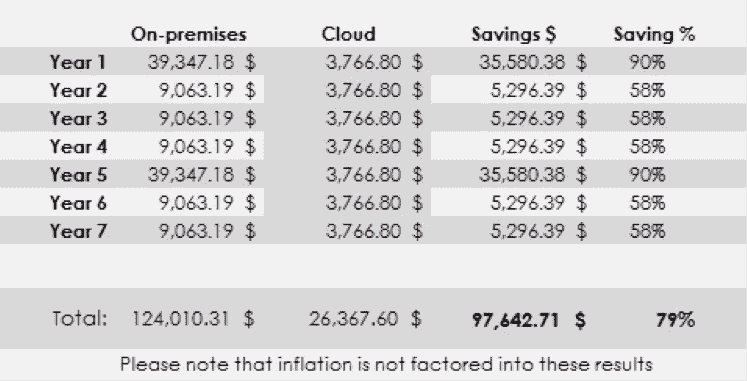

# Web 开发的未来:编码即服务

> 原文：<https://medium.com/hackernoon/the-future-of-web-development-coding-as-a-service-e413c978f77e>

开一个网站需要多少钱？

事实证明，并不多。从[谷歌](https://domains.google/#/)开始，一个域名将收取你 12 美元/年。在[谷歌应用引擎](https://cloud.google.com/)或[亚马逊网络服务](https://aws.amazon.com/free/?sc_channel=PS&sc_campaign=acquisition_US&sc_publisher=google&sc_medium=cloud_computing_b&sc_content=aws_url_e_control_q32016&sc_detail=amazon.%20web%20services&sc_category=cloud_computing&sc_segment=102882720282&sc_matchtype=e&sc_country=US&s_kwcid=AL!4422!3!102882720282!e!!g!!amazon.%20web%20services&ef_id=V6Mm5QAAAMJ18-Qn:20170310010732:s)上的虚拟主机开始是免费的——只有当你开始获得更多用户时，它们才需要花钱。如果你知道如何编码，差不多就是这么多了——每年 12 美元。

但是假设你没有技术背景，这不是问题。免费建立一个 [Wordpress](https://wordpress.com/com-vs-org/) 或 [Wix](http://www.wix.com/freesitebuilder/hiker-create?experiment_id=wix%5Ee%5E48420852460%5E1t2&gclid=Cj0KEQiAl4TGBRDhgvmikdHPsdABEiQAtBcc8Cgo9XQ13no3zWz7JHGKiXgmbIyoqSajufKnjyDXEQ8aAvk08P8HAQ&utm_campaign=195454540%5E10375167220&utm_medium=cpc&utm_source=google) 网站。不需要编码，假设选项有限。但是不到一个小时，你就上线了。别担心，你在一个好公司里。Wordpress 为超过 26%的网站提供支持。

花一点额外的钱，你可以从诸如 Weebly、T2、Squarespace、T4、Bluehost、T5 等公司获得更多的主题和功能。我说的是平均每月不到 10 美元。因此，每月两杯大杯焦糖玛奇朵的价格，你就可以在没有技术经验的情况下运营一个值得尊敬的网站。想让这个网站销售你的产品吗？ [Shopify](https://www.shopify.com/) 和 [Stripe](https://stripe.com/) 您是否已支付月费或小额交易费。这是我们称之为编码即服务的开始。在 2017 年，我们开始认为这是理所当然的，但即使在 10 年前，大多数人也会认为你疯了。

这里提醒一下我们在 2007 年使用的手机。

Yeah, I know.

历史课。谷歌在 1998 年拥有的第一台服务器是 Sun Ultra II。根据规格的不同，新的价格在 16，500-60，000 美元之间。这是极其昂贵的，尤其是对创业公司来说。但那是 20 年前的事了，价格肯定已经下降了。是的，但是对于一个运行服务器的大公司来说，它仍然很贵，这是 Sherweb 提供的 2015 年的表格。Sherweb 在他们的分析中做出了使用和规格假设(2 个 vCPUs、8GB 内存、512GB 磁盘存储)，因此这不是一个一刀切的评估，但您会明白其中的意思。请注意，由于服务器升级周期，第 1 年和第 5 年的成本要高得多。

2006 年，亚马逊是第一家意识到服务器的成本和头痛是一个有利可图的商业机会的大型科技公司，他们开始托管带有[亚马逊弹性云计算](https://en.wikipedia.org/wiki/Amazon_Elastic_Compute_Cloud)或简称 EC2 的服务器。这改变了世界。今天，像 [Snap](http://www.zdnet.com/article/snapchat-spending-2-billion-over-5-years-for-google-cloud/) (chat)这样的大型组织和初创公司都在被称为云的基础设施即服务(IaaS)上运行。在未来，这意味着计算机根本不需要太多的计算能力，因为计算将全部在云端运行。设备将会变得更小，连接性更强。这就是为物联网革命铺平道路的东西，[亚马逊 Echo](https://www.amazon.com/dp/B015TJD0Y4/ref=fs_ods_fs_aucc_bt) 有人吗？

这一演变的下一步是编码即服务(CaaS)——就像之前的 IaaS 一样。当前的网站建设者都依赖人类程序员为我们制作模板。这既费时又费力，但很快就不再是这样了。人工智能将使更复杂的代码组合能够通过自动化过程装配在一起。把网站背后的代码想象成拼图。用现在的技术网站建造者正在创造，比方说，100 块拼图。虽然有些复杂，但就粒度而言，它们仍然是非常基本的。它们是拖放或公式化的模板。现在，当人工智能融入其中时，这些网站建设者将基本上创建 10，000 块拼图。用 AI 定制的数量和质量将是惊人的。对于最终用户来说，这意味着它将立刻变得更简单、更便宜。

但是，让我们在实践中看到这一点…想象一下，与一个在生活中唯一的工作就是建立网站的人工智能交谈。人工智能有自然语言处理能力，所以它能完全理解你说话的意图。人工智能还具有即时和不知疲倦的编码能力，以及对功能的完美理解。因此，人工智能将在你的眼前建立并改变你的网站，限制因素是你可以多快地说你希望背景颜色是[炫丽玫瑰](http://www.crayola.com/explore-colors/razzle-dazzle-rose.aspx)。最终的结果是，网站的外观和行为完全符合您的要求，只需使用您的声音。

正如你现在可能已经意识到的那样，通过人工智能进行 CaaS 将不仅限于制作有趣网站的人。最终，CaaS 将降低从企业到社交领域的新功能所需的时间和资金。但在短期内，CaaS 将影响那些完成相对简单或脚本化任务的程序员，例如查询数据库。我们不再需要大量的编码人员，他们熟练地理解如何在循环中使用 if else 语句，无论是使用 Ruby 还是 Angular。人工智能将能够更快地做到这一点，更少的错误，更好地理解系统需求。

所以简而言之，软件将继续运行这个世界，但是越来越少的人会开发这个软件。

点击这里关注[马修·比金斯](https://medium.com/u/92f25ac1082d?source=post_page-----e413c978f77e--------------------------------)或者 [LinkedIn](https://www.linkedin.com/in/bigginsmatthew/) 了解更多

> [黑客中午](http://bit.ly/Hackernoon)是黑客如何开始他们的下午。我们是 [@AMI](http://bit.ly/atAMIatAMI) 家庭的一员。我们现在[接受投稿](http://bit.ly/hackernoonsubmission)并乐意[讨论广告&赞助](mailto:partners@amipublications.com)机会。
> 
> 如果你喜欢这个故事，我们推荐你阅读我们的[最新科技故事](http://bit.ly/hackernoonlatestt)和[趋势科技故事](https://hackernoon.com/trending)。直到下一次，不要把世界的现实想当然！

