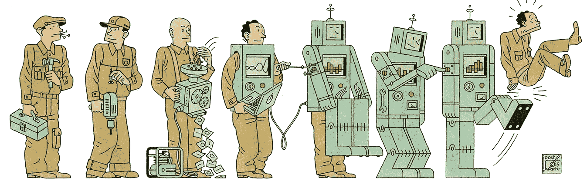
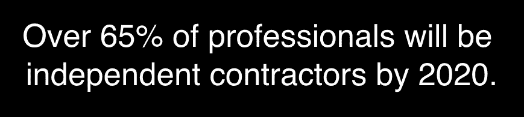
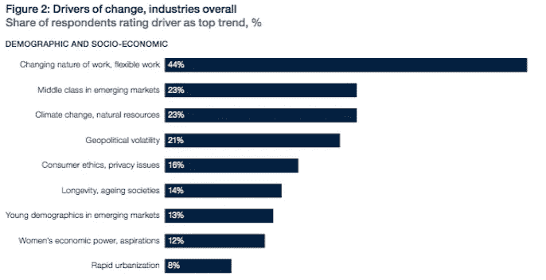
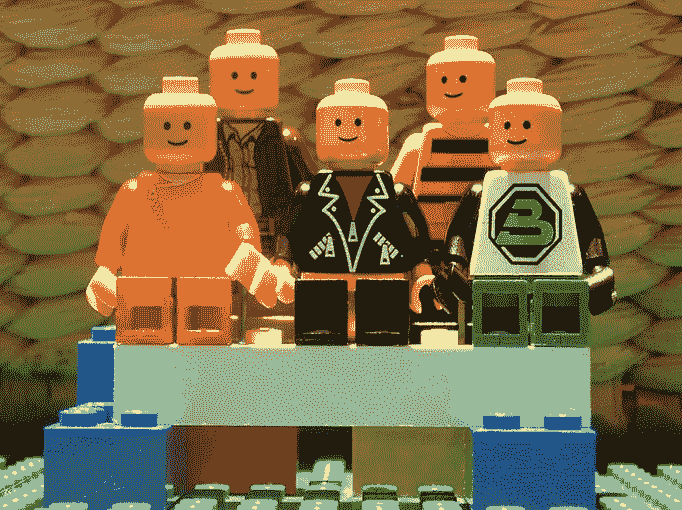
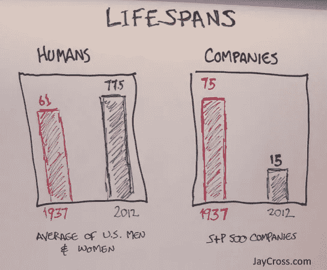
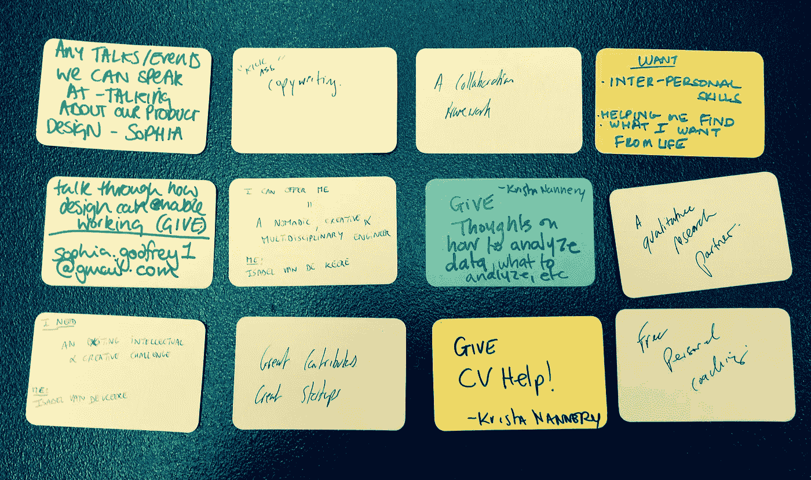

# 工作会议的未来

> 原文：<https://medium.com/hackernoon/the-future-of-work-sessions-c1d26536bb60>

Image: MIT Technology Review

## *协作&创新*

每隔一段时间，你就会有一次这样的对话——精神食粮，它不仅会改变你的思维方式，还可能会改变你的行为方式。一周前，我和一群人一起探索工作的未来 [WeWork](https://www.wework.com/locations/london/soho-london) ，我也参与了这样的对话。对话一直持续到深夜，一周后我仍沉浸在其中。

***没错，你没看错*** *。这意味着很快，项目组合工作将真正成为常态。汉迪先生完全正确。但更疯狂的是，虽然我们的平均寿命增加了，但财富 500 强公司的平均寿命却在快速下降。这些趋势的影响将是巨大的。*

# 有东西坏了。

超过三分之二的人报告说他们在工作中感到无所事事。后工业时代的过时制度在今天根本不适用。在一个永远在线的世界里，77%的年轻人现在期望弹性工作安排。

> 对个人和组织来说，重塑和适应性已经成为 21 世纪梦寐以求的技能。

# 变革的驱动力。

到 2030 年，亚洲将拥有全球 66%的中产阶级。不久之后(好吧，大概 20 年后)，新兴经济体将有近 30 亿人越过汉斯·罗斯林的“警戒线”。

我们如何对待环境将变得至关重要(今天应该已经如此)，气候变化将是组织创新的主要驱动力。

但是，这两个驱动因素对于最大的变革催化剂来说都是次要的:工作性质的改变。

Image: WEF Report 2016

# 设计对话。

所以在那个晚上，为了《工作的未来》系列的第四版，我很荣幸地邀请了艾莉森·考沃德([括号](http://bracketcreative.co.uk/))、卢卡斯·塞登法登([时尚链接](https://fashionlink.io/))和纳维德·阿克兰( [Vestd](https://vestd.com/) )。面对一群好奇的人，这些导航员向我们讲述了他们在工作世界中的位置，以及他们对未来的独特愿景。

继续，看一看:

# 论合作——艾莉森·考沃德

[View Presentation](http://socialfabric.com/wp-content/uploads/2016/03/FUTUREOFWORK-Bracket.pdf)

## 艾莉森的书推荐道:

[有效研讨会的袖珍指南](https://www.fivesimplesteps.com/products/effective-workshops)
[伟大的团队——更好的创造性协作指南](http://bracketcreative.co.uk/ebook/)
[10 年后的顶级职位可能不是你所期望的](http://www.fastcompany.com/3046277/the-new-rules-of-work/the-top-jobs-in-10-years-might-not-be-what-you-expect)[文章]

# 在旅途中——卢卡斯·塞登法登

[View Presentation](http://socialfabric.com/wp-content/uploads/2016/03/FOW-Fashion-Link.pdf)

## 卢卡斯图书推荐:

[社会物理学](http://www.amazon.co.uk/Social-Physics-Alex-Pentland/dp/1922247553/)

# 在新的操作系统上——Naveed Akram

[View Presentation](http://socialfabric.com/wp-content/uploads/2016/03/FOW-Vestd.pdf)

## Naveed 图书推荐:

[第二个机器时代](http://www.amazon.co.uk/The-Second-Machine-Age-Technologies/dp/0393239357)
[富足](http://www.amazon.co.uk/Abundance-Future-Better-Than-Think/dp/1451614217)
[重塑组织](http://www.amazon.co.uk/Reinventing-Organizations-Creating-Inspired-Consciousness/dp/2960133501)

# 沉思了一下。

那天晚上，有人问我，所有这些未来工作聚会是否只是一遍又一遍地重复同样的废话——就像一台坏掉的电唱机。我想了一下..

Artefact Cards of Give/Get

我确信事实并非如此。每个事件都带来了独特的视角，不同的观众和特定的时间点——离未来更近了。

涌浪正在形成。一场志同道合的运动——有些人在边缘，有些人在内部。我们不再坐在众所周知的扶手椅上。随着对话的增长和继续起伏，我们开始用新的方式思考。

# **资源**

[工作的未来](http://www3.weforum.org/docs/WEF_Future_of_Jobs.pdf)【WEF 报告】
[重新想象办公室](http://www.nytimes.com/2016/02/28/magazine/what-google-learned-from-its-quest-to-build-the-perfect-team.html?_r=0)【纽约时报】
[职业的未来](https://www.youtube.com/watch?v=Dp5_1QPLps0)【视频】
[机构的未来|经济咨询](https://econsultancy.com/reports/the-future-of-agencies/)
[工作的未来|快公司](http://www.fastcompany.com/section/the-future-of-work)
[工作的未来|演讲家](http://raconteur.net/future-of-work)
[工作的未来|普华永道](http://www.pwc.com/gx/en/issues/talent/future-of-work/journey-to-2022.html)
[沃尔夫·奥林的游戏改变](http://gamechangers.wolffolins.com/)

# **文章**

我们未来的工作会成功吗？
[设计未来的工作岗位](http://www.fastcodesign.com/3054433/design-moves/the-most-important-design-jobs-of-the-future)
[每 3 年换一份工作](http://www.fastcompany.com/3055035/the-future-of-work/you-should-plan-on-switching-jobs-every-three-years-for-the-rest-of-your-)
[谁将拥有机器人？](https://www.technologyreview.com/s/538401/who-will-own-the-robots/)
[社会结构|工作的未来第二场](http://socialfabric.com/2015/04/future-of-work-shoreditch-house/)
[世界上最具创新性的学校](http://www.techinsider.io/the-13-most-innovative-schools-in-the-world-2015-9)
[社会结构|更好的工作方式](http://socialfabric.com/2014/09/better-ways-working/)

如果你喜欢这个..

# *报名参加我们的关于设计、技术和未来工作的文摘* [***这里***](http://socialfabric.com/digest/)

*第五届 FoW 将于 2016 年 5 月 19 日在肖尔迪奇别墅举行*

> [黑客中午](http://bit.ly/Hackernoon)是黑客如何开始他们的下午。我们是 [@AMI](http://bit.ly/atAMIatAMI) 家庭的一员。我们现在[接受投稿](http://bit.ly/hackernoonsubmission)并乐意[讨论广告&赞助](mailto:partners@amipublications.com)机会。
> 
> 如果你喜欢这个故事，我们推荐你阅读我们的[最新科技故事](http://bit.ly/hackernoonlatestt)和[趋势科技故事](https://hackernoon.com/trending)。直到下一次，不要把世界的现实想当然！

