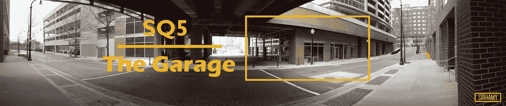
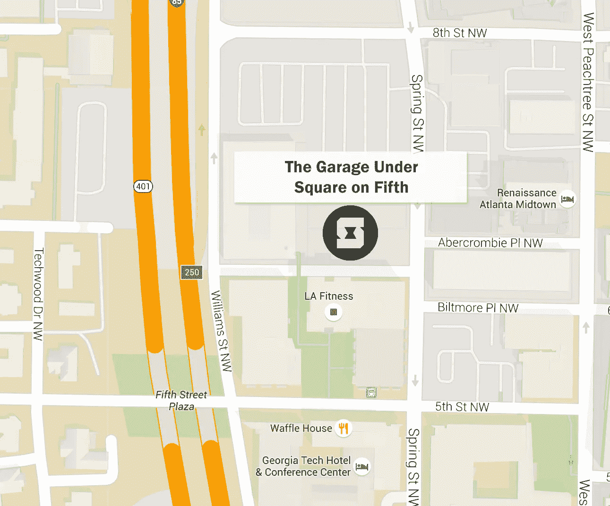

# 车库主办 2016 年创业交流

> 原文：<https://medium.com/hackernoon/the-garage-hosts-startup-exchange-in-2016-efdda31a4394>

The Garage under SQ5 is outlined with a rectangle

*免责声明:这项工作是佐治亚理工学院 2016 年秋季 CS4464/6465 课程作业的一部分(https://github . com/Jacob Eisenstein/gt-compj-class/)。这里表达的观点，如果有的话，仅仅是从事这项作业的学生的观点，而不是教师或乔治亚理工学院的观点。*

# 启动交换

Startup Exchange 在 SQ5 下的车库举行了 2016 年的第一次会议。来自佐治亚理工学院社区的所有人都被邀请以点心、行业讲座和企业家研讨会开始新学期——当然也看看 Startup Exchange 为未来几周做了什么计划。

## **什么是创业交易所？**

从他们的[网站](http://startupexchange.gatech.edu/):

> Startup Exchange 是一个创业社区，让学生能够相互支持和激励，以实现他们的梦想，过上另一种生活方式。

更直白地说，Startup Exchange 是一个由佐治亚理工学院学生开办的俱乐部，旨在联系对创业感兴趣的人，并帮助他们磨练自己的技能。

佐治亚理工学院学习计算机科学的学生布雷特·加西亚说:“俱乐部为会员提供了社交和向其他会员学习的空间。俱乐部请来了经验丰富的客座讲师，他们可以提供指导。最重要的是，这个俱乐部让你与其他有相似目标和抱负的学生接触，这有助于找到合适的人来发展你的创业。”

至于人们为什么来参加这些会议，GT 的另一名计算机科学学生 Naveen Chandran 说，这与“参加会议的人的动机和智慧”有关。他继续说道:“他们说为了让自己变得更好，你应该和比你更好但有相同兴趣的人在一起——这正是我正在尝试做的。”

该俱乐部每周举办会议，与会者可以分享他们的想法、故事和在该领域的斗争。

Startup Exchange Logo. Source: [https://www.facebook.com/StartupExchange/](https://www.facebook.com/StartupExchange/)

# 该事件

2016 年的就职活动以与会者向人群介绍自己开始。每个人都站起来，拿到一个麦克风，回答提示:

*   你叫什么名字？
*   你的专业是什么？(如果你还在上学)
*   你为什么来这里/为什么对 Startup Exchange 感兴趣？
*   如果你有一个新公司，在 60 秒内告诉我们。如果不是，你最喜欢的创业公司是哪家？

出席者中，绝大多数是佐治亚理工学院的在校学生。其他人是最近的校友或在科技广场附近工作的人。

令人惊讶的是，只有五分之一的人表示他们目前正在创业。不出所料，对于“你为什么在这里？”是沿着学习更多关于企业家精神的路线，找到一个地方/人来激发想法，并与那些也有兴趣创建自己的公司的人联系。

## 基调

> "无论你做什么，都要做好"

介绍结束后，[销售店](https://salesloft.com/)的首席执行官[凯尔·波特](https://www.linkedin.com/in/kyleporter)走上了讲台。凯尔是 GT 的校友(MGT-2004)，在加入 M-Train 之前，他是从工程学院起步的。他讲述了自己从大学生活派对到派对再到一家被《亚特兰大商业纪事报》评为[中型企业最佳工作场所第一名](http://www.bizjournals.com/atlanta/news/2015/09/10/2015-best-places-to-work.html)的公司首席执行官的演变故事。

一路走来，他分享了自己在创建公司期间获得的一些建议，比如:

*   "无论你做什么，都要做好"
*   将你的核心价值观融入你企业的各个层面
*   找出你擅长的，和你不擅长的一起做
*   对你的业务目标有一个清晰的愿景，你将如何完成它，以及你为什么要完成它。

## 校友

下一位发言人是亨特·罗森布鲁姆，宇宙实验室的首席执行官，佐治亚理工学院创业学期的前任主任。他开始说，仅仅一年前，他还是在 Startup Exchange 听演讲的人群中的一员，现在他是自己公司的首席执行官。

亨特分享了他自己关于成为企业家的建议:

*   "周围总是有人在做很酷的事。"
*   “接你没时间做的副业”，尤其是那些看起来很酷或者会让你学到很多东西的副业。

The Garage

# 车库

最后上台发言的是沙盒社区的首席执行官兼联合创始人斯科特·亨德森。在 Tech Square 周围，他最出名的是亚特兰大分公司 SandboxATL，这是一家“将你与亚特兰大科技场景核心的事件、媒体内容和协作空间联系起来”的公司他们在城市的各种技术空间举办活动，鼓励成员交流和分享想法。

The Garage’s location. Source: [http://startupexchange.gatech.edu/](http://startupexchange.gatech.edu/)

车库是一个新的活动空间，位于五号塔楼的广场下面，由 SandboxATL 运营。斯科特将它定位为“创造科技未来的人们”的俱乐部这个空间名副其实，暴露的混凝土墙、裸露的木头和金属构件给人一种朴实无华、实用的感觉。

它分为两个层次。顶层有三个中等大小的区域，沿着栏杆有桌子，可以俯瞰底层和舞台。沿着内墙，它展示了几个由小桌子和门装饰的小房间，在其他公共空间中提供了一些隐私。

底层有一个开放的平面图，当你第一次走进去的时候，在第二层的掩护下有一个悬挑。登记台坐落在你左边的楼梯上。再往里，舞台周围的空间变得开阔了——一个可以安排观众座位的凸起平台(据[网站](http://www.sandboxatl.com/spaces/)报道，可以容纳 250 名客人)。

# 创业学院

当晚的最后一个节目是创业学院的第一个*实例。Startup Academy 是 Startup Exchange 的教育分支，为俱乐部参与者提供研讨会和其他互动活动。*

第一课是关于构思——或者说为初创企业提出想法的过程。它包括一个介绍概念的简短演示，然后是一个互动部分，将人们分组，利用*的大量*便利贴进行头脑风暴和分类。

Startup Exchange 每周周五下午 4-6 点在车库与 Startup Academy 会面，紧接在半月刊之后。

汉密尔顿·格林目前是佐治亚理工学院计算机科学专业的学生。如果你喜欢这篇文章，可以考虑点击心形图标或者在 Medium 上关注他。欲了解更多信息，请访问他的网站:[*http://sirhamy.com*](http://sirhamy.com)*。*

> [黑客中午](http://bit.ly/Hackernoon)是黑客如何开始他们的下午。我们是阿妹家庭的一员。我们现在[接受投稿](http://bit.ly/hackernoonsubmission)并乐意[讨论广告&赞助](mailto:partners@amipublications.com)的机会。
> 
> 如果你喜欢这个故事，我们推荐你阅读我们的[最新科技故事](http://bit.ly/hackernoonlatestt)和[趋势科技故事](https://hackernoon.com/trending)。直到下一次，不要把世界的现实想当然！

