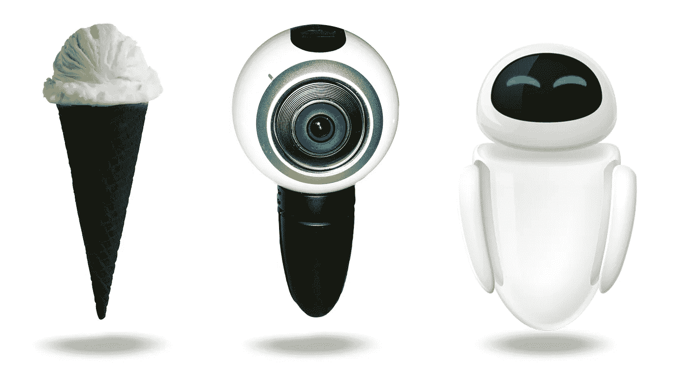
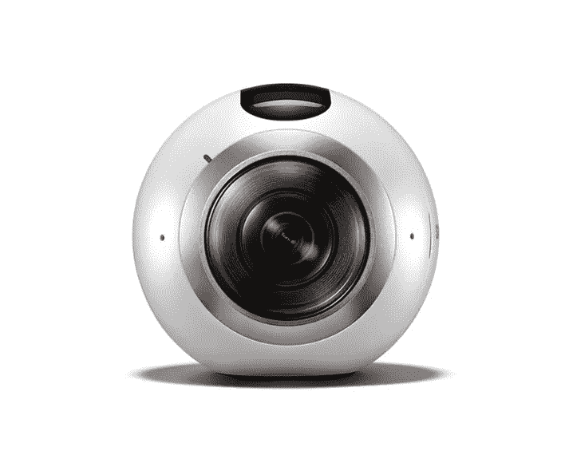
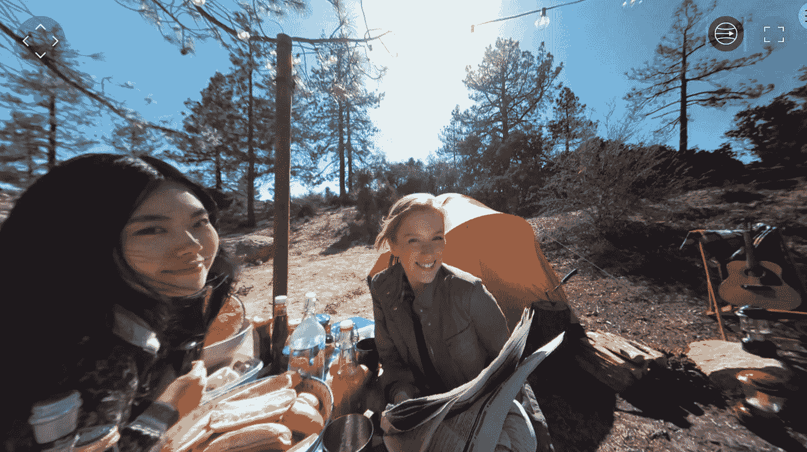
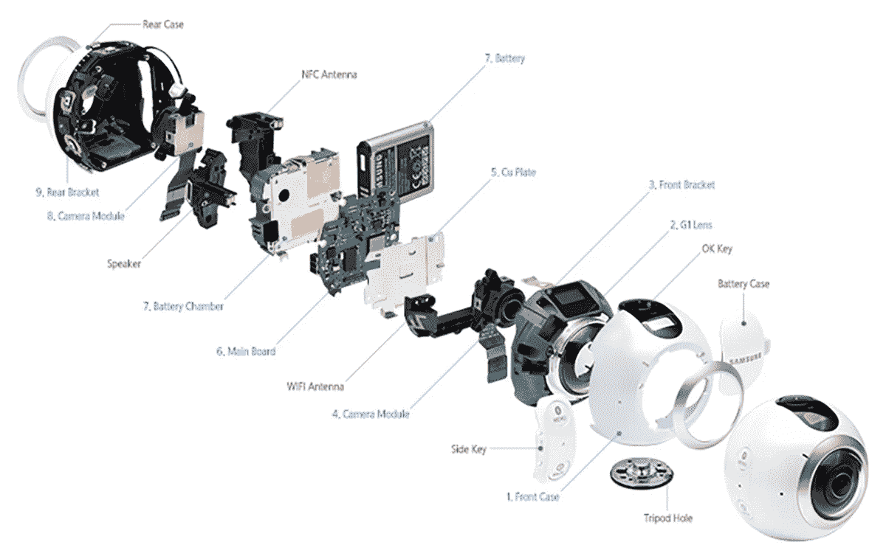
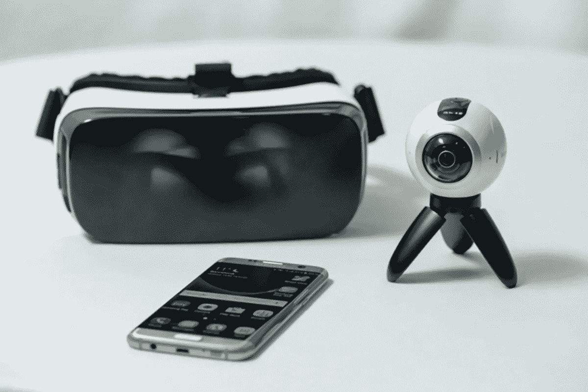
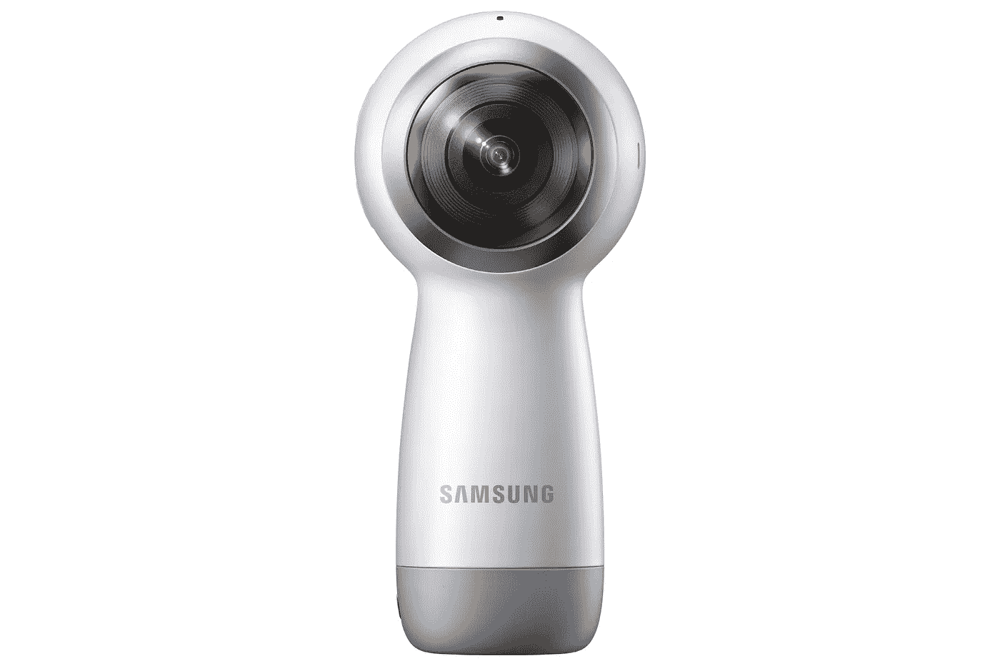
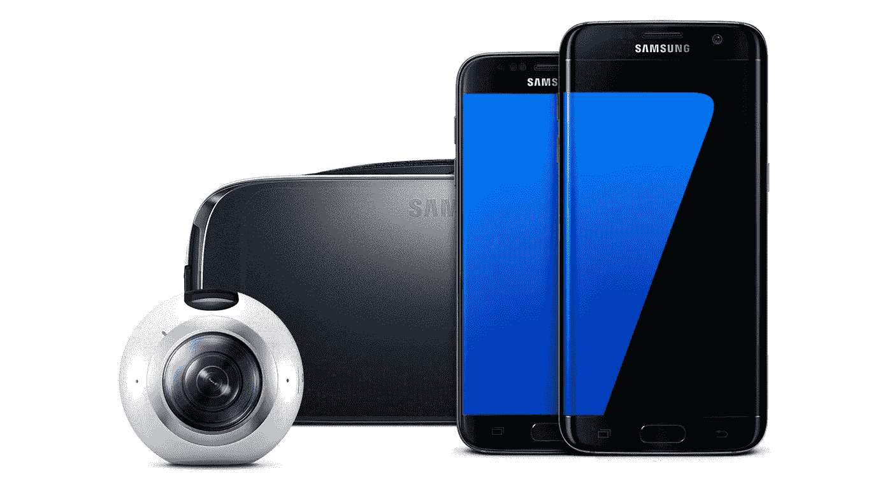

# 齿轮 360:负担得起的 360 相机或外星植被评估？

> 原文：<https://medium.com/hackernoon/the-gear-360-affordable-360-camera-or-extraterrestrial-vegetation-evaluator-3061cfc67eea>

## 外行人的技术:新设备、产品和乐趣的指南——给那些没有计算机科学学位的人。

今年，更多的 360 相机将涌入市场。价格相差很大，很难说哪个适合你。下面，我将介绍一些三星的消费者版本:Gear 360 。

# 一个可爱的小家伙

从一开始，就很难不喜欢 Gear 360 的外观。球形设计使我可以很容易地将相机连接到它提供的球形视图上。它很圆滑，正面有一个大眼睛状的镜头，背面有另一个。顶部的黑色条给人一种有点莫霍克发型的感觉，只有三个按钮，不会妨碍设计。

内含的底座进一步改变了外观。没有底座，它看起来有点像未来的某种泄气的运动球。然而，有了底座，它就完全变成了一只不同的机器野兽。我争论这个装置是否看起来更像来自[皮克斯的《瓦力》](http://movies.disney.com/wall-e)的 EVE(外星植物评估员)或者令人垂涎的冰淇淋甜筒。(当然，我可能有点渴望甜食，但这种相似性是毋庸置疑的。我欢迎在下面的评论中对此展开健康的辩论。)

# 价格

这是市场上较便宜的相机之一，售价仅为 299.99 美元至 349.99 美元(取决于是否有促销)。它还需要一个微型 SD 卡，你必须单独购买。对于快速，一站式购物，你可以在三星的网站上购买相机。如果你正在寻找更多的交易，在当地商店或在线零售商的 SD 卡可能会节省一些现金。

**Samsung advertises this image quality, but I’ve had yet to duplicate this with their camera.**

# 解决

谈到 360°相机分辨率，我有点犹豫。如今，消费品仍处于相对初级阶段，种类并不多。购买一台相机而不是下一台相机并不能提供我们所期望的差异，随着技术的发展，分辨率将会大幅提高。

> 这是我评测的第一台 360 相机，所以应该有一个小说明，这种分辨率与我们习惯的单反相机、视频或手机相机有什么不同。这些相机获取分辨率(像素计数)并将其分布在一个定义好的平面上，而 360 相机则将其分布在一个球体上。默认情况下，这会改变质量。例如，如果您手机的摄像头宣传分辨率为 3840x1920，而您的 360 摄像头也是如此，您会发现您手机的图像更加清晰。它规定这些像素被压缩到一个更小的空间，允许更多的细节。

不过，由于分辨率是一个因素，所以有些事情需要注意。就 360 相机而言，这款相机是分辨率较低的相机之一(从其价格可以看出)。对于视频，最高分辨率为 3840x1920 (他们宣传这是在【4K】**附近的*)，照片分辨率高达 30 MP。***

# 基本特征

这不是为了运行一艘宇宙飞船，它不会在你外出工作时帮你洗衣服或慢煮一顿饭，但它确实有一系列相当不错的功能。

*   拍摄 360 个视频
*   拍摄 360 张照片
*   蓝牙(兼容手机)
*   定时拍摄(这是 360 中一个更有趣的功能——我保证！)
*   视频循环
*   延迟开始

What you **ACTUALLY** need to work the camera at it’s fullest.

# 广告功能

与任何产品一样，尤其是那些有可能追加销售的产品，Gear 360 承诺了很多，如果没有适当的购买附件，这些都是不可能的。三星对此相当清楚，但还是值得注意。

*   **编辑**:这只能通过手机或电脑实现。广告中的编辑不能在相机内部完成。
*   分享:正如他们网站上所说，三星表示分享视频是简单而容易的。不过，这并不像他们说的那样一步到位。比起简单的手机照片，这需要更多的努力。这不一定是三星的问题——这是脸书和 YouTube 等平台的问题，它们还没有加入无缝分享功能。无论如何，你不能从相机本身分享。您必须使用外部设备来实现这些功能。

# **可用性**

那么，这个小小的袖珍相机到底有多人性化呢？

**It’s easier to use than plastic wrap!**

嗯，首先，**使用**相对容易。我需要使用一些作弊软件来查看相机显示屏上的微小字体，但图标和文本都很小，很容易理解。

**相机上只有三个按钮**。在这些和显示屏之间，滚动功能所需的按钮组合让我想起了很多 GoPro。然而，我认为在使用 GoPro 时，一个方便、便携的流程图会很有用，而 Gear 360 的菜单选项更少，更容易导航。

My thoughts on what the pocket guide for using navigating through the GoPro’s buttons might look like.

**延迟启动很棒**。各种各样的时间设置允许你(或者我在大量的测试中)在拍摄或拍摄之前离开镜头。对于一张简单的照片，这就像魔术一样(以下不一定是个人经历，但我有可能经历过这些):

*   **第一步**:设置定时器。
*   第二步:当摄像机像炸弹一样发出哔哔声时，逃跑。在一部可预见的动作片中，有人试图通过切断错误颜色的电线来解除武装。
*   **第三步**:绊倒眼前的一切。
*   **第四步**:听到相机咔哒一声。
*   **第五步**:在真正看到你蜷缩扭曲的身体挂在某个尴尬的角落之前，尝试删除图像/视频。
*   **第六步**:再试一次，直到淤青布满腿部和手臂。

Perhaps a selfie after an attempt to use the 360 camera delay?

抛开我自己的笨拙不谈，这个功能在前端是很棒的。不过，对于视频，我注意到没有办法停止远距离拍摄。也没有将电影长度设置为任何特定持续时间的选项。对于我的实验来说，这迫使我躲在最不舒服的地方，让摄像机转动。然后我需要溜进去或者偷偷摸摸地靠近摄像机，把它关掉。当然，你可以稍后再编辑它(一个额外的步骤)，但是我发现一些隐藏的地方让我的观众有点吃惊和窃笑。

**虽然可爱，但附带的三脚架很短**。这使得将相机放在桌子、椅子或地面上变得非常容易。但是，从我的观察来看，人们倾向于更好地欣赏从眼睛高度看到的图像。通常从 VR(虚拟现实)耳机中观看，视平线为观看者提供了一个更加真实和舒适的有利位置。

虽然三脚架拧开，似乎有正确的开口连接到任何标准的，完全可调的三脚架，我没有这个运气。螺纹没有在正确的方向上匹配，所以最终归结为一个不稳定的平衡行为。

这是三星的产品，所以它只能和三星的产品一起使用。在大多数情况下，您只能在三星特别指定的智能手机上使用它。从那里你下载一个 app ( [Gear 360 Manager](https://play.google.com/store/apps/details?id=com.samsung.android.samsunggear360manager&hl=en) )通过蓝牙管理东西。这样做是很容易的，一旦你知道所有的东西在哪里，需要去哪里，步骤就会变得越来越容易。

在没有三星特殊手机的情况下，独立开发者已经开发出了在其他机器人上使用相机的应用程序。当然，这并不能无缝地工作，而且质量最终会有所下降。

传言还称，新版 Gear 360 将适用于 iPhones，甚至比现有版本更便携。

The new Samsung 360 as announced on 3/29/17.

**不需要拼接软件。**一些更贵的相机需要外部软件和手动拼接。这可能很耗时(取决于相机)，而且通常需要额外的资金。有了 Gear 360，将两幅图像/视频拼接在一起变得快速、简单，并且可以在您的手机/相机中完成。

由于这款相机只有两个镜头，因此缝合线也较少。随着分辨率的提高，需要更多的镜头。我相信脸书的相机有大约 25 个镜头，我见过 16 个 GoPro 装备。这是大量的缝合，这使得许多缝合线中断清晰可见。

# **总体**

如果你正在寻找一款轻便、便携、价格合理(坦白说，可爱)的 360°相机，可以与大约三款不同的三星手机中的一款配合使用，这是一个很好的选择。然而，除非三星找到一种方法让它更广泛——任何 android 或 iPhone 用户都可以使用——否则我很难看到它在这个新兴市场持续更长时间。

> [黑客中午](http://bit.ly/Hackernoon)是黑客如何开始他们的下午。我们是 [@AMI](http://bit.ly/atAMIatAMI) 家庭的一员。我们现在[接受投稿](http://bit.ly/hackernoonsubmission)并乐意[讨论广告&赞助](mailto:partners@amipublications.com)机会。
> 
> 如果你喜欢这个故事，我们推荐你阅读我们的[最新科技故事](http://bit.ly/hackernoonlatestt)和[趋势科技故事](https://hackernoon.com/trending)。直到下一次，不要把世界的现实想当然！

