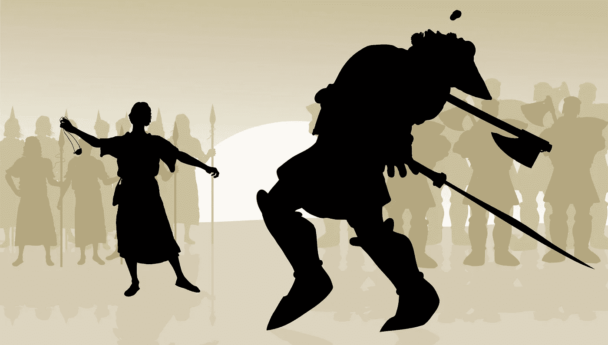

# 巨人杀手效应

> 原文：<https://medium.com/hackernoon/the-giant-slayer-effect-48ff8826578a>

当你想到大卫和歌利亚，你会想一个邋遢的小家伙怎么能放倒一个巨人。他用的只是那块石头吗？比大卫的手还小的东西怎么能击倒像歌利亚这样的巨人呢？

物理定律。我们不知道大卫和歌利亚的全部故事，但我们得到了一些线索…

今天，在创业公司的世界里，不仅颠覆者试图杀死巨头，年轻的颠覆者也试图打倒老的。

有人称之为滚雪球效应，有人称之为多米诺效应，有人甚至称之为复合效应。我简单地称之为……动力。如果你造得足够多，你就能改变世界。

一旦你获得动力，你将很难停下来——事实上是不可战胜的——即使你现在付出的努力减少了。只需多付出一点努力就能获得更大的成果，这可能感觉像是欺骗或不公平的优势。但这是你的自然法则。

一张多米诺骨牌可以推倒 1.5 倍于它的另一张多米诺骨牌。不相信我？观看多米诺骨牌效应的视频…想一想它的影响。

这意味着如此小的东西(可以被钳子夹起)最终可以对付如此大的东西并击倒它们。如果你小心地把多米诺骨牌排成一行，并且没有方块，神奇的事情就会发生。

以轻轻的滴答声开始的，很快以响亮的“砰”声结束。你排的多米诺骨牌越多，你能释放的潜在能量就越多。

> 当它开始的时候，它太慢了以至于不能察觉，直到它太快了以至于不能停下来。

沃伦·巴菲特的书名叫《雪球》,是以雪球效应命名的——滚动的雪球一旦变大，就会吸引更多的东西，变得更大，就像城市或帝国一样，就像生活中的任何事情一样。

但这里的区别是，一旦你变成了一个巨大的雪球，你是继续前进还是让一个脏兮兮的小多米诺骨牌把你撞倒？

别担心，没有什么比成功更失败的了——如果你变得自满……那位巨人杀手将会为那一天积聚力量击倒你。

当你倒下时……惯性定律的第一部分将会生效:静止的物体倾向于保持静止，除非受到外力的作用。

复合效应是从一系列小而聪明的选择中获得巨大回报的原则。

你可以通过阅读达伦·哈代的书《复合效应》来迈出建立动力的第一步。一旦你读完了那本书，读一读杰伊·帕帕桑的[《同一件事](http://amzn.to/2bFu3e3)——它也谈到做一件事会产生多米诺骨牌效应。如果你真的很喜欢阅读，拿起沃伦·巴菲特的[雪球](http://amzn.to/2c3kBCf)(这是一本很长的书)。

然后回忆一下惯性定律的第二部分:运动中的物体倾向于保持运动，除非有什么东西阻止了它们的动量。

所以，找到那张领先的多米诺骨牌，开始全力以赴吧。始终如一，斩杀那些巨人…

[***何塞·保罗·马丁***](http://jpmartin.com) *是一名私募股权投资者&顾问，在战略&财务咨询方面拥有超过 15 年的经验，目前专注于信息技术、医疗保健&教育行业。*

> [黑客中午](http://bit.ly/Hackernoon)是黑客如何开始他们的下午。我们是 [@AMI](http://bit.ly/atAMIatAMI) 家庭的一员。我们现在[接受投稿](http://bit.ly/hackernoonsubmission)并乐意[讨论广告&赞助](mailto:partners@amipublications.com)机会。
> 
> 如果你喜欢这个故事，我们推荐你阅读我们的[最新科技故事](http://bit.ly/hackernoonlatestt)和[趋势科技故事](https://hackernoon.com/trending)。直到下一次，不要把世界的现实想当然！

