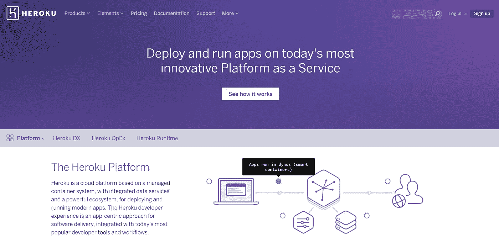

# “给予的红宝石”Heroku 上用户枚举的奇怪情况(未修复)

> 原文：<https://medium.com/hackernoon/the-giving-ruby-the-strange-case-of-user-enumeration-on-heroku-not-fixed-1a8296067318>


我想分享一个最近关于臭虫奖励的经历。我多年来一直在做昆虫奖金，现在我正在操场上试用大男孩——bugcrowd.com*和 hackerone.com*——这种体验是……嗯，不一样的。**

**我想，动机是为了能够与关心交付时间并对你评估的公司负责的人谈判，但我从未觉得有必要让第三方参与这个过程，可能是因为我不是以此为生，也不是出于乐趣和真正的关心，因为通常我会在我已经是活跃用户的网站上发现漏洞。额外的美元、t 恤或者仅仅是在某种名人堂上被提及，大多是为了炫耀的权利。在这篇文章的最后，我将回到我自己的一些二分水平的见解——但首先，让我们继续告诉你在 Heroku 上发现的漏洞。**

# **什么是 Heroku？**

**[*Heroku*](https://www.heroku.com/) 其实挺神奇的。他们有一个集成的 PaaS 解决方案，允许开发人员最轻松地在云上托管他们的应用程序。**

****

**无论是大公司还是小公司都在不停地使用 Heroku，所以我猜想这是一个发现有趣漏洞的好地方，通过发现一个与组织无关的漏洞，这些漏洞可能会影响到他们所有人。**

# **登录 API 调用，发现响应异常**

**Heroku 有几种与他们的服务接口的选择。基于网络是很常见的用法，API 紧随其后。有一个 Heroku 命令行界面(CLI)工具，它基本上是 API 调用的包装器。我使用 CLI 工具来联系网站，并开始弄乱一些输入，过了一段时间，我把重点放在了看起来非常简单的登录机制上。它基于一个 POST 请求，伴随着*用户名*和*密码*参数。**

**起初，当我弄乱输入时，我认为没什么大不了的，我希望出现错误输出或者真实用户名和虚假用户名之间的任何响应变化。尽管我没有看到这些错误文本的任何变化，但是响应中有一个更微妙的变化。**

**登录请求看起来像这样:**

```
**POST **https://api.heroku.com/login** HTTP/1.1
Host: api.heroku.com
User-Agent: heroku-cli/5.2.39-010a227 (windows-386) go1.6.2
Content-Length: 54
Accept: application/json
Content-Type: application/x-www-form-urlencoded
Accept-Encoding: gzip

password=fjfjfjfj&username=bogus%40gmail.com**
```

**适当的回应应该是:**

```
**HTTP/1.1 404 Not Found
Cache-Control: private, no-cache
Content-Type: text/html;charset=utf-8
Date: Mon, 29 Aug 2016 16:49:52 GMT
Request-Id: b3ca4a2c-1adf-4244-4cb0-17fbbc9deb06
Server: nginx/1.8.1
Strict-Transport-Security: max-age=31536000; includeSubDomains
Vary: Accept-Encoding
X-Content-Type-Options: nosniff
X-Frame-Options: SAMEORIGIN
X-Runtime: 0.018023806
X-Xss-Protection: 1; mode=block
Content-Length: 0
Connection: keep-alive**
```

**所以，如前所述，不超过 404，但另一方面，它在可选标题上有些慷慨——“那又怎样？”你可能会问。这就完全不同了。具体来说，引起我注意的是“**X-Runtime”**头。**

**从它的名字我只能猜测我发现了什么。但是它需要更多的探测来确定。**

# **别动，你这个混蛋！**

**第一站是在 HTTP RFCs 上查看第 1，000，000 次，注意这里没有类似的东西——所以它一定是由 web 服务器上的另一个组件添加的。简短的扫描显示，它很可能是由依赖于 Ruby/Rails 的服务器端组件派生的。**

**其中一个名为 **Rack** 的项目首先出现在搜索中，也就是说我们不能确定这是否是网站上运行的 Ruby 代码，但我们会把它作为一个测试案例，最终证明这是足够的。**

**对于那些从未听说过它的人(像我一样)，GitHub 页面上写着:**

> **Rack 为用 Ruby 开发 web 应用程序提供了一个最小的、模块化的、适应性强的接口。通过以尽可能简单的方式包装 HTTP 请求和响应，它将 web 服务器、web 框架和它们之间的软件(所谓的中间件)的 API 统一和提取到一个方法调用中。**

**仔细查看它的源代码，在 *lib/rack/runtime.rb* 中解释了异常的头文件:**

**现在我们可以充分肯定我们对“X-Runtime”含义的常识性理解。它指的是操作完成所需的时间。**

**你和我想的一样吗？**

**为了证实这一想法，我们必须针对系统中不存在的用户名和存在的用户名的不同组合获得一个更大的测试样本集。并且记录定时差异以及是否存在任何可辨别的种类的增量。**

**现有用户名包含生成了以下计时注释:**

```
**X-Runtime: 0.093990008
X-Runtime: 0.088857339
X-Runtime: 0.09251876
X-Runtime: 0.089843447
X-Runtime: 0.091845765
X-Runtime: 0.101260549**
```

**当使用不存在的用户名时(为了安全起见，我使用了正确的电子邮件地址方案):**

```
**X-Runtime: 0.027787351
X-Runtime: 0.018023806
X-Runtime: 0.020997733
X-Runtime: 0.021645124
X-Runtime: 0.016645836
X-Runtime: 0.021828831
X-Runtime: 0.022211143**
```

# **守旧派旁门左道定时攻击——❤**

**所有这些评估都集中到一个最终结论中——系统上的假用户名和真用户名在时间上有明显的(~1 个数量级)差异。**

**这怎么可能呢？可能是因为在根据真正的散列密码检查密码的过程中涉及到了与加密相关的操作。**

**这是一个定时攻击的常规例子。一旦服务器接收到来自用户的参数，它首先检查用户以查看它是否相关，如果不相关，操作结束并向用户响应 *404* 。在另一种情况下，如果发现用户名是相关的——它将继续前进，根据密码的本地散列副本检查用户给出的密码，这是一个非常密集的操作，与其后面的用户名列表的短途旅行形成对比。由于运行时间不同，我们可以感知这些独特的路线。**

**许多应用程序都在做同样的事情，但主要是因为延迟，对于基于时间的攻击，要确定一个明确的结论有点困难。在这种情况下 Ruby 服务器通过一个简单的 POST 请求为我们提供了得出这个结论所需的所有信息。**爽！****

# **如何克服攻击？**

**这可以在许多层面上解决。由于我不知道 Heroku 对保持这个标题的考虑，我将尝试涵盖不同的方法，因为几乎每种方法都有实际的限制。**

1.  ****从响应中删除“X-Runtime”标头—** 这是最明显的建议，因为这是导致我们得出结论的错误，但这只是某种内在因素的最终结果—时间计算可能以其他不太直接的方式观察，如响应延迟时间。通过计算从发送请求到收到响应的往返时间，我观察到的并不仅仅是这一点。运行时值可以用于调试目的，我在过去遇到过一些客户，他们不能从所有响应甚至某些响应的子集中删除调试头——如果是这样，他们可能会在更高的 web 服务器级别上修改它，并在编译最终响应之前努力删除慷慨的一行。非常丑陋的补丁，但实用性有时压倒优雅。**
2.  ****使所有操作时间相等—** 依靠 Heroku 对用户认证过程的精细控制，他们可能会将检查用户名和密码参数的过程延迟一段时间。如果他们决定把它留在原地，这就不一定会通过 X-Runtime 来实现。**
3.  ****为操作添加随机时间—** 在流程中注入随机长度的延迟，实际上会使这些时间变得不稳定。这种方法的问题是，在更大的范围内，对每个猜测进行多次检查，你会得到(假设随机长度延迟的正态分布)一个更大的结果。这也不一定要通过 X-Runtime 来体现。**
4.  ****限制请求数量—** 如果您认为这种攻击威胁到整个客户群，而不是针对一小部分用户的攻击，那么这是一种解决方案。根据这个定义——您应该能够在给定时间限制来自单个源的请求数量，这使得决心较小的攻击者的工作变得多余。在任何情况下，这都不是一个防弹的解决方案，因为攻击者通常会使用 VPN、匿名网络或僵尸网络来掩盖他们的踪迹。**

# **Heroku/BugCrowd 的回应**

**根据 Bugcrowd 的条款——用户枚举漏洞不在范围内，他们实际上为此罚了我-1 分(老实说，我早该知道的。我的辩护是，我不清楚是否有一个独立的条款，不仅来自供应商，也来自 BugCrowd，需要遵守。)**

**事情是这样的，正如我之前提到的——这不是我的重点，因为我的许多同行都不是为了盈利而做这件事，我只是想做一个我评估过的网站，供我自己使用，如果碰巧，就像在这种情况下，提示有[安全](https://hackernoon.com/tagged/security)漏洞。我是否得到奖金是次要目标，让我担心的是，因为 BugCrowd 认为它超出了范围，所以我们不应该讨论这个漏洞。应该有这样的术语来定义，不是所有的东西都会让你赚一点小钱，但是一旦你发现 bugcrowd 范围之外的东西，为什么它应该被认为是供应商缓解范围之外的呢？**

**我真的不反对 Heroku 或 BugCrowd，他们都是由伟大的，充满激情的人组成，从我的经验来看，但官僚主义在这种情况下与进步相矛盾，我希望这些不成文的程序应该得到照顾，为我们的社区的利益。**

**[](http://bit.ly/HackernoonFB)****[](https://goo.gl/k7XYbx)****[](https://goo.gl/4ofytp)**

> **[黑客中午](http://bit.ly/Hackernoon)是黑客如何开始他们的下午。我们是 [@AMI](http://bit.ly/atAMIatAMI) 家庭的一员。我们现在[接受投稿](http://bit.ly/hackernoonsubmission)并乐意[讨论广告&赞助](mailto:partners@amipublications.com)机会。**
> 
> **如果你喜欢这个故事，我们推荐你阅读我们的[最新科技故事](http://bit.ly/hackernoonlatestt)和[趋势科技故事](https://hackernoon.com/trending)。直到下一次，不要把世界的现实想当然！**

****